# App Flow Document

**Status:** Current as of 2026-06-01  
**Scope:** All major user flows across Build Studio, Conxa Cloud, and Runtime

---

## Table of Contents

1. [User Onboarding](#1-user-onboarding)
2. [Build Studio Login](#2-build-studio-login)
3. [Create a Plugin](#3-create-a-plugin)
4. [Record Authentication Session](#4-record-authentication-session)
5. [Record a Workflow](#5-record-a-workflow)
6. [Pipeline & Compilation](#6-pipeline--compilation)
7. [Workflow Editing (HumanEdit)](#7-workflow-editing-humanedit)
8. [Build Plugin](#8-build-plugin)
9. [Build Installer & Publish](#9-build-installer--publish)
10. [End-User Installation](#10-end-user-installation)
11. [Runtime Registration & First Sync](#11-runtime-registration--first-sync)
12. [MCP Skill Execution](#12-mcp-skill-execution)
13. [Execution with Recovery](#13-execution-with-recovery)
14. [Skill Pack Update (Company Side)](#14-skill-pack-update-company-side)
15. [Skill Sync (Runtime Side)](#15-skill-sync-runtime-side)
16. [Runtime Self-Update](#16-runtime-self-update)
17. [Failure Recovery (End User)](#17-failure-recovery-end-user)

---

## 1. User Onboarding

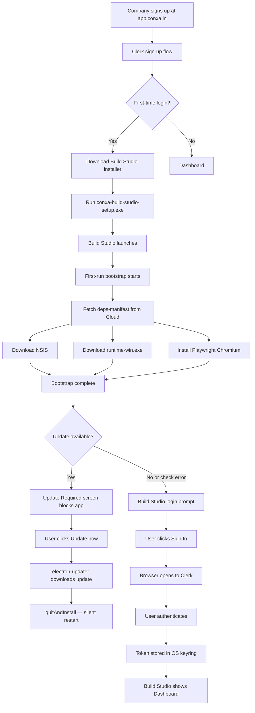

**Notes:**
- Bootstrap (`services/bootstrap.py`) is idempotent. Re-running skips already-present dependencies.
- All downloads are SHA-256 verified against values from the cloud manifest.
- If on a corporate network, the bootstrap surfaces the exact URLs for IT whitelisting.
- The update check (step U) is fail-open: if GitHub Releases is unreachable, the app proceeds normally. Updates are mandatory — the app cannot advance past the Update Required screen without installing.
- On subsequent (non-first-time) launches the same gate applies: deps check is skipped (already installed), update check runs, then login or dashboard.

---

## 2. Build Studio Login

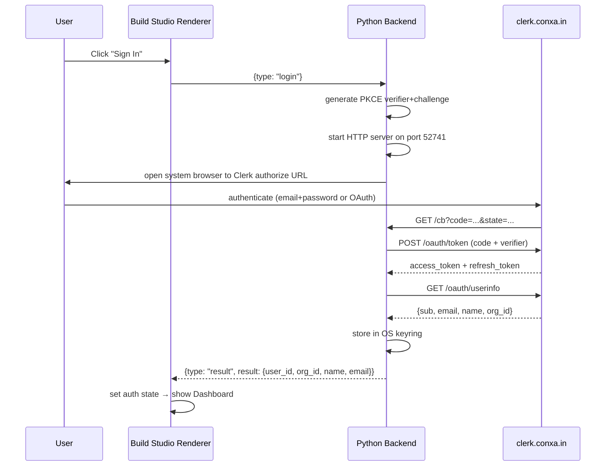

**Refresh:** `auth_service.get_token()` checks expiry on every outbound API call. If within 60s of expiry, uses `refresh_token` to get a new `access_token` transparently.

---

## 3. Create a Plugin

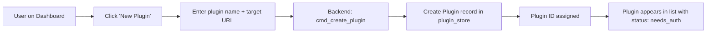

**Data created:** `Plugin` model with `status="needs_auth"`, `auth=null`, `workflows=[]`.  
**Storage:** `data/plugins/{id}/plugin.json`

---

## 4. Record Authentication Session

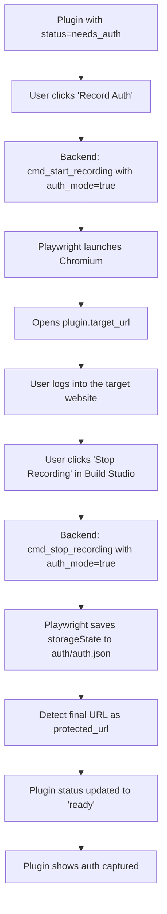

**Key invariant:** `auth.json` lives at `data/plugins/{id}/auth/auth.json`. It is NEVER copied into the skill pack build output.

---

## 5. Record a Workflow

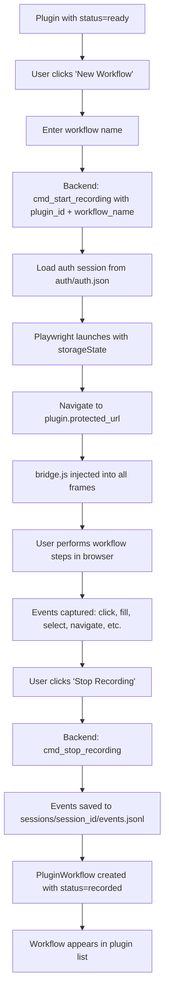

**Event types captured by bridge.js:**
`click`, `dblclick`, `right_click`, `type`, `fill`, `focus`, `select`, `select_option`, `set_checkbox`, `set_radio`, `date_pick`, `drag_drop`, `keyboard_shortcut`, `upload`, `navigate`, `scroll`, `tab_open`, `tab_switch`, `popup`, `frame_enter`, `frame_exit`, `dialog_appeared`, `dialog_accept`, `dialog_dismiss`.

---

## 6. Pipeline & Compilation

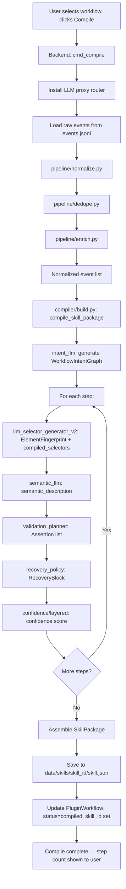

**Fresh compile quota:** Before local compile starts, Build Studio reserves 1 compile credit through `POST /api/v1/usage/compile/reserve`. The reservation is committed before the first LLM-assisted pipeline/compiler stage. If compile fails before commit, Build Studio releases the reservation; after commit, the credit remains consumed.

**Recompile quota:** Existing workflows with `skill_id` skip compile-credit reservation. Their proxied LLM calls use `usage_class="human_edit"` and draw from the monthly Human Edit pool.

**LLM calls** route through `conxa_core.llm.get_router()`, which is replaced at compile time with `LLMProxyClient` forwarding to `POST /api/v1/llm/proxy/{text,vision}` with `usage_class` set to `compile` or `human_edit`.

**Real-time events** stream from backend to renderer during compilation:
- `pipeline_start`, `pipeline_done`
- `compile_step` with `step` and `status` fields
- `compiler_start`, `compiler_done`
- `api_call` — each LLM call
- `compile_error` — on failure

---

## 7. Workflow Editing (HumanEdit)

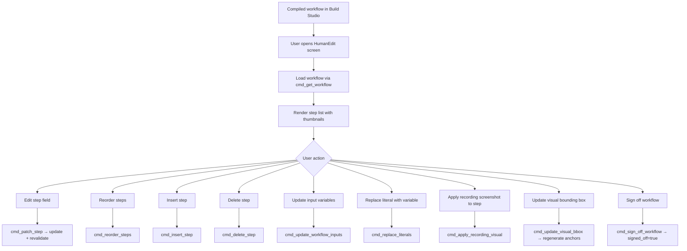

**Patch gate:** Each edit increments the skill version. `revalidate_step()` checks that selector and intent remain coherent after the patch.

Deterministic Human Edit actions are available without quota: patch, reorder, delete, input edits, validation edits, and sign-off. LLM-assisted actions such as selector regeneration, visual re-anchor, screenshot/bbox anchor regeneration, semantic repair, and raw-recording recompile require remaining Human Edit pool.

---

## 8. Build Plugin

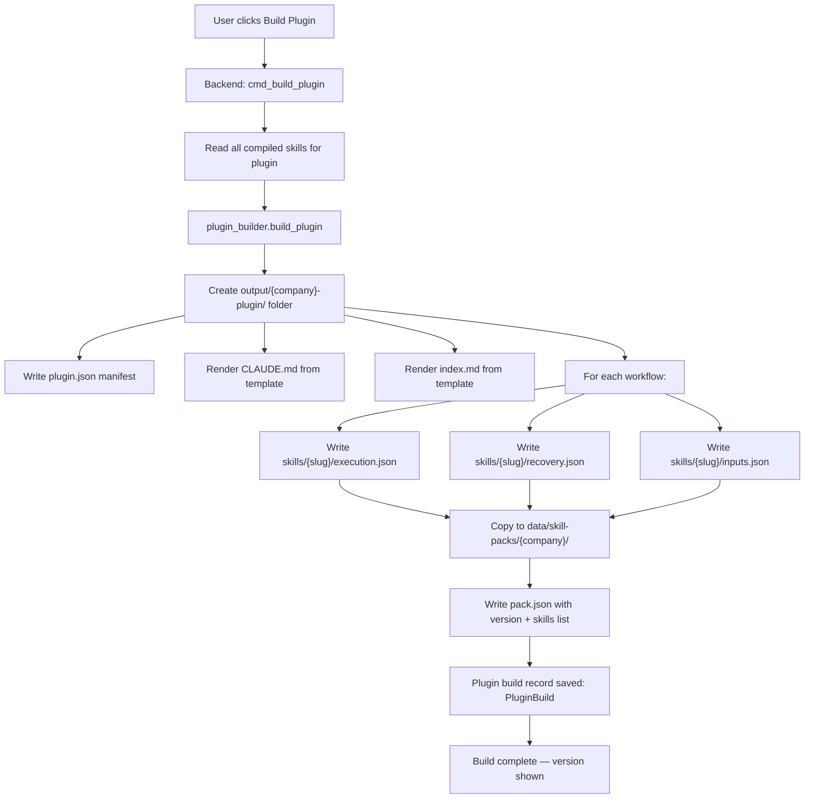

**Security check:** Build output directory is scanned for `auth.json`. If found, the build is **refused** with `auth_file_in_build_input` error.

---

## 9. Build Installer & Publish

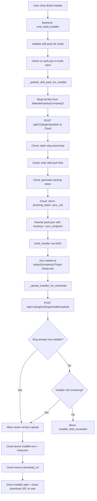

**Installer contents:**
- `skill-packs/{company}/` (pack.json with tracking config embedded)
- `runtime.exe` + `keytar.node`
- Chromium browser (fetched at install time, not bundled)
- `conxa.mcpb` Desktop Extension (handles MCP registration via Claude's official mechanism)

**Customer-visible meters shown during this flow:**
- Settings/Billing: seats, installer slots, compile credits, Human Edit pool.
- Compile: compile credits for first compile and Human Edit pool for recompile.
- Human Edit: Human Edit pool only for LLM-assisted actions.
- Build Installer / Plugins: installer slots; same-slug version uploads are shown as existing-slot updates.

Workflow recording and local plugin creation remain unlimited.

---

## 10. End-User Installation

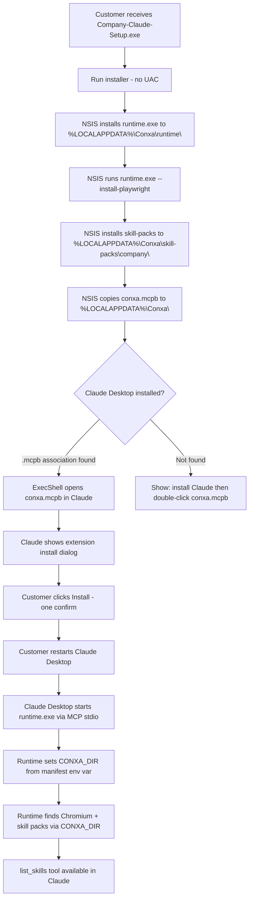

**Install scope:** Per-user (`RequestExecutionLevel user`), installs to `%LOCALAPPDATA%\Conxa`. No admin elevation required. Correctly resolves to the logged-in user's profile (avoids the elevated-admin-wrong-profile bug).

**MCP registration:** Via official `.mcpb` Desktop Extension mechanism. Claude Desktop owns `claude_desktop_config.json` — we never write to it. This is robust to MSIX filesystem virtualization (Claude Desktop MSIX reads config from `%LOCALAPPDATA%\Packages\Claude_pzs8sxrjxfjjc\LocalCache\Roaming\Claude\`, not `%APPDATA%\Claude\`).

**CONXA_DIR wiring:** The `manifest.json` inside `conxa.mcpb` sets `env.CONXA_DIR = ${HOME}\AppData\Local\Conxa`. `server.js` derives `PLAYWRIGHT_BROWSERS_PATH` and `SKILL_PACKS_DIR` from `CONXA_DIR`, so the `.mcpb`-launched runtime always finds the `.exe`-installed Chromium and skill packs.

**Uninstall asymmetry:** The `.exe` uninstaller removes `%LOCALAPPDATA%\Conxa` and the HKCU deep-link key. The Claude-managed extension (`mcpServers.conxa` in Claude's config) must be removed in-app: Claude Desktop → Settings → Extensions → Conxa → Remove.

---

## 11. Runtime Registration & First Sync

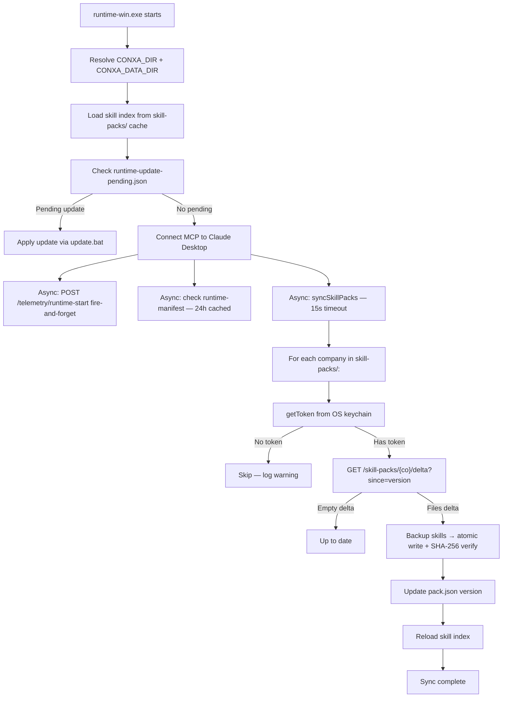

**First-time token:** The `auth.json` (Playwright storageState) is staged into `cache/sessions/` by the installer. On first sync, if no keytar token exists for the company, the runtime cannot sync. Token acquisition for the runtime is the **current gap** — the `getAuthChallengeUrl()` function generates a challenge URL but there is no in-app flow to complete this yet.

---

## 12. MCP Skill Execution

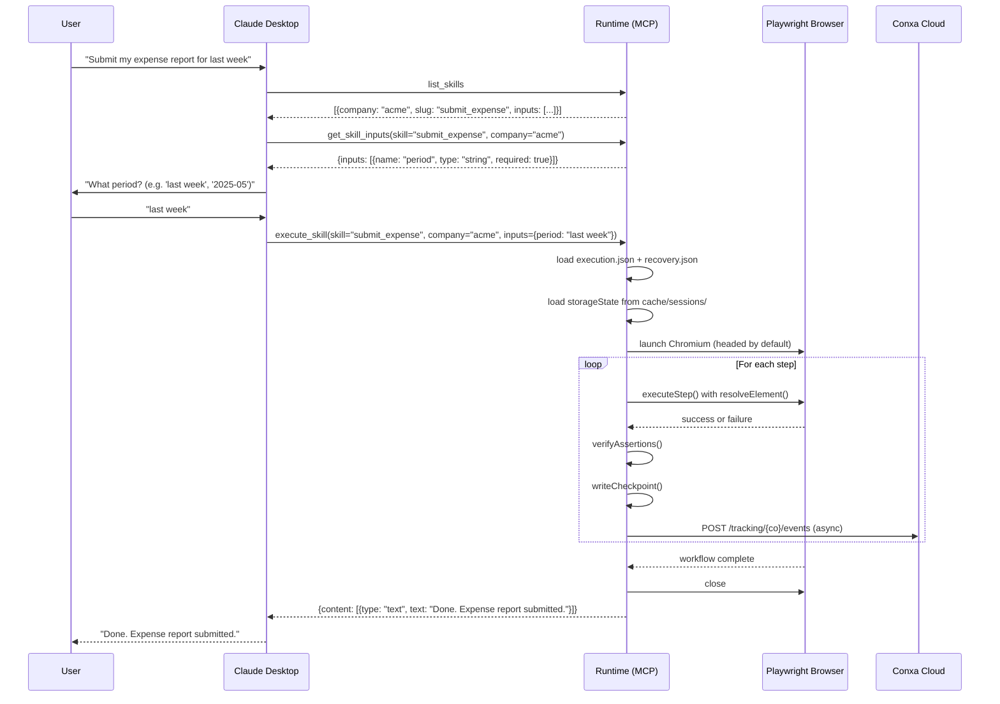

---

## 13. Execution with Recovery

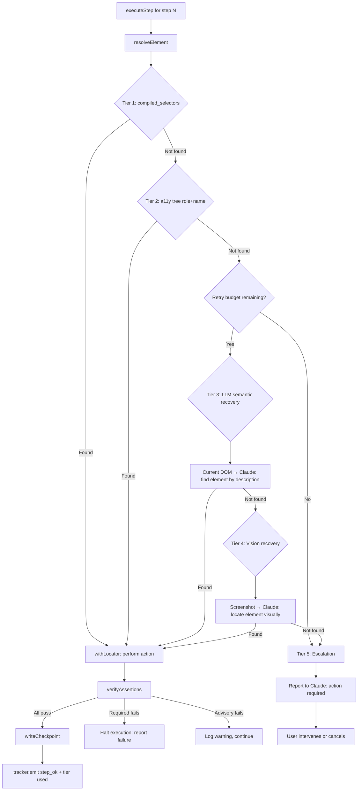

---

## 14. Skill Pack Update (Company Side)

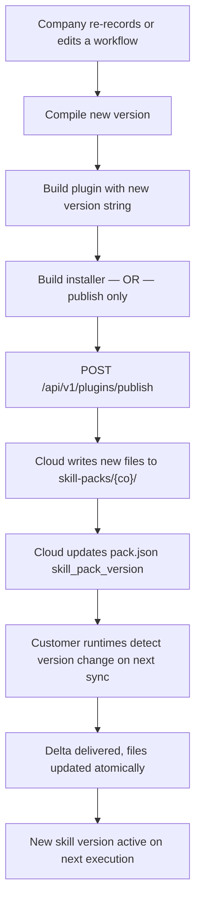

**No re-installer needed** for content-only updates. The runtime's delta sync handles delivery automatically.

---

## 15. Skill Sync (Runtime Side)

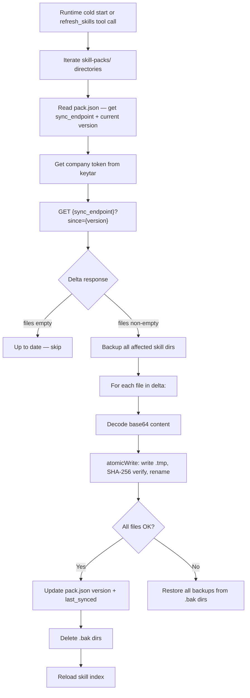

---

## 16. Runtime Self-Update

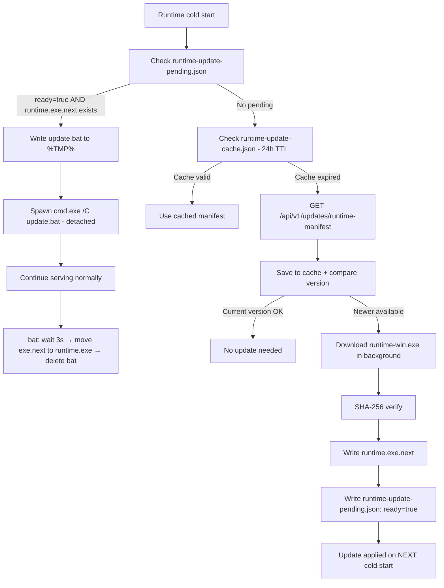

---

## 17. Failure Recovery (End User)

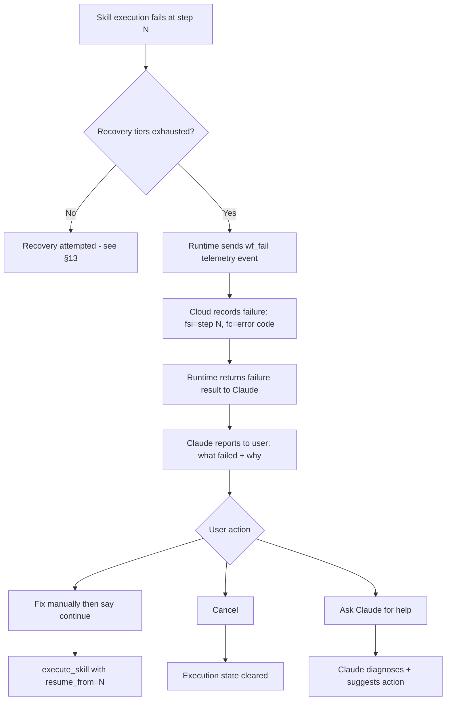

**Execution state:** `data/executions/{id}/checkpoint.json` records the last successfully completed step. On resume, execution starts from `resume_from` step index with the same browser session if still open.

---

## Flow Summary

| Flow | Trigger | Systems Involved | Duration |
|---|---|---|---|
| Onboarding | First Build Studio launch | Build Studio, Cloud | ~5 min |
| Login | User clicks Sign In | Build Studio, Clerk | <30s |
| Record auth | Plugin setup | Build Studio, Target website | 2–5 min |
| Record workflow | Plugin setup | Build Studio, Target website | 5–30 min |
| Compile | After recording | Build Studio, Cloud LLM proxy | 1–10 min |
| Build installer | After compile | Build Studio, Cloud | 1–5 min |
| Customer install | .exe runs | Runtime, Claude Desktop | 2–5 min |
| Skill execution | Claude tool call | Runtime, Target website | 10s–5 min |
| Recovery | Step failure | Runtime, Cloud (LLM at T3+) | +2–30s |
| Skill update | Company publishes | Cloud, Runtime (next start) | <15s sync |
| Runtime update | Cold start check | Runtime, Cloud | Background |
