# App Flow Document

**Status:** Current as of 2026-08-08  
**Scope:** All major user flows across Build Studio, Conxa Cloud, and Runtime

---

## Table of Contents

1. [User Onboarding](#1-user-onboarding)
2. [Build Studio Login](#2-build-studio-login)
3. [Create a Workflow](#3-create-a-workflow)
4. [Group Page — Workflow Lifecycle Rail (Record, Compile, Review, Test)](#4-group-page--workflow-lifecycle-rail)
5. [Pipeline & Compilation](#5-pipeline--compilation)
6. [Workflow Editing (HumanEdit)](#6-workflow-editing-humanedit)
7. [Build Skill Package](#7-build-skill-package)
8. [Publish & Build Installer](#8-publish--build-installer)
10. [End-User Installation](#10-end-user-installation)
11. [Runtime Registration & First Sync](#11-runtime-registration--first-sync)
12. [MCP Skill Execution](#12-mcp-skill-execution)
13. [Execution with Recovery](#13-execution-with-recovery)
14. [Skill Pack Update (Company Side)](#14-skill-pack-update-company-side)
15. [Skill Sync (Runtime Side)](#15-skill-sync-runtime-side)
16. [Runtime Self-Update](#16-runtime-self-update)
17. [Failure Recovery (End User)](#17-failure-recovery-end-user)
18. [Entitlement Gates (Trial, Machines, Distribution, BYOK)](#18-entitlement-gates-trial-machines-distribution-byok)

---

## 1. User Onboarding

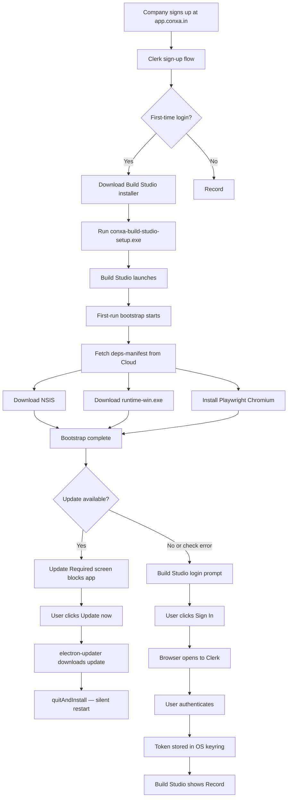
```mermaid
flowchart TD
    A[Company signs up at app.conxa.in] --> B[Clerk sign-up flow]
    B --> C{First-time login?}
    C -->|Yes| D[Download Build Studio installer]
    C -->|No| E[Record]
    D --> F[Run conxa-build-studio-setup.exe]
    F --> G[Build Studio launches]
    G --> H[First-run bootstrap starts]
    H --> I[Fetch deps-manifest from Cloud]
    I --> J[Download NSIS]
    I --> K[Download runtime-win.exe]
    I --> L[Install Playwright Chromium]
    J & K & L --> M[Bootstrap complete]
    M --> U{Update available?}
    U -->|Yes| V[Update Required screen blocks app]
    V --> W[User clicks Update now]
    W --> X[electron-updater downloads update]
    X --> Y[quitAndInstall — silent restart]
    U -->|No or check error| N[Build Studio login prompt]
    N --> O[User clicks Sign In]
    O --> P[Browser opens to Clerk]
    P --> Q[User authenticates]
    Q --> R[Token stored in OS keyring]
    R --> S[Build Studio shows Record]
```

**Notes:**
- Bootstrap (`services/bootstrap.py`) is idempotent. Re-running skips already-present dependencies.
- All downloads are SHA-256 verified against values from the cloud manifest.
- If on a corporate network, the bootstrap surfaces the exact URLs for IT whitelisting.
- The update check (step U) is fail-open: if GitHub Releases is unreachable, the app proceeds normally. Updates are mandatory — the app cannot advance past the Update Required screen without installing.
- On subsequent (non-first-time) launches the same gate applies: deps check is skipped (already installed), update check runs, then login or Workflow list.
- The Record page was removed (2026-08): the Workflow List (`/workflows`) is now the primary landing page. Its group cards drill into the Group Page (`/groups/:id`), which contains every recording/auth/compile/review/test control for that group's workflows inline — see §4. Root `/` redirects to `/workflows`; the old `/workflows/:id` per-workflow route (removed 2026-08-13) now redirects to the workflow's owning group.

---

## 2. Build Studio Login

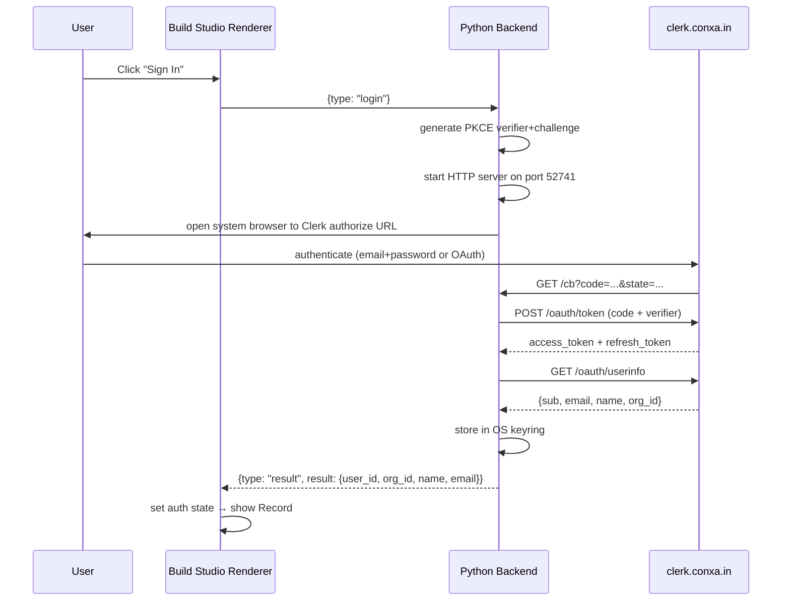
```mermaid
sequenceDiagram
    participant User
    participant Renderer as Build Studio Renderer
    participant Backend as Python Backend
    participant Clerk as clerk.conxa.in

    User->>Renderer: Click "Sign In"
    Renderer->>Backend: {type: "login"}
    Backend->>Backend: generate PKCE verifier+challenge
    Backend->>Backend: start HTTP server on port 52741
    Backend->>User: open system browser to Clerk authorize URL
    User->>Clerk: authenticate (email+password or OAuth)
    Clerk->>Backend: GET /cb?code=...&state=...
    Backend->>Clerk: POST /oauth/token (code + verifier)
    Clerk-->>Backend: access_token + refresh_token
    Backend->>Clerk: GET /oauth/userinfo
    Clerk-->>Backend: {sub, email, name, org_id}
    Backend->>Backend: store in OS keyring
    Backend-->>Renderer: {type: "result", result: {user_id, org_id, name, email}}
    Renderer->>Renderer: set auth state → show Record
```

**Refresh:** `auth_service.get_token()` checks expiry on every outbound API call. If within 60s of expiry, uses `refresh_token` to get a new `access_token` transparently.

---

## 3. Create a Workflow

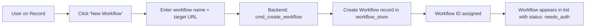
```mermaid
flowchart LR
    A[User on Record] --> B[Click 'New Workflow']
    B --> C[Enter workflow name + target URL]
    C --> D[Backend: cmd_create_workflow]
    D --> E[Create Workflow record in workflow_store]
    E --> F[Workflow ID assigned]
    F --> G[Workflow appears in list with status: needs_auth]
```

**Data created:** `Workflow` model with `status="needs_auth"`, `auth=null`, `workflows=[]`.  
**Storage:** `data/workflows/{id}/workflow.json`

---

## 4. Group Page — Workflow Lifecycle Rail

The Group Page (`/groups/:groupId`) is the primary interface for recording and managing every workflow in a group — there is no separate per-workflow page (removed 2026-08-13; see `docs/UI-UX-Brief.md` §2.3a). Each workflow's row carries a five-node `WorkflowStageRail` — Record → Compile → Review → Test → Ready to Package — where each node is the action for that stage, gated on the previous one's completion. Creating or renaming the group in Build Studio also creates/renames the matching folder under Conxa Cloud Skill Packages (same id and name), even if no workflow in it has been published yet. Cloud is not a second place to create groups.

### 4.1 Authentication is set up once per group, not per workflow

As of the Workflow Groups change (see `docs/TRD.md` §5.2a), a workflow no longer records its own login — it inherits its group's app sessions. The same Group Page that hosts the workflow rows also hosts the group's own Applications panel (add/edit/remove apps, connect sessions); a workflow's Record node stays disabled with an explanatory tooltip until every app in its group is authenticated.

```mermaid
flowchart TD
    A[Group has apps with missing/expired sessions] --> B["Group page shows 'Connect' per app"]
    B --> C[User clicks Connect on an app]
    C --> D[Backend: cmd_start_group_app_auth]
    D --> E[Playwright launches Chromium at app.login_url]
    E --> F[User logs into the target website]
    F --> G["Recorder self-detects app.success_url (wait_for_url) and closes the browser"]
    G --> H[Renderer polls get_recording_status, sees reached_wait_url]
    H --> I[Backend: cmd_finish_group_app_auth]
    I --> J[Playwright's storageState saved to data/groups/{group_id}/auth/{app_id}.json]
    J --> K[Every workflow in the group flips to status=ready once all its apps are authenticated]
    K --> L{More unauthenticated apps in the group?}
    L -->|Yes| B
    L -->|No| M[Group ready — every workflow in it can record/run immediately]
```

**Key invariant:** each app's captured session lives at `data/groups/{group_id}/auth/{app_id}.json`. It is NEVER copied into the skill pack build output.

### 4.1a Recording a workflow starts pre-authenticated to every app in its group

`cmd_start_recording` merges every authenticated app's storageState in the workflow's group into one seeded Playwright context (`conxa_core.storage.storage_state.merge_storage_states`) before opening the recorder — so a recording that crosses several of the group's apps starts signed in to all of them, with no per-site login step during the recording itself. Only the apps the workflow's own URLs actually resolve to (by hostname) have to be connected before recording can start — an app elsewhere in the group that this workflow never visits doesn't block it, mirroring the `required_apps` execution-time scoping in §4.1b below. Because recording seeds every captured app, not just the required ones, the gate also runs a bounded freshness check against every captured app (skipping any checked in the last 10 minutes) before recording opens: an expired *required* app blocks recording outright, while an expired *sibling* app only surfaces a warning in the response — the user is right there in the recorder window and can sign back in inline if that app actually comes up.

Recording no longer discards what happens to the session while it's open: it autosaves into the same merged file it was seeded from, and when the recording stops (or is cancelled), each app's slice of that file — cookies and local storage the app already owned, nothing a sibling app in the same group picked up — gets written back to that app's own saved session. Signing in once now actually holds: routine cookie rotation, a refreshed token, or the user re-authenticating mid-recording because the seeded session had gone stale all stick, instead of being thrown away the moment the recording window closes.

### 4.1b Testing/running a workflow only asks for the apps it actually visited — and never fails mid-run for a gap recording papered over

Being pre-authenticated to every group app during recording does **not** mean every one of those apps has to be signed in before the workflow can *run*. At build time, each workflow's own start URL, the URL it lands on after auth (if any), **and every hostname the recording actually visited mid-flow** are matched by hostname against the group's apps, and only the apps that match are written into that workflow's compiled skill as `required_apps` — so a workflow that starts in one app but clicks through to a sibling app partway through gates on both, not just the one its start URL happens to resolve to. Testing or executing a workflow only *requires* signing in to an app in `required_apps` — a workflow that never touches a given app is never blocked on it — but it still *seeds* the browser session from every other app in the group that's currently signed in, the same "seed everything, require only what's needed" split recording already uses, so a workflow that unexpectedly wanders into an ungated sibling app still arrives signed in instead of hitting a login wall mid-run. If more than one required app needs signing in, every login window opens together with one message naming all of them, rather than one window per run attempt. See `docs/TRD.md` §5.2a ("Per-workflow app scoping").

### 4.2 Record a Workflow (inline action)

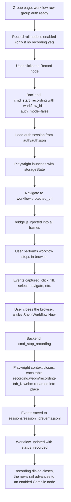
```mermaid
flowchart TD
    A["Group page, workflow row, group auth ready"] --> B["Record rail node is enabled (only if no recording yet)"]
    B --> C[User clicks the Record node]
    C --> D[Backend: cmd_start_recording with workflow_id + auth_mode=false]
    D --> E[Load auth session from auth/auth.json]
    E --> F[Playwright launches with storageState]
    F --> G[Navigate to workflow.protected_url]
    G --> H[bridge.js injected into all frames]
    H --> I[User performs workflow steps in browser]
    I --> J[Events captured: click, fill, select, navigate, etc.]
    J --> K[User closes the browser, clicks 'Save Workflow Now']
    K --> L[Backend: cmd_stop_recording]
    L --> L2[Playwright context closes; each tab's recording.webm/recording-tab_N.webm renamed into place]
    L2 --> M[Events saved to sessions/session_id/events.jsonl]
    M --> N[Workflow updated with status=recorded]
    N --> O[Recording dialog closes, the row's rail advances to an enabled Compile node]
```

**Event types captured by bridge.js:**
`click`, `dblclick`, `right_click`, `type`, `fill`, `focus`, `select`, `select_option`, `set_checkbox`, `set_radio`, `date_pick`, `drag_drop`, `keyboard_shortcut`, `upload`, `navigate`, `scroll`, `tab_open`, `tab_switch`, `popup`, `frame_enter`, `frame_exit`, `dialog_appeared`, `dialog_accept`, `dialog_dismiss`.

Stop-recording no longer waits on video frame extraction — it only renames Playwright's raw `.webm`
files into place and returns. Frame extraction (for vision anchors) now runs at compile time, see §5.

**Recording across multiple tabs** works whether the site opens the new tab (a link or button
that opens `target="_blank"`) or the user does (Ctrl+T): every tab the browser context opens is
captured, not just the first. Open a new tab, do work there, switch back to the original tab and
keep going — all of it is recorded, in order, with each event tagged to the tab it happened on.
Compiling inserts a small marker step ("switched to a new tab" / "switched back to tab 1") at
each crossing, and at replay time the runtime follows the same tabs the recording did — waiting
for a tab the site is expected to open, or opening one itself for a tab the user opened manually.
A file downloaded in one tab can also be picked up and uploaded again in a later tab, in the same
run, with no extra step required. See `docs/TRD.md` §6.3, §7.1, §9.1a.

**Recording a file upload** works exactly like any other step from the user's point of view: click the
page's upload control, pick a file, done — except the dialog that opens is the Studio's own, not
Chromium's native one, and it opens already pointed at the folder the most recent download landed
in (or its extracted folder, for a downloaded zip). Three earlier attempts to make Chromium's own
picker remember that folder never worked reliably, so recording now intercepts the picker request
and shows its own dialog instead — see `docs/TRD.md` §7.1. What gets recorded is the file's *name*,
never its path (browsers do not expose paths), so the compiled skill turns the upload into a required
`file_path` input the calling agent must supply at run time. See `docs/TRD.md` §9.3.

---

## 5. Pipeline & Compilation

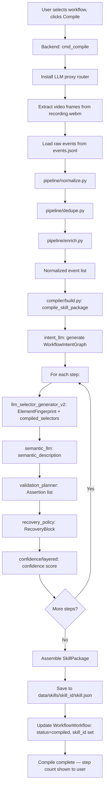
```mermaid
flowchart TD
    A[User selects workflow, clicks Compile] --> B[Backend: cmd_compile]
    B --> C[Install LLM proxy router]
    C --> C2[Extract video frames from recording.webm]
    C2 --> D[Load raw events from events.jsonl]
    D --> E[pipeline/normalize.py]
    E --> F[pipeline/dedupe.py]
    F --> G[pipeline/enrich.py]
    G --> H[Normalized event list]
    H --> I[compiler/build.py: compile_skill_package]
    
    I --> J[intent_llm: generate WorkflowIntentGraph]
    J --> K[For each step:]
    K --> L[llm_selector_generator_v2: ElementFingerprint + compiled_selectors]
    L --> M[semantic_llm: semantic_description]
    M --> N[validation_planner: Assertion list]
    N --> O[recovery_policy: RecoveryBlock]
    O --> P[confidence/layered: confidence score]
    P --> Q{More steps?}
    Q -->|Yes| K
    Q -->|No| R[Assemble SkillPackage]
    R --> S[Save to data/skills/skill_id/skill.json]
    S --> T[Update WorkflowWorkflow: status=compiled, skill_id set]
    T --> U[Compile complete — step count shown to user]
```

**Frame extraction (step C2):** runs once per compile against `recording.webm`, cutting 5 PNGs per
recorded event (`before_far/near`, `at`, `after_near/far`) via ffmpeg for the compiler's vision-anchor
step. It is idempotent — a frame already on disk from a prior compile attempt is not re-cut — and
isolated per event, so one event's extraction failure (e.g. a slow/timed-out ffmpeg call) does not cost
any other event its frames. A failed event falls back to deterministic, DOM-derived anchors instead of
vision-model anchors for that step only (`Vision anchors fell back for step N` in the compile log);
primary element selection is unaffected, since the `IdentityBundle` never reads vision output. Recompile
re-attempts only the events still missing frames.

**Fresh compile quota:** Before local compile starts, Build Studio reserves 1 compile credit through `POST /api/v1/usage/compile/reserve`. The reservation is committed before the first LLM-assisted pipeline/compiler stage. If compile fails before commit, Build Studio releases the reservation; after commit, the credit remains consumed.

**Recompile quota:** Existing workflows with `skill_id` skip compile-credit reservation. Their proxied LLM calls use `usage_class="human_edit"` and draw from the monthly Human Edit pool.

**LLM calls** route through `conxa_core.llm.get_router()`, which is replaced at compile time with `LLMProxyClient` forwarding to `POST /api/v1/llm/proxy/{text,vision}` with `usage_class` set to `compile` or `human_edit`.

**Real-time events** stream from backend to renderer during compilation:
- `pipeline_start`, `pipeline_done`
- `compile_step` with `step` and `status` fields
- `compiler_start`, `compiler_done`
- `api_call` — each LLM call
- `compile_error` — on failure

---

## 6. Workflow Editing (HumanEdit)

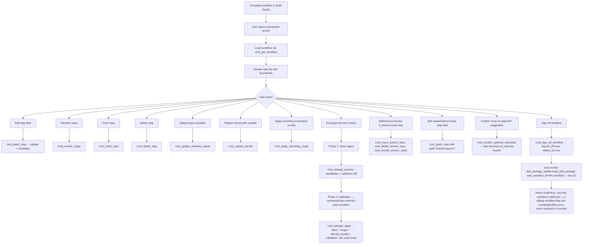
```mermaid
flowchart TD
    A[Compiled workflow in Build Studio] --> B[User opens HumanEdit screen]
    B --> C[Load workflow via cmd_get_workflow]
    C --> D[Render step list with thumbnails]
    D --> E{User action}
    E --> F[Edit step field] --> G[cmd_patch_step → update + revalidate]
    E --> H[Reorder steps] --> I[cmd_reorder_steps]
    E --> J[Insert step] --> K[cmd_insert_step]
    E --> L[Delete step] --> M[cmd_delete_step]
    E --> N[Update input variables] --> O[cmd_update_workflow_inputs]
    E --> P[Replace literal with variable] --> Q[cmd_replace_literals]
    E --> R[Apply recording screenshot to step] --> S[cmd_apply_recording_visual]
    E --> T[Re-target element wizard] --> T1[Phase 1: draw region] --> T2[cmd_retarget_preview: candidates + validation diff] --> T3[Phase 3: Validation — review/edit the enforced post-condition] --> T4[cmd_retarget_apply → bbox + target + identity_bundle + validation, one undo entry]
    E --> U1[Add/remove/reorder if_present body step] --> U2[cmd_insert_branch_step / cmd_delete_branch_step / cmd_reorder_branch_steps]
    E --> U3[Edit nested branch-body step field] --> U4[cmd_patch_step with path='branch.steps N ']
    E --> U5["Confirm 'treat as optional?' suggestion"] --> U6[cmd_confirm_optional_interstitial → step becomes try_dismiss branch]
    E --> V[Sign off workflow] --> W[cmd_sign_off_workflow → signed_off=true, edited_at=now]
    W --> Z[Auto-invoke skill_package_builder.build_skill_package, only_workflow_id=this workflow — see §7] --> AA[Return built=true; only this workflow's skill built — a sibling workflow that isn't compiled/edited yet is never required or touched]
```

**Patch gate:** Each edit increments the skill version. `revalidate_step()` checks that selector and intent remain coherent after the patch.

**Three-tier review surface (2026-07-10 redesign):** the workflow list, per-step panel, and a new
Diagnostics dialog now separate what an *approver* needs to see (branch-body sub-steps, safety
badges, a workflow-level compile-health banner, the compiled "Workflow plan" tool pane showing
`intent_graph`) from what a *skill engineer* needs (a per-step "Reliability" section: recovery
behavior, element fingerprint, current identity signals) from what *support* needs (integrity
hashes, LLM router stats). All of it is read-only projection through the existing
`cmd_get_workflow`/`_skill_response` chokepoint — see `docs/Implementation-Plan.md` §1.11 and
`research-analysis/Human-Edit-vs-Skill-Package.md` for the full audit and design rationale.

**Branch-step authoring:** `if_present`/`try_dismiss`/`wait_for_one_of` (§10.7 of `docs/TRD.md`)
are now insertable from the Add-action menu. `if_present`'s nested body gets a dedicated editor
(add/remove/reorder + per-step field edits via the new `path`-addressed `cmd_patch_step`); nested
steps cannot patch `recovery`/`validation` since branch bodies are best-effort and never enter
recovery. `try_dismiss`/`wait_for_one_of` show read-only summary badges only — no authoring UI
for their candidate/option lists yet (`TODO.md` BUILD-6).

**"Treat as optional?" suggestion (recording-next-steps.md Priority 2, 2026-07-10):** the recorder
now observes (never probes) whether a step's target sat inside what looked like an optional
interstitial — a dialog or cookie/consent banner — during recording, and flags it advisory-only;
the step still compiles and executes as a normal required step regardless. When flagged, the step
row in Human Edit shows a small "treat as optional?" badge (`WorkflowStepItem.tsx`). Confirming it
calls `cmd_confirm_optional_interstitial`, which rewrites the step into a real `try_dismiss` branch
(candidates seeded from the step's own recorded selector plus the recorder's observed container) —
the same executor path `try_dismiss` steps already use (§10.7 of `docs/TRD.md`). This is the only
way a branch step gets created from a live recording without hand-editing JSON: the compiler never
converts a flagged step on its own, honoring "branch steps compile only from observed states +
human confirmation."

**Auto-build on sign-off (2026-07 workflow redesign, Phase 1):** sign-off no longer just flips a flag. `cmd_sign_off_workflow` re-checks, after persisting `signed_off`/`edited_at`, whether every workflow belonging to the workflow is compiled and signed off — the same condition `workflow_builder.build_workflow` already gates on (§8). If so, it calls `build_workflow` itself, so the package exists the moment the gate is satisfied instead of requiring a separate visit to a build page (there is no such page anymore — see §8). The gate itself is unchanged; this only moves *when* the already-existing build call happens to fire.

**Re-target wizard (replaces the old direct "update visual bbox" flow):** `cmd_update_visual_bbox` still exists (bbox + vision-anchor regeneration only, no selector change) but the primary re-target entry point is the 3-phase wizard — Pick element → Review selectors → **Validation**. `cmd_retarget_preview` is read-only (generates and scores candidates + a validation diff without persisting); `cmd_retarget_apply` is the only command that writes, composing bbox + `target.primary_selector`/`fallback_selectors` + rebuilt `identity_bundle` + (optionally) regenerated `validation.wait_for`/`assertions` into a single document mutation and a single undo entry. See `docs/UI-UX-Brief.md` §2.8 for the UI.

**Phase 2 candidate generation when the element is re-picked** (drawing a new region) uses a vision LLM, not text: there is no stored per-element geometry anywhere in a recording (only the originally-clicked element carries a bbox, and the DOM snapshot is plain HTML with no inline coordinates), so a text prompt has no way to relate a drawn region to a DOM node. `conxa_compile/llm/region_selector_vision.py` (task `region_selector`) sends the step's full-page screenshot — with the drawn region highlighted, the same technique `anchor_vision_llm.py` uses for anchors — together with the recorded DOM snippet, so the model can see which element the box points to and read the DOM to select it. Candidates then go through the same validate/prune pipeline as every other selector source (§7.2). Continuing without re-picking the element (`regenerate=False`) still reads back the already-compiled selectors with no LLM call.

**Validation phase (was "Confirm & apply"):** Phase 3 is a true post-condition review, not just a
confirm-and-go screen. It surfaces the step's enforced (`required=True`) assertion — the single
deterministic post-condition the compiler picked for this action (`docs/Backend-Schema.md` §3.6)
— alongside any advisory checks, and lets the user edit the flat assertion list (type, target,
expected value, timeout, required) before applying. An edit sends `edited_assertions` in the
`cmd_retarget_apply` payload, which takes precedence over the previewed `proposed_assertions`;
omitting any edit falls back to today's keep/replace behavior unchanged. A step with no enforced
assertion is flagged in the UI ("this step will pass even if the action had no effect") rather
than silently accepted.

Deterministic Human Edit actions are available without quota: patch, reorder, delete, input edits, validation edits, sign-off, and reviewing a step's already-compiled selectors in the re-target wizard (continuing without re-picking the element). LLM-assisted actions such as selector regeneration (including the re-target wizard's Phase 2 candidate generation **when the element is re-picked**), visual re-anchor, screenshot/bbox anchor regeneration, semantic repair, and raw-recording recompile require remaining Human Edit pool.

---

## 7. Build Skill Package

**Trigger (revised 2026-08, re-scoped 2026-08-19):** there is no longer a "Build Skill Package" page or button. `cmd_build_skill_package` (and the `skill_package_builder.build_skill_package` call it wraps) fires automatically the moment sign-off's gate check passes for **that one workflow** — a sibling workflow that isn't compiled/edited yet is never required or touched — or manually via the Inspector drawer's "Rebuild package" action (also single-workflow scoped) or the Publish page's per-skill "Rebuild" action. 1 Workflow = 1 Skill = 1 Skill Package = 1 independent version history = 1 independent release: `build_skill_package(workspace_id, only_workflow_id=...)` compiles just that workflow into its own subtree of the shared local package directory, merging into (never replacing) whatever sibling skills were already built there. An explicit full-workspace rebuild (`only_workflow_id=None`) still exists as a maintenance action but is no longer the path sign-off or Publish use.

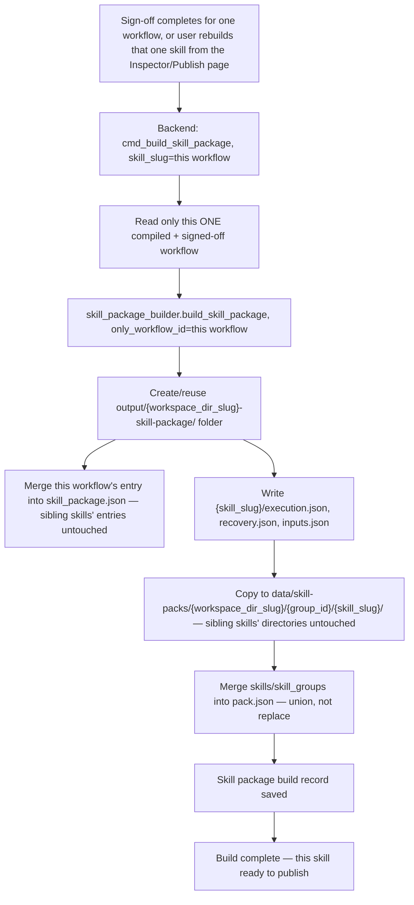
```mermaid
flowchart TD
    A[Sign-off completes for one workflow, or user rebuilds that one skill from the Inspector/Publish page] --> B[Backend: cmd_build_skill_package, skill_slug=this workflow]
    B --> C[Read only this ONE compiled + signed-off workflow]
    C --> D[skill_package_builder.build_skill_package, only_workflow_id=this workflow]
    D --> E["Create/reuse output/{workspace_dir_slug}-skill-package/ folder"]
    E --> F[Merge this workflow's entry into skill_package.json — sibling skills' entries untouched]
    E --> I["Write {skill_slug}/execution.json, recovery.json, inputs.json"]
    I --> M["Copy to data/skill-packs/{workspace_dir_slug}/{group_id}/{skill_slug}/ — sibling skills' directories untouched"]
    M --> N[Merge skills/skill_groups into pack.json — union, not replace]
    N --> O[Skill package build record saved]
    O --> P[Build complete — this skill ready to publish]
```

**Security check:** Build output directory is scanned for `auth.json`. If found, the build is **refused** with `auth_file_in_build_input` error.

---

## 8. Publish & Build Installer

**Publish is the primary, mandatory release action — and publishing is not
the same as deploying.** Build Studio only ever gets a version to Conxa
Cloud as an immutable, versioned artifact; a Cloud admin's explicit
Release/Deploy action is what actually activates it and starts customer
machines receiving it. Build Installer is a secondary, optional action for
distributing an already-published skill package as a standalone `.exe`.

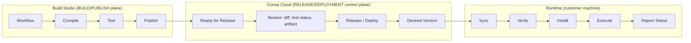
```mermaid
flowchart LR
    subgraph Studio["Build Studio (BUILD/PUBLISH plane)"]
        S1[Workflow] --> S2[Compile] --> S3[Test] --> S4[Publish]
    end
    subgraph Cloud["Conxa Cloud (RELEASE/DEPLOYMENT control plane)"]
        C1["Ready for Release"] --> C2[Review: diff, test status, artifact] --> C3["Release / Deploy"] --> C4["Desired Version"]
    end
    subgraph Runtime["Runtime (customer machine)"]
        R1[Sync] --> R2[Verify] --> R3[Install] --> R4[Execute] --> R5["Report Status"]
    end
    S4 --> C1
    C4 --> R1
```

### 8.1 Publish Skill Package (Build Studio, Primary)

The Publish page is scoped to ONE selected skill (workflow) via a skill
picker: release candidate → what will change (deterministic diff against
that skill's own previous version) → version + release notes → publish. Every
skill has its own independent version number (a brand-new skill's first
publish is v1.0.0, no previous-version requirement) and its own publish/test
gate — publishing "Create a Lead" never requires, checks, or touches "Update
Opportunity," even if "Update Opportunity" is failing its tests. Full
mechanism in `docs/TRD.md` §5.5a; API contracts in `docs/Backend-Schema.md`
§5.1d.

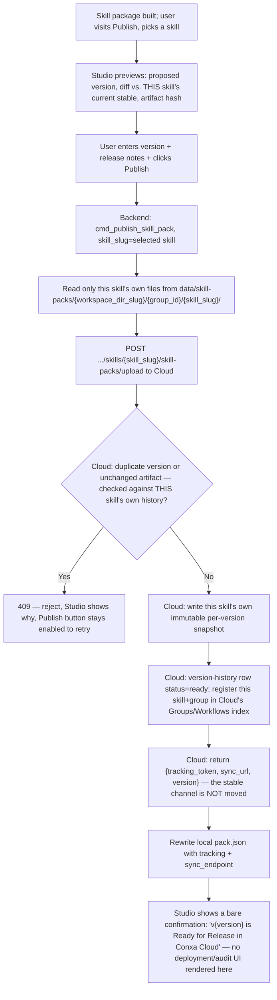
```mermaid
flowchart TD
    A[Skill package built; user visits Publish, picks a skill] --> A2["Studio previews: proposed version, diff vs. THIS skill's current stable, artifact hash"]
    A2 --> B[User enters version + release notes + clicks Publish]
    B --> C[Backend: cmd_publish_skill_pack, skill_slug=selected skill]
    C --> D["Read only this skill's own files from data/skill-packs/{workspace_dir_slug}/{group_id}/{skill_slug}/"]
    D --> E["POST .../skills/{skill_slug}/skill-packs/upload to Cloud"]
    E --> F{Cloud: duplicate version or unchanged artifact — checked against THIS skill's own history?}
    F -->|Yes| F2[409 — reject, Studio shows why, Publish button stays enabled to retry]
    F -->|No| G["Cloud: write this skill's own immutable per-version snapshot"]
    G --> H["Cloud: version-history row status=ready; register this skill+group in Cloud's Groups/Workflows index"]
    H --> I["Cloud: return {tracking_token, sync_url, version} — the stable channel is NOT moved"]
    I --> J[Rewrite local pack.json with tracking + sync_endpoint]
    J --> K["Studio shows a bare confirmation: 'v{version} is Ready for Release in Conxa Cloud' — no deployment/audit UI rendered here"]
```

A failed publish (step F2, or a failure inside G-H) never creates a "ready"
row — the UI states plainly that nothing was uploaded and what version failed.
Because every step above is scoped to one skill, a failed publish (or a
failing test gate) for one skill never blocks, retests, or republishes any
other skill. Build Studio never renders release history, deployment status,
or an audit log — those, along with Release/Deploy and Rollback, are
Cloud-only (§8.1a).

### 8.1a Release, Deploy, Rollback, and Deployment/Audit — Conxa Cloud (Primary)

Everything downstream of "uploaded to Cloud" lives in the Cloud dashboard
under Skill Packages → Group → Workflow, never in Build Studio:

- **Ready for Release**: every "ready" version for the selected workflow,
  each with its diff against the previous release, its test status
  (`tests_passed`, reported by Build Studio at publish time), and its
  artifact hash.
- **Release / Deploy**: a Cloud admin picks a "ready" version and confirms
  (current stable, target, effect shown explicitly). This is the *only*
  action anywhere in the product that moves a skill's stable channel forward
  — it refreshes that skill's files in the mutable mirror runtimes actually
  sync from, records its `component_versions` entry, and flips the version
  row to "published." Admin/owner only, enforced server-side
  (`require_admin`), same gate as publish and rollback.
- **Rollback**: from Release History, an admin/owner picks a previous
  *already-published* version of the same skill and confirms. No artifact is
  rebuilt or re-uploaded — that skill's stable channel pointer moves back to
  the already-immutable snapshot, and only that skill's files in the mutable
  mirror plus its own `component_versions` entry are refreshed from it; no
  other skill's channel, files, or version history is touched, and the
  company-level `pack.json` (target_url, tracking) is left as-is. **Rollback
  is always scoped to one workflow/skill — never the whole group.**
- **Deployment dashboard**: desired (stable) version vs. what each registered
  machine last reported, derived only from data the runtime actually reports
  (`runtime_registrations`) — never fabricated. Per-machine status is one of
  `up_to_date`, `pending` (hasn't synced to the desired version yet),
  `failed` (the runtime reported a sync error — checksum mismatch or
  download/activation failure — that it hasn't since recovered from),
  `offline` (not seen in 30 days), or `unknown` (a registration that predates
  per-skill version reporting).
- **Audit log**: every publish, release, rollback, and channel-change event
  for the selected skill, attributed to the user who did it — a durable,
  unbounded per-skill event log (mirrored into the global audit ring buffer
  the rest of the dashboard already uses).

Runtimes pick up a Release or a Rollback at their next regular delta-sync —
the sync mechanism itself doesn't know the difference between the two, only
that the stable channel moved.

### 8.2 Build Installer (Secondary, Optional)

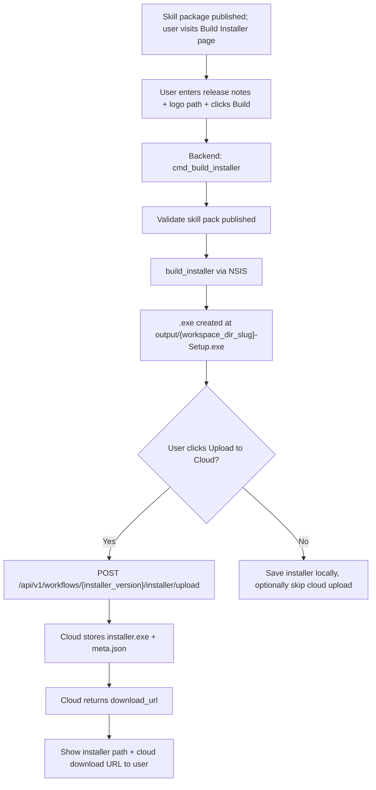
```mermaid
flowchart TD
    A[Skill package published; user visits Build Installer page] --> B[User enters release notes + logo path + clicks Build]
    B --> C[Backend: cmd_build_installer]
    C --> D[Validate skill pack published]
    D --> E[build_installer via NSIS]
    E --> F[".exe created at output/{workspace_dir_slug}-Setup.exe"]
    
    F --> G{User clicks Upload to Cloud?}
    G -->|Yes| H["POST /api/v1/workflows/{installer_version}/installer/upload"]
    G -->|No| I[Save installer locally, optionally skip cloud upload]
    H --> J[Cloud stores installer.exe + meta.json]
    J --> K[Cloud returns download_url]
    K --> L[Show installer path + cloud download URL to user]
```

**Installer contents:**
- `skill-packs/{workspace_dir_slug}/` (pack.json with tracking config embedded)
- `runtime.exe` + `keytar.node` + `version.json`
- Chromium browser (fetched at install time via `runtime.exe --install-playwright`, not bundled)

**Customer-visible meters shown during this flow:**
- Settings/Billing: seats, machines, compile credits, Human Edit pool.
- Publish: compile credits (paid monthly tier only).
- Build Installer: optional cloud upload; no metering (upload can be skipped entirely).

Workflow recording and local workflow creation remain unlimited.

---

## 9. End-User Installation

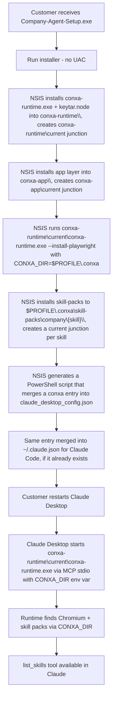
```mermaid
flowchart TD
    A[Customer receives Company-Agent-Setup.exe] --> B[Run installer - no UAC]
    B --> C["NSIS installs conxa-runtime.exe + keytar.node into conxa-runtime\<version>\, creates conxa-runtime\current junction"]
    C --> D[NSIS installs app layer into conxa-app\<version>\, creates conxa-app\current junction]
    D --> E[NSIS runs conxa-runtime\current\conxa-runtime.exe --install-playwright with CONXA_DIR=$PROFILE\.conxa]
    E --> F["NSIS installs skill-packs to $PROFILE\.conxa\skill-packs\company\{skill}\<version>\, creates a current junction per skill"]
    F --> G[NSIS generates a PowerShell script that merges a conxa entry into claude_desktop_config.json]
    G --> H[Same entry merged into ~/.claude.json for Claude Code, if it already exists]
    H --> I[Customer restarts Claude Desktop]
    I --> J[Claude Desktop starts conxa-runtime\current\conxa-runtime.exe via MCP stdio with CONXA_DIR env var]
    J --> K[Runtime finds Chromium + skill packs via CONXA_DIR]
    K --> L[list_skills tool available in Claude]
```

**Install scope:** Per-user (`RequestExecutionLevel user`), installs to `$PROFILE\.conxa` (i.e. `%USERPROFILE%\.conxa`). No admin elevation required. Correctly resolves to the logged-in user's profile (avoids the elevated-admin-wrong-profile bug).

**Versioned layout:** Every component the installer lays down (host exe, app layer, each skill) is its own versioned directory with a `current` directory junction pointing at it — see TRD.md §4.4. Junctions are used (rather than a plain flat copy) because this is the exact same on-disk convention the runtime's self-updater writes into later; the installer's initial install and every subsequent update speak the same layout from day one. Directory junctions don't require admin rights or Developer Mode, unlike true NTFS symlinks.

**MCP registration:** The installer writes directly into `claude_desktop_config.json` via a generated PowerShell script that does a non-destructive JSON merge (preserves any existing `mcpServers` entries). The registered `command` points at `conxa-runtime\current\conxa-runtime.exe` — a stable path that is written **once**, at install time, and never rewritten; every future self-update simply flips the `current` junction to a new version directory, so Claude Desktop's config never needs to change again. The script auto-detects the Microsoft Store/MSIX install path (`%LOCALAPPDATA%\Packages\Claude_*\LocalCache\Roaming\Claude\`) and falls back to `%APPDATA%\Claude\` otherwise. If `~/.claude.json` (Claude Code) already exists, the same entry is merged there too; it is never created if absent.

**CONXA_DIR wiring:** The MCP entry written into `claude_desktop_config.json` (and `~/.claude.json`) sets `env.CONXA_DIR = $PROFILE\.conxa` — the same `INSTALL_DIR` used during install. `server.js` derives `PLAYWRIGHT_BROWSERS_PATH` and `SKILL_PACKS_DIR` from `CONXA_DIR`, so the runtime always finds the `.exe`-installed Chromium and skill packs.

**Uninstall asymmetry:** The `.exe` uninstaller removes `$PROFILE\.conxa` (when no other companies' skill packs remain) and the HKCU uninstall registry key, and also removes the `conxa` entry from `claude_desktop_config.json` and `~/.claude.json` via the same PowerShell-merge approach — no manual cleanup needed in Claude Desktop's UI. `RMDir /r` on a tree containing directory junctions removes each junction as a single reparse-point entry without recursing into its target (standard Win32 behaviour); since every `current` junction points at a version directory that is itself a normal subdirectory of the same tree being removed, nothing survives and nothing is ever deleted through an unintended path.

---

## 10. Runtime Registration & First Sync

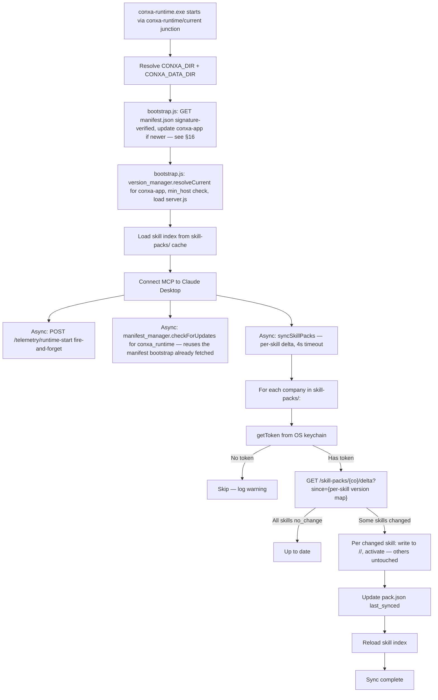
```mermaid
flowchart TD
    A[conxa-runtime.exe starts via conxa-runtime/current junction] --> B[Resolve CONXA_DIR + CONXA_DATA_DIR]
    B --> B2[bootstrap.js: GET manifest.json signature-verified, update conxa-app if newer — see §16]
    B2 --> C[bootstrap.js: version_manager.resolveCurrent for conxa-app, min_host check, load server.js]
    C --> D[Load skill index from skill-packs/ cache]
    D --> E[Connect MCP to Claude Desktop]
    E --> F[Async: POST /telemetry/runtime-start fire-and-forget]
    E --> G[Async: manifest_manager.checkForUpdates for conxa_runtime — reuses the manifest bootstrap already fetched]
    E --> H[Async: syncSkillPacks — per-skill delta, 4s timeout]
    H --> I[For each company in skill-packs/:]
    I --> J[getToken from OS keychain]
    J -->|No token| K[Skip — log warning]
    J -->|Has token| L["GET /skill-packs/{co}/delta?since={per-skill version map}"]
    L -->|All skills no_change| M[Up to date]
    L -->|Some skills changed| N[Per changed skill: write to <skill>/<version>/, activate — others untouched]
    N --> O[Update pack.json last_synced]
    O --> P[Reload skill index]
    P --> Q[Sync complete]
```

**No token-acquisition step needed:** the runtime authenticates to Conxa Cloud using the **installer-embedded sync token** — a `secrets.token_urlsafe(32)` string minted at publish time and written into `pack.json` (see `docs/TRD.md` §5.4, `docs/Auth-and-Updater.md` §1.3). It's sent as `Authorization: Bearer` on every delta-sync request straight out of the installer, with no keytar lookup and no user login required. This superseded an earlier design (a Clerk-token/`setup_company` challenge-URL flow) that would have required an in-app completion step — that flow was replaced before shipping, so there is no first-sync gap to close here.

---

## 11. MCP Skill Execution

```mermaid
sequenceDiagram
    participant User
    participant Claude as Claude Desktop
    participant RT as Runtime (MCP)
    participant Browser as Playwright Browser
    participant Cloud as Conxa Cloud

    User->>Claude: "Submit my expense report for last week"
    Claude->>RT: list_skills
    RT-->>Claude: [{company: "acme", slug: "submit_expense", inputs: [...]}]
    Claude->>RT: get_skill_inputs(skill="submit_expense", company="acme")
    RT-->>Claude: {inputs: [{name: "period", type: "string", required: true}]}
    Claude->>User: "What period? (e.g. 'last week', '2025-05')"
    User->>Claude: "last week"
    Claude->>RT: execute_skill(skill="submit_expense", company="acme", inputs={period: "last week"})
    RT->>RT: load execution.json + recovery.json
    RT->>RT: load storageState from cache/sessions/, validate against protected_url
    alt session missing or expired
        RT->>Browser: open interactive login window (non-blocking)
        RT-->>Claude: "A login window is open — sign in, then re-run the skill."
        Claude-->>User: relays the message
        Note over Browser,RT: capture + save happens in the background;<br/>next execute_skill call picks up the fresh session
    else session valid
        RT->>Browser: launch Chromium (headed by default)
        loop For each step
            RT->>Browser: executeStep() with resolveElement()
            Browser-->>RT: success or failure
            RT->>RT: verifyAssertions()
            RT->>RT: writeCheckpoint()
            RT->>Cloud: POST /tracking/{co}/events (async)
        end
        Browser-->>RT: workflow complete
        RT->>Browser: close
        RT-->>Claude: {content: [{type: "text", text: "Done. Expense report submitted."}]}
        Claude-->>User: "Done. Expense report submitted."
    end
```

A step failing mid-execution with a login redirect (session expired) follows the same
non-blocking pattern: `isAuthFailure()` detects it, a login window opens in the background, and
`execute_skill` returns immediately telling Claude to resume with `resume_from` once the user has
signed in — see `docs/Auth-and-Updater.md` §1.3.

---

## 12. Execution with Recovery

Before step 0, the runtime runs an **advisory pre-execution drift check** (`runtime/drift.js`):
it looks for the pack's recorded structural landmarks on the live page and, if most are gone
(a redesign signal), emits a `drift_detected` telemetry event that surfaces on the vendor
dashboard's `/drift` queue. This **never blocks** — execution proceeds straight into the per-step
loop below and normal recovery still applies. See TRD §10.6.

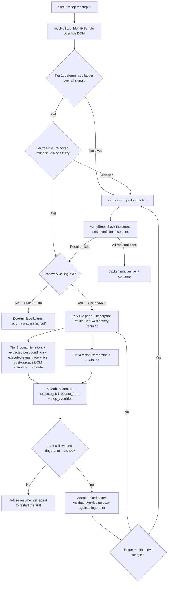
```mermaid
flowchart TD
    A[executeStep for step N] --> B[resolveStep: IdentityBundle over live DOM]
    B --> C{Tier 1: deterministic ladder over all signals}
    C -->|Resolved| D[withLocator: perform action]
    C -->|Fail| E{Tier 2: a11y / re-hover / fallback / dialog / fuzzy}
    E -->|Resolved| D
    E -->|Fail| F{Recovery ceiling ≥ 3?}
    F -->|No — Build Studio| N[Deterministic failure: report, no agent handoff]
    F -->|Yes — Claude/MCP| G[Park live page + fingerprint; return Tier 3/4 recovery request]
    G --> H[Tier 3 semantic: intent + expected post-condition + executed-steps trace + live post-cascade DOM inventory → Claude]
    G --> I[Tier 4 vision: screenshots → Claude]
    H --> J[Claude resumes: execute_skill resume_from + step_overrides]
    I --> J
    J --> P{Park still live and fingerprint matches?}
    P -->|No| Q[Refuse resume: ask agent to restart the skill]
    P -->|Yes| K[Adopt parked page; validate override selector against fingerprint]
    K --> R{Unique match above margin?}
    R -->|No| G
    R -->|Yes| D
    D --> L[verifyStep: check the step's post-condition assertions]
    L -->|All required pass| M[tracker.emit tier_ok + continue]
    L -->|Required fails| F
```

**Validated closing edge:** the agent's `step_overrides` selector is never applied blind. It is
resolved against the live page and scored against the step's recorded fingerprint the same way
`resolver.js` scores a compiled signal — a unique match is accepted, a multi-match must clear the
uniqueness margin, and a no-match/ambiguous selector is rejected back into a fresh recovery
request (`R -->|No| G` above) rather than silently acting on the first match. Separately, the
parked page itself is only trusted if a cheap page-state fingerprint (url + interactive-element
count + a body-text hash) still matches what was captured at park time — a page that has drifted
while the agent was reasoning is discarded, and the resume is refused outright rather than
silently continuing mid-plan on a fresh, different page. See `docs/TRD.md` §10.1.

**Re-verified recovery:** a "resolved" in Tier 1/2 above isn't the end of the story for a
consequential step — every remedy that re-runs the action re-checks the post-condition
(`verifyStep`) before being counted as recovered (`runtime/run.js` `recoverWithSelector`). A
verify-fail also skips straight past the Tier 1 single-remedy retry (re-running the same action
against the same, already-checked DOM can't fix it) into Tier 2's resolution-changing mechanisms.
See `docs/TRD.md` §10.2a/§10.2b for the assertion vocabulary and the re-verify wiring.

---

## 13. Skill Pack Update (Company Side)

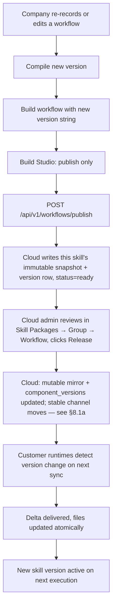
```mermaid
flowchart TD
    A[Company re-records or edits a workflow] --> B[Compile new version]
    B --> C[Build workflow with new version string]
    C --> D[Build Studio: publish only]
    D --> E[POST /api/v1/workflows/publish]
    E --> F["Cloud writes this skill's immutable snapshot + version row, status=ready"]
    F --> G["Cloud admin reviews in Skill Packages → Group → Workflow, clicks Release"]
    G --> H["Cloud: mutable mirror + component_versions updated; stable channel moves — see §8.1a"]
    H --> I[Customer runtimes detect version change on next sync]
    I --> J[Delta delivered, files updated atomically]
    J --> K[New skill version active on next execution]
```

**No re-installer needed** for content-only updates — once released, the runtime's delta sync
handles delivery automatically. **Publishing alone never reaches step H** — see §8.1/§8.1a for why
that split exists and who does each half.

---

## 14. Skill Sync (Runtime Side)

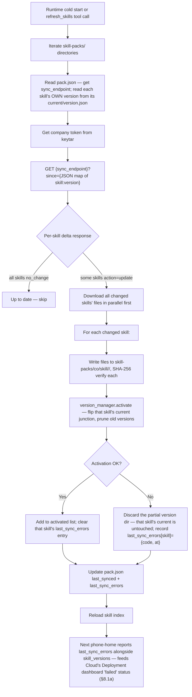
```mermaid
flowchart TD
    A[Runtime cold start or refresh_skills tool call] --> B[Iterate skill-packs/ directories]
    B --> C[Read pack.json — get sync_endpoint; read each skill's OWN version from its current/version.json]
    C --> D[Get company token from keytar]
    D --> E["GET {sync_endpoint}?since={JSON map of skill:version}"]
    E --> F{Per-skill delta response}
    F -->|all skills no_change| G[Up to date — skip]
    F -->|some skills action=update| H[Download all changed skills' files in parallel first]
    H --> I[For each changed skill:]
    I --> J[Write files to skill-packs/co/skill/<version>/, SHA-256 verify each]
    J --> K[version_manager.activate — flip that skill's current junction, prune old versions]
    K --> L{Activation OK?}
    L -->|Yes| M[Add to activated list; clear that skill's last_sync_errors entry]
    L -->|No| N["Discard the partial version dir — that skill's current is untouched; record last_sync_errors[skill]={code, at}"]
    M --> O[Update pack.json last_synced + last_sync_errors]
    N --> O
    O --> P[Reload skill index]
    P --> Q["Next phone-home reports last_sync_errors alongside skill_versions — feeds Cloud's Deployment dashboard 'failed' status (§8.1a)"]
```

Each skill is compared and activated **independently** — republishing one skill never redownloads or re-touches the others (see TRD.md §5.9). A checksum mismatch or a download/activation failure for one skill is recorded (`code`: `checksum_mismatch` | `download_failed` | `activation_failed`) and cleared the moment that skill next activates successfully — it never blocks or delays any other skill's sync.

---

## 15. Runtime Self-Update

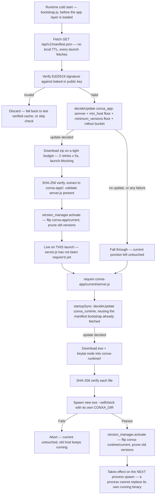
```mermaid
flowchart TD
    A[Runtime cold start — bootstrap.js, before the app layer is loaded] --> B[Fetch GET /api/v1/manifest.json — no local TTL, every launch fetches]
    B --> C[Verify Ed25519 signature against baked-in public key]
    C -->|Invalid| D[Discard — fall back to last verified cache, or skip check]
    C -->|Valid| E[decideUpdate conxa_app: semver + min_host floor + minimum_versions floor + rollout bucket]

    E -->|update decided| L[Download zip on a tight budget — 2 retries x 5s, launch-blocking]
    L --> M[SHA-256 verify, extract to conxa-app/<version>/, validate server.js present]
    M --> N[version_manager.activate — flip conxa-app/current, prune old versions]
    N --> O[Live on THIS launch — server.js has not been require'd yet]
    E -->|no update, or any failure| P[Fall through — current junction left untouched]

    O --> Q[require conxa-app/current/server.js]
    P --> Q
    Q --> R[startupSync: decideUpdate conxa_runtime, reusing the manifest bootstrap already fetched]

    R -->|update decided| F[Download exe + keytar.node into conxa-runtime/<version>/]
    F --> G[SHA-256 verify each file]
    G --> H[Spawn new exe --selfcheck with its own CONXA_DIR]
    H -->|Fails| I[Abort — current untouched, old host keeps running]
    H -->|Passes| J[version_manager.activate — flip conxa-runtime/current, prune old versions]
    J --> K[Takes effect on the NEXT process spawn — a process cannot replace its own running binary]
```

Because each new version lands in its own directory rather than overwriting whatever file the *currently running* process loaded from, activation never needs to wait for a "safe restart" — there's nothing running that could be disrupted by it.

The two legs are timed differently on purpose. The app layer is checked *before* anything loads it, so a new app version takes effect on the same launch that downloaded it — which is why its download budget is deliberately small and every failure is swallowed rather than surfaced. The host exe can't possibly apply until the next spawn, so it keeps a generous retry budget and runs in the background alongside skill sync. See `docs/TRD.md` §5.8.

---

## 16. Failure Recovery (End User)

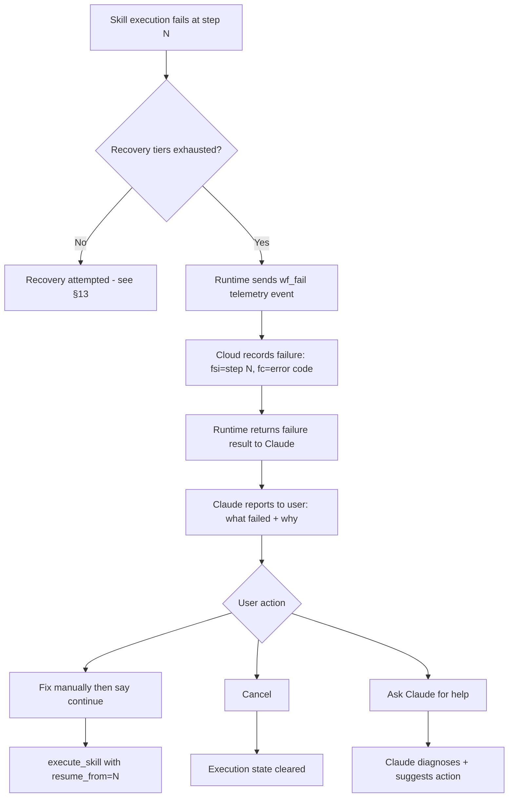
```mermaid
flowchart TD
    A[Skill execution fails at step N] --> B{Recovery tiers exhausted?}
    B -->|No| C[Recovery attempted - see §13]
    B -->|Yes| D[Runtime sends wf_fail telemetry event]
    D --> E[Cloud records failure: fsi=step N, fc=error code]
    E --> F[Runtime returns failure result to Claude]
    F --> G[Claude reports to user: what failed + why]
    G --> H{User action}
    H --> I[Fix manually then say continue] --> J[execute_skill with resume_from=N]
    H --> K[Cancel] --> L[Execution state cleared]
    H --> M[Ask Claude for help] --> N[Claude diagnoses + suggests action]
```

**Execution state:** `data/executions/{id}/checkpoint.json` records the last successfully completed step. On resume, execution starts from `resume_from` step index with the same browser session if still open.

---

## 17. Entitlement Gates (Trial, Machines, Distribution, BYOK)

Added 2026-08-08 for the capability ladder (`docs/PRD.md` §11, `docs/TRD.md` §13.4). These gates sit in
front of steps 6 (Pipeline & Compilation) and 9 (Build Installer & Publish) above — they don't replace
those flows, they can block entry into them.

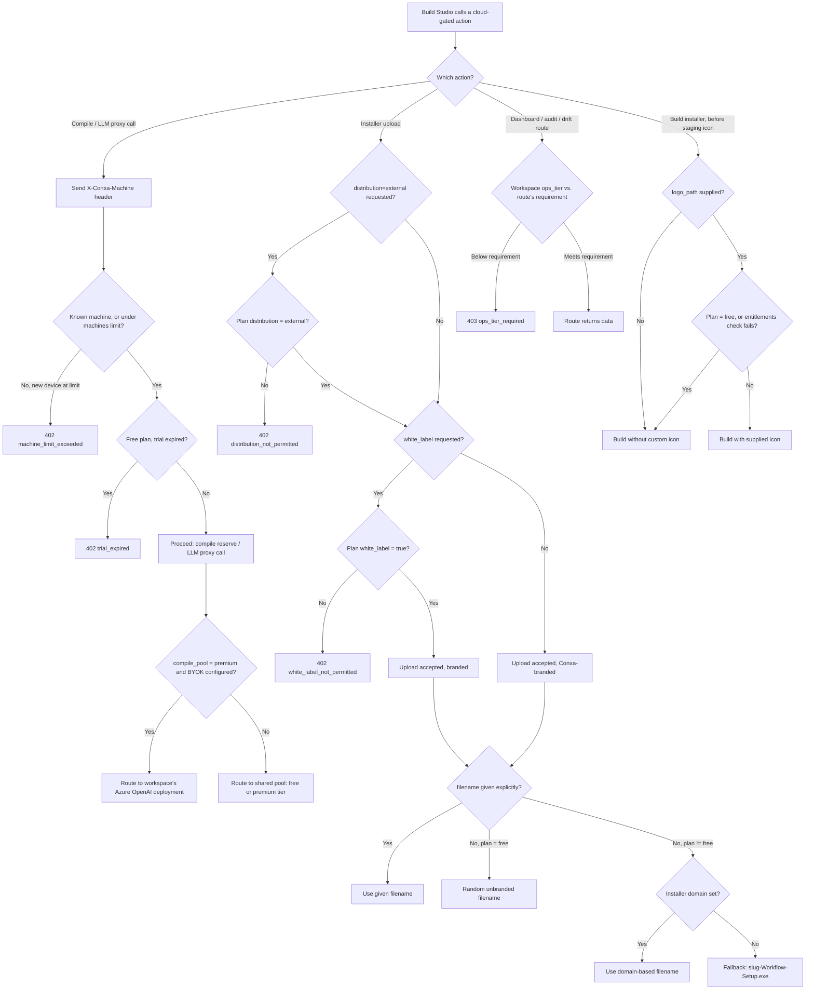
```mermaid
flowchart TD
    A[Build Studio calls a cloud-gated action] --> B{Which action?}
    B -->|Compile / LLM proxy call| C[Send X-Conxa-Machine header]
    C --> D{Known machine, or under machines limit?}
    D -->|No, new device at limit| E[402 machine_limit_exceeded]
    D -->|Yes| F{Free plan, trial expired?}
    F -->|Yes| G[402 trial_expired]
    F -->|No| H[Proceed: compile reserve / LLM proxy call]
    H --> I{compile_pool = premium and BYOK configured?}
    I -->|Yes| J[Route to workspace's Azure OpenAI deployment]
    I -->|No| K[Route to shared pool: free or premium tier]

    B -->|Installer upload| L{distribution=external requested?}
    L -->|Yes| M{Plan distribution = external?}
    M -->|No| N[402 distribution_not_permitted]
    M -->|Yes| O{white_label requested?}
    L -->|No| O
    O -->|Yes| P{Plan white_label = true?}
    P -->|No| Q[402 white_label_not_permitted]
    P -->|Yes| R[Upload accepted, branded]
    O -->|No| S[Upload accepted, Conxa-branded]
    R --> AE{filename given explicitly?}
    S --> AE
    AE -->|Yes| AF[Use given filename]
    AE -->|No, plan = free| AG[Random unbranded filename]
    AE -->|No, plan != free| AH{Installer domain set?}
    AH -->|Yes| AI[Use domain-based filename]
    AH -->|No| AJ["Fallback: slug-Workflow-Setup.exe"]

    B -->|Dashboard / audit / drift route| T{Workspace ops_tier vs. route's requirement}
    T -->|Below requirement| U[403 ops_tier_required]
    T -->|Meets requirement| V[Route returns data]

    B -->|Build installer, before staging icon| AK{logo_path supplied?}
    AK -->|No| AL[Build without custom icon]
    AK -->|Yes| AM{Plan = free, or entitlements check fails?}
    AM -->|Yes| AL
    AM -->|No| AN[Build with supplied icon]
```

**First-time machine registration.** A brand-new device registers itself on its first gated call — there
is no separate "register this machine" step in the Studio UI. Settings shows the resulting device list
(`GET /entitlements/machines`) and lets an admin revoke one (`POST /entitlements/machines/revoke`); a
revoked machine re-enters through the limit check on its next call, it doesn't silently reappear.

**Trial banner.** While `trial_expired` is false but `trial_ends_at` is set, Studio and the dashboard
show a countdown; once expired, the same building actions above 402, with a plain-language upgrade
prompt (`docs/UI-UX-Brief.md`).

**BYOK setup** (Enterprise only): Settings → configure Azure OpenAI endpoint/deployment/API key via
`PUT /api/v1/workspace/llm-key`. Once configured, every subsequent compile and LLM proxy call for that
workspace routes to the customer's own deployment instead of the shared pool — silently, with no
per-call toggle. `GET` on the same endpoint never returns the key, only whether one is configured.

**Plan-aware installer naming and icon**, added 2026-08-09 (`docs/TRD.md` §13.4a, `docs/Backend-Schema.md`
§5.1c): a Free-tier installer that predates this feature would run and update on any machine — an
earlier same-day attempt at hard-locking that (machine-hash stamped into `pack.json`, checked by the
runtime and the delta-sync endpoint) was reverted for blocking legitimate reinstalls, so no such lock
exists today (see `TODO.md` CLOUD-3, reopened). What ships instead is cosmetic, not restrictive: Free
gets a randomly-named, unbranded `.exe` with no custom icon; paid plans get a filename derived from a
workspace-set (but not yet ownership-verified — see `TODO.md` PROD-6) installer domain, and may embed a
custom icon.

---

## Flow Summary

| Flow | Trigger | Systems Involved | Duration |
|---|---|---|---|
| Onboarding | First Build Studio launch | Build Studio, Cloud | ~5 min |
| Login | User clicks Sign In | Build Studio, Clerk | <30s |
| Record auth | Workflow setup | Build Studio, Target website | 2–5 min |
| Record workflow | Workflow setup | Build Studio, Target website | 5–30 min |
| Compile | After recording | Build Studio, Cloud LLM proxy | 1–10 min |
| Build installer | After compile | Build Studio, Cloud | 1–5 min |
| Customer install | .exe runs | Runtime, Claude Desktop | 2–5 min |
| Skill execution | Claude tool call | Runtime, Target website | 10s–5 min |
| Recovery | Step failure | Runtime, Cloud (LLM at T3+) | +2–30s |
| Skill update | Cloud admin releases a "ready" version | Build Studio (publish), Cloud (release), Runtime (next sync) | <15s sync after release |
| Runtime update | Cold start check | Runtime, Cloud | Background |
| Entitlement gate | Every compile/LLM/installer call | Build Studio, Cloud | <200ms |
