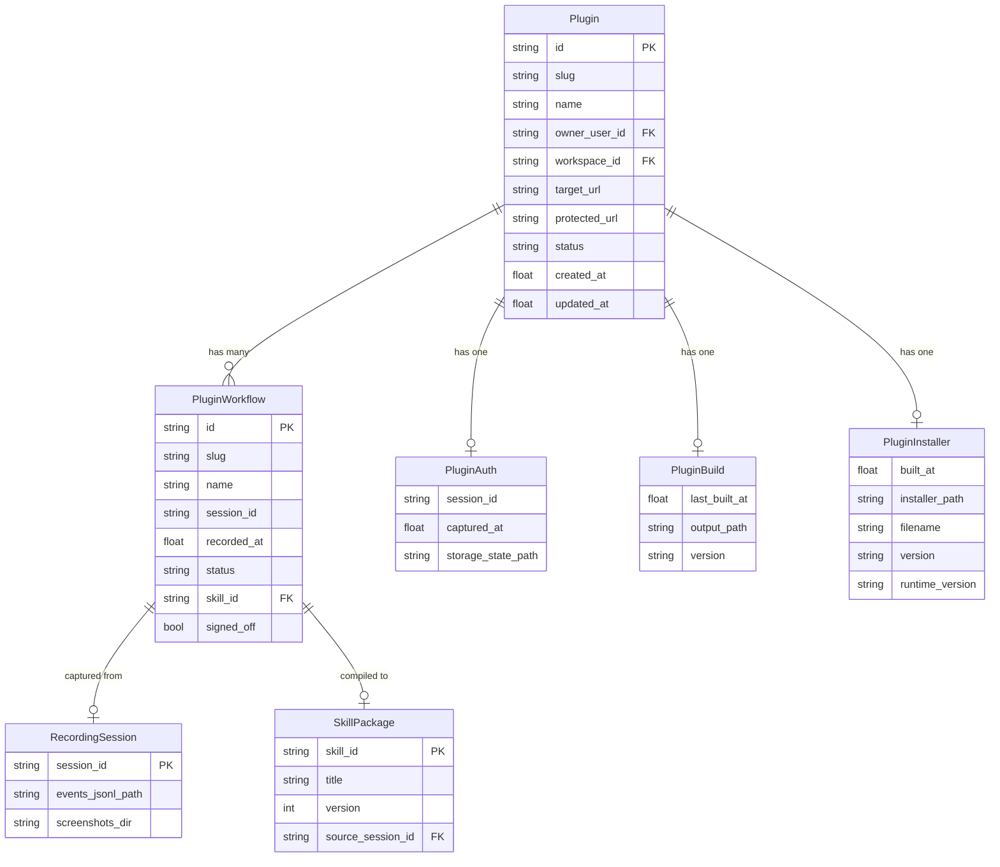
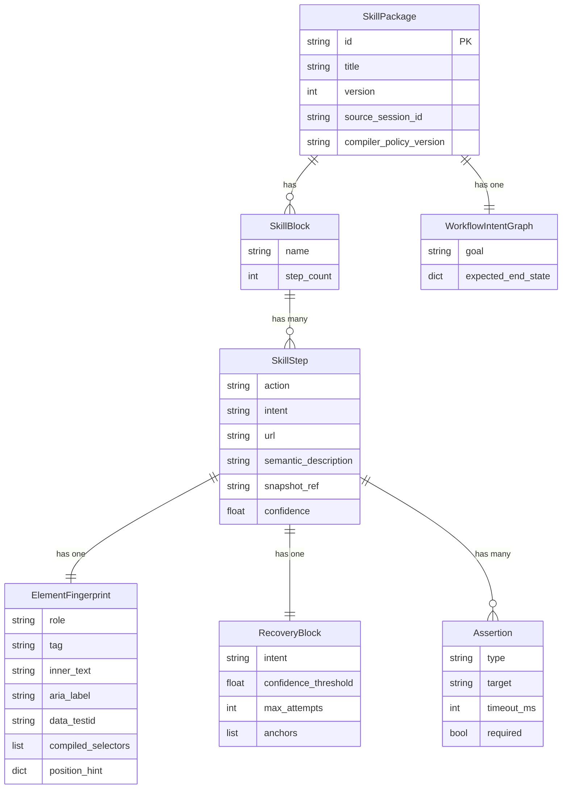
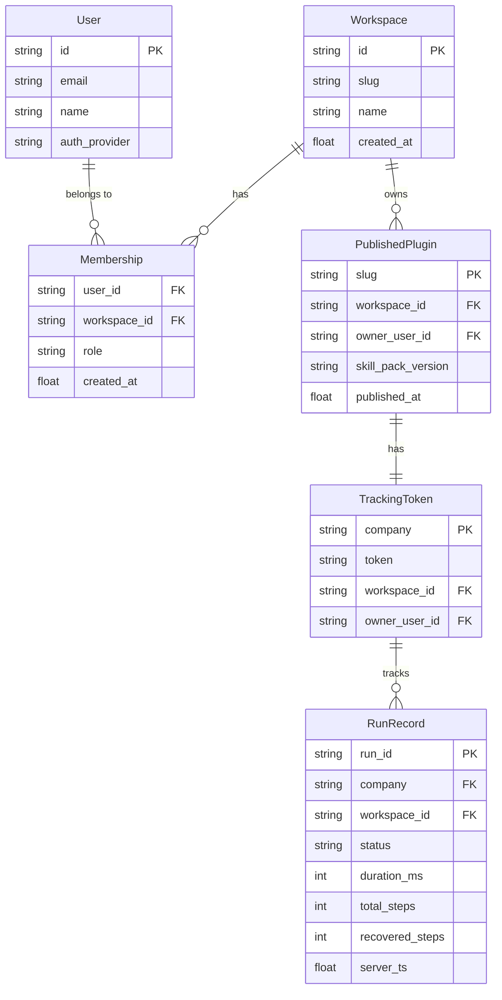

# Backend Schema Document

**Status:** Current as of 2026-06-11
**Scope:** All data models, storage architecture, and API contracts

---

## Table of Contents

1. [Storage Architecture](#1-storage-architecture)
2. [Core Data Models](#2-core-data-models)
3. [Skill Package Schema](#3-skill-package-schema)
4. [Tracking / Telemetry Schema](#4-tracking--telemetry-schema)
5. [API Contracts](#5-api-contracts)
6. [Entity Relationship Diagrams](#6-entity-relationship-diagrams)
7. [KV Namespace Map](#7-kv-namespace-map)
8. [File Storage Map](#8-file-storage-map)
9. [Multi-Tenancy Design](#9-multi-tenancy-design)
10. [Security Considerations](#10-security-considerations)

---

## 1. Storage Architecture

Conxa uses a **dual-mode key-value store** abstracted in `packages/conxa-core/conxa_core/db.py`.

### 1.1 PostgreSQL Mode (Production)

Activated when `SKILL_DATABASE_URL` is set. Required in production (`SKILL_AUTH_REQUIRED=true`).

```sql
CREATE TABLE IF NOT EXISTS kv_store (
    namespace  TEXT        NOT NULL,
    key        TEXT        NOT NULL,
    data       JSONB       NOT NULL DEFAULT '{}',
    created_at TIMESTAMPTZ NOT NULL DEFAULT now(),
    updated_at TIMESTAMPTZ NOT NULL DEFAULT now(),
    PRIMARY KEY (namespace, key)
);
```

**Access patterns:**
- `db_get(namespace, key)` → JSONB data or None
- `db_set(namespace, key, value)` → upsert
- `db_append(namespace, key, items)` → append items to JSON array in `data`
- `db_list_kv(namespace)` → all (key, data) pairs in namespace

### 1.2 Filesystem Mode (Local Development)

Activated when `SKILL_DATABASE_URL` is not set.

```
data/kv/{namespace}/{sha256(key)}.json
```

Key is hashed to SHA-256 to produce a filesystem-safe filename (colons, slashes, etc. are invalid on Windows).

**Fallback:** Legacy paths used pre-hashing are also checked for backward compatibility.

### 1.3 Additional Storage (Non-KV)

Large or time-series data lives in flat files, not the KV store:

| Type | Path | Format |
|---|---|---|
| Raw recorded events | `data/sessions/{id}/events.jsonl` | JSONL (append-only) |
| Compiled skills | `data/skills/{id}/skill.json` | JSON (SkillPackage) |
| Skill screenshots | `data/sessions/{id}/screenshots/` | PNG |
| Step thumbnails | `data/skills/{id}/assets/` | PNG |
| Run logs (local) | `data/runs/{plugin_id}.jsonl` | JSONL |
| Published skill packs | `data/skill-packs/{co}/` | Directory tree |
| Installer binaries | `data/installers/{co}/installer.exe` | Binary |
| Installer metadata | `data/installers/{co}/meta.json` | JSON |
| Blob store (planned) | External (BLOB_READ_WRITE_TOKEN) | Binary |

---

## 2. Core Data Models

All models are Pydantic. Source: `packages/conxa-core/conxa_core/models/plugin.py`

### 2.1 Plugin

```python
class Plugin(BaseModel):
    id: str                    # UUID-like, e.g. "plugin_abc123"
    slug: str                  # URL-safe company identifier, e.g. "acme-corp"
    name: str                  # Display name
    owner_user_id: str         # Clerk user ID or "local"
    workspace_id: str          # Clerk org ID or "ws_local"
    target_url: str            # Entry URL for the target website
    protected_url: str         # URL captured after auth (e.g. dashboard URL)
    protected_url_marker_text: str  # Text that marks the protected area
    status: Literal["needs_auth", "ready", "building", "error"]
    auth: PluginAuth | None    # Captured browser session reference
    workflows: list[PluginWorkflow]
    build: PluginBuild | None  # Most recent build metadata
    installer: PluginInstaller | None
    created_at: float          # Unix timestamp
    updated_at: float
```

**Status transitions:**
```
needs_auth → ready (after auth recording)
ready → building (during build)
building → ready (build success)
building → error (build failure)
```

### 2.2 PluginWorkflow

```python
class PluginWorkflow(BaseModel):
    id: str                    # UUID
    slug: str                  # URL-safe workflow name
    name: str                  # Display name
    session_id: str            # Recording session this workflow came from
    recorded_at: float         # Unix timestamp
    status: Literal["recorded", "compiled", "error"]
    skill_id: str | None       # "skill_{session_id}" after compilation
    edited_at: float | None    # Last edit timestamp
    last_test_at: float | None
    last_test_status: Literal["passed", "failed", "never"]
    last_test_error: str | None
    last_test_inputs: dict     # Inputs used in last test
    signed_off: bool           # Human review complete
```

### 2.3 PluginAuth

```python
class PluginAuth(BaseModel):
    session_id: str            # Recording session used for auth capture
    captured_at: float
    storage_state_path: str    # Absolute path to auth.json (local only)
```

### 2.4 PluginBuild

```python
class PluginBuild(BaseModel):
    last_built_at: float
    output_path: str           # Path to {company}-plugin/ folder
    version: str               # Semver, e.g. "0.1.0"
```

### 2.5 PluginInstaller

```python
class PluginInstaller(BaseModel):
    built_at: float
    installer_path: str        # Local path to .exe
    filename: str              # e.g. "Acme-Plugin-Setup.exe"
    version: str
    runtime_version: str       # Version of bundled runtime
```

### 2.6 EntitlementUsage

Stored in KV namespace `entitlement_usage`, keyed by `workspace_id:YYYY-MM`.

```python
class EntitlementUsage(TypedDict):
    workspace_id: str
    period: str                         # UTC calendar month, e.g. "2026-06"
    compile_credits_used: int
    compile_input_tokens: int
    compile_output_tokens: int
    compile_requests: int               # proxied compile LLM requests
    human_edit_input_tokens: int
    human_edit_output_tokens: int
    human_edit_requests: int            # proxied Human Edit LLM requests
    created_at: str                     # ISO-8601 UTC
    updated_at: str                     # ISO-8601 UTC
```

### 2.7 CompileReservation

Stored in KV namespace `compile_reservations`, keyed by `reservation_id`.

```python
class CompileReservation(TypedDict):
    reservation_id: str
    workspace_id: str
    period: str
    amount: int                         # currently always 1
    status: Literal["reserved", "committed", "released", "expired"]
    plugin_id: str
    workflow_id: str
    session_id: str
    idempotency_key: str
    created_at: str
    updated_at: str
    expires_at: float                   # Unix timestamp
```

Production enforcement uses database transactions plus a Postgres advisory transaction lock. Local development uses the file/KV fallback with a process-local lock.

---

## 3. Skill Package Schema

Source: `packages/conxa-core/conxa_core/models/skill_spec.py`

### 3.1 SkillPackage (top-level)

```python
class SkillPackage(BaseModel):
    meta: SkillMeta
    inputs: list[dict]         # Parameterizable inputs schema
    skills: list[SkillBlock]   # Currently always 1 block per workflow
    policies: SkillPolicies
    llm: dict                  # LLM config hints
    intent_graph: WorkflowIntentGraph
    compile_report: dict       # Required: {status, steps_total, min_confidence, 
                               #            llm_router_stats, steps}
```

### 3.2 SkillMeta

```python
class SkillMeta(BaseModel):
    id: str                    # "skill_{session_id}"
    version: int               # Monotonically increasing
    title: str                 # Human-readable workflow name
    created_at: str            # ISO timestamp
    source_session_id: str | None
    compiler_policy_version: str
    compiler_policy_hash: str
    structural_fingerprint: dict  # Hash of first 3 steps' landmark selectors
                                  # Used for drift detection
```

### 3.3 SkillStep

```python
class SkillStep(BaseModel):
    action: str | dict         # Action type + params
    intent: str                # "Click the Submit button"
    url: str                   # Expected URL for this step
    frame: dict                # Iframe chain context
    target: dict               # Raw recorded target element data
    element_fingerprint: ElementFingerprint
    signals: dict              # Additional DOM signals
    state: dict                # Page state at recording time
    value: Any                 # Input value (may be {{variable}})
    input_binding: str | None  # Input variable name if parameterized
    validation: ValidationBlock
    recovery: RecoveryBlock
    confidence_protocol: dict
    decision_policy: DecisionPolicy
    compiled_selectors: list[str]  # Ranked CSS/XPath selectors (T1 recovery)
    semantic_description: str      # "First Name input in Add Person dialog"
    snapshot_ref: str              # DOM snapshot blob reference
    snapshot_dom_hash: str         # For cross-compilation cache lookup
```

### 3.4 ElementFingerprint

The stable element identity used to score DOM candidates at runtime:

```python
class ElementFingerprint(BaseModel):
    role: str          # ARIA role
    tag: str           # HTML tag
    inner_text: str    # Visible text (max 120 chars)
    aria_label: str
    name: str          # form field name attribute
    placeholder: str
    label_text: str    # Associated <label> text
    data_testid: str   # data-testid attribute (highest stability)
    input_type: str    # for <input> elements
    css_class_tokens: list[str]   # Stable class tokens only
    anchor_phrases: list[str]     # Relational context phrases
    position_hint: dict           # {x: 0.0-1.0, y: 0.0-1.0}
```

### 3.5 RecoveryBlock

```python
class RecoveryBlock(BaseModel):
    intent: str                # What this step is trying to do
    final_intent: str          # Refined intent for LLM recovery
    anchors: list[dict]        # Visual anchor points for vision recovery
    strategies: list[str]      # ["semantic match", "position match", "visual match"]
    confidence_threshold: float  # 0.85 default
    max_attempts: int          # 2 default
    require_diverse_attempts: bool
```

### 3.6 Assertion

```python
class Assertion(BaseModel):
    type: str          # "url_pattern" | "selector_present" | "selector_absent"
                       # | "text_present" | "text_absent"
    target: str        # URL pattern or CSS selector or text string
    timeout_ms: int    # 5000 default
    required: bool     # True = halt on failure; False = warning only
```

### 3.7 ValidationBlock

```python
class ValidationBlock(BaseModel):
    wait_for: dict             # Condition to wait for before asserting
    success_conditions: dict   # Legacy field
    assertions: list[Assertion]
```

### 3.8 WorkflowIntentGraph

Generated by `intent_llm.py` — one LLM call per workflow:

```python
class WorkflowIntentGraph(BaseModel):
    goal: str                          # "Submit expense report for given period"
    steps: list[WorkflowIntentStep]    # Per-step intent summary
    decision_points: list[dict]        # Points where branching may occur
    expected_end_state: dict           # What success looks like
```

---

## 4. Tracking / Telemetry Schema

### 4.1 Telemetry Batch Payload (Runtime → Cloud)

```json
{
  "rid": "run_abc123",      // run_id
  "pid": "acme",            // plugin/company slug
  "pv": "0.2.0",            // plugin version
  "rv": "1.0.0",            // runtime version
  "uid": "user_hash",       // anonymized user identifier
  "wid": "ws_xyz",          // workspace identifier
  "sv": 1,                  // schema version
  "evts": [                 // compact event list
    {"e": "wf_start", "ts": 1717000000, "tot": 5},
    {"e": "step_ok",  "ts": 1717000002, "si": 0, "tier": 1},
    {"e": "step_fail","ts": 1717000005, "si": 1, "code": "selector_timeout"},
    {"e": "recovery_tier2", "ts": 1717000006, "si": 1},
    {"e": "step_ok",  "ts": 1717000007, "si": 1, "tier": 2},
    {"e": "wf_ok",    "ts": 1717000020, "dur": 20000, "tot": 5, "rec": 1}
  ]
}
```

**Event codes:**

| Code | Meaning | Extra fields |
|---|---|---|
| `wf_start` | Workflow execution begins | `tot` (total steps) |
| `step_ok` | Step succeeded | `si` (step index), `tier` (1–4) |
| `step_fail` | Step failed | `si`, `code` (error code) |
| `recovery_tier{N}` | Recovery tier N attempted | `si` |
| `wf_ok` | Workflow completed successfully | `dur` (ms), `tot`, `rec` (recovered steps) |
| `wf_fail` | Workflow failed | `dur`, `fsi` (failed step index), `fc` (failure code) |

### 4.2 Stored Event Batch (Cloud)

After enrichment, stored in `kv_store` under `tracking/{company}` → `run_id`:

```json
{
  "run_id": "run_abc123",
  "company": "acme",
  "plugin_id": "acme",
  "plugin_ver": "0.2.0",
  "runtime_ver": "1.0.0",
  "uid": "user_hash",
  "wid": "ws_xyz",
  "workspace_id": "org_clerk123",
  "owner_user_id": "user_clerk456",
  "server_ts": 1717000025.3,
  "events": [...],
  "schema_v": 1
}
```

### 4.3 Tracking Token Record

Stored in `kv_store` under `tracking_tokens` → `company_slug`:

```json
{
  "token": "random_urlsafe_32_bytes",
  "company": "acme",
  "version": "0.2.0",
  "workspace_id": "org_clerk123",
  "owner_user_id": "user_clerk456",
  "updated_at": 1717000000.0
}
```

---

## 5. API Contracts

### 5.1 Publish Skill Pack

**POST /api/v1/plugins/publish**

Request:
```json
{
  "slug": "acme",
  "display_name": "Acme Corp",
  "target_url": "https://app.acme.com",
  "protected_url": "https://app.acme.com/dashboard",
  "skill_pack_version": "0.2.0",
  "skills": ["submit_expense", "export_report"],
  "files": [
    {
      "path": "pack.json",
      "content_base64": "..."
    },
    {
      "path": "submit_expense/execution.json",
      "content_base64": "..."
    }
  ]
}
```

Response (201):
```json
{
  "slug": "acme",
  "version": "0.2.0",
  "files_written": 6,
  "sync_url": "/api/v1/skill-packs/acme/delta",
  "tracking": {
    "enabled": true,
    "tracking_url": "https://apis.conxa.in/api/tracking/acme/events",
    "tracking_token": "...",
    "company_id": "acme",
    "schema_version": 1
  },
  "workspace_id": "org_clerk123",
  "published_at": 1717000000.0
}
```

### 5.2 Skill Pack Delta

**GET /api/v1/skill-packs/{company}/delta?since={version}**

Response (200):
```json
{
  "current_version": "0.3.0",
  "base_version": "0.2.0",
  "files": [
    {
      "skill": "submit_expense",
      "path": "submit_expense/execution.json",
      "action": "update",
      "sha256": "abc123...",
      "content_base64": "..."
    }
  ]
}
```

### 5.3 Entitlements

**GET /api/v1/entitlements/current**

Response:
```json
{
  "workspace_id": "org_123",
  "plan": "starter",
  "period": "billing:1782691200",
  "reset_at": "2026-06-29T00:00:00Z",
  "meters": {
    "seats": {"used": 2, "limit": 3, "remaining": 1, "unlimited": false},
    "installer_slots": {"used": 1, "limit": 3, "remaining": 2, "unlimited": false},
    "compile_credits": {"used": 42, "limit": 300, "remaining": 258, "unlimited": false},
    "human_edit_tokens": {"used": 230000, "limit": 10000000, "remaining": 9770000, "unlimited": false}
  }
}
```

For paid Razorpay workspaces, `period` is `billing:<current_period_end_unix>` and `reset_at` is the next monthly payment timestamp. Workspaces without a subscription timestamp use the UTC calendar-month fallback (`YYYY-MM`).

**POST /api/v1/usage/compile/reserve**

Request:
```json
{
  "reservation_id": "cmp_org_123_plugin_wf_session_attempt",
  "plugin_id": "plugin_123",
  "workflow_id": "wf_123",
  "session_id": "sess_123"
}
```

Response:
```json
{
  "reservation_id": "cmp_org_123_plugin_wf_session_attempt",
  "status": "reserved",
  "remaining_compile_credits": 257
}
```

**POST /api/v1/usage/compile/commit**

Request:
```json
{"reservation_id": "cmp_org_123_plugin_wf_session_attempt"}
```

**POST /api/v1/usage/compile/release**

Request:
```json
{"reservation_id": "cmp_org_123_plugin_wf_session_attempt"}
```

Stable entitlement error details:
- `compile_credit_limit_exceeded`
- `human_edit_pool_exceeded`
- `installer_limit_exceeded`
- `seat_limit_exceeded`
- `entitlements_unavailable`
- `invalid_usage_class`

### 5.4 Billing

**POST /api/v1/subscriptions/create**

Request:
```json
{"tier": "starter"}
```

Response:
```json
{
  "subscription_id": "sub_123",
  "plan_id": "plan_123",
  "key_id": "rzp_live_xxx",
  "amount": 2999900,
  "currency": "INR",
  "tier": "starter"
}
```

`key_id` is the public Razorpay Checkout key for the same account/mode that created the subscription. Secrets stay backend-only.

**POST /api/v1/subscriptions/verify**

Request:
```json
{
  "razorpay_payment_id": "pay_123",
  "razorpay_subscription_id": "sub_123",
  "razorpay_signature": "..."
}
```

Response:
```json
{"success": true}
```

On success, the billing record stores the active tier, Razorpay subscription id, and `current_period_end` from Razorpay `charge_at` with `current_end` as a fallback. The dashboard uses that timestamp as the usage reset date.

**POST /api/v1/subscriptions/webhooks/razorpay**

Razorpay webhook endpoint. When `RAZORPAY_WEBHOOK_SECRET` is configured, requests must include a valid `x-razorpay-signature`. Activation and charge webhooks refresh `current_period_end`; cancellation clears it.

### 5.5 LLM Proxy Usage Class

`POST /api/v1/llm/proxy/text` and `/vision` accept:

```json
{
  "task": "anchor_vision",
  "payload": {},
  "timeout_ms": 120000,
  "usage_class": "human_edit"
}
```

Allowed `usage_class` values are `compile` and `human_edit`. Missing `usage_class` defaults to `compile`.

Response when up-to-date:
```json
{
  "current_version": "0.2.0",
  "base_version": "0.2.0",
  "files": []
}
```

### 5.6 Telemetry Ingest

**POST /api/tracking/{company}/events**
**Header: X-Tracking-Token: {token}**

Request: See §4.1 above.

Response (202):
```json
{"ok": true}
```

### 5.7 Tracking Runs Query

**GET /api/v1/tracking/{company}/runs?limit=50&offset=0**
**Header: Authorization: Bearer {clerk_jwt}**

Response:
```json
{
  "runs": [
    {
      "run_id": "run_abc123",
      "plugin_id": "acme",
      "plugin_ver": "0.2.0",
      "runtime_ver": "1.0.0",
      "uid": "...",
      "wid": "...",
      "status": "ok",
      "duration_ms": 20000,
      "total_steps": 5,
      "recovered_steps": 1,
      "failed_step_id": null,
      "failure_code": null,
      "started_at": 1717000000,
      "server_ts": 1717000025.3
    }
  ],
  "total": 1,
  "workspace_id": "org_clerk123"
}
```

### 5.8 Runtime Manifest

**GET /api/v1/updates/runtime-manifest**

Response:
```json
{
  "version": "v1.2.0",
  "url": "https://github.com/conxa-ai/runtime/releases/download/v1.2.0/runtime-win.exe",
  "sha256": "abc123...",
  "min_skill_pack_version": "0.3.0",
  "playwright_version": "1.49.0",
  "chromium_revision": "1148460"
}
```

### 5.9 Skill-Pack Delta Sync

**GET /api/v1/skill-packs/{company}/delta?since={version}**

Authentication: `Authorization: Bearer <sync_token>` where `sync_token` is the per-company token minted at publish time (`publish_routes._sync_token()`) and stored in the `sync_tokens` KV namespace. The token is embedded in `pack.json` at publish and ships inside the installer — the runtime reads it directly with zero user interaction.

- Production (`SKILL_AUTH_REQUIRED=true`): 401 if token is missing or does not match stored token.
- Local dev (`SKILL_AUTH_REQUIRED=false`): validation skipped.

The sync_token is also returned in the publish response so the Build Studio can write it into the local pack.json before staging the installer:

```json
{
  "slug": "acme",
  "version": "0.3.0",
  "sync_token": "aBcDeFgH...",
  "sync_url": "/api/v1/skill-packs/acme/delta",
  "tracking": {...},
  "workspace_id": "org_...",
  "published_at": 1717000000.0
}
```

**KV namespace:** `sync_tokens` — keyed by slug, stores `{token, company, version, workspace_id, owner_user_id, updated_at}`.

### 5.10 Backend JSON-RPC Protocol (Build Studio)

**Protocol:** Newline-delimited JSON over stdin/stdout.

Request:
```json
{"id": "req_abc", "type": "compile", "payload": {"session_id": "...", "plugin_id": "...", "skill_title": "Submit Expense"}}
```

Result:
```json
{"id": "req_abc", "type": "result", "result": {"skill_id": "skill_...", "version": 2, "step_count": 8}}
```

Error:
```json
{"id": "req_abc", "type": "error", "code": "compile_credit_limit_exceeded", "message": "Monthly compile credits are exhausted for this workspace."}
```

Streaming event:
```json
{"type": "event", "id": "req_abc", "phase": "compile_step", "step": "selectors", "status": "running"}
```

---

## 6. Entity Relationship Diagrams

### 6.1 Plugin Domain



### 6.2 Skill Package Domain



### 6.3 Cloud Platform Domain



---

## 7. KV Namespace Map

| Namespace | Key | Value | Used by |
|---|---|---|---|
| `plugins` | `{plugin_id}` | `Plugin` JSON | Build Studio, Cloud |
| `entitlement_usage` | `{workspace_id}:{YYYY-MM}` | Monthly compile/Human Edit usage row | Cloud entitlements |
| `compile_reservations` | `{reservation_id}` | Compile reservation row | Cloud entitlements |
| `publish_owners` | `{slug}` | `{workspace_id, claimed_at}` | Cloud publish |
| `tracking_tokens` | `{company}` | `{token, workspace_id, ...}` | Cloud tracking |
| `tracking/{company}` | `{run_id}` | `[event_batch, ...]` | Runtime, Cloud dashboard |
| `runs` | `{plugin_id}` | `[run_record, ...]` | Cloud, Build Studio |
| `selector_cache` | `{dom_hash}:{bbox}:{model}` | Selector candidates | Compiler |
| `runtime_registrations` | `{company}:{platform}` | `{company, platform, runtime_version, workspace_id, last_seen, first_seen}` | 2.1 device registration |
| `audit_log` | `{workspace_id}` | `[{id, user_id, action, resource_type, resource_id, metadata, created_at, ip}, ...]` | 2.3 audit trail |
| `kv_store` (meta) | `{namespace}` | Admin use | Internal |

---

## 8. File Storage Map

### Build Studio Machine

```
~/.conxa/  (SKILL_DATA_DIR or data/)
├── kv/                           ← filesystem KV fallback
│   ├── plugins/{sha256}.json
│   ├── publish_owners/{sha256}.json
│   └── tracking_tokens/{sha256}.json
├── sessions/{session_id}/
│   ├── events.jsonl              ← raw RecordedEvent stream (append-only)
│   └── screenshots/{n}.png
├── skills/{skill_id}/
│   ├── skill.json                ← SkillPackage (canonical)
│   └── assets/{step_n}.png
├── plugins/{plugin_id}/
│   ├── plugin.json               ← Plugin model
│   └── auth/
│       └── auth.json             ← Playwright storageState (LOCAL ONLY, never published)
├── skill-packs/{company}/
│   ├── pack.json                 ← manifest with sync_endpoint + tracking
│   └── {skill_slug}/
│       ├── execution.json
│       ├── recovery.json
│       └── inputs.json
├── runs/{plugin_id}.jsonl
├── saas/metadata.json            ← local workspace metadata
└── deps/
    ├── nsis/makensis.exe
    └── runtime/{ver}/runtime-win.exe
```

### Conxa Cloud (Render)

```
data/  (SKILL_DATA_DIR on Render, or cloud blob storage)
├── skill-packs/{company}/
│   ├── pack.json
│   └── {skill_slug}/
│       ├── execution.json
│       ├── recovery.json
│       ├── inputs.json
│       └── manifest.json
└── installers/{company}/
    ├── installer.exe
    └── meta.json
```

### End-User Machine (Runtime)

```
~/.conxa/  or  C:\Program Files\Conxa\
├── runtime/
│   └── runtime-win.exe
├── chromium/                     ← Playwright browser
├── skill-packs/{company}/
│   ├── pack.json                 ← sync_endpoint + tracking config embedded
│   └── {skill_slug}/
│       ├── execution.json
│       ├── recovery.json
│       └── inputs.json
└── logs/
    ├── runtime.log
    └── recovery.log

~/.conxa/  or  %APPDATA%/Conxa/  (CONXA_DATA_DIR)
└── cache/
    ├── sessions/
    │   ├── {co}_state.json       ← AES-256-GCM encrypted storageState
    │   ├── {co}_raw_state.json   ← plaintext fallback (no Conxa token)
    │   └── {co}_auth_meta.json
    ├── runtime-update-cache.json
    └── runtime-update-pending.json
```

---

## 9. Multi-Tenancy Design

### Current State

The platform has a basic workspace model:

- **Workspace** = Clerk organization (`org_id`) or personal (`personal_{user_id}`)
- **Slug ownership** = first publisher claims the slug for their workspace. Subsequent publishes to the same slug from a different workspace return HTTP 403.
- **Tracking scoping** = telemetry events carry `workspace_id`. Dashboard queries filter by `visible_workspace_ids_for(principal)`.
- **Plugin visibility** = plugins are scoped to `workspace_id`. Local dev uses `ws_local`.

### Current Gaps

- **No team-level publishing** — only the initial slug owner can publish updates.
- **No member roles enforced at API** — `rbac.py` is scaffolded but not wired to any route handler.
- **No cross-workspace sharing** — a company cannot share a plugin with another workspace.
- **Runtime auth is per-company** — there is no per-user runtime token. The same skill pack serves all users on the same machine.

### Future State (Planned)

- Per-workspace slug isolation with transfer capability.
- Role-based publishing (owner/admin/member model).
- Team invitations and multi-user workspace management.
- Per-skill access controls (which team members can publish vs. view).
- Audit log (all publish, compile, delete actions attributed to users).

---

## 10. Security Considerations

### Data Classification

| Data | Classification | In Transit | At Rest |
|---|---|---|---|
| Clerk JWT | Credential | HTTPS | OS keyring (Studio) |
| Runtime company token | Credential | HTTPS | OS keychain (keytar) |
| Playwright storageState | Sensitive (session cookies) | Never transmitted | Local only; encrypted at rest (AES-256-GCM on end-user machine) |
| Skill pack content | Internal | HTTPS | Plain text on cloud; plain text on runtime machine |
| Tracking token | Semi-sensitive | HTTPS (in body) | kv_store (plain) |
| Telemetry events | Internal (anonymized) | HTTPS | kv_store |
| Run steps content | Internal | Never to cloud | Local only |

### Auth File Exclusion

**Enforced in code (`backend.py:cmd_build_installer`):**
```python
if skill_pack_dir.exists() and any(skill_pack_dir.rglob("auth.json")):
    raise _CommandError(
        "auth_file_in_build_input",
        "Refusing to build: auth.json found under the built skill pack.",
    )
```

### Slug Ownership

First publish claims the slug. This prevents a different workspace from overwriting another company's published skills. However:
- There is no slug reservation before publishing.
- Slug transfer is not implemented.
- A bad actor who publishes first can claim any slug.

### Tracking Token Security

The tracking token (`secrets.token_urlsafe(32)`) is embedded in the installer. Anyone with the installer can extract the token and submit fake telemetry. `SKILL_TRACKING_HMAC_SECRET` can be set to add HMAC validation — but this field is currently optional and not enforced by default.
