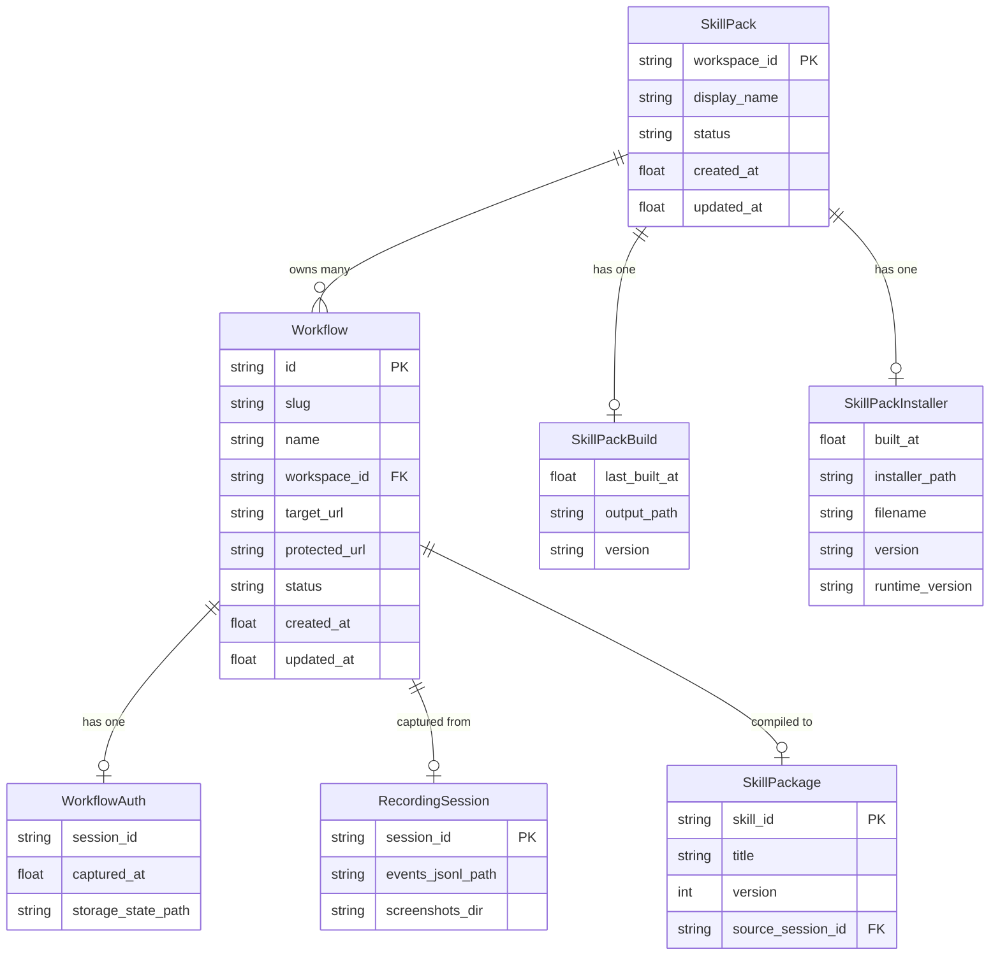
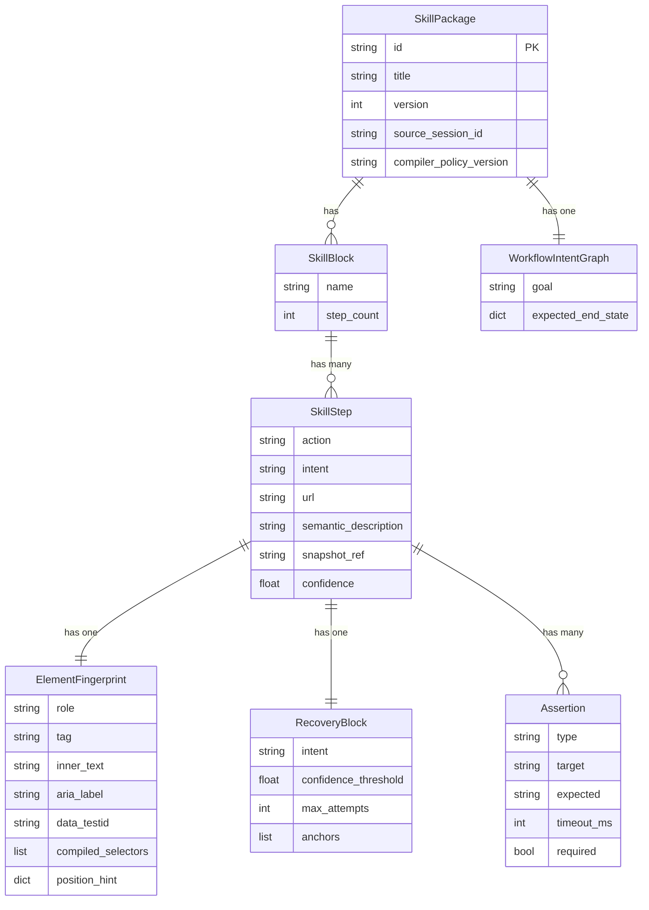

# Backend Schema Document

**Status:** Current as of 2026-07-04
**Scope:** All data models, storage architecture, and API contracts

---

## Table of Contents

1. [Storage Architecture](#1-storage-architecture)
2. [Core Data Models](#2-core-data-models)
3. [Skill Package Schema](#3-skill-package-schema)
4. [Tracking / Telemetry Schema](#4-tracking--telemetry-schema)
5. [API Contracts](#5-api-contracts)
6. [Entity Relationship Diagrams](#6-entity-relationship-diagrams)
7. [KV Namespace Map](#7-kv-namespace-map)
8. [File Storage Map](#8-file-storage-map)
9. [Multi-Tenancy Design](#9-multi-tenancy-design)
10. [Security Considerations](#10-security-considerations)

---

## 1. Storage Architecture

Conxa uses a **dual-mode key-value store** abstracted in `packages/conxa-core/conxa_core/db.py`.

### 1.1 PostgreSQL Mode (Production)

Activated when `SKILL_DATABASE_URL` is set. Required in production (`SKILL_AUTH_REQUIRED=true`).

```sql
CREATE TABLE IF NOT EXISTS kv_store (
    namespace  TEXT        NOT NULL,
    key        TEXT        NOT NULL,
    data       JSONB       NOT NULL DEFAULT '{}',
    created_at TIMESTAMPTZ NOT NULL DEFAULT now(),
    updated_at TIMESTAMPTZ NOT NULL DEFAULT now(),
    PRIMARY KEY (namespace, key)
);
```

**Access patterns:**
- `db_get(namespace, key)` → JSONB data or None
- `db_set(namespace, key, value)` → upsert
- `db_append(namespace, key, items)` → append items to JSON array in `data`
- `db_list_kv(namespace)` → all (key, data) pairs in namespace

### 1.2 Filesystem Mode (Local Development)

Activated when `SKILL_DATABASE_URL` is not set.

```
data/kv/{namespace}/{sha256(key)}.json
```

Key is hashed to SHA-256 to produce a filesystem-safe filename (colons, slashes, etc. are invalid on Windows).

**Fallback:** Legacy paths used pre-hashing are also checked for backward compatibility.

### 1.3 Additional Storage (Non-KV)

Large or time-series data lives in flat files, not the KV store:

| Type | Path | Format |
|---|---|---|
| Raw recorded events | `data/sessions/{id}/events.jsonl` | JSONL (append-only) |
| Per-tab recording videos | `data/sessions/{id}/recording.webm` (tab_0), `recording-{tab_id}.webm` (others), `videos.json` (`{tab_id: {file, start_wall_ms}}`) | WebM + JSON map |
| Compiled skills | `data/skills/{id}/skill.json` | JSON (SkillPackage) |
| Skill screenshots | `data/sessions/{id}/screenshots/` | PNG |
| Step thumbnails | `data/skills/{id}/assets/` | PNG |
| Run logs (local) | `data/runs/{workflow_id}.jsonl` | JSONL |
| Published skill packs | `data/skill-packs/{co}/` | Directory tree |
| Installer binaries | `data/installers/{co}/installer.exe` | Binary |
| Installer metadata | `data/installers/{co}/meta.json` | JSON |
| Blob store (planned) | External (BLOB_READ_WRITE_TOKEN) | Binary |

---

## 2. Core Data Models

All models are Pydantic. Source: `packages/conxa-core/conxa_core/models/workflow.py`

**Cardinality: N Workflows per Workspace : 1 SkillPack per Workspace/Company**

Each workflow holds one login session + one recording. A workspace's SkillPack bundles every signed-off workflow into a single skill package; republishing a second workflow does not create a second installer or duplicate the build. This enables efficient multi-automation packaging within a single company workspace.

### 2.1 Workflow

```python
class Workflow(BaseModel):
    id: str                    # UUID-like, e.g. "wf_abc123"
    slug: str                  # URL-safe workflow name, e.g. "expense-submit"
    name: str                  # Display name
    owner_user_id: str         # Clerk user ID or "local"
    workspace_id: str          # Clerk org ID or "ws_local"
    group_id: str              # Owning WorkflowGroup — see 2.2. Every workflow has exactly one.
    target_url: str            # Entry URL for the target website
    protected_url: str         # URL captured after auth (e.g. dashboard URL)
    protected_url_marker_text: str  # Text that marks the protected area
    status: Literal["needs_auth", "ready", "error"]  # Derived from the owning group's app auth readiness
    # Single recording per workflow (inlined — no nested list).
    session_id: str | None     # Recording session ID for this workflow
    recorded_at: float | None  # Unix timestamp
    recording_status: Literal["recorded", "compiled", "error"] | None
    skill_id: str | None       # "skill_{session_id}" after compilation
    edited_at: float | None    # Last edit timestamp
    last_test_at: float | None
    last_test_status: Literal["passed", "failed", "never"]
    last_test_error: str | None
    last_test_inputs: dict     # Inputs used in last test
    signed_off: bool           # Human review complete
    compile_status: Literal["ok", "review_needed", "failed"] | None
    compile_min_confidence: float | None
    compile_steps_with_warnings: int | None
    created_at: float          # Unix timestamp
    updated_at: float
```

**Status transitions:**
```
needs_auth → ready (after auth recording)
ready → error (auth lost or auth re-recording failed)
ready → (any recording_status) (during workflow recording/compilation)
```

### 2.2 WorkflowGroup / GroupApp

A business-domain folder ("Sales") that owns both a set of Workflows and the
applications those workflows sign in to. Auth is captured **once per app, at
the group level** — this replaced the old per-workflow `WorkflowAuth` field
(auth was previously captured once per workflow; now every workflow in a
group shares the group's app sessions). See `docs/TRD.md` §5.2a for the full
setup/recording/execution flow.

```python
class GroupApp(BaseModel):
    id: str                    # Stable slug, e.g. "salesforce"
    name: str
    login_url: str
    success_url: str           # Reaching this host = authenticated; "" = unset
    captured_at: float | None  # Unix timestamp, None until authenticated
    storage_state_path: str    # Absolute path to this app's captured session (local only)
    last_error: str            # Most recent capture failure, if any
    checked_at: float | None   # Unix timestamp of the last actual probe verdict (any
                                # check_app_session_sync call), None if never probed since
                                # capture. Distinct from captured_at ("a session file
                                # exists") — group_auth_status derives a `verified` flag
                                # from this (set + within a 600s TTL), so a `ready` badge
                                # doesn't silently mean "never actually tested."

class WorkflowGroup(BaseModel):
    id: str
    slug: str
    name: str                  # "Default" is the migration target for ungrouped workflows
    workspace_id: str
    apps: list[GroupApp]
    created_at: float
    updated_at: float
```

Storage: `data/groups/{group_id}.json` (dual DB+file, same pattern as
Workflow) via `conxa_core/storage/group_store.py`; each app's captured
session lives at `data/groups/{group_id}/auth/{app_id}.json`.

`captured_at`/`storage_state_path` aren't only set by the explicit Connect
flow (`cmd_finish_group_app_auth`) — every workflow recording that uses the
app also refreshes them. `handlers/session.py::_refresh_group_app_sessions`
runs after a recording stops or is cancelled, splits the session the
recording ended with back into each app's own file (scoped to the cookie
domains/origins that app already owned), and re-saves it via
`set_group_app_auth` — so a session stays "captured" as long as it's still
being used, not just from the moment it was first connected. See
`docs/TRD.md` §5.2a ("Per-workflow recording gate + session write-back").

**Compiled skill-pack layout:** a WorkflowGroup's `id` also decides *where a
skill's files live on disk* — `pack.json` carries a `skill_groups` field
(`{skill_slug: group_id}`, distinct from the `groups` array above — `groups`
is auth-app metadata, `skill_groups` is the path index) and each skill is
written to `skill-packs/{company}/{group_id}/{skill_slug}/` (the sentinel
`"_default"` when a workflow's `group_id` is empty), both in Build Studio's
local build output and after the real runtime syncs. See `docs/TRD.md` §5.2a
and §11.1 for the full on-disk layout and delta-sync wire format.

Each skill's own `manifest.json` also carries `"required_apps": [app_id, ...]`
— the subset of its group's `GroupApp`s that workflow's own `target_url`/
`protected_url`, **and every hostname the recording actually visited**
(`SkillMeta.visited_hosts`, populated at compile time from the recorded
events — see `docs/TRD.md` §5.2a "Per-workflow app scoping"), resolve to by
hostname. The runtime's group-auth gate (`runtime/browser.js::getGroupAuthContext`)
only *requires* these apps to be signed in before running the skill — but it
*seeds* the merged session from every app in the group whose saved session
still validates, required or not, so a workflow that wanders into an
ungated sibling app mid-run still arrives signed in instead of hitting a
login wall.

### 2.3 SkillPack (Workspace-Level, Shared)

```python
class SkillPack(BaseModel):
    workspace_id: str          # Clerk org ID or "ws_local" (unique key)
    display_name: str = ""     # Display name for UI + installer filename; cosmetic only
    status: Literal["idle", "building", "error"]
    build: SkillPackBuild | None  # Most recent build metadata
    installer: SkillPackInstaller | None
    created_at: float          # Unix timestamp
    updated_at: float
```

**Note:** One workspace has exactly one SkillPack, forever. All workflows in a workspace that are `signed_off=true` compile together into this single skill package. The workspace is the sole identity unit — there is no secondary "company slug" ownership model.

### 2.4 SkillPackBuild

```python
class SkillPackBuild(BaseModel):
    last_built_at: float
    output_path: str           # Path to skill-package/ folder
    version: str               # Semver, e.g. "0.1.0"
```

### 2.5 SkillPackInstaller

```python
class SkillPackInstaller(BaseModel):
    built_at: float
    installer_path: str        # Local path to .exe
    filename: str              # e.g. "acme-corp-Setup.exe" or branded per plan
    version: str               # Installer version
    runtime_version: str       # Version of bundled runtime
    release_notes: str = ""    # User-provided release notes
```

### 2.6 EntitlementUsage

Stored in KV namespace `entitlement_usage`, keyed by `workspace_id:YYYY-MM`.

```python
class EntitlementUsage(TypedDict):
    workspace_id: str
    period: str                         # UTC calendar month, e.g. "2026-06"
    compile_credits_used: int
    compile_input_tokens: int
    compile_output_tokens: int
    compile_requests: int               # proxied compile LLM requests
    human_edit_input_tokens: int
    human_edit_output_tokens: int
    human_edit_requests: int            # proxied Human Edit LLM requests
    created_at: str                     # ISO-8601 UTC
    updated_at: str                     # ISO-8601 UTC
```

### 2.7 CompileReservation

Stored in KV namespace `compile_reservations`, keyed by `reservation_id`.

```python
class CompileReservation(TypedDict):
    reservation_id: str
    workspace_id: str
    period: str
    amount: int                         # currently always 1
    status: Literal["reserved", "committed", "released", "expired"]
    workflow_id: str                    # The workflow being compiled
    session_id: str
    idempotency_key: str
    created_at: str
    updated_at: str
    expires_at: float                   # Unix timestamp
```

Production enforcement uses database transactions plus a Postgres advisory transaction lock. Local development uses the file/KV fallback with a process-local lock.

---

## 3. Skill Package Schema

Source: `packages/conxa-core/conxa_core/models/skill_spec.py`

### 3.0 Contract vs. Executor Boundary (ARCH-3)

Conxa's durable position is owning the governance layer *above* whichever execution
technology actually runs a step — browser replay today, a graduated API connector (PROD-7)
or a computer-use agent later. That only holds if executor assumptions don't quietly leak
into the skill format while the schema is still cheap to change. Every field in `skill_spec.py`
is tagged in code and below as one of:

| Tag | Meaning |
|---|---|
| **contract** | Executor-independent. Describes *what* the step does and *how success is judged* — must survive a swap to a non-browser executor unchanged. |
| **executor** | Browser-replay implementation detail — Playwright selector grammar, DOM/iframe/shadow-DOM structure, hover chains. Free to change per executor backend. |
| **mixed** | The class holds both; sub-fields are tagged individually below. |

| Class | Contract fields | Executor fields |
|---|---|---|
| `SkillMeta` | `id`, `version`, `title`, `created_at`, `source_session_id`, `compiler_policy_version`, `compiler_policy_hash`, `visited_hosts` | `required_runtime`, `structural_fingerprint` |
| `SkillPolicies` | all | — |
| `RecoveryBlock` | `intent`, `final_intent`, `strategies`, `confidence_threshold`, `max_attempts`, `require_diverse_attempts` | `anchors` |
| `Assertion` | all | — |
| `ValidationBlock` | `assertions` | `wait_for`, `success_conditions` (legacy) |
| `DecisionPolicy` | all | — |
| `ElementFingerprint` | all | — |
| `IdentitySignal` | — | all (Playwright grammar) |
| `FrameFingerprint` | — | all |
| `ShadowHost` | — | all |
| `IdentityBundle` | `fingerprint`, `stable_hash`, `destructive` | `signals`, `frame_chain`, `shadow_path`, `compat_fingerprint`, `guid_like_attrs` |
| `HandlerHints` | — | all |
| `SkillStep` | `action`, `intent`, `url`, `value`, `input_binding`, `validation`, `recovery`, `confidence_protocol`, `decision_policy`, `semantic_description`, `optional_hint` | `frame`, `tab`, `target`, `identity_bundle`\*, `handler_hints`, `signals`, `state`, `compiled_selectors`, `snapshot_ref`, `snapshot_dom_hash` |
| `SkillStep.branch` | — (mixed today; see below) | — |
| `WorkflowIntentGraph` / `WorkflowIntentStep` | all | — |
| `SkillPackage` | `meta`, `inputs`, `policies`, `llm`, `intent_graph`, `compile_report` | — |

\* `identity_bundle` is itself mixed — see the `IdentityBundle` row.

**`SkillStep.branch` (EXEC-1)** is the one place today's schema still leaks executor detail
into what should be contract terms: its `if_present`/`try_dismiss`/`wait_for_one_of` payloads
carry raw selector strings and nested raw-dict steps (§3.4c). New branch primitives should
define the *condition* itself in contract terms (e.g. "an interstitial matching this identity
is present") and keep browser-specific evaluation strictly on the executor side — this is the
gate EXEC-1's schema work must pass before it ships.

**Review rule going forward:** any new field added to `skill_spec.py` must be tagged
`[contract]`/`[executor]`/`[mixed]` in its own comment at the point of introduction, and this
table updated in the same change. A field with no tag is a review-blocking omission, not an
acceptable default.

### 3.1 SkillPackage (top-level)

```python
class SkillPackage(BaseModel):
    meta: SkillMeta
    inputs: list[dict]         # Parameterizable inputs schema
    skills: list[SkillBlock]   # Currently always 1 block per workflow
    policies: SkillPolicies
    llm: dict                  # LLM config hints
    intent_graph: WorkflowIntentGraph
    compile_report: dict       # Required: {status, steps_total, min_confidence, 
                               #            llm_router_stats, steps}
```

Each entry in `inputs` is validated against `SkillInputVariable` (`conxa-builder/python/conxa_compile/editor/dto.py`):

```python
class SkillInputVariable(BaseModel):
    id: str                    # letter-led, alnum + underscore — must match {{id}} grammar
    label: str = ""
    type: Literal["text", "select"] = "text"
    default: str | None = None
    options: list[str] = []    # required (non-empty) when type == "select"
    pattern: str | None = None
    sensitive: bool = False    # redacts the value from saved test history; feeds the shipped
                               # bundle's inferred auth type (password/api-key/none)
    optional: bool = False     # the skill may run without this value. A value with `default`
                               # set is always effectively optional regardless of this flag.
```

`optional` is excluded from the packaged manifest's `inputs_required` (`skill_package_builder_output.py::_compute_inputs_required`), which is what the runtime's pre-execution gate and the MCP tool's `inputSchema.required` both read (`runtime/server.js`).

**Auto-declared inputs.** Any `{{placeholder}}` present in the execution steps but absent from the declared input list is appended automatically at package time. One is special-cased: **every upload step binds to `file_path`**, regardless of the picker element's label — a recording can only ever capture a file's *name*, never a path, so the real path must arrive as a runtime input. Its description is enriched with the recorded example filename (`"Path to the file to upload (e.g. invoice.pdf)"`) so an agent calling `get_skill_inputs` knows a real on-disk path is expected rather than a filename. The description also states that a **folder path** may be given when the page's upload control accepts more than one file — the runtime expands a directory into every file directly inside it, which is how a batch upload of 20 or 200 documents is driven without enumerating each file. It does not claim how many files the control accepts: that is a property of the live page (`multiple`), so the runtime asks the element at replay time and refuses a folder aimed at a single-file control with a clear message. See `docs/TRD.md` §9.3.

### 3.2 SkillMeta

```python
class SkillMeta(BaseModel):
    id: str                    # "skill_{session_id}"
    version: int               # Monotonically increasing
    title: str                 # Human-readable workflow name
    created_at: str            # ISO timestamp
    source_session_id: str | None
    compiler_policy_version: str
    compiler_policy_hash: str
    structural_fingerprint: dict  # Hash of first 3 steps' landmark selectors
                                  # Used for drift detection
    visited_hosts: list[str]      # Every hostname the recording actually navigated to
                                  # (main frame + any tab opened during recording), lowercase,
                                  # deduped. Feeds required_apps (§2.2) so a workflow that
                                  # starts in one group app but links into a sibling mid-
                                  # recording gates on both at execution time, not just the
                                  # app its start URL resolves to. Empty on skills compiled
                                  # before this field existed.
```

### 3.3 SkillStep

```python
class SkillStep(BaseModel):
    action: str | dict         # Action type + params
    intent: str                # "Click the Submit button"
    url: str                   # Expected URL for this step
    frame: dict                # Iframe chain structural marker (url/url_pattern per level)
    tab: dict                  # {id, index, opened_by, opener_tab} — empty means tab_0, the
                                # initial page. Runtime resolves it per step: TRD §9.1a
    target: dict               # Raw recorded target element data
    identity_bundle: IdentityBundle          # REQUIRED — single source of element identity (see §3.4a)
    handler_hints: HandlerHints              # hover_chain, virtualization (see §3.4b)
    signals: dict              # Additional DOM signals
    state: dict                # Page state at recording time
    value: Any                 # Input value (may be {{variable}})
    input_binding: str | None  # Input variable name if parameterized
    validation: ValidationBlock
    recovery: RecoveryBlock
    confidence_protocol: dict
    decision_policy: DecisionPolicy
    compiled_selectors: list[str]  # Ranked CSS/XPath selectors (T1 recovery)
    semantic_description: str      # "First Name input in Add Person dialog"
    snapshot_ref: str              # DOM snapshot blob reference
    snapshot_dom_hash: str         # For cross-compilation cache lookup
    branch: dict                   # Conditional/branch payload — empty for ordinary steps (§3.4c)
    optional_hint: dict | None     # Recorder-observed "might be optional" flag, advisory only (§3.4d)
```

> **Single identity object (cutover):** `element_fingerprint` is no longer a top-level
> `SkillStep` field — it lives **inside** `IdentityBundle.fingerprint` (§3.4a). `identity_bundle`
> is required; the runtime resolves the primary target through `identity_bundle.signals` (no legacy
> `compiled_selectors` primary path), and frame roots are driven solely by
> `identity_bundle.frame_chain`. Packs compiled before this change must be recompiled.

### 3.4 ElementFingerprint

The stable element identity used to score DOM candidates at runtime (carried as
`IdentityBundle.fingerprint`):

```python
class ElementFingerprint(BaseModel):
    role: str          # ARIA role
    tag: str           # HTML tag
    inner_text: str    # Visible text (max 120 chars)
    aria_label: str
    name: str          # form field name attribute
    placeholder: str
    label_text: str    # Associated <label> text
    data_testid: str   # data-testid attribute (highest stability)
    input_type: str    # for <input> elements
    css_class_tokens: list[str]   # Stable class tokens only
    anchor_phrases: list[str]     # Relational context phrases
    position_hint: dict           # {x: 0.0-1.0, y: 0.0-1.0}
```

### 3.4a IdentityBundle (Final Selector Architecture)

The durability-ranked, orthogonality-deduplicated element identity used by the pure runtime
resolver. Retained alongside `ElementFingerprint` for backward compatibility.

```python
class IdentitySignal(BaseModel):
    engine: str                # testid | role | aria | text | relational | css-id | css-structural | xpath
    selector: str              # Playwright native grammar (internal:role=…, internal:testid=…)
    durability: float          # 0.0–1.0, base_durability(engine) × survival_prior × stability_adj
    orthogonality_class: str   # test-contract | semantic-aria | visible-text | spatial-anchor | structural
    unique_at_compile: bool    # matched exactly 1 node in recorded DOM
    source: str                # compiler | llm | input_bound

class FrameFingerprint(BaseModel):
    signals: list[IdentitySignal]   # durability-ranked per frame level
    url: str
    url_pattern: str

class ShadowHost(BaseModel):
    host: str                  # CSS selector of the shadow host
    mode: str                  # "open" | "closed"

class IdentityBundle(BaseModel):
    signals: list[IdentitySignal]        # durability-ordered, ≤1 per orthogonality class
    fingerprint: ElementFingerprint      # the resolver's scoring oracle (recorded element attrs)
    stable_hash: str                     # SHA256(tag_path + static attrs + AX name), dynamic classes stripped
    frame_chain: list[FrameFingerprint]  # sole frame-resolution source (durability-ranked per level)
    shadow_path: list[ShadowHost]
    compat_fingerprint: str              # app-version indicators
    guid_like_attrs: list[str]
    destructive: bool
```

### 3.4b HandlerHints

```python
class HandlerHints(BaseModel):
    hover_chain: list[IdentitySignal]    # elements to hover before acting (menu reveals)
    virtualized_container: str           # scroll container selector for virtualized rows
    allow_forced_action: bool
```

### 3.4c Conditional / Branch Steps (EXEC-1)

`SkillStep.branch` (`dict`, empty for ordinary linear steps) holds the payload for the three
conditional/branch action kinds — `if_present`, `try_dismiss`, `wait_for_one_of`. See
`docs/TRD.md` §10.7 for runtime execution semantics (best-effort, never enters recovery).

| `action` | `branch` keys | Probe target |
|---|---|---|
| `if_present` | `steps` (nested SkillStep dicts), `timeout_ms` | `SkillStep.target`/`identity_bundle` (the step's own) |
| `try_dismiss` | `candidates` (selector strings), `timeout_ms`, `fallback_escape` | each candidate, in order |
| `wait_for_one_of` | `options` (`[{selector, steps?}]`), `timeout_ms`, `required` | each option's `selector` |

Nested `steps` entries are raw dicts in the same shape as a saved `SkillStep`
(`action`/`target`/`identity_bundle`/`branch`/...) — `skill_package_builder_saved_skill.py`'s
`_saved_step_to_execution_step` recursively serializes each one into the flat runtime step
shape below.

**On-disk `execution.json` shape** (what `runtime/run.js` actually consumes — flat, `type` not
`action`):

```json
{ "type": "if_present", "selector": ".cookie-banner", "timeout_ms": 1500,
  "steps": [ { "type": "click", "selector": "#accept-cookies" } ] }

{ "type": "try_dismiss", "timeout_ms": 1000,
  "candidates": [ "#accept-cookies", ".cookie .accept", "[aria-label='Close']" ] }

{ "type": "wait_for_one_of", "timeout_ms": 8000, "required": true,
  "options": [
    { "selector": "#mfa-code", "steps": [ { "type": "fill", "selector": "#mfa-code", "value": "{{otp}}" } ] },
    { "selector": "#dashboard" }
  ] }
```

A probe may carry `identity_bundle` instead of a bare `selector`; the runtime's `probePresent`
resolves either. See `runtime/test/gate-skill/skill-pack/gate/gate-skill/execution.json` for a
working `if_present` fixture exercised by the CI execution gate.

**Editor authoring (2026-07-10):** `if_present`/`try_dismiss`/`wait_for_one_of` are now
insertable from Human Edit. `if_present`'s nested `steps` body is fully editable — structural
edits (add/remove/reorder) go through `insert_branch_step`/`delete_branch_step`/
`reorder_branch_steps` (`conxa_compile/editor/workflow_mutations.py`), while per-field edits on a
nested step reuse `cmd_patch_step` with an optional `path` parameter (e.g. `"branch.steps[1]"`)
that addresses the nested dict inside `branch.steps` instead of a top-level step. Nested steps
cannot patch `recovery`/`validation` (branch bodies never enter Tier 1-4 recovery, so those
blocks are meaningless there — enforced by `patch_gate.py::validate_editor_patch`'s
`in_branch_body` flag). `try_dismiss`/`wait_for_one_of` accept a normal `branch` key patch
(candidates/options, quality-gated the same way as any selector) but have no dedicated authoring
UI yet — see `TODO.md` BUILD-6.

### 3.4d Optional-interstitial observation (recording-next-steps.md Priority 2, 2026-07-10)

`SkillStep.optional_hint` (`dict | None`) is the recorder's advisory flag that this step's target
sat inside what looked like an optional interstitial (dialog or cookie/consent banner) during
recording — carried verbatim from the recorded event's `optionality`/`branch_hint` fields
(`RecordedEvent`, `packages/conxa-core/conxa_core/models/events.py`; see `docs/TRD.md` §10.7 for
the detection heuristic). It never changes compiled behavior on its own: the step still compiles and executes as a normal
required linear step. Only a human confirming in Human Edit converts it into a real `try_dismiss`
branch (§3.4c) — the compiler never does this automatically, honoring the invariant that branch
steps compile only from observed states + human confirmation.

```python
optional_hint: dict | None   # {"kind": "try_dismiss", "container_signal": "<selector>"} or None
```

- **Set by:** `build.py` carries `RecordedEvent.optionality == "stochastic"`'s `branch_hint` onto
  the compiled step unchanged.
- **Surfaced by:** `StepEditorDTO.optional_hint` (same shape), read-only — Human Edit renders a
  "treat as optional?" affordance when present.
- **Consumed by:** `POST confirm_optional_interstitial` (`skill_id`, `step_index`) — a structural
  mutation (same shape as `insert_branch_step`, bypasses `patch_gate.py`) that rewrites the step's
  `action` to `try_dismiss`, seeds `branch.candidates` from the step's own recorded selector plus
  the hint's `container_signal`, and clears `optional_hint`.

### 3.4e Multi-Tab Context (TabContext)

`RecordedEvent.tab` (`packages/conxa-core/conxa_core/models/events.py::TabContext`) records which
browser tab produced an event; `SkillStep.tab` (§3.3) is the compiled twin, carried through
verbatim from the event that produced the step, empty for `tab_0` (see `docs/TRD.md` §6.3 for how
the recorder assigns it, §7.1 for compile-time `tab_open`/`tab_switch` marker insertion, §9.1a for
runtime resolution).

```python
class TabContext(BaseModel):
    id: str = "tab_0"
    index: int = 0
    opened_by: Literal["initial", "site", "user"] = "initial"
    opener_tab: str | None = None
    url: str = ""   # editor display only — dropped from the runtime-facing execution.json copy
```

Absent on recordings made before multi-tab support existed — same read-new-fallback-old pattern as
`post_condition` (§3.4d) — so old recordings still validate and old compiled skills replay
identically (every step resolves to the initial page, exactly as before this field existed).

### 3.5 RecoveryBlock

```python
class RecoveryBlock(BaseModel):
    intent: str                # What this step is trying to do
    final_intent: str          # Refined intent for LLM recovery
    anchors: list[dict]        # Visual anchor points for vision recovery
    strategies: list[str]      # ["semantic match", "position match", "visual match"]
    confidence_threshold: float  # 0.85 default
    max_attempts: int          # 2 default
    require_diverse_attempts: bool
```

### 3.6 Assertion

A verifiable post-action condition, checked independently of whether the action itself threw.
Every consequential action (submit click, destructive confirm, text entry/select) compiles with
exactly one **required** (enforced) assertion — the compiler's deterministic "primary signal
picker" in `build.py:_build_assertions` — plus zero or more advisory ones. `required=False`
assertions only log a warning on failure; a `required=True` failure halts the step and descends
into recovery (`runtime/run.js` `verifyStep`).

```python
class Assertion(BaseModel):
    type: str          # "url_changed" | "url_pattern" | "selector_present" | "selector_absent"
                       # | "text_present" | "text_absent" | "value_equals" | "state_changed"
    target: str        # URL prefix, regex pattern, CSS selector, or text string (empty for state_changed)
    expected: str       # value_equals only — expected field value (interpolated against runtime inputs)
    timeout_ms: int    # 5000 default
    required: bool     # True = halt on failure (and descend into recovery); False = warning only
```

- `url_changed` — the page address must differ from its value before the action (target = the
  before-URL). `url_pattern`/`url` is a regex-matching alias.
- `selector_present` / `selector_absent` — a selector must (not) be present.
- `text_present` / `text_absent` — visible text must (not) appear.
- `value_equals` — the target field's actual value must match `expected`. Compared normalized
  (trim/collapse-whitespace/lowercase); if the normalized-exact match fails, a "field contains
  expected" fallback is accepted, so masked/formatted fields (phone, currency) still validate.
  Compiled for `fill`/`type`/`select`/`select_option` steps that have a resolvable target
  selector and a recorded value.
- `state_changed` — no `target`; confirms the page shows *some* observable effect (URL,
  interactive-element count, or a body-text-length delta beyond a small noise tolerance) relative
  to a pre-action baseline captured by the runtime. Synthesized only for commit/destructive clicks
  that have no recorded URL/DOM evidence — the "no silent no-op" guard for evidence-less commits.

**Post-condition preference (recording-next-steps.md Priority 1, 2026-07-10):** before falling
back to the generic wait_for/success_conditions inference above, `_build_assertions` checks the
recorded event's `post_condition` (`RecordedEvent.post_condition`, optional) — a small structured
classification bridge.js computes live against the running page at action time. When
`classified_effect == "dialog_opened"`, its `dialog_signal` claims the enforced slot as a
`selector_present`. When `classified_effect == "value_set"`, a non-redacted `value_readback`
becomes `value_equals`'s `expected` instead of the recorded intent value. This live evidence is
strictly preferred because it's captured against the running page rather than reconstructed
after the fact; the runtime evaluation path is unchanged either way.

### 3.7 ValidationBlock

```python
class ValidationBlock(BaseModel):
    wait_for: dict             # Condition to wait for before asserting
    success_conditions: dict   # Legacy field
    assertions: list[Assertion]
```

### 3.8 WorkflowIntentGraph

Generated by `intent_llm.py` — one LLM call per workflow:

```python
class WorkflowIntentGraph(BaseModel):
    goal: str                          # "Submit expense report for given period"
    steps: list[WorkflowIntentStep]    # Per-step intent summary
    decision_points: list[dict]        # Points where branching may occur
    expected_end_state: dict           # What success looks like
```

---

## 4. Tracking / Telemetry Schema

### 4.1 Telemetry Batch Payload (Runtime → Cloud)

```json
{
  "rid": "run_abc123",      // run_id
  "wfid": "acme",           // workflow/company slug
  "wfv": "0.2.0",           // workflow version
  "rv": "1.0.0",            // runtime version
  "uid": "user_hash",       // anonymized user identifier
  "wid": "ws_xyz",          // workspace identifier
  "sv": 1,                  // schema version
  "evts": [                 // compact event list
    {"e": "wf_start", "ts": 1717000000, "tot": 5},
    {"e": "step_ok",  "ts": 1717000002, "si": 0, "tier": 1},
    {"e": "step_fail","ts": 1717000005, "si": 1, "code": "selector_timeout"},
    {"e": "recovery_tier2", "ts": 1717000006, "si": 1},
    {"e": "step_ok",  "ts": 1717000007, "si": 1, "tier": 2},
    {"e": "wf_ok",    "ts": 1717000020, "dur": 20000, "tot": 5, "rec": 1}
  ]
}
```

**Event codes:**

| Code | Meaning | Extra fields |
|---|---|---|
| `wf_start` | Workflow execution begins | `tot` (total steps) |
| `step_ok` | Step succeeded | `si` (step index), `tier` (1–4) |
| `step_fail` | Step failed | `si`, `code` (error code) |
| `recovery_tier{N}` | Recovery tier N attempted | `si` |
| `tier_ok` | A resolution/recovery tier succeeded | `si`, `tier`, `sel` |
| `verify_fail` | Post-action VERIFY failed | `si`, `ch` (assertion channel) |
| `verify_result` | Full post-action assertion audit for a step that carries assertions (emitted on the primary execution path, pass or fail — not on recovery re-verification) | `si`, `ok` (overall pass/fail), `n` (assertion count), `advFail` (count of failed advisory/non-required assertions) |
| `repair_event` | A step was recovered — drift signal for the admin flywheel queue | `step_id`, `tier` (L1/L2), `method`, `score`, `margin`, `stable_hash_match`, `stable_hash`, `drift_hint`, `app_version_fingerprint` |
| `drift_detected` | Pre-execution structural drift warning (advisory; emitted at run start, never blocks) | `total` (landmarks), `missing`, `drift_ratio`, `missing_intents` (≤5), `url` |
| `wf_ok` | Workflow completed successfully | `dur` (ms), `tot`, `rec` (recovered steps) |
| `wf_fail` | Workflow failed | `dur`, `fsi` (failed step index), `fc` (failure code) |

**`repair_event` is ephemeral per-run telemetry** — it never mutates the signed local pack.
It aggregates into the admin drift-review queue at `GET /api/v1/tracking/{company}/drift`
(keyed by workflow/version/step). Detection is automatic and fleet-wide; a durable fix is always
an admin-reviewed, manually published re-sign — publishing is never automatic.

**`drift_detected`** is emitted by the runtime before step 0 when most of a pack's recorded
structural landmarks are no longer present on the live page (a redesign signal). It is advisory —
execution proceeds and per-step recovery still applies. `GET /api/v1/tracking/{company}/drift`
returns these separately under `pre_exec` (aggregated per workflow/version by `_pre_exec_drift_queue`),
alongside the per-step `repair_event` `queue`.

### 4.2 Stored Event Batch (Cloud)

After enrichment, stored in `kv_store` under `tracking/{company}` → `run_id`:

```json
{
  "run_id": "run_abc123",
  "company": "acme",
  "workflow_id": "acme",
  "workflow_ver": "0.2.0",
  "runtime_ver": "1.0.0",
  "uid": "user_hash",
  "wid": "ws_xyz",
  "workspace_id": "org_clerk123",
  "owner_user_id": "user_clerk456",
  "server_ts": 1717000025.3,
  "events": [...],
  "schema_v": 1
}
```

### 4.3 Tracking Token Record

Stored in `kv_store` under `tracking_tokens` → `workspace_id`:

```json
{
  "token": "random_urlsafe_32_bytes",
  "company": "workspace_dir_slug_value",
  "version": "0.2.0",
  "workspace_id": "org_clerk123",
  "owner_user_id": "user_clerk456",
  "updated_at": 1717000000.0
}
```

---

## 5. API Contracts

### 5.1 Publish Skill Pack

**Publish never deploys — it uploads a "ready" version to Conxa Cloud.** A
Cloud admin's explicit Release/Deploy action (§5.1d) is the only thing that
activates a version and starts runtimes receiving it. See `docs/App-Flow.md`
§8.

**POST /api/v1/workflows/publish**

Request:
```json
{
  "slug": "acme",
  "skill_slug": "submit_expense",
  "group_id": "expenses",
  "group_name": "Expenses",
  "workflow_name": "Submit Expense",
  "display_name": "Acme Corp",
  "target_url": "https://app.acme.com",
  "protected_url": "https://app.acme.com/dashboard",
  "skill_pack_version": "0.2.0",
  "release_notes": "Fixed export bug",
  "tests_passed": true,
  "files": [
    {
      "path": "execution.json",
      "content_base64": "..."
    }
  ]
}
```
`group_name`/`workflow_name` are display-only, used by Cloud's Skill Packages
→ Group → Workflow navigation (§5.1d) — an older Build Studio that hasn't
picked them up yet just falls back to the slug/group_id. `tests_passed` is
Build Studio's own local test-gate result, surfaced to Cloud admins reviewing
a "ready" version alongside its diff and artifact.

Response (200):
```json
{
  "slug": "acme",
  "version": "0.2.0",
  "files_written": 1,
  "sync_url": "/api/v1/skill-packs/acme/delta",
  "sync_token": "...",
  "tracking": {
    "enabled": true,
    "tracking_url": "https://apis.conxa.in/api/tracking/acme/events",
    "tracking_token": "...",
    "company_id": "acme",
    "schema_version": 1
  },
  "workspace_id": "org_clerk123",
  "published_at": 1717000000.0
}
```
This response means the version is durably uploaded and **"ready"** — not
that it's live. `sync_url`/`sync_token` are minted here (Build Studio's local
`pack.json` needs them for future syncs), but nothing about the runtime-facing
mutable mirror or the stable channel moves until Release/Deploy (§5.1d).

Duplicate-version publish → **409** `skill_pack_version_exists`, unless the
existing row is still `"ready"` (or legacy `"pending"`) — retrying an
unreleased version number is safe and expected, not an overwrite.

### 5.1a Versioned Endpoint Scheme (`{installer_version}`)

Skill Pack Publishing is the primary, version-controlled release surface; installers are a stable, Conxa-owned platform artifact. To let Conxa evolve the installer/runtime wire contract without ever requiring vendors to rebuild for routine skill-pack updates, Conxa-owned versions of endpoint families are nested under `{installer_version}` path segment (`publish_routes.SUPPORTED_INSTALLER_GENERATIONS`, currently `("v1", "v2")`):

**Dashboard endpoints** (Clerk-authenticated; workspace derived from authenticated principal, not a path parameter):
```
POST /api/v1/workflows/publish                                                  # legacy
POST /api/v1/workflows/{installer_version}/skill-packs/upload                   # versioned; same body/response as §5.1
GET  /api/v1/workflows/{installer_version}/skill-packs/versions                 # release history — see §5.1a below
POST /api/v1/workflows/{installer_version}/installer/upload                     # versioned; same as §5.1b below
GET  /api/v1/workflows/{installer_version}/installer/versions                   # versioned; same as §5.1b below
GET  /api/v1/workflows/generations                                              # {current, supported, deprecated}
POST /api/v1/admin/workflows/generations                                        # admin flip (Bearer CONXA_ADMIN_TOKEN)
```

**Runtime endpoints** (bearer-token authenticated; workspace scoped by `{workspace_id}` path parameter):
```
GET  /api/v1/skill-packs/{workspace_id}/delta                                   # legacy
GET  /api/v1/workflows/{installer_version}/{workspace_id}/skill-packs/delta     # versioned; same as §5.9
POST /api/v1/tracking/{workspace_id}/events                                     # legacy ingest
POST /api/v1/workflows/{installer_version}/{workspace_id}/tracking/events       # versioned ingest; same as §5.6
```

Every versioned route validates `{installer_version}` against the allow-list (400 `unsupported_installer_version` otherwise) and delegates to the exact same shared implementation function as its legacy, unversioned counterpart — behavior is identical across generations. **`{installer_version}` is frozen into an installer at build time** (stamped into `pack.json.installer_version` at publish time by Build Studio, read from `GET /api/v1/workflows/generations`'s `current` field) and is never reassigned remotely for an already-installed runtime. "Migrating customers to a new generation" means Conxa flips the *default* generation that **new** installer builds stamp (`POST /api/v1/admin/workflows/generations`) — it does not, and cannot, change the URLs already baked into a customer's machine. The legacy, unversioned routes are kept mounted **permanently** as the implicit "v1" behavior for every already-deployed installer — never removed.

**GET /api/v1/workflows/{installer_version}/skill-packs/versions** — release history for the Skill Pack Publishing / Release Center page (version, release notes, publish timestamp, artifact hash, `is_latest`), the version/release-comment/publishing-limit surface that moved here from Build Installer:
```json
{
  "slug": "acme",
  "skill_slug": "submit_expense",
  "current_stable": {"slug": "acme", "skill_slug": "submit_expense", "version": "0.3.0", "status": "published", "is_latest": true, "...": "same row shape as below"},
  "versions": [
    {"slug": "acme", "skill_slug": "submit_expense", "version": "0.4.0", "release_notes": "WIP export tweak",
     "group_id": "expenses", "tests_passed": true,
     "workspace_id": "org_clerk123", "owner_user_id": "user_123",
     "published_by": {"user_id": "user_123", "email": "a@acme.test", "name": "Ana"},
     "published_at": 1717000200.0, "files_written": 4, "file_count": 4, "size_bytes": 3010,
     "artifact_sha256": "7e5d...12", "status": "ready", "is_latest": false},
    {"slug": "acme", "skill_slug": "submit_expense", "version": "0.3.0", "release_notes": "Fixed export bug",
     "group_id": "expenses", "tests_passed": true,
     "workspace_id": "org_clerk123", "owner_user_id": "user_123",
     "published_by": {"user_id": "user_123", "email": "a@acme.test", "name": "Ana"},
     "published_at": 1717000100.0, "files_written": 6, "file_count": 6, "size_bytes": 4821,
     "artifact_sha256": "3f2a...c9", "status": "published", "is_latest": true},
    {"slug": "acme", "skill_slug": "submit_expense", "version": "0.2.0", "release_notes": "Initial release",
     "workspace_id": "org_clerk123", "owner_user_id": "user_123", "published_at": 1717000000.0,
     "files_written": 5, "artifact_sha256": "9c1b...44", "status": "published", "is_latest": false}
  ]
}
```
**KV namespace:** `skillpack_versions__{slug}__{skill_slug}` — one row per (skill, version) (mirrors `installer_versions__{slug}`, §5.1b below). Duplicate-version publish → 409 `skill_pack_version_exists`; a byte-identical republish (same `artifact_sha256` as the current stable release) → 409 `skill_pack_artifact_unchanged` (see §5.1). `is_latest` tracks the stable channel, not "most recently published" — it moves on rollback too. `status` is one of: `"ready"` — uploaded and durably persisted, awaiting a Cloud admin's Release/Deploy decision (§5.1d); `"published"` — activated, the normal state for every row a Release or Rollback has ever pointed at; `"pending"` — legacy, a row left behind by a publish attempt that crashed before even reaching `"ready"` (safe to retry the same version number, but distinct from the new `"ready"` steady state). See §5.1d for the full release system this row shape backs.

### 5.1d Skill Pack Release System (per-skill: immutable versions, stable channel, rollback, diff)

Built on top of §5.1's publish endpoint — see `docs/Implementation-Plan.md` §3.4 for the full design writeup. Every route below is Clerk-authenticated with `require_admin` gating; workspace is derived from the authenticated principal, not a path parameter.

**Re-scoped 2026-08-19 to per skill.** 1 Workflow = 1 Skill = 1 Skill Package = 1 independent version history = 1 independent release. Every route, KV namespace, and JSON shape below is keyed by **skill slug** — publishing, testing, versioning, and rolling back one skill (e.g. "create-a-lead") never requires, checks, or touches another skill (e.g. "update-opportunity") in the same workspace. `skill_slug` travels as a required body field on `POST`s with a body (`.../releases/preview`) and as a required `?skill_slug=` query parameter on every other route below (kept off the URL path itself to avoid re-numbering the existing route segments).

```
POST /api/v1/workflows/{installer_version}/releases/preview                              # dry run for ONE skill — proposed version, diff vs. that skill's own previous version, duplicate/unchanged flags
GET  /api/v1/workflows/{installer_version}/releases/{version}?skill_slug=...              # release detail + per-file sha256, for that one skill's own version row
GET  /api/v1/workflows/{installer_version}/releases/{version}/diff?skill_slug=...          # deterministic diff vs. the preceding published version OF THIS SAME SKILL
POST /api/v1/workflows/{installer_version}/releases/{version}/release?skill_slug=...       # Cloud-only: activate a "ready" version — the only action that deploys it
POST /api/v1/workflows/{installer_version}/releases/{version}/rollback?skill_slug=...      # move ONE skill's stable channel pointer back to an already-published version
GET  /api/v1/workflows/{installer_version}/deployments?skill_slug=...                      # runtime deployment status for ONE skill
GET  /api/v1/workflows/{installer_version}/releases/events?skill_slug=...                  # release-lifecycle audit trail for ONE skill
GET  /api/v1/workflows/{installer_version}/groups                                          # Cloud's Skill Packages → Group → Workflow navigation — Studio-synced groups (possibly empty) unioned with every skill ever published
PUT  /api/v1/workflows/{installer_version}/groups/{group_id}                               # Build Studio create/rename: upsert {group_id, group_name} so the folder exists before first publish
```

**Publish vs. Release/Deploy.** `POST .../skill-packs/upload` (§5.1) only ever
writes the immutable snapshot and a version-history row with
`status: "ready"` — it never touches the mutable mirror `_build_delta`
serves, the `component_versions` entry, or the stable channel. `POST
.../releases/{version}/release` is the only thing that does all three
(mirrors `.../rollback`'s structure, just with the opposite precondition: a
`"ready"` row instead of an already-`"published"` one). This is what makes
"publish ≠ deploy" true at the data-plane level, not just a UI label — see
`docs/App-Flow.md` §8.1/§8.1a.

**Domain model:**
- **Immutable snapshot** — every publish writes its file set once, write-only, to `skillpack_release_files__{slug}__{skill_slug}__{version}` (KV) + `data_dir/skill-packs/{slug}/skills/{skill_slug}/releases/{version}/` (disk cache). Never touched again. This is what rollback restores from — no artifact is ever rebuilt, copied, or mutated. Contains only that skill's own files (`execution.json`, `recovery.json`, `inputs.json`, `manifest.json`) — never `pack.json`, which is company-level static config (target_url, tracking) a single skill's release/rollback must never mutate.
- **Mutable mirror** — the pre-existing `skillpack_files__{slug}` / `data_dir/skill-packs/{slug}/{group_id}/{skill_slug}/...` layout `_build_delta` (§5.9) has always served. Still one namespace per company (not re-keyed), but every publish/rollback call now only ever writes the one skill's own file subset into it — a sibling skill's files in the same mirror are never touched.
- **Stable channel** — `skillpack_channels` KV (still one namespace), row key is now the composite `"{slug}:{skill_slug}"`: `{"slug": "acme", "skill_slug": "create-a-lead", "stable": {"version": "1.3.0", "set_at": 1717000100.0, "set_by": "user_123", "reason": "publish"|"rollback", "from_version": "1.2.0"}}`. One channel per skill in V1. **Not** the same "channel" concept as §5.8's runtime/app self-update `dev`/`stable` channel — a separate, unrelated pointer this system doesn't read or write.
- **Release events** — `skillpack_release_events__{slug}__{skill_slug}` KV, an unbounded append-only array (`db_append`), one row per lifecycle action: `skill_version_created`, `skill_publish_started`, `skill_publish_succeeded`, `skill_publish_failed`, `release_started`, `release_succeeded`, `release_failed`, `stable_channel_changed`, `rollback_started`, `rollback_completed`. Every event is also mirrored into the existing `saas.add_audit_event` (§7's `saas` namespace) so the dashboard's Audit page needed no changes — but that log is a global 500-entry ring buffer across all workspaces, so the durable per-(slug, skill_slug) record here is the one to query for a specific skill's history. `stable_channel_changed` now fires from two different callers with a different `reason` (`"release"` vs. `"rollback"`) rather than from `publish` — publishing alone never emits it.
- **No data migration for the re-key.** These four namespaces are purely internal cloud bookkeeping — no installed runtime reads them directly (runtimes only ever see `component_versions`, `pack.json`, and the delta endpoint, all unchanged in shape — see §5.9). A pre-existing company-wide release published before this re-scoping simply won't appear in the new per-skill Release Center; that's an accepted gap, not a regression for any already-deployed runtime.
- **Known-skills registry** — `skillpack_known_skills` KV (row key `"{slug}:{skill_slug}"`, same pattern as `skillpack_channels`): `{slug, skill_slug, group_id, group_name, workflow_name, first_published_at}`, upserted at **publish** time (not release time). Deliberately independent of `pack.json`'s `skills`/`skill_groups` union, which only updates at Release/Deploy — this registry is what lets Cloud's Skill Packages → Group → Workflow navigation (`GET .../groups`) show a skill the moment it's published, before anyone has released it, without exposing anything runtime-facing early.
- **Known-groups registry** — `skillpack_known_groups` KV (row key `"{slug}:{group_id}"`): `{slug, group_id, group_name, created_at}`, upserted when Build Studio creates or renames a group (`PUT .../groups/{group_id}`), not at publish time. `GET .../groups` unions this registry with known-skills so an empty Studio group appears as a folder with `workflows: []`. A later publish of a skill with the same `group_id` attaches that workflow to the existing folder. Deleting a group in Studio does not remove the Cloud row. If the company slug has no SkillPack yet, the PUT creates a shell record from the caller's workspace name so the Skill Packages list has a company card to hang the folder on.

**PUT .../groups/{group_id}** request/response — Build Studio, `require_admin` + slug ownership (unclaimed slugs are claimed when the shell SkillPack is created):
```json
// request
{"group_name": "Sales", "company_name": "Acme"}
// response
{"slug": "acme", "group_id": "11111111-1111-1111-1111-111111111111", "group_name": "Sales"}
```

**POST .../releases/preview** request/response — one skill per call:
```json
// request
{"version": "0.4.0", "skill_slug": "submit_expense", "group_id": "expenses", "files": [{"path": "execution.json", "content_base64": "..."}]}
// response
{
  "slug": "acme", "skill_slug": "submit_expense", "previous_version": "0.3.0", "proposed_version": "0.4.0",
  "version_valid": true, "version_available": true,
  "artifact_sha256": "a1b2...", "artifact_unchanged": false,
  "diff": {
    "skills_added": [], "skills_removed": [],
    "steps_added": 2, "steps_removed": 1, "steps_modified": 3,
    "recovery_changed_skills": ["submit_expense"], "metadata_changed_skills": [],
    "summary": "+2 steps added, ~3 modified, -1 removed, ~1 recovery rule changed",
    "per_skill": {"submit_expense": {"status": "changed", "steps_added": 2, "steps_removed": 1, "steps_modified": 3, "recovery_changed": true, "metadata_changed": false}}
  }
}
```
For a brand-new skill (no previous publish), `previous_version` is `null` and the artifact-unchanged check is skipped entirely — no previous-version requirement, matching "publish a new skill's first version as v1.0.0." The diff is pure stdlib (`difflib` over a semantic per-step key — type/tab/frame/selector — excluding volatile targeting metadata like `identity_bundle`/`compiled_selectors`/`confidence`) — deterministic, no LLM, same function for the pre-publish preview and the published `.../diff` endpoint.

**POST .../releases/{version}/release?skill_slug=...** — Cloud-only, `require_admin` + slug ownership. 404 if the version doesn't exist for this skill; 400 `release_not_ready` if it isn't currently `"ready"` (already published, or still `"pending"`); 409 `release_snapshot_unavailable` if the snapshot is missing. Success response: `{"slug": "acme", "skill_slug": "create-a-lead", "released": "1.3.0", "previous_stable": "1.2.0"}`. Performs, in order: refresh the mutable mirror from the immutable snapshot; fold the skill into `pack.json`'s `skills`/`skill_groups` union (a no-op after the first release of a given skill); rewrite `component_versions`; move the stable channel; flip the row to `"published"` + `is_latest`. Every step is scoped to this one skill.

**POST .../releases/{version}/rollback?skill_slug=...** — `require_admin` + slug ownership. 404 if the version doesn't exist for this skill; 400 `release_not_published` if it isn't currently `"published"` (still `"ready"`, or a legacy `"pending"` row); 400 `already_stable` if it's already this skill's channel target; 409 `release_snapshot_unavailable` if it predates this feature. Success response: `{"slug": "acme", "skill_slug": "create-a-lead", "rolled_back_to": "1.2.0", "previous_stable": "1.3.0"}`. Every step (channel move, mirror restore, `component_versions` rewrite, `is_latest` flip) is scoped to this one skill — a sibling skill's stable version, live files, and version history are never touched by this call. **Rollback is always scoped to one workflow/skill — there is no group-level or bulk rollback anywhere in this system.**

**GET .../deployments?skill_slug=...** — reads `runtime_registrations` (§5.6/telemetry), filtered to the slug + caller's workspace, compared against THIS skill's channel stable version only:
```json
{
  "slug": "acme", "skill_slug": "submit_expense", "desired_version": "1.3.0",
  "machines": [{"machine_id": "install-abc", "platform": "win32", "runtime_version": "1.4.0",
                "installed_skill_versions": "1.3.0", "desired_skill_version": "1.3.0",
                "status": "up_to_date", "sync_error": null, "last_seen": 1717000200.0, "last_sync": 1717000200.0}],
  "summary": {"total": 1, "up_to_date": 1, "pending": 0, "failed": 0, "offline": 0, "unknown": 0}
}
```
`installed_skill_versions` is that one skill's installed version string (not the machine's full `{skill_slug: version}` map) — a machine current on every other skill but stale on this one reads `pending`, never `up_to_date`. `status` is one of, checked in this order: `offline` (stale `last_seen`, §5.6's 30-day window) → `failed` (the runtime's last phone-home reported a `sync_errors` entry for this skill AND the installed version still hasn't caught up to desired — an error that's since self-resolved never counts) → `unknown` (registration predates the runtime reporting `skill_versions`, or hasn't reported this skill yet) → `up_to_date` / `pending`. `sync_error` (`{code, at}` or `null`) is only populated when `status == "failed"`.

**Runtime telemetry extension** — `POST /api/v1/telemetry/runtime-start`'s `TelemetryBody` has two optional fields:
- `skill_versions: {company: {skill_slug: version}}`, populated by `runtime/installed_versions.js` off the same `current` junction / `version.json` §5.9/§8 already describe. Omitted entirely by a runtime that hasn't self-updated to report it yet — its registrations just read as `unknown` above rather than a fabricated `up_to_date`. Sticky: an omission never overwrites a previously-reported value (an older runtime that stops sending it doesn't regress an already-known state to `unknown`).
- `sync_errors: {company: {skill_slug: {code, at}}}`, populated by `runtime/sync_errors.js` off `pack.json.last_sync_errors` — the per-skill failures `runtime/sync.js` records on a checksum mismatch, download failure, or activation failure, and clears the moment that skill next activates successfully. **Not sticky**: always overwritten in full on every phone-home, since an empty `{}` is itself a real signal ("nothing failed this round"), unlike `skill_versions`.

**KV namespaces (re-keyed 2026-08-19 to include `skill_slug`):** `skillpack_release_files__{slug}__{skill_slug}__{version}`, `skillpack_channels` (composite row key `"{slug}:{skill_slug}"`), `skillpack_release_events__{slug}__{skill_slug}`, `skillpack_known_skills` (composite row key `"{slug}:{skill_slug}"`, publish-time index, see above) — see §7.

### 5.1b Installer Upload + History (installer becomes a secondary, advanced artifact)

**POST /api/v1/workflows/{slug}/installer/upload?filename=...&version=...&release_notes=...** (raw octet-stream body) — uploads a built installer `.exe`. No product/skill-pack-slot entitlement check here (that gate lives on skill-pack publish only, §5.1/§5.3 — installer upload is optional and unmetered, matching the requirement that a failed/skipped installer upload never fails a Build Installer run). Duplicate-version upload → 409 `installer_version_exists`. Response:
```json
{
  "slug": "acme", "version": "1.2.0", "sha256": "abc123...", "size": 20480000,
  "download_url": "/api/v1/installers/acme", "version_download_url": "/api/v1/installers/acme/versions/1.2.0"
}
```

**GET /api/v1/workflows/{slug}/installer/versions** — authenticated installer release history for the dashboard (version, release notes, sha256, size, `is_latest`, signed `download_url`).

**KV namespace:** `installer_versions__{slug}` — one row per version, binary mirrored separately in Postgres (`installer_storage.load_installer_from_db`) since Render's disk is ephemeral.

### 5.1c Plan-Aware Installer Naming + Icon (added 2026-08-09)

When `?filename=` is omitted from the upload call above, the served filename now depends on plan:
Free gets a random 10-letter unbranded name; paid plans (Starter/Pro/Enterprise) use the workspace's
stored **installer domain** if one is set, else fall back to the previous `{slug}-Setup.exe`.
The installer domain is plain text and unverified — no DNS proof of ownership yet (see `TODO.md`
PROD-6, which this field is meant to be gated on once that ships).

**GET /api/v1/entitlements/installer-domain** (owner/admin) — `{domain: string}` (empty string if unset).

**POST /api/v1/entitlements/installer-domain** (owner/admin) — `{domain: string}` → validated (protocol
stripped, basic hostname shape), stored, and returned. 400 `invalid_domain` on a malformed value.

**KV namespace:** `workspace_installer_domain` — one row per workspace, `{workspace_id, domain}`.

The installer's `.exe` icon is a separate, build-time-only concern (embedded in the binary by Build
Studio before upload, so the cloud has no upload-time hook for it): Build Studio checks
`GET /entitlements/current`'s `plan` before calling the local builder and drops any supplied
`logo_path` on the Free plan. See `docs/TRD.md` §13.4's "Plan-aware installer naming and icon" note.

### 5.2 Skill Pack Delta

See §5.9 (Skill-Pack Delta Sync) — the sole current contract for this endpoint. An earlier revision of this document described a single shared pack-wide version here; that has been superseded by §5.9's per-skill version map and removed to avoid two contradictory contracts for the same endpoint.

### 5.3 Entitlements

**Rewritten 2026-08-08** for the capability ladder (`docs/PRD.md` §11, `docs/TRD.md` §13.4). The
per-slug `skill_pack_slots` meter was removed entirely — a workspace may publish under unlimited
product slugs on every tier, tracked only via `publish_owners` for the ownership-conflict check, not
for a limit. `machines` replaced it as the numeric meter.

**GET /api/v1/entitlements/current**

Response:
```json
{
  "workspace_id": "org_123",
  "plan": "starter",
  "period": "billing:1782691200",
  "reset_at": "2026-06-29T00:00:00Z",
  "trial_ends_at": null,
  "trial_expired": false,
  "meters": {
    "seats": {"used": 2, "limit": 3, "remaining": 1, "unlimited": false},
    "machines": {"used": 1, "limit": 3, "remaining": 2, "unlimited": false},
    "compile_credits": {"used": 42, "limit": 200, "remaining": 158, "unlimited": false},
    "human_edit_tokens": {"used": 230000, "limit": 2500000, "remaining": 2270000, "unlimited": false}
  },
  "capabilities": {
    "distribution": "external",
    "white_label": false,
    "ops_tier": "basic",
    "compile_pool": "premium",
    "byok": false
  },
  "workflow_lock": {
    "limit": 200,
    "active": 200,
    "locked": 12,
    "workflows": [
      {"workspace_id": "org_123", "workflow_id": "wf1", "created_at": "2026-06-01T00:00:00Z", "locked": true}
    ]
  }
}
```
(Free is the only plan carrying `"distribution": "internal"`, enforced by `ensure_distribution_allowed` at installer-upload time — see §5.1b below.)

**Added 2026-08-09 — `workflow_lock` (persistent workflow-slot ledger).** `compile_credits` above is a *monthly* meter that resets every period; it never reclaims access to workflows a workspace already published in an earlier, higher-tier period. `workflow_lock` is the separate, never-resetting answer to that gap: every distinct `(workspace_id, workflow_id)` a workspace has ever published is recorded once, on first publish, in the `entitlement_workflows` KV namespace (`app/services/entitlements.py::record_published_workflow`). On every read, `_reconcile_workflow_locks` reuses the plan's current `compile_credits` number as a standing cap on how many of those workflows may stay **active** — it keeps the `limit` most-recently-published unlocked and locks the rest, oldest first. This self-heals on every read: a downgrade locks the oldest excess automatically, an upgrade unlocks them back in the same order, with no separate migration step. `ensure_workflow_publishable` enforces the same cap at publish time (`app/api/publish_routes.py`): republishing an already-active workflow (a new version) is always allowed; republishing a **locked** one raises `workflow_locked` (402); publishing a **brand-new** workflow once the workspace is already at its cap raises `workflow_limit_exceeded` (402). Scope is deliberately company-side only — locking never touches already-installed end-customer runtimes, which keep syncing and running a workflow they already have regardless of the SaaS company's current plan (execution is local and the cloud isn't in that path, same rationale as `ensure_trial_active`). Gated by the same `entitlements_enforce_compile` flag as the monthly meter.

For paid (Cashfree-subscribed) workspaces, `period` is `billing:<current_period_end_unix>` and `reset_at` is the next monthly payment timestamp. Workspaces without a subscription timestamp use the UTC calendar-month fallback (`YYYY-MM`). `trial_ends_at`/`trial_expired` are non-null only for the `free` plan.

**GET /api/v1/entitlements/machines** (owner/admin) — registered build devices, `[{machine_hash, last_ip, first_seen, last_seen, revoked?}]`, newest `last_seen` first. Includes revoked devices for history.

**POST /api/v1/entitlements/machines/revoke** (owner/admin) — `{machine_hash}` → frees that slot; the same hash re-registers as a brand-new device on its next call, re-entering through the limit check.

**POST /api/v1/usage/compile/reserve**

Request:
```json
{
  "reservation_id": "cmp_org_123_wf_123_sess_123",
  "workflow_id": "wf_123",
  "session_id": "sess_123"
}
```
Also registers the `X-Conxa-Machine` header (§TRD 13.4a) and checks trial expiry before the reservation attempt.

Response:
```json
{
  "reservation_id": "cmp_org_123_wf_123_sess_123",
  "status": "reserved",
  "remaining_compile_credits": 157
}
```

**POST /api/v1/usage/compile/commit**

Request:
```json
{"reservation_id": "cmp_org_123_wf_123_sess_123"}
```

**POST /api/v1/usage/compile/release**

Request:
```json
{"reservation_id": "cmp_org_123_wf_123_sess_123"}
```

Stable entitlement error details (returned as HTTP `402` for quota-exhausted, `403`/`503` for
config/availability):
- `compile_credit_limit_exceeded` — 402, compile-credit reservation at limit (checked at `/usage/compile/reserve`)
- `human_edit_pool_exceeded` — 402, monthly Human-Edit token pool exhausted (checked at the LLM proxy)
- `seat_limit_exceeded` — 402, workspace seat limit reached
- `machine_limit_exceeded` — 402, plan's machine limit reached for a new (never-seen) device
- `trial_expired` — 402, Free's 30-day trial window has passed; blocks LLM proxy, compile reserve, skill-pack publish, installer upload
- `distribution_not_permitted` — installer upload (402): requested `distribution=external` but the plan carries `distribution="internal"`. Skill-pack delta-sync (403, §5.9): the requesting machine isn't the Free-tier workspace's own registered device.
- `white_label_not_permitted` — 402, installer upload requested `white_label=true` without the plan's `white_label` capability
- `ops_tier_required` — 403, dashboard/audit/drift route requested above the plan's `ops_tier`
- `entitlements_unavailable` — 503, cloud could not evaluate entitlements (quota-gated actions blocked)
- `invalid_usage_class` — 400

**Enforcement is on by default**
(`entitlements_enforce_compile|_human_edit|_distribution|_machines = True` in `config.py`; the old
`entitlements_enforce_installers` flag was renamed to `entitlements_enforce_distribution` and a new
`entitlements_enforce_machines` flag added). Workspaces on the `development` plan, or any plan whose
limit resolves to `None` (e.g. an `enterprise` override), are never blocked on the numeric meters.
Enforcement points: skill-pack publish and installer upload (`publish_routes.py`, both legacy and
versioned routes), the compile-credit reserve/commit protocol, the Human-Edit pool and machine
registration at `llm_proxy_routes`, and `ops_tier` gates on the tracking/audit routes.

**Slug ownership** (`services/entitlements.py`, `app/api/product_ownership.py`): unchanged as a
security boundary — a slug is claimed the first time a workspace publishes a skill pack or uploads an
installer for it, tracked in the `publish_owners` KV namespace (one row per slug,
`{slug, workspace_id, claimed_at}`). `_assert_owner`/`_assert_not_owned_by_other` still gate slug
takeover; there is no longer a *count* limit on how many slugs a workspace may claim.

### 5.4 Billing

The live payment gateway is **Cashfree** (switched from Razorpay 2026-06-30 — see `cashfree_routes.py`, mounted at `/api/v1/subscriptions`).

**POST /api/v1/subscriptions/create**

Request:
```json
{"tier": "starter", "customer_email": "...", "customer_phone": "..."}
```

`tier` accepts `starter`, `pro`, or `credits_addon_25` (the compile-credit add-on — `enterprise` is
sales-assisted, never self-serve checkout). Calls Cashfree's
`POST /api/v2/subscriptions/nonSeamless/subscription` server-side and returns:
```json
{
  "subscription_id": "<Cashfree subReferenceId>",
  "auth_link": "https://payments.cashfree.com/...",
  "plan_id": "<Cashfree planId>",
  "amount": 19999,
  "currency": "INR",
  "tier": "starter"
}
```

The workspace↔subscription↔tier mapping is stored server-side in the `cashfree_sub_workspace` KV namespace (keyed by `subReferenceId`) for later webhook lookup, since Cashfree webhooks only carry the subscription reference id, not the originating workspace. The frontend redirects the user to `auth_link` to complete payment.

**Credit add-on** (`tier: "credits_addon_25"`, ₹4,999/mo, stacks on Starter or Pro): activation and
cancellation branch separately from the base-plan path in both `/verify` and the webhook handler —
`_bump_addon_packs` increments/decrements `addon_compile_packs` on the billing record without ever
touching `plan`/`status`/`current_period_end`, which belong to the base subscription. Cancelling an
add-on pack removes only that pack's 25 credits; cancelling the base subscription resets `plan` to
`free` as before and leaves any add-on packs' billing untouched (their own subscriptions cancel
independently). `entitlements._limits_from_billing` adds `25 * addon_compile_packs` to
`compile_credits` whenever the base limit isn't already `None` (unlimited).

**POST /api/v1/subscriptions/verify**

Request:
```json
{"subscription_id": "<Cashfree subReferenceId>"}
```

Response:
```json
{"success": true}
```

Fetches `GET /api/v2/subscriptions/{subscription_id}` from Cashfree, resolves the tier from the returned `planId`, and upserts the billing record (`plan`, `status: "active"`, `subscription_id`, `current_period_end`).

**POST /api/v1/subscriptions/webhooks/cashfree**

Cashfree webhook endpoint. When `cashfree_webhook_secret` is configured, the signature is verified by sorting all `cf_`-prefixed payload fields, concatenating `key+value` pairs, and comparing against the provided signature using the shared secret (`_cf_webhook_signature()`). Activation/charge events refresh `current_period_end`; cancellation clears it.

### 5.5 LLM Proxy Usage Class

`POST /api/v1/llm/proxy/text` and `/vision` accept:

```json
{
  "task": "anchor_vision",
  "payload": {},
  "timeout_ms": 120000,
  "usage_class": "human_edit"
}
```

Allowed `usage_class` values are `compile` and `human_edit`. Missing `usage_class` defaults to `compile`.

Response when up-to-date:
```json
{
  "current_version": "0.2.0",
  "base_version": "0.2.0",
  "files": []
}
```

### 5.6 Telemetry Ingest

**POST /api/tracking/{company}/events** (also served at `/api/v1/tracking/{company}/events` — both are permanent back-compat aliases, see CLAUDE.md Key Invariants) and its versioned equivalent **POST /api/v1/workflows/{installer_version}/{company}/tracking/events** (§5.1a).
**Header: X-Tracking-Token: {token}**

Request: See §4.1 above.

Response (202):
```json
{"ok": true}
```

### 5.7 Tracking Runs Query

**GET /api/v1/tracking/{company}/runs?limit=50&offset=0**
**Header: Authorization: Bearer {clerk_jwt}**

Response:
```json
{
  "runs": [
    {
      "run_id": "run_abc123",
      "workflow_id": "acme",
      "workflow_ver": "0.2.0",
      "runtime_ver": "1.0.0",
      "uid": "...",
      "wid": "...",
      "status": "ok",
      "duration_ms": 20000,
      "total_steps": 5,
      "recovered_steps": 1,
      "failed_step_id": null,
      "failure_code": null,
      "started_at": 1717000000,
      "server_ts": 1717000025.3
    }
  ],
  "total": 1,
  "workspace_id": "org_clerk123"
}
```

**GET /api/v1/tracking/{company}/runs/{run_id}** additionally returns `summary` (the same
run-summary shape as above) and `steps` — the per-step outcome used by the run drill-down:

```json
{
  "steps": [
    {"index": 0, "label": "Step 1", "status": "ok", "tiers": [], "assertionsPassed": 1, "assertionsFailed": 0},
    {"index": 2, "label": "Step 3", "status": "recovered", "tiers": ["Tier 1", "Tier 2"], "assertionsPassed": 0, "assertionsFailed": 0},
    {"index": 3, "label": "Step 4", "status": "failed", "tiers": [], "assertionsPassed": 0, "assertionsFailed": 1},
    {"index": 4, "label": "Step 5", "status": "not_reached", "tiers": [], "assertionsPassed": 0, "assertionsFailed": 0}
  ]
}
```

`status` is derived server-side (`tracking_analytics.run_step_flow`) rather than in the
frontend, so the run view and the dashboard aggregates classify a recovery the same way.
`run.js` does not reliably emit a per-step success event, so a step is treated as healed
unless it is positively known to have failed; steps after the failing one are reported as
`not_reached` rather than omitted.

### 5.7a Operations Analytics

Aggregation for the operations dashboard lives in `app/services/tracking_analytics.py` as
pure functions over the record list `tracking._visible_run_records` produces. Everything is
derived from telemetry the runtime already emits — no new event codes, no LLM calls.

**GET /api/v1/tracking/dashboard?range={24h|7d|30d|90d}** — unknown values fall back to `7d`.

Returns the pre-existing keys (`metrics`, `recovery_type_usage`, `recovery_usage_by_step`,
`recovery_usage_by_workflow`, `most_failed_workflows`, `most_failed_steps`,
`execution_trend`, `assertion_health_by_step`) plus:

| Key | Shape |
|---|---|
| `granularity` | `"hour"` for `24h`, `"day"` otherwise |
| `series[]` | `{bucket, at, executions, successful, failed, recovered, success_rate, avg_duration}` — pre-seeded so quiet periods are zeros, not gaps. `success_rate` is `null` when nothing completed, which is distinct from a genuine 0% |
| `kpis[]` | `{key, label, unit, direction, value, previous, delta, delta_pct, series[]}`. `direction` (`up_good`/`down_good`) tells the UI which way is an improvement per metric |
| `health` | `{score, grade, factors[], summary}`. `score` is `null` (grade `"No telemetry"`) for a workspace with no runs — never 0. Factor weights sum to 100: success rate 40, assertion pass rate 20, drift resistance 15, zero-token healing 15, runtime freshness 10 |
| `workflows[]` | Per-skill rollups grouped by `(company, workflow_id)` — runs, success rate, `success_rate_delta` vs the previous equal period, recovery/unattended rate, p50/p95 duration, and a nested `versions[]` breakdown |
| `recovery_cascade` | Sankey `{nodes, links}` over `Entered recovery → Tier 1…4 → Healed \| Failed`, plus `entered_recovery`, `healed`, `failed`, `heal_rate`, `resolved_directly`, `tier_touch[]`, `zero_token_heals`, `agent_assisted` |
| `reliability_heatmap` | `{cells[{weekday, hour, runs, successful, failed, success_rate}], max_runs}`, UTC |
| `failure_codes[]` | `{code, count, last_seen, workflow_count}` |
| `roi` | `{assumptions, estimated{...}, measured{...}}` — see below |
| `insights[]` | `{id, severity, title, body, metric, evidence}`, most severe first, capped at 8 |
| `stale_runtimes` | Registrations with no report in 30+ days |

Only steps that entered recovery appear in `recovery_cascade`; the far larger directly-resolved
population is reported as `resolved_directly` instead, because folding it in would compress
every other band to a hairline. `zero_token_heals` counts **steps that healed without ever
reaching a paid tier** — not Tier 1/2 event hits, which would double-count a step that tried
both and would credit a step that only succeeded after escalating to a model.

`roi.estimated` (hours saved, value) depends on the stored assumptions; `roi.measured`
(unattended completions, self-healed runs, zero-token heals, agent-assisted heals) does not.
They are separate objects so the UI can never present an assumption as a measurement.

**GET /api/v1/tracking/activity?limit=50&before={epoch_ms}** — recent runs across every
visible company, newest first, each with `recovery_tiers[]`. Separate from the dashboard
payload because the live feed polls every 10s and must not re-run the full aggregation.

**GET /api/v1/tracking/workflows/{company}/{slug}?range=** — step-level drill-down for one
skill: `summary`, `series[]`, `steps[]`, `recovery_cascade`, `failure_codes[]`,
`assertion_health[]`, `recent_runs[]`.

**GET | PUT /api/v1/tracking/roi-assumptions** — read/write the `roi_assumptions` row for the
caller's workspace. `PUT` requires admin or owner (`app.services.rbac.require_admin`) and
normalizes input rather than trusting it.

> **One scan per request.** `_visible_run_records` reads every run's full event list out of
> KV, so it is the dominant cost of the dashboard. `tracking_analytics.dashboard` performs
> that scan once and derives every block from it, passing the records into
> `tracking._dashboard_metrics` via its optional `records` parameter. Adding a further
> endpoint that re-scans for one more panel would repeat the most expensive thing the
> dashboard does — extend the composed response instead.

### 5.8 Unified Signed Runtime Manifest

**GET /api/v1/manifest.json** — the single source of truth for `runtime/manifest_manager.js`'s self-updater. Replaces the three previous manifest endpoints (still served as deprecated shims — see below). Served straight from `manifest` KV; signed once at publish time, not on the read path.

**Update channels.** An optional `?channel=dev|stable` query param selects the update channel (default `stable`). Dev builds (prerelease tags) publish to `dev`; the promotion workflow re-publishes the exact signed artifact to `stable`. Channel data is namespaced in KV — `stable` keeps the original unsuffixed `component_versions` / `manifest` namespaces (byte-identical to before), `dev` uses `:dev`-suffixed namespaces — so a dev runtime (`CONXA_UPDATE_CHANNEL=dev`) never sees a stable build and vice-versa. The same server-side Ed25519 key signs every channel; the runtime's baked-in public key verifies all of them. The response carries a `"channel"` field. `POST /admin/component-versions/{component}?channel=<channel>` targets the same dimension.

Response (`packages/conxa-core/conxa_core/models/manifest.py:UnifiedManifest`):
```json
{
  "manifest_version": 3,
  "generated_at": "2026-07-01T00:00:00Z",
  "mcp_protocol_version": "2024-11-05",
  "minimum_versions": {"conxa_runtime": "host-v1.0.0", "conxa_app": "app-v1.0.0"},
  "compatibility": {},
  "conxa_runtime": {
    "version": "host-v1.1.0",
    "released_at": "2026-07-01T00:00:00Z",
    "required": false,
    "files": [
      {"filename": "conxa-runtime.exe", "url": "https://github.com/.../conxa-runtime.exe", "sha256": "abc123..."},
      {"filename": "keytar.node", "url": "https://github.com/.../keytar.node", "sha256": "def456..."}
    ],
    "rollout": {"percentage": 100, "halted": false}
  },
  "conxa_app": {
    "version": "app-v1.5.0",
    "min_host": "host-v1.0.0",
    "files": [{"filename": "conxa-app-app-v1.5.0.zip", "url": "https://github.com/.../conxa-app-app-v1.5.0.zip", "sha256": "abc123..."}],
    "rollout": {"percentage": 100, "halted": false}
  },
  "skill_packs": {
    "acme": {
      "invoice-automation": {"version": "v1.2.0", "min_runtime": "app-v1.0.0", "files": []}
    }
  },
  "signature": "base64-encoded-ed25519-signature"
}
```

`signature` is computed over the canonical JSON (sorted keys, no whitespace, `signature` field excluded) of every other field, using an Ed25519 private key held only as the `CONXA_MANIFEST_SIGNING_KEY` env var — never in CI. The runtime verifies it against a public key baked into the host exe at build time; a failed verification is treated exactly like a network failure (fall back to the last verified cache, or skip entirely on first run). `skill_packs[].files` is deliberately empty — skill content is delivered through the existing per-company delta-sync (§5.9) which is Bearer-token-gated per company, not broadcast in a public manifest.

**POST /api/v1/admin/component-versions/{component}** — CI (after host/app build) and `release_routes.py` (after a skill is Released/Deployed — see §5.1d; **not** at publish time) write a component's version record here; the manifest is recomposed and re-signed immediately after. `component` is `conxa_runtime`, `conxa_app`, or `skill_packs:{company}:{skill}`. Requires `Authorization: Bearer <CONXA_ADMIN_TOKEN>`.

**Deprecated shims** (kept for runtimes that haven't picked up the manifest-driven self-updater): `GET /api/v1/updates/conxa-runtime-manifest` and `GET /api/v1/updates/conxa-app-manifest` now derive their response from the same `component_versions` KV data instead of process-local globals.

**KV namespaces:** `component_versions` (keys: `conxa_runtime`, `conxa_app`, `skill_packs:{company}:{skill}`) and `manifest` (keys: `current` — the composed+signed manifest; `skill_pack_index` — a list of `{company}:{skill}` identifiers, maintained because the filesystem-fallback KV store hashes keys and can't recover the original string, so skill entries can't be discovered by scanning `component_versions` directly; `minimum_versions`, `compatibility` — operator-set floors/gates).

### 5.9 Skill-Pack Delta Sync

**GET /api/v1/skill-packs/{company}/delta?since={json-map}** (legacy, permanent) and **GET /api/v1/workflows/{installer_version}/{company}/skill-packs/delta?since={json-map}** (versioned, §5.1a) — identical contract, both delegate to `_delta_impl()`/`_build_delta()`. `{installer_version}` is validated but not yet branched on — reserved for a future skill-pack wire-format generation, not dead code.

`since` is a JSON-encoded map of `{skill_slug: last_known_version}` (URL-encoded), letting each skill be compared and shipped independently instead of one shared pack-wide version — republishing one skill never triggers a redownload of the others (see `_skill_version()`/`_build_delta()` in `skillpack_update_routes.py`).

The delta response's `skills` array is the **authoritative full skill list** for the company — `runtime/sync.js` writes it back into local `pack.json.skills` on every successful fetch (whether or not anything changed), which is what makes a thin installer (shipping with `pack.skills` empty) and a skill added to a company post-install both eventually reach `skill_loader.js`'s registry.

Authentication: `Authorization: Bearer <sync_token>` where `sync_token` is the per-company token minted at publish time (`publish_routes._sync_token()`) and stored in the `sync_tokens` KV namespace. The token is embedded in `pack.json` at publish and ships inside the installer — the runtime reads it directly with zero user interaction.

- Production (`SKILL_AUTH_REQUIRED=true`): 401 if token is missing or does not match stored token.
- Local dev (`SKILL_AUTH_REQUIRED=false`): validation skipped.

Response:
```json
{
  "skills": [
    {"name": "invoice-automation", "version": "v1.2.0", "action": "update", "group": "grp_a1b2c3",
     "files": [{"path": "execution.json", "sha256": "abc123...", "content_base64": "..."}]},
    {"name": "approval-workflow", "action": "no_change", "group": "_default"}
  ]
}
```

`group` is the skill's `group_id` from `pack.json`'s `skill_groups` map (falling back to `"_default"`), telling `runtime/sync.js` which nested `skill-packs/{company}/{group}/{skill_slug}/` directory to write into (§2.2, `docs/TRD.md` §5.2a) — present on both `"update"` and `"no_change"` entries since a "no_change" skill on a company that hasn't republished since group-nesting shipped still needs its group reported so the client's next `since` computation stays correct. `_build_delta()` falls back to a company's old flat `skill-packs/{company}/{skill_slug}/` cloud-storage location if the nested one doesn't exist yet (packs published before this feature), so already-published companies keep syncing without needing to republish.

Each skill's version is read from `component_versions` KV (`skill_packs:{company}:{skill}`, written at publish time), falling back to the shared `pack.json.skill_pack_version` for packs published before independent per-skill versioning existed.

The sync_token is also returned in the publish response so the Build Studio can write it into the local pack.json before staging the installer:

```json
{
  "slug": "acme",
  "version": "0.3.0",
  "sync_token": "aBcDeFgH...",
  "sync_url": "/api/v1/skill-packs/acme/delta",
  "tracking": {...},
  "workspace_id": "org_...",
  "published_at": 1717000000.0,
  "plan": "free",
  "distribution": "internal"
}
```

`plan`/`distribution` (added 2026-08-09) are informational — surfaced so Build Studio can reflect the
workspace's current plan/reach in its own UI without a separate `/entitlements/current` round trip. An
earlier revision of this field pair drove a machine-lock stamp (`pack.json.build_machine_id`); that
mechanism was removed the same day — see §5.1c and `docs/TRD.md` §13.4.

**KV namespace:** `sync_tokens` — keyed by slug, stores `{token, company, version, workspace_id, owner_user_id, updated_at}`.

### 5.10 Backend JSON-RPC Protocol (Build Studio)

**Protocol:** Newline-delimited JSON over stdin/stdout.

Request:
```json
{"id": "req_abc", "type": "compile", "payload": {"session_id": "...", "workflow_id": "...", "skill_title": "Submit Expense"}}
```

Result:
```json
{"id": "req_abc", "type": "result", "result": {"skill_id": "skill_...", "version": 2, "step_count": 8}}
```

Error:
```json
{"id": "req_abc", "type": "error", "code": "compile_credit_limit_exceeded", "message": "Monthly compile credits are exhausted for this workspace."}
```

Streaming event:
```json
{"type": "event", "id": "req_abc", "phase": "compile_step", "step": "selectors", "status": "running"}
```

---

## 6. Entity Relationship Diagrams

### 6.1 Workflow & SkillPack Domain


```mermaid
erDiagram
    SkillPack {
        string workspace_id PK
        string display_name
        string status
        float created_at
        float updated_at
    }
    Workflow {
        string id PK
        string slug
        string name
        string workspace_id FK
        string target_url
        string protected_url
        string status
        float created_at
        float updated_at
    }
    WorkflowAuth {
        string session_id
        float captured_at
        string storage_state_path
    }
    SkillPackBuild {
        float last_built_at
        string output_path
        string version
    }
    SkillPackInstaller {
        float built_at
        string installer_path
        string filename
        string version
        string runtime_version
    }
    RecordingSession {
        string session_id PK
        string events_jsonl_path
        string screenshots_dir
    }
    SkillPackage {
        string skill_id PK
        string title
        int version
        string source_session_id FK
    }

    SkillPack ||--o| SkillPackBuild : "has one"
    SkillPack ||--o| SkillPackInstaller : "has one"
    SkillPack ||--o{ Workflow : "owns many"
    Workflow ||--o| WorkflowAuth : "has one"
    Workflow ||--o| RecordingSession : "captured from"
    Workflow ||--o| SkillPackage : "compiled to"
```

**Cardinality:** One workspace has exactly one SkillPack (identified by `workspace_id`). The SkillPack owns many Workflows. Each Workflow represents one recorded automation with one login session and one recording. When a workspace publishes, all `signed_off=true` workflows in that workspace compile together into the single SkillPack's shared build and installer.

### 6.2 Skill Package Domain


```mermaid
erDiagram
    SkillPackage {
        string id PK
        string title
        int version
        string source_session_id
        string compiler_policy_version
    }
    SkillBlock {
        string name
        int step_count
    }
    SkillStep {
        string action
        string intent
        string url
        string semantic_description
        string snapshot_ref
        float confidence
    }
    ElementFingerprint {
        string role
        string tag
        string inner_text
        string aria_label
        string data_testid
        list compiled_selectors
        dict position_hint
    }
    RecoveryBlock {
        string intent
        float confidence_threshold
        int max_attempts
        list anchors
    }
    Assertion {
        string type
        string target
        string expected
        int timeout_ms
        bool required
    }
    WorkflowIntentGraph {
        string goal
        dict expected_end_state
    }

    SkillPackage ||--|| WorkflowIntentGraph : "has one"
    SkillPackage ||--o{ SkillBlock : "has"
    SkillBlock ||--o{ SkillStep : "has many"
    SkillStep ||--|| ElementFingerprint : "has one"
    SkillStep ||--|| RecoveryBlock : "has one"
    SkillStep ||--o{ Assertion : "has many"
```

### 6.3 Cloud Platform Domain


```mermaid
erDiagram
    Workspace {
        string id PK
        string slug
        string name
        float created_at
    }
    User {
        string id PK
        string email
        string name
        string auth_provider
    }
    Membership {
        string user_id FK
        string workspace_id FK
        string role
        float created_at
    }
    PublishedSkillPack {
        string slug PK
        string workspace_id FK
        string owner_user_id FK
        string skill_pack_version
        float published_at
    }
    TrackingToken {
        string company PK
        string token
        string workspace_id FK
        string owner_user_id FK
    }
    RunRecord {
        string run_id PK
        string company FK
        string workspace_id FK
        string status
        int duration_ms
        int total_steps
        int recovered_steps
        float server_ts
    }

    Workspace ||--o{ Membership : "has"
    User ||--o{ Membership : "belongs to"
    Workspace ||--o{ PublishedSkillPack : "owns"
    PublishedSkillPack ||--|| TrackingToken : "has"
    TrackingToken ||--o{ RunRecord : "tracks"
```

---

## 7. KV Namespace Map

| Namespace | Key | Value | Used by |
|---|---|---|---|
| `workflows` | `{workflow_id}` | `Workflow` JSON | Build Studio, Cloud |
| `skill_packs_meta` | `{workspace_id}` | `SkillPack` JSON (workspace-scoped; one per workspace) | Build Studio, Cloud |
| `entitlement_usage` | `{workspace_id}:{YYYY-MM}` | Monthly compile/Human Edit usage row | Cloud entitlements |
| `compile_reservations` | `{reservation_id}` | Compile reservation row | Cloud entitlements |
| `tracking_tokens` | `{workspace_id}` | `{token, company, version, workspace_id, owner_user_id, updated_at}` | Cloud tracking, runtime telemetry auth |
| `roi_assumptions` | `{workspace_id}` | `{default_minutes, hourly_rate, currency, per_workflow: {"{company}/{skill}": minutes}, updated_at, updated_by}` | Operations dashboard — Impact page. The only input the dashboard cannot derive from telemetry: how long a task took a human before it was automated. Admin-writable, surfaced beside every figure that depends on it |
| `sync_tokens` | `{workspace_id}` | `{token, company, version, workspace_id, owner_user_id, updated_at}` | Cloud publish, runtime delta-sync auth |
| `installer_versions__{slug}` | `{version}` | Installer `meta.json` fields + `content_base64` (full .exe) | Cloud publish — durable backing for installer history; Render's free-tier disk is ephemeral, this KV namespace (Postgres in prod) is the source of truth, local disk is a rehydratable cache |
| `skillpack_files__{slug}` | `{relative_path}` (e.g. `pack.json`, `{group_id}/{skill_slug}/execution.json`) | `{path, content_base64}` | Cloud publish, skill-pack sync — the **mutable** "currently live" mirror `_build_delta` serves; still one namespace per company (not re-keyed by skill), but every publish/rollback call only ever writes one skill's own path subset — a sibling skill's entries are untouched. Same disk-wipe rationale as above; `path` is stored explicitly because the fs-fallback KV implementation keys files by a hash of the original key, not the literal string |
| `skillpack_versions__{slug}__{skill_slug}` | `{version}` | Release-history row: `{slug, skill_slug, version, release_notes, group_id, tests_passed, workspace_id, owner_user_id, published_by, published_at, file_count, size_bytes, artifact_sha256, status, is_latest}` | Cloud publish, §5.1d release system — one immutable row per published version, per skill (re-keyed 2026-08-19; every skill has its own independent history). `status` is `ready` (published, awaiting Release/Deploy), `published` (activated), or legacy `pending` |
| `skillpack_release_files__{slug}__{skill_slug}__{version}` | `{relative_path}` | `{path, content_base64}` | §5.1d release system — the **immutable** per-version snapshot for one skill, write-once, never overwritten; what Release/Deploy or rollback restores that skill's subset of `skillpack_files__{slug}` from |
| `skillpack_known_skills` | `"{slug}:{skill_slug}"` | `{slug, skill_slug, group_id, group_name, workflow_name, first_published_at}` | §5.1d release system — upserted at **publish** time (not release time); backs Cloud's Skill Packages → Group → Workflow navigation (`GET .../groups`) so an unreleased "ready" skill is still visible to admins |
| `skillpack_known_groups` | `"{slug}:{group_id}"` | `{slug, group_id, group_name, created_at}` | §5.1d — upserted when Build Studio creates/renames a group; `GET .../groups` unions this with known-skills so empty folders appear before first publish |
| `skillpack_channels` | `"{slug}:{skill_slug}"` | `{slug, skill_slug, stable: {version, set_at, set_by, reason, from_version}}` | §5.1d release system — the per-skill stable-channel pointer (re-keyed 2026-08-19); distinct from §5.8's runtime/app self-update `dev`/`stable` channel. `reason` is `release` (first activation of a "ready" version) or `rollback` — never `publish` |
| `skillpack_release_events__{slug}__{skill_slug}` | `"events"` (single key, JSON array via `db_append`) | `[{id, workspace_id, user_id, action, resource_type, resource_id, skill_slug, metadata, created_at}, ...]` | §5.1d release system — unbounded per-(slug, skill_slug) release audit trail, mirrored into `saas.add_audit_event` |
| `tracking/{company}` | `{run_id}` | `[event_batch, ...]` | Runtime, Cloud dashboard |
| `runs` | `{workflow_id}` | `[run_record, ...]` | Cloud, Build Studio |
| `selector_cache` | `{dom_hash}:{bbox}:{model}` | Selector candidates | Compiler |
| `runtime_registrations` | `{company}:{install_id or platform}` | `{company, install_id, platform, runtime_version, workspace_id, last_seen, first_seen, skill_versions?, sync_errors?}` | 2.1 device registration. `skill_versions` (`{skill_slug: installed_version}`) is optional and sticky (an omission never wipes a prior value), added for §5.1d's Deployment view. `sync_errors` (`{skill_slug: {code, at}}`) is optional and **not** sticky — always overwritten in full each phone-home — and is what lets Deployment show a real `failed` status |
| `audit_log` | `{workspace_id}` | `[{id, user_id, action, resource_type, resource_id, metadata, created_at, ip}, ...]` | 2.3 audit trail |
| `rate_limits` | `{sha256(token)[:16]}` | `{last_ts}` | Skill-pack sync rate limiter — persisted so the 5-min window survives restarts and is shared across instances (1.5). In-memory dict fallback when no database is configured |
| `component_versions` | `conxa_runtime`, `conxa_app`, `skill_packs:{company}:{skill}` | `ComponentVersion`/`SkillVersion` dict (version, released_at, files[], rollout, min_host/min_runtime) | 5.8 unified manifest — written by CI + `publish_routes.py`, read by `_compose_manifest()` |
| `manifest` | `current` (composed+signed `UnifiedManifest`), `skill_pack_index` (list of `{company}:{skill}` identifiers), `minimum_versions`, `compatibility` | 5.8 unified manifest — `skill_pack_index` exists because the filesystem-fallback KV store hashes keys, so `component_versions` entries for skills can't be discovered by scanning keys directly |
| `workspace_devices` | `{workspace_id}:{machine_hash}` | `{workspace_id, machine_hash, last_ip, first_seen, last_seen, revoked?}` | 5.3 machine binding — `machine_hash` is SHA-256 of the Windows `MachineGuid`, never the raw ID. Added 2026-08-08 |
| `workspace_llm_keys` | `{workspace_id}` | `{provider: "azure_openai", endpoint, deployment, api_version, nonce_b64, ciphertext_b64}` | Enterprise BYOK (§TRD 13.5) — the API key is AES-256-GCM encrypted at rest under `SKILL_BYOK_ENCRYPTION_KEY`; never stored or returned in plaintext. Added 2026-08-08 |
| `kv_store` (meta) | `{namespace}` | Admin use | Internal |

---

## 8. File Storage Map

### Build Studio Machine

```
~/.conxa/  (SKILL_DATA_DIR or data/)
├── kv/                           ← filesystem KV fallback
│   ├── workflows/{sha256}.json
│   ├── publish_owners/{sha256}.json
│   └── tracking_tokens/{sha256}.json
├── sessions/{session_id}/
│   ├── events.jsonl              ← raw RecordedEvent stream (append-only)
│   └── screenshots/{n}.png
├── skills/{skill_id}/
│   ├── skill.json                ← SkillPackage (canonical)
│   └── assets/{step_n}.png
├── workflows/{workflow_id}.json  ← Workflow model (flat, one file per workflow)
├── workflows/{workflow_id}/
│   └── auth/
│       └── auth.json             ← Playwright storageState (LOCAL ONLY, never published)
├── skill-packs/{company}/
│   ├── pack.json                 ← manifest with sync_endpoint, tracking, skill_groups
│   └── {group_id}/                ← workflow's group_id, or "_default" (§2.2)
│       └── {skill_slug}/
│           ├── execution.json
│           ├── recovery.json
│           └── inputs.json
├── runs/{workflow_id}.jsonl
├── saas/metadata.json            ← local workspace metadata
└── deps/
    ├── nsis/makensis.exe
    └── runtime/{ver}/conxa-runtime.exe + keytar.node + runtime-app/
```

### Conxa Cloud (Render)

```
data/  (SKILL_DATA_DIR on Render, or cloud blob storage)
├── skill-packs/{company}/
│   ├── pack.json
│   └── {group_id}/                ← workflow's group_id, or "_default" (§2.2); packs
│       │                            published before group-nesting existed still have
│       │                            skills directly here instead — _build_delta() falls
│       │                            back to that flat layout when the nested one is absent
│       └── {skill_slug}/
│           ├── execution.json
│           ├── recovery.json
│           ├── inputs.json
│           └── manifest.json
└── installers/{company}/
    ├── installer.exe
    └── meta.json
```

### End-User Machine (Runtime)

Every updateable component (host, app, each skill) is a versioned directory with a
`current` directory junction — see TRD.md §4.4 for the full rationale and
`runtime/version_manager.js` for the implementation. App-layer files ship as obfuscated
plain JS, not V8 bytecode (`.jsc` was abandoned — `@yao-pkg/pkg`'s embedded Node build has
a different V8 than official nodejs.org Node, causing silent deserialization segfaults).

```
~/.conxa/  (CONXA_DIR)
├── conxa-runtime/
│   ├── v1.0.0/, v1.1.0/           ← conxa-runtime.exe + keytar.node + version.json each
│   └── current                    ← directory junction to the active version
├── conxa-app/
│   ├── v1.0.0/, v1.1.0/           ← server.js, sync.js, run.js, ... (obfuscated .js) + version.json each
│   └── current                    ← directory junction to the active version
├── manifest.json                  ← cached last Ed25519-verified signed manifest
├── chromium/                      ← Playwright browser (unversioned, external)
├── skill-packs/{company}/
│   ├── pack.json                  ← sync_endpoint + sync_token + tracking + skill_groups (no shared version)
│   └── {group_id}/                ← workflow's group_id, or "_default" (§2.2)
│       └── {skill_slug}/
│           ├── v1.0.0/, v1.1.0/   ← execution.json, recovery.json, inputs.json, manifest.json, version.json each
│           └── current             ← directory junction, independent per skill
└── logs/
    ├── runtime.log
    └── recovery.log

%APPDATA%/Conxa/  (CONXA_DATA_DIR)
└── cache/
    ├── sessions/
    │   ├── {co}_state.json             ← AES-256-GCM encrypted storageState
    │   ├── {co}_raw_state.json         ← plaintext fallback (no Conxa token)
    │   └── {co}_auth_meta.json
    └── manifests.json                  ← skill index fast-load cache
```

---

## 9. Multi-Tenancy Design

### Current State

The platform has a basic workspace model:

- **Workspace** = Clerk organization (`org_id`) or personal (`personal_{user_id}`)
- **Slug ownership** = first publisher claims the slug for their workspace. Subsequent publishes to the same slug from a different workspace return HTTP 403.
- **Tracking scoping** = telemetry events carry `workspace_id`. Dashboard queries filter by `visible_workspace_ids_for(principal)`.
- **Workflow visibility** = workflows are scoped to `workspace_id`. Local dev uses `ws_local`.

### Current Gaps

- **No team-level publishing** — only the initial slug owner can publish updates.
- **Member roles enforced on write routes** — `rbac.py`'s `require_admin` guards publish, workflow create/delete, and bundle release (403 for non-admin/owner). Not yet fine-grained (per-skill / read-only analyst roles are Phase 3).
- **No cross-workspace sharing** — a company cannot share a skill package with another workspace.
- **Runtime auth is per-company** — there is no per-user runtime token. The same skill pack serves all users on the same machine.

### Future State (Planned)

- Per-workspace slug isolation with transfer capability.
- Role-based publishing (owner/admin/member model).
- Team invitations and multi-user workspace management.
- Per-skill access controls (which team members can publish vs. view).
- Audit log (all publish, compile, delete actions attributed to users).

---

## 10. Security Considerations

### Data Classification

| Data | Classification | In Transit | At Rest |
|---|---|---|---|
| Clerk JWT | Credential | HTTPS | OS keyring (Studio) |
| Runtime company token | Credential | HTTPS | OS keychain (keytar) |
| Playwright storageState | Sensitive (session cookies) | Never transmitted | Local only; encrypted at rest (AES-256-GCM on end-user machine) |
| Skill pack content | Internal | HTTPS | Plain text on cloud; plain text on runtime machine |
| Tracking token | Semi-sensitive | HTTPS (in body) | kv_store (plain) |
| Telemetry events | Internal (anonymized) | HTTPS | kv_store |
| Run steps content | Internal | Never to cloud | Local only |

### Auth File Exclusion

**Enforced in code (`backend.py:cmd_build_installer`):**
```python
if skill_pack_dir.exists() and any(skill_pack_dir.rglob("auth.json")):
    raise _CommandError(
        "auth_file_in_build_input",
        "Refusing to build: auth.json found under the built skill pack.",
    )
```

### Slug Ownership

First publish claims the slug. This prevents a different workspace from overwriting another company's published skills. However:
- There is no slug reservation before publishing.
- Slug transfer is not implemented.
- A bad actor who publishes first can claim any slug.

### Tracking Token Security

The tracking token (`secrets.token_urlsafe(32)`) is embedded in the installer, so anyone holding an installer can extract it and submit telemetry as that company. What was closed (SG-05): ingest no longer falls back to a synthetic workspace for a company with no stored token — `_verify_token()` returns `None` (→ 401) and logs a warning whenever either `SKILL_TRACKING_HMAC_SECRET` or `SKILL_AUTH_REQUIRED` is set, and `_validate_production_config()` requires `SKILL_TRACKING_HMAC_SECRET` in production, so the permissive path survives only in true local dev. What remains open: the token is still a bearer secret shipped inside a customer-distributable binary, so a *legitimate* company's own installer can still be used to submit fabricated events for that company.

**Production config gate.** `app/main.py::_validate_production_config()` refuses to start the backend when `SKILL_AUTH_REQUIRED=true` and any of these are unset: `SKILL_DATABASE_URL`, `SKILL_CLERK_ISSUER`, `SKILL_CLERK_JWKS_URL`, `SKILL_CORS_ORIGINS`, the Cashfree credential/plan set, `SKILL_API_BASE_URL`, `SKILL_TRACKING_HMAC_SECRET`, `SKILL_INSTALLER_SIGNING_KEY`, `CONXA_MANIFEST_SIGNING_KEY`, and at least one LLM provider key. Each of these has a silent-degradation failure mode if absent (see `docs/TRD.md` §16.1), which is why they fail the boot rather than warn.
