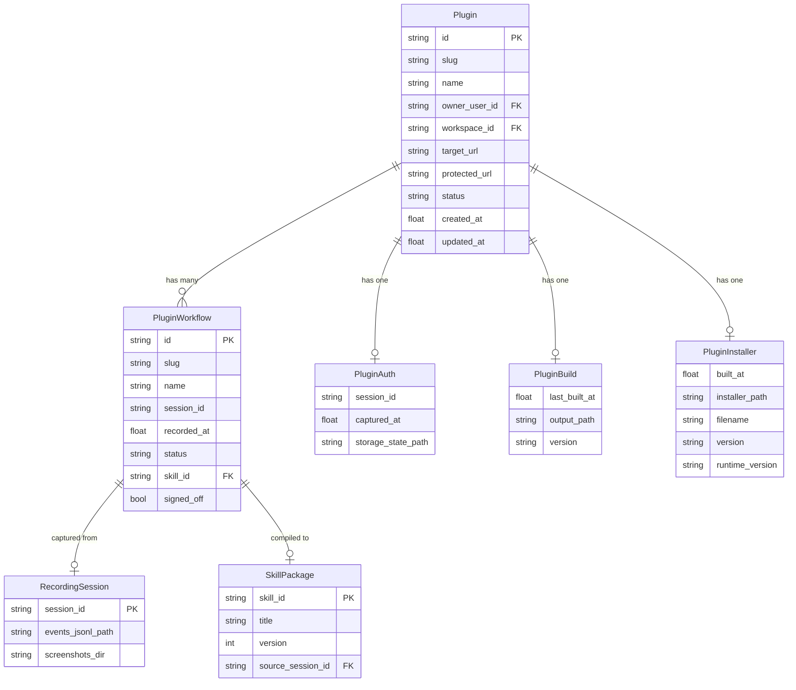
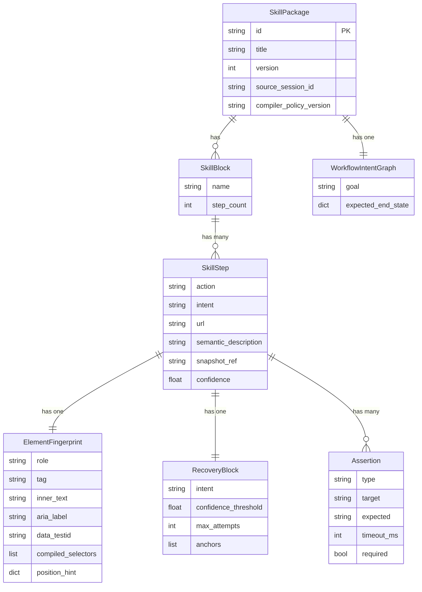
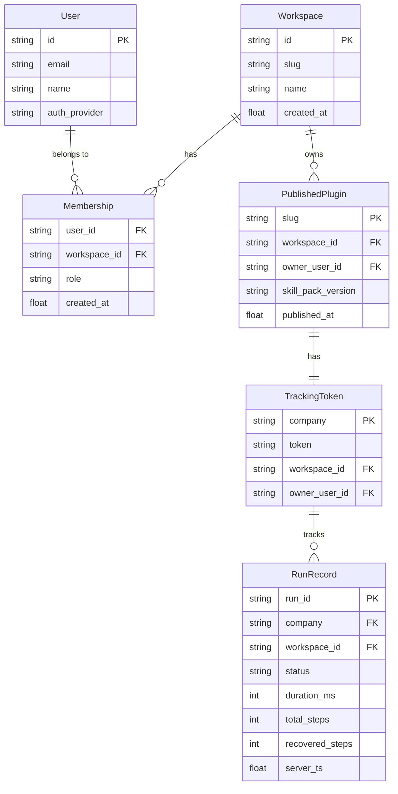

# Backend Schema Document

**Status:** Current as of 2026-07-04
**Scope:** All data models, storage architecture, and API contracts

---

## Table of Contents

1. [Storage Architecture](#1-storage-architecture)
2. [Core Data Models](#2-core-data-models)
3. [Skill Package Schema](#3-skill-package-schema)
4. [Tracking / Telemetry Schema](#4-tracking--telemetry-schema)
5. [API Contracts](#5-api-contracts)
6. [Entity Relationship Diagrams](#6-entity-relationship-diagrams)
7. [KV Namespace Map](#7-kv-namespace-map)
8. [File Storage Map](#8-file-storage-map)
9. [Multi-Tenancy Design](#9-multi-tenancy-design)
10. [Security Considerations](#10-security-considerations)

---

## 1. Storage Architecture

Conxa uses a **dual-mode key-value store** abstracted in `packages/conxa-core/conxa_core/db.py`.

### 1.1 PostgreSQL Mode (Production)

Activated when `SKILL_DATABASE_URL` is set. Required in production (`SKILL_AUTH_REQUIRED=true`).

```sql
CREATE TABLE IF NOT EXISTS kv_store (
    namespace  TEXT        NOT NULL,
    key        TEXT        NOT NULL,
    data       JSONB       NOT NULL DEFAULT '{}',
    created_at TIMESTAMPTZ NOT NULL DEFAULT now(),
    updated_at TIMESTAMPTZ NOT NULL DEFAULT now(),
    PRIMARY KEY (namespace, key)
);
```

**Access patterns:**
- `db_get(namespace, key)` → JSONB data or None
- `db_set(namespace, key, value)` → upsert
- `db_append(namespace, key, items)` → append items to JSON array in `data`
- `db_list_kv(namespace)` → all (key, data) pairs in namespace

### 1.2 Filesystem Mode (Local Development)

Activated when `SKILL_DATABASE_URL` is not set.

```
data/kv/{namespace}/{sha256(key)}.json
```

Key is hashed to SHA-256 to produce a filesystem-safe filename (colons, slashes, etc. are invalid on Windows).

**Fallback:** Legacy paths used pre-hashing are also checked for backward compatibility.

### 1.3 Additional Storage (Non-KV)

Large or time-series data lives in flat files, not the KV store:

| Type | Path | Format |
|---|---|---|
| Raw recorded events | `data/sessions/{id}/events.jsonl` | JSONL (append-only) |
| Compiled skills | `data/skills/{id}/skill.json` | JSON (SkillPackage) |
| Skill screenshots | `data/sessions/{id}/screenshots/` | PNG |
| Step thumbnails | `data/skills/{id}/assets/` | PNG |
| Run logs (local) | `data/runs/{plugin_id}.jsonl` | JSONL |
| Published skill packs | `data/skill-packs/{co}/` | Directory tree |
| Installer binaries | `data/installers/{co}/installer.exe` | Binary |
| Installer metadata | `data/installers/{co}/meta.json` | JSON |
| Blob store (planned) | External (BLOB_READ_WRITE_TOKEN) | Binary |

---

## 2. Core Data Models

All models are Pydantic. Source: `packages/conxa-core/conxa_core/models/plugin.py`

### 2.1 Plugin

```python
class Plugin(BaseModel):
    id: str                    # UUID-like, e.g. "plugin_abc123"
    slug: str                  # URL-safe company identifier, e.g. "acme-corp"
    name: str                  # Display name
    owner_user_id: str         # Clerk user ID or "local"
    workspace_id: str          # Clerk org ID or "ws_local"
    target_url: str            # Entry URL for the target website
    protected_url: str         # URL captured after auth (e.g. dashboard URL)
    protected_url_marker_text: str  # Text that marks the protected area
    status: Literal["needs_auth", "ready", "building", "error"]
    auth: PluginAuth | None    # Captured browser session reference
    workflows: list[PluginWorkflow]
    build: PluginBuild | None  # Most recent build metadata
    installer: PluginInstaller | None
    created_at: float          # Unix timestamp
    updated_at: float
```

**Status transitions:**
```
needs_auth → ready (after auth recording)
ready → building (during build)
building → ready (build success)
building → error (build failure)
```

### 2.2 PluginWorkflow

```python
class PluginWorkflow(BaseModel):
    id: str                    # UUID
    slug: str                  # URL-safe workflow name
    name: str                  # Display name
    session_id: str            # Recording session this workflow came from
    recorded_at: float         # Unix timestamp
    status: Literal["recorded", "compiled", "error"]
    skill_id: str | None       # "skill_{session_id}" after compilation
    edited_at: float | None    # Last edit timestamp
    last_test_at: float | None
    last_test_status: Literal["passed", "failed", "never"]
    last_test_error: str | None
    last_test_inputs: dict     # Inputs used in last test
    signed_off: bool           # Human review complete
```

### 2.3 PluginAuth

```python
class PluginAuth(BaseModel):
    session_id: str            # Recording session used for auth capture
    captured_at: float
    storage_state_path: str    # Absolute path to auth.json (local only)
```

### 2.4 PluginBuild

```python
class PluginBuild(BaseModel):
    last_built_at: float
    output_path: str           # Path to {company}-plugin/ folder
    version: str               # Semver, e.g. "0.1.0"
```

### 2.5 PluginInstaller

```python
class PluginInstaller(BaseModel):
    built_at: float
    installer_path: str        # Local path to .exe
    filename: str              # e.g. "Acme-Plugin-Setup.exe"
    version: str
    runtime_version: str       # Version of bundled runtime
```

### 2.6 EntitlementUsage

Stored in KV namespace `entitlement_usage`, keyed by `workspace_id:YYYY-MM`.

```python
class EntitlementUsage(TypedDict):
    workspace_id: str
    period: str                         # UTC calendar month, e.g. "2026-06"
    compile_credits_used: int
    compile_input_tokens: int
    compile_output_tokens: int
    compile_requests: int               # proxied compile LLM requests
    human_edit_input_tokens: int
    human_edit_output_tokens: int
    human_edit_requests: int            # proxied Human Edit LLM requests
    created_at: str                     # ISO-8601 UTC
    updated_at: str                     # ISO-8601 UTC
```

### 2.7 CompileReservation

Stored in KV namespace `compile_reservations`, keyed by `reservation_id`.

```python
class CompileReservation(TypedDict):
    reservation_id: str
    workspace_id: str
    period: str
    amount: int                         # currently always 1
    status: Literal["reserved", "committed", "released", "expired"]
    plugin_id: str
    workflow_id: str
    session_id: str
    idempotency_key: str
    created_at: str
    updated_at: str
    expires_at: float                   # Unix timestamp
```

Production enforcement uses database transactions plus a Postgres advisory transaction lock. Local development uses the file/KV fallback with a process-local lock.

---

## 3. Skill Package Schema

Source: `packages/conxa-core/conxa_core/models/skill_spec.py`

### 3.1 SkillPackage (top-level)

```python
class SkillPackage(BaseModel):
    meta: SkillMeta
    inputs: list[dict]         # Parameterizable inputs schema
    skills: list[SkillBlock]   # Currently always 1 block per workflow
    policies: SkillPolicies
    llm: dict                  # LLM config hints
    intent_graph: WorkflowIntentGraph
    compile_report: dict       # Required: {status, steps_total, min_confidence, 
                               #            llm_router_stats, steps}
```

Each entry in `inputs` is validated against `SkillInputVariable` (`conxa-builder/python/conxa_compile/editor/dto.py`):

```python
class SkillInputVariable(BaseModel):
    id: str                    # letter-led, alnum + underscore — must match {{id}} grammar
    label: str = ""
    type: Literal["text", "select"] = "text"
    default: str | None = None
    options: list[str] = []    # required (non-empty) when type == "select"
    pattern: str | None = None
    sensitive: bool = False    # redacts the value from saved test history; feeds the shipped
                               # bundle's inferred auth type (password/api-key/none)
    optional: bool = False     # the skill may run without this value. A value with `default`
                               # set is always effectively optional regardless of this flag.
```

`optional` is excluded from the packaged manifest's `inputs_required` (`plugin_builder_output.py::_compute_inputs_required`), which is what the runtime's pre-execution gate and the MCP tool's `inputSchema.required` both read (`runtime/server.js`).

### 3.2 SkillMeta

```python
class SkillMeta(BaseModel):
    id: str                    # "skill_{session_id}"
    version: int               # Monotonically increasing
    title: str                 # Human-readable workflow name
    created_at: str            # ISO timestamp
    source_session_id: str | None
    compiler_policy_version: str
    compiler_policy_hash: str
    structural_fingerprint: dict  # Hash of first 3 steps' landmark selectors
                                  # Used for drift detection
```

### 3.3 SkillStep

```python
class SkillStep(BaseModel):
    action: str | dict         # Action type + params
    intent: str                # "Click the Submit button"
    url: str                   # Expected URL for this step
    frame: dict                # Iframe chain structural marker (url/url_pattern per level)
    target: dict               # Raw recorded target element data
    identity_bundle: IdentityBundle          # REQUIRED — single source of element identity (see §3.4a)
    handler_hints: HandlerHints              # hover_chain, virtualization (see §3.4b)
    signals: dict              # Additional DOM signals
    state: dict                # Page state at recording time
    value: Any                 # Input value (may be {{variable}})
    input_binding: str | None  # Input variable name if parameterized
    validation: ValidationBlock
    recovery: RecoveryBlock
    confidence_protocol: dict
    decision_policy: DecisionPolicy
    compiled_selectors: list[str]  # Ranked CSS/XPath selectors (T1 recovery)
    semantic_description: str      # "First Name input in Add Person dialog"
    snapshot_ref: str              # DOM snapshot blob reference
    snapshot_dom_hash: str         # For cross-compilation cache lookup
    branch: dict                   # Conditional/branch payload — empty for ordinary steps (§3.4c)
    optional_hint: dict | None     # Recorder-observed "might be optional" flag, advisory only (§3.4d)
```

> **Single identity object (cutover):** `element_fingerprint` is no longer a top-level
> `SkillStep` field — it lives **inside** `IdentityBundle.fingerprint` (§3.4a). `identity_bundle`
> is required; the runtime resolves the primary target through `identity_bundle.signals` (no legacy
> `compiled_selectors` primary path), and frame roots are driven solely by
> `identity_bundle.frame_chain`. Packs compiled before this change must be recompiled.

### 3.4 ElementFingerprint

The stable element identity used to score DOM candidates at runtime (carried as
`IdentityBundle.fingerprint`):

```python
class ElementFingerprint(BaseModel):
    role: str          # ARIA role
    tag: str           # HTML tag
    inner_text: str    # Visible text (max 120 chars)
    aria_label: str
    name: str          # form field name attribute
    placeholder: str
    label_text: str    # Associated <label> text
    data_testid: str   # data-testid attribute (highest stability)
    input_type: str    # for <input> elements
    css_class_tokens: list[str]   # Stable class tokens only
    anchor_phrases: list[str]     # Relational context phrases
    position_hint: dict           # {x: 0.0-1.0, y: 0.0-1.0}
```

### 3.4a IdentityBundle (Final Selector Architecture)

The durability-ranked, orthogonality-deduplicated element identity used by the pure runtime
resolver. Retained alongside `ElementFingerprint` for backward compatibility.

```python
class IdentitySignal(BaseModel):
    engine: str                # testid | role | aria | text | relational | css-id | css-structural | xpath
    selector: str              # Playwright native grammar (internal:role=…, internal:testid=…)
    durability: float          # 0.0–1.0, base_durability(engine) × survival_prior × stability_adj
    orthogonality_class: str   # test-contract | semantic-aria | visible-text | spatial-anchor | structural
    unique_at_compile: bool    # matched exactly 1 node in recorded DOM
    source: str                # compiler | llm | input_bound

class FrameFingerprint(BaseModel):
    signals: list[IdentitySignal]   # durability-ranked per frame level
    url: str
    url_pattern: str

class ShadowHost(BaseModel):
    host: str                  # CSS selector of the shadow host
    mode: str                  # "open" | "closed"

class IdentityBundle(BaseModel):
    signals: list[IdentitySignal]        # durability-ordered, ≤1 per orthogonality class
    fingerprint: ElementFingerprint      # the resolver's scoring oracle (recorded element attrs)
    stable_hash: str                     # SHA256(tag_path + static attrs + AX name), dynamic classes stripped
    frame_chain: list[FrameFingerprint]  # sole frame-resolution source (durability-ranked per level)
    shadow_path: list[ShadowHost]
    compat_fingerprint: str              # app-version indicators
    guid_like_attrs: list[str]
    destructive: bool
```

### 3.4b HandlerHints

```python
class HandlerHints(BaseModel):
    hover_chain: list[IdentitySignal]    # elements to hover before acting (menu reveals)
    virtualized_container: str           # scroll container selector for virtualized rows
    allow_forced_action: bool
```

### 3.4c Conditional / Branch Steps (EXEC-1)

`SkillStep.branch` (`dict`, empty for ordinary linear steps) holds the payload for the three
conditional/branch action kinds — `if_present`, `try_dismiss`, `wait_for_one_of`. See
`docs/TRD.md` §10.7 for runtime execution semantics (best-effort, never enters recovery).

| `action` | `branch` keys | Probe target |
|---|---|---|
| `if_present` | `steps` (nested SkillStep dicts), `timeout_ms` | `SkillStep.target`/`identity_bundle` (the step's own) |
| `try_dismiss` | `candidates` (selector strings), `timeout_ms`, `fallback_escape` | each candidate, in order |
| `wait_for_one_of` | `options` (`[{selector, steps?}]`), `timeout_ms`, `required` | each option's `selector` |

Nested `steps` entries are raw dicts in the same shape as a saved `SkillStep`
(`action`/`target`/`identity_bundle`/`branch`/...) — `plugin_builder_saved_skill.py`'s
`_saved_step_to_execution_step` recursively serializes each one into the flat runtime step
shape below.

**On-disk `execution.json` shape** (what `runtime/run.js` actually consumes — flat, `type` not
`action`):

```json
{ "type": "if_present", "selector": ".cookie-banner", "timeout_ms": 1500,
  "steps": [ { "type": "click", "selector": "#accept-cookies" } ] }

{ "type": "try_dismiss", "timeout_ms": 1000,
  "candidates": [ "#accept-cookies", ".cookie .accept", "[aria-label='Close']" ] }

{ "type": "wait_for_one_of", "timeout_ms": 8000, "required": true,
  "options": [
    { "selector": "#mfa-code", "steps": [ { "type": "fill", "selector": "#mfa-code", "value": "{{otp}}" } ] },
    { "selector": "#dashboard" }
  ] }
```

A probe may carry `identity_bundle` instead of a bare `selector`; the runtime's `probePresent`
resolves either. See `runtime/test/gate-skill/skill-pack/gate/gate-skill/execution.json` for a
working `if_present` fixture exercised by the CI execution gate.

**Editor authoring (2026-07-10):** `if_present`/`try_dismiss`/`wait_for_one_of` are now
insertable from Human Edit. `if_present`'s nested `steps` body is fully editable — structural
edits (add/remove/reorder) go through `insert_branch_step`/`delete_branch_step`/
`reorder_branch_steps` (`conxa_compile/editor/workflow_mutations.py`), while per-field edits on a
nested step reuse `cmd_patch_step` with an optional `path` parameter (e.g. `"branch.steps[1]"`)
that addresses the nested dict inside `branch.steps` instead of a top-level step. Nested steps
cannot patch `recovery`/`validation` (branch bodies never enter Tier 1-4 recovery, so those
blocks are meaningless there — enforced by `patch_gate.py::validate_editor_patch`'s
`in_branch_body` flag). `try_dismiss`/`wait_for_one_of` accept a normal `branch` key patch
(candidates/options, quality-gated the same way as any selector) but have no dedicated authoring
UI yet — see `TODO.md` BUILD-6.

### 3.4d Optional-interstitial observation (recording-next-steps.md Priority 2, 2026-07-10)

`SkillStep.optional_hint` (`dict | None`) is the recorder's advisory flag that this step's target
sat inside what looked like an optional interstitial (dialog or cookie/consent banner) during
recording — carried verbatim from the recorded event's `optionality`/`branch_hint` fields
(`RecordedEvent`, `packages/conxa-core/conxa_core/models/events.py`; see `docs/TRD.md` §10.7 for
the detection heuristic). It never changes compiled behavior on its own: the step still compiles and executes as a normal
required linear step. Only a human confirming in Human Edit converts it into a real `try_dismiss`
branch (§3.4c) — the compiler never does this automatically, honoring the invariant that branch
steps compile only from observed states + human confirmation.

```python
optional_hint: dict | None   # {"kind": "try_dismiss", "container_signal": "<selector>"} or None
```

- **Set by:** `build.py` carries `RecordedEvent.optionality == "stochastic"`'s `branch_hint` onto
  the compiled step unchanged.
- **Surfaced by:** `StepEditorDTO.optional_hint` (same shape), read-only — Human Edit renders a
  "treat as optional?" affordance when present.
- **Consumed by:** `POST confirm_optional_interstitial` (`skill_id`, `step_index`) — a structural
  mutation (same shape as `insert_branch_step`, bypasses `patch_gate.py`) that rewrites the step's
  `action` to `try_dismiss`, seeds `branch.candidates` from the step's own recorded selector plus
  the hint's `container_signal`, and clears `optional_hint`.

### 3.5 RecoveryBlock

```python
class RecoveryBlock(BaseModel):
    intent: str                # What this step is trying to do
    final_intent: str          # Refined intent for LLM recovery
    anchors: list[dict]        # Visual anchor points for vision recovery
    strategies: list[str]      # ["semantic match", "position match", "visual match"]
    confidence_threshold: float  # 0.85 default
    max_attempts: int          # 2 default
    require_diverse_attempts: bool
```

### 3.6 Assertion

A verifiable post-action condition, checked independently of whether the action itself threw.
Every consequential action (submit click, destructive confirm, text entry/select) compiles with
exactly one **required** (enforced) assertion — the compiler's deterministic "primary signal
picker" in `build.py:_build_assertions` — plus zero or more advisory ones. `required=False`
assertions only log a warning on failure; a `required=True` failure halts the step and descends
into recovery (`runtime/run.js` `verifyStep`).

```python
class Assertion(BaseModel):
    type: str          # "url_changed" | "url_pattern" | "selector_present" | "selector_absent"
                       # | "text_present" | "text_absent" | "value_equals" | "state_changed"
    target: str        # URL prefix, regex pattern, CSS selector, or text string (empty for state_changed)
    expected: str       # value_equals only — expected field value (interpolated against runtime inputs)
    timeout_ms: int    # 5000 default
    required: bool     # True = halt on failure (and descend into recovery); False = warning only
```

- `url_changed` — the page address must differ from its value before the action (target = the
  before-URL). `url_pattern`/`url` is a regex-matching alias.
- `selector_present` / `selector_absent` — a selector must (not) be present.
- `text_present` / `text_absent` — visible text must (not) appear.
- `value_equals` — the target field's actual value must match `expected`. Compared normalized
  (trim/collapse-whitespace/lowercase); if the normalized-exact match fails, a "field contains
  expected" fallback is accepted, so masked/formatted fields (phone, currency) still validate.
  Compiled for `fill`/`type`/`select`/`select_option` steps that have a resolvable target
  selector and a recorded value.
- `state_changed` — no `target`; confirms the page shows *some* observable effect (URL,
  interactive-element count, or a body-text-length delta beyond a small noise tolerance) relative
  to a pre-action baseline captured by the runtime. Synthesized only for commit/destructive clicks
  that have no recorded URL/DOM evidence — the "no silent no-op" guard for evidence-less commits.

**Post-condition preference (recording-next-steps.md Priority 1, 2026-07-10):** before falling
back to the generic wait_for/success_conditions inference above, `_build_assertions` checks the
recorded event's `post_condition` (`RecordedEvent.post_condition`, optional) — a small structured
classification bridge.js computes live against the running page at action time. When
`classified_effect == "dialog_opened"`, its `dialog_signal` claims the enforced slot as a
`selector_present`. When `classified_effect == "value_set"`, a non-redacted `value_readback`
becomes `value_equals`'s `expected` instead of the recorded intent value. This live evidence is
strictly preferred because it's captured against the running page rather than reconstructed
after the fact; the runtime evaluation path is unchanged either way.

### 3.7 ValidationBlock

```python
class ValidationBlock(BaseModel):
    wait_for: dict             # Condition to wait for before asserting
    success_conditions: dict   # Legacy field
    assertions: list[Assertion]
```

### 3.8 WorkflowIntentGraph

Generated by `intent_llm.py` — one LLM call per workflow:

```python
class WorkflowIntentGraph(BaseModel):
    goal: str                          # "Submit expense report for given period"
    steps: list[WorkflowIntentStep]    # Per-step intent summary
    decision_points: list[dict]        # Points where branching may occur
    expected_end_state: dict           # What success looks like
```

---

## 4. Tracking / Telemetry Schema

### 4.1 Telemetry Batch Payload (Runtime → Cloud)

```json
{
  "rid": "run_abc123",      // run_id
  "pid": "acme",            // plugin/company slug
  "pv": "0.2.0",            // plugin version
  "rv": "1.0.0",            // runtime version
  "uid": "user_hash",       // anonymized user identifier
  "wid": "ws_xyz",          // workspace identifier
  "sv": 1,                  // schema version
  "evts": [                 // compact event list
    {"e": "wf_start", "ts": 1717000000, "tot": 5},
    {"e": "step_ok",  "ts": 1717000002, "si": 0, "tier": 1},
    {"e": "step_fail","ts": 1717000005, "si": 1, "code": "selector_timeout"},
    {"e": "recovery_tier2", "ts": 1717000006, "si": 1},
    {"e": "step_ok",  "ts": 1717000007, "si": 1, "tier": 2},
    {"e": "wf_ok",    "ts": 1717000020, "dur": 20000, "tot": 5, "rec": 1}
  ]
}
```

**Event codes:**

| Code | Meaning | Extra fields |
|---|---|---|
| `wf_start` | Workflow execution begins | `tot` (total steps) |
| `step_ok` | Step succeeded | `si` (step index), `tier` (1–4) |
| `step_fail` | Step failed | `si`, `code` (error code) |
| `recovery_tier{N}` | Recovery tier N attempted | `si` |
| `tier_ok` | A resolution/recovery tier succeeded | `si`, `tier`, `sel` |
| `verify_fail` | Post-action VERIFY failed | `si`, `ch` (assertion channel) |
| `verify_result` | Full post-action assertion audit for a step that carries assertions (emitted on the primary execution path, pass or fail — not on recovery re-verification) | `si`, `ok` (overall pass/fail), `n` (assertion count), `advFail` (count of failed advisory/non-required assertions) |
| `repair_event` | A step was recovered — drift signal for the admin flywheel queue | `step_id`, `tier` (L1/L2), `method`, `score`, `margin`, `stable_hash_match`, `stable_hash`, `drift_hint`, `app_version_fingerprint` |
| `drift_detected` | Pre-execution structural drift warning (advisory; emitted at run start, never blocks) | `total` (landmarks), `missing`, `drift_ratio`, `missing_intents` (≤5), `url` |
| `wf_ok` | Workflow completed successfully | `dur` (ms), `tot`, `rec` (recovered steps) |
| `wf_fail` | Workflow failed | `dur`, `fsi` (failed step index), `fc` (failure code) |

**`repair_event` is ephemeral per-run telemetry** — it never mutates the signed local pack.
It aggregates into the admin drift-review queue at `GET /api/v1/tracking/{company}/drift`
(keyed by plugin/version/step). Detection is automatic and fleet-wide; a durable fix is always
an admin-reviewed, manually published re-sign — publishing is never automatic.

**`drift_detected`** is emitted by the runtime before step 0 when most of a pack's recorded
structural landmarks are no longer present on the live page (a redesign signal). It is advisory —
execution proceeds and per-step recovery still applies. `GET /api/v1/tracking/{company}/drift`
returns these separately under `pre_exec` (aggregated per plugin/version by `_pre_exec_drift_queue`),
alongside the per-step `repair_event` `queue`.

### 4.2 Stored Event Batch (Cloud)

After enrichment, stored in `kv_store` under `tracking/{company}` → `run_id`:

```json
{
  "run_id": "run_abc123",
  "company": "acme",
  "plugin_id": "acme",
  "plugin_ver": "0.2.0",
  "runtime_ver": "1.0.0",
  "uid": "user_hash",
  "wid": "ws_xyz",
  "workspace_id": "org_clerk123",
  "owner_user_id": "user_clerk456",
  "server_ts": 1717000025.3,
  "events": [...],
  "schema_v": 1
}
```

### 4.3 Tracking Token Record

Stored in `kv_store` under `tracking_tokens` → `company_slug`:

```json
{
  "token": "random_urlsafe_32_bytes",
  "company": "acme",
  "version": "0.2.0",
  "workspace_id": "org_clerk123",
  "owner_user_id": "user_clerk456",
  "updated_at": 1717000000.0
}
```

---

## 5. API Contracts

### 5.1 Publish Skill Pack

**POST /api/v1/plugins/publish**

Request:
```json
{
  "slug": "acme",
  "display_name": "Acme Corp",
  "target_url": "https://app.acme.com",
  "protected_url": "https://app.acme.com/dashboard",
  "skill_pack_version": "0.2.0",
  "skills": ["submit_expense", "export_report"],
  "files": [
    {
      "path": "pack.json",
      "content_base64": "..."
    },
    {
      "path": "submit_expense/execution.json",
      "content_base64": "..."
    }
  ]
}
```

Response (201):
```json
{
  "slug": "acme",
  "version": "0.2.0",
  "files_written": 6,
  "sync_url": "/api/v1/skill-packs/acme/delta",
  "tracking": {
    "enabled": true,
    "tracking_url": "https://apis.conxa.in/api/tracking/acme/events",
    "tracking_token": "...",
    "company_id": "acme",
    "schema_version": 1
  },
  "workspace_id": "org_clerk123",
  "published_at": 1717000000.0
}
```

Duplicate-version publish → **409** `skill_pack_version_exists` (a given `skill_pack_version` is an immutable release, same as installer uploads — bump the version and republish).

### 5.1a Versioned Endpoint Scheme (`{installer_version}`)

Skill Pack Publishing is the primary, version-controlled release surface; installers are a stable, Conxa-owned platform artifact. To let Conxa evolve the installer/runtime wire contract without ever requiring vendors to rebuild for routine skill-pack updates, every per-company endpoint has a versioned equivalent nested under a Conxa-owned `{installer_version}` path segment (`publish_routes.SUPPORTED_INSTALLER_GENERATIONS`, currently `("v1", "v2")`):

```
POST /api/v1/plugins/{installer_version}/{company_slug}/skill-packs/upload      # same body/response as §5.1
GET  /api/v1/plugins/{installer_version}/{company_slug}/skill-packs/versions   # release history — see §5.1a below
GET  /api/v1/plugins/{installer_version}/{company_slug}/skill-packs/delta      # same as §5.9
POST /api/v1/plugins/{installer_version}/{company_slug}/installer/upload       # same as §5.1b below
GET  /api/v1/plugins/{installer_version}/{company_slug}/installer/versions     # same as §5.1b below
POST /api/v1/plugins/{installer_version}/{company_slug}/tracking/events        # same as §5.6
GET  /api/v1/plugins/generations                                              # {current, supported, deprecated}
POST /api/v1/admin/plugins/generations                                        # admin flip (Bearer CONXA_ADMIN_TOKEN)
```

Every versioned route validates `{installer_version}` against the allow-list (400 `unsupported_installer_version` otherwise) and delegates to the exact same shared implementation function as its legacy, unversioned counterpart — behavior is identical across generations. **`{installer_version}` is frozen into an installer at build time** (stamped into `pack.json.installer_version` at publish time by Build Studio, read from `GET /api/v1/plugins/generations`'s `current` field) and is never reassigned remotely for an already-installed runtime. "Migrating customers to a new generation" means Conxa flips the *default* generation that **new** installer builds stamp (`POST /api/v1/admin/plugins/generations`) — it does not, and cannot, change the URLs already baked into a customer's machine. The legacy, unversioned routes (`/api/v1/plugins/publish`, `/api/v1/plugins/{slug}/installer/upload`, `/api/v1/skill-packs/{company}/delta`, `/api/tracking/{company}/events`) are kept mounted **permanently** as the implicit "v1" behavior for every already-deployed installer — never removed.

**GET /api/v1/plugins/{installer_version}/{company_slug}/skill-packs/versions** — release history for the Skill Pack Publishing page (version, release notes, publish timestamp, `is_latest`), the version/release-comment/publishing-limit surface that moved here from Build Installer:
```json
{
  "slug": "acme",
  "versions": [
    {"slug": "acme", "version": "0.3.0", "release_notes": "Fixed export bug", "skills": ["submit_expense"],
     "workspace_id": "org_clerk123", "owner_user_id": "user_123", "published_at": 1717000100.0,
     "files_written": 6, "is_latest": true},
    {"slug": "acme", "version": "0.2.0", "release_notes": "Initial release", "skills": ["submit_expense"],
     "workspace_id": "org_clerk123", "owner_user_id": "user_123", "published_at": 1717000000.0,
     "files_written": 5, "is_latest": false}
  ]
}
```
**KV namespace:** `skillpack_versions__{slug}` — one row per version (mirrors `installer_versions__{slug}`, §5.1b below). Duplicate-version publish → 409 `skill_pack_version_exists` (see §5.1).

### 5.1b Installer Upload + History (installer becomes a secondary, advanced artifact)

**POST /api/v1/plugins/{slug}/installer/upload?filename=...&version=...&release_notes=...** (raw octet-stream body) — uploads a built installer `.exe`. No product/skill-pack-slot entitlement check here (that gate lives on skill-pack publish only, §5.1/§5.3 — installer upload is optional and unmetered, matching the requirement that a failed/skipped installer upload never fails a Build Installer run). Duplicate-version upload → 409 `installer_version_exists`. Response:
```json
{
  "slug": "acme", "version": "1.2.0", "sha256": "abc123...", "size": 20480000,
  "download_url": "/api/v1/installers/acme", "version_download_url": "/api/v1/installers/acme/versions/1.2.0"
}
```

**GET /api/v1/plugins/{slug}/installer/versions** — authenticated installer release history for the dashboard (version, release notes, sha256, size, `is_latest`, signed `download_url`).

**KV namespace:** `installer_versions__{slug}` — one row per version, binary mirrored separately in Postgres (`installer_storage.load_installer_from_db`) since Render's disk is ephemeral.

### 5.2 Skill Pack Delta

See §5.9 (Skill-Pack Delta Sync) — the sole current contract for this endpoint. An earlier revision of this document described a single shared pack-wide version here; that has been superseded by §5.9's per-skill version map and removed to avoid two contradictory contracts for the same endpoint.

### 5.3 Entitlements

**GET /api/v1/entitlements/current**

Response:
```json
{
  "workspace_id": "org_123",
  "plan": "starter",
  "period": "billing:1782691200",
  "reset_at": "2026-06-29T00:00:00Z",
  "meters": {
    "seats": {"used": 2, "limit": 3, "remaining": 1, "unlimited": false},
    "skill_pack_slots": {"used": 1, "limit": 3, "remaining": 2, "unlimited": false},
    "compile_credits": {"used": 42, "limit": 300, "remaining": 258, "unlimited": false},
    "human_edit_tokens": {"used": 230000, "limit": 10000000, "remaining": 9770000, "unlimited": false}
  }
}
```

For paid (Cashfree-subscribed) workspaces, `period` is `billing:<current_period_end_unix>` and `reset_at` is the next monthly payment timestamp. Workspaces without a subscription timestamp use the UTC calendar-month fallback (`YYYY-MM`).

**POST /api/v1/usage/compile/reserve**

Request:
```json
{
  "reservation_id": "cmp_org_123_plugin_wf_session_attempt",
  "plugin_id": "plugin_123",
  "workflow_id": "wf_123",
  "session_id": "sess_123"
}
```

Response:
```json
{
  "reservation_id": "cmp_org_123_plugin_wf_session_attempt",
  "status": "reserved",
  "remaining_compile_credits": 257
}
```

**POST /api/v1/usage/compile/commit**

Request:
```json
{"reservation_id": "cmp_org_123_plugin_wf_session_attempt"}
```

**POST /api/v1/usage/compile/release**

Request:
```json
{"reservation_id": "cmp_org_123_plugin_wf_session_attempt"}
```

Stable entitlement error details (returned as HTTP `402` for quota-exhausted, `403`/`503` for
config/availability):
- `compile_credit_limit_exceeded` — 402, compile-credit reservation at limit (checked at `/usage/compile/reserve`)
- `human_edit_pool_exceeded` — 402, monthly Human-Edit token pool exhausted (checked at the LLM proxy)
- `installer_limit_exceeded` — 402, plan skill-pack-slot limit reached (checked at **skill-pack publish only** — installer upload is unmetered; error code kept unchanged for back-compat with Build Studio's existing error-message map)
- `seat_limit_exceeded` — 402, workspace seat limit reached
- `entitlements_unavailable` — 503, cloud could not evaluate entitlements (quota-gated actions blocked)
- `invalid_usage_class` — 400

**Enforcement is on by default** (`entitlements_enforce_compile|_human_edit|_installers = True` in
`config.py`). Workspaces on the `development` plan, or any plan whose limit resolves to `None`
(e.g. an `enterprise` override), are never blocked. Enforcement points: skill-pack publish
(`publish_routes._publish_skill_pack_impl`, both the legacy and versioned routes — **not** installer
upload, which is optional and unmetered), the compile-credit reserve/commit protocol (driven by
Build Studio around each compile), and the Human-Edit pool at `llm_proxy_routes`.

**`skill_pack_slots` accounting** (`services/entitlements.py`): a slot is consumed the first time a
workspace publishes a skill pack *or* uploads an installer for a given slug, tracked in the
`publish_owners` KV namespace (one row per slug, `{slug, workspace_id, claimed_at}` — same store
`_assert_owner`/`_assert_not_owned_by_other` use for the 403 ownership-conflict check).
`ensure_skill_pack_slot_available` checks the *conflict* (`_assert_not_owned_by_other`) and the
*limit* before the slug is claimed (`_claim_owner`) — claiming first would make a brand-new slug
look pre-owned by the time the limit check ran, making the limit unenforceable. The old
`installer_slots` override key is still accepted as an alias in billing metadata.

### 5.4 Billing

The live payment gateway is **Cashfree** (switched from Razorpay 2026-06-30 — see `cashfree_routes.py`, mounted at `/api/v1/subscriptions`).

**POST /api/v1/subscriptions/create**

Request:
```json
{"tier": "starter", "customer_email": "...", "customer_phone": "..."}
```

Calls Cashfree's `POST /api/v2/subscriptions/nonSeamless/subscription` server-side and returns:
```json
{
  "subscription_id": "<Cashfree subReferenceId>",
  "auth_link": "https://payments.cashfree.com/...",
  "plan_id": "<Cashfree planId>",
  "amount": 2999900,
  "currency": "INR",
  "tier": "starter"
}
```

The workspace↔subscription↔tier mapping is stored server-side in the `cashfree_sub_workspace` KV namespace (keyed by `subReferenceId`) for later webhook lookup, since Cashfree webhooks only carry the subscription reference id, not the originating workspace. The frontend redirects the user to `auth_link` to complete payment.

**POST /api/v1/subscriptions/verify**

Request:
```json
{"subscription_id": "<Cashfree subReferenceId>"}
```

Response:
```json
{"success": true}
```

Fetches `GET /api/v2/subscriptions/{subscription_id}` from Cashfree, resolves the tier from the returned `planId`, and upserts the billing record (`plan`, `status: "active"`, `subscription_id`, `current_period_end`).

**POST /api/v1/subscriptions/webhooks/cashfree**

Cashfree webhook endpoint. When `cashfree_webhook_secret` is configured, the signature is verified by sorting all `cf_`-prefixed payload fields, concatenating `key+value` pairs, and comparing against the provided signature using the shared secret (`_cf_webhook_signature()`). Activation/charge events refresh `current_period_end`; cancellation clears it.

### 5.5 LLM Proxy Usage Class

`POST /api/v1/llm/proxy/text` and `/vision` accept:

```json
{
  "task": "anchor_vision",
  "payload": {},
  "timeout_ms": 120000,
  "usage_class": "human_edit"
}
```

Allowed `usage_class` values are `compile` and `human_edit`. Missing `usage_class` defaults to `compile`.

Response when up-to-date:
```json
{
  "current_version": "0.2.0",
  "base_version": "0.2.0",
  "files": []
}
```

### 5.6 Telemetry Ingest

**POST /api/tracking/{company}/events** (also served at `/api/v1/tracking/{company}/events` — both are permanent back-compat aliases, see CLAUDE.md Key Invariants) and its versioned equivalent **POST /api/v1/plugins/{installer_version}/{company}/tracking/events** (§5.1a).
**Header: X-Tracking-Token: {token}**

Request: See §4.1 above.

Response (202):
```json
{"ok": true}
```

### 5.7 Tracking Runs Query

**GET /api/v1/tracking/{company}/runs?limit=50&offset=0**
**Header: Authorization: Bearer {clerk_jwt}**

Response:
```json
{
  "runs": [
    {
      "run_id": "run_abc123",
      "plugin_id": "acme",
      "plugin_ver": "0.2.0",
      "runtime_ver": "1.0.0",
      "uid": "...",
      "wid": "...",
      "status": "ok",
      "duration_ms": 20000,
      "total_steps": 5,
      "recovered_steps": 1,
      "failed_step_id": null,
      "failure_code": null,
      "started_at": 1717000000,
      "server_ts": 1717000025.3
    }
  ],
  "total": 1,
  "workspace_id": "org_clerk123"
}
```

### 5.8 Unified Signed Runtime Manifest

**GET /api/v1/manifest.json** — the single source of truth for `runtime/manifest_manager.js`'s self-updater. Replaces the three previous manifest endpoints (still served as deprecated shims — see below). Served straight from `manifest` KV; signed once at publish time, not on the read path.

**Update channels.** An optional `?channel=dev|stable` query param selects the update channel (default `stable`). Dev builds (prerelease tags) publish to `dev`; the promotion workflow re-publishes the exact signed artifact to `stable`. Channel data is namespaced in KV — `stable` keeps the original unsuffixed `component_versions` / `manifest` namespaces (byte-identical to before), `dev` uses `:dev`-suffixed namespaces — so a dev runtime (`CONXA_UPDATE_CHANNEL=dev`) never sees a stable build and vice-versa. The same server-side Ed25519 key signs every channel; the runtime's baked-in public key verifies all of them. The response carries a `"channel"` field. `POST /admin/component-versions/{component}?channel=<channel>` targets the same dimension.

Response (`packages/conxa-core/conxa_core/models/manifest.py:UnifiedManifest`):
```json
{
  "manifest_version": 3,
  "generated_at": "2026-07-01T00:00:00Z",
  "mcp_protocol_version": "2024-11-05",
  "minimum_versions": {"conxa_runtime": "host-v1.0.0", "conxa_app": "app-v1.0.0"},
  "compatibility": {},
  "conxa_runtime": {
    "version": "host-v1.1.0",
    "released_at": "2026-07-01T00:00:00Z",
    "required": false,
    "files": [
      {"filename": "conxa-runtime.exe", "url": "https://github.com/.../conxa-runtime.exe", "sha256": "abc123..."},
      {"filename": "keytar.node", "url": "https://github.com/.../keytar.node", "sha256": "def456..."}
    ],
    "rollout": {"percentage": 100, "halted": false}
  },
  "conxa_app": {
    "version": "app-v1.5.0",
    "min_host": "host-v1.0.0",
    "files": [{"filename": "conxa-app-app-v1.5.0.zip", "url": "https://github.com/.../conxa-app-app-v1.5.0.zip", "sha256": "abc123..."}],
    "rollout": {"percentage": 100, "halted": false}
  },
  "skill_packs": {
    "acme": {
      "invoice-automation": {"version": "v1.2.0", "min_runtime": "app-v1.0.0", "files": []}
    }
  },
  "signature": "base64-encoded-ed25519-signature"
}
```

`signature` is computed over the canonical JSON (sorted keys, no whitespace, `signature` field excluded) of every other field, using an Ed25519 private key held only as the `CONXA_MANIFEST_SIGNING_KEY` env var — never in CI. The runtime verifies it against a public key baked into the host exe at build time; a failed verification is treated exactly like a network failure (fall back to the last verified cache, or skip entirely on first run). `skill_packs[].files` is deliberately empty — skill content is delivered through the existing per-company delta-sync (§5.9) which is Bearer-token-gated per company, not broadcast in a public manifest.

**POST /api/v1/admin/component-versions/{component}** — CI (after host/app build) and `publish_routes.py` (after skill publish) write a component's version record here; the manifest is recomposed and re-signed immediately after. `component` is `conxa_runtime`, `conxa_app`, or `skill_packs:{company}:{skill}`. Requires `Authorization: Bearer <CONXA_ADMIN_TOKEN>`.

**Deprecated shims** (kept for runtimes that haven't picked up the manifest-driven self-updater): `GET /api/v1/updates/conxa-runtime-manifest` and `GET /api/v1/updates/conxa-app-manifest` now derive their response from the same `component_versions` KV data instead of process-local globals.

**KV namespaces:** `component_versions` (keys: `conxa_runtime`, `conxa_app`, `skill_packs:{company}:{skill}`) and `manifest` (keys: `current` — the composed+signed manifest; `skill_pack_index` — a list of `{company}:{skill}` identifiers, maintained because the filesystem-fallback KV store hashes keys and can't recover the original string, so skill entries can't be discovered by scanning `component_versions` directly; `minimum_versions`, `compatibility` — operator-set floors/gates).

### 5.9 Skill-Pack Delta Sync

**GET /api/v1/skill-packs/{company}/delta?since={json-map}** (legacy, permanent) and **GET /api/v1/plugins/{installer_version}/{company}/skill-packs/delta?since={json-map}** (versioned, §5.1a) — identical contract, both delegate to `_delta_impl()`/`_build_delta()`. `{installer_version}` is validated but not yet branched on — reserved for a future skill-pack wire-format generation, not dead code.

`since` is a JSON-encoded map of `{skill_slug: last_known_version}` (URL-encoded), letting each skill be compared and shipped independently instead of one shared pack-wide version — republishing one skill never triggers a redownload of the others (see `_skill_version()`/`_build_delta()` in `skillpack_update_routes.py`).

The delta response's `skills` array is the **authoritative full skill list** for the company — `runtime/sync.js` writes it back into local `pack.json.skills` on every successful fetch (whether or not anything changed), which is what makes a thin installer (shipping with `pack.skills` empty) and a skill added to a company post-install both eventually reach `skill_loader.js`'s registry.

Authentication: `Authorization: Bearer <sync_token>` where `sync_token` is the per-company token minted at publish time (`publish_routes._sync_token()`) and stored in the `sync_tokens` KV namespace. The token is embedded in `pack.json` at publish and ships inside the installer — the runtime reads it directly with zero user interaction.

- Production (`SKILL_AUTH_REQUIRED=true`): 401 if token is missing or does not match stored token.
- Local dev (`SKILL_AUTH_REQUIRED=false`): validation skipped.

Response:
```json
{
  "skills": [
    {"name": "invoice-automation", "version": "v1.2.0", "action": "update",
     "files": [{"path": "execution.json", "sha256": "abc123...", "content_base64": "..."}]},
    {"name": "approval-workflow", "action": "no_change"}
  ]
}
```

Each skill's version is read from `component_versions` KV (`skill_packs:{company}:{skill}`, written at publish time), falling back to the shared `pack.json.skill_pack_version` for packs published before independent per-skill versioning existed.

The sync_token is also returned in the publish response so the Build Studio can write it into the local pack.json before staging the installer:

```json
{
  "slug": "acme",
  "version": "0.3.0",
  "sync_token": "aBcDeFgH...",
  "sync_url": "/api/v1/skill-packs/acme/delta",
  "tracking": {...},
  "workspace_id": "org_...",
  "published_at": 1717000000.0
}
```

**KV namespace:** `sync_tokens` — keyed by slug, stores `{token, company, version, workspace_id, owner_user_id, updated_at}`.

### 5.10 Backend JSON-RPC Protocol (Build Studio)

**Protocol:** Newline-delimited JSON over stdin/stdout.

Request:
```json
{"id": "req_abc", "type": "compile", "payload": {"session_id": "...", "plugin_id": "...", "skill_title": "Submit Expense"}}
```

Result:
```json
{"id": "req_abc", "type": "result", "result": {"skill_id": "skill_...", "version": 2, "step_count": 8}}
```

Error:
```json
{"id": "req_abc", "type": "error", "code": "compile_credit_limit_exceeded", "message": "Monthly compile credits are exhausted for this workspace."}
```

Streaming event:
```json
{"type": "event", "id": "req_abc", "phase": "compile_step", "step": "selectors", "status": "running"}
```

---

## 6. Entity Relationship Diagrams

### 6.1 Plugin Domain


```mermaid
erDiagram
    Plugin {
        string id PK
        string slug
        string name
        string owner_user_id FK
        string workspace_id FK
        string target_url
        string protected_url
        string status
        float created_at
        float updated_at
    }
    PluginWorkflow {
        string id PK
        string slug
        string name
        string session_id
        float recorded_at
        string status
        string skill_id FK
        bool signed_off
    }
    PluginAuth {
        string session_id
        float captured_at
        string storage_state_path
    }
    PluginBuild {
        float last_built_at
        string output_path
        string version
    }
    PluginInstaller {
        float built_at
        string installer_path
        string filename
        string version
        string runtime_version
    }
    RecordingSession {
        string session_id PK
        string events_jsonl_path
        string screenshots_dir
    }
    SkillPackage {
        string skill_id PK
        string title
        int version
        string source_session_id FK
    }

    Plugin ||--o{ PluginWorkflow : "has many"
    Plugin ||--o| PluginAuth : "has one"
    Plugin ||--o| PluginBuild : "has one"
    Plugin ||--o| PluginInstaller : "has one"
    PluginWorkflow ||--o| RecordingSession : "captured from"
    PluginWorkflow ||--o| SkillPackage : "compiled to"
```

### 6.2 Skill Package Domain


```mermaid
erDiagram
    SkillPackage {
        string id PK
        string title
        int version
        string source_session_id
        string compiler_policy_version
    }
    SkillBlock {
        string name
        int step_count
    }
    SkillStep {
        string action
        string intent
        string url
        string semantic_description
        string snapshot_ref
        float confidence
    }
    ElementFingerprint {
        string role
        string tag
        string inner_text
        string aria_label
        string data_testid
        list compiled_selectors
        dict position_hint
    }
    RecoveryBlock {
        string intent
        float confidence_threshold
        int max_attempts
        list anchors
    }
    Assertion {
        string type
        string target
        string expected
        int timeout_ms
        bool required
    }
    WorkflowIntentGraph {
        string goal
        dict expected_end_state
    }

    SkillPackage ||--|| WorkflowIntentGraph : "has one"
    SkillPackage ||--o{ SkillBlock : "has"
    SkillBlock ||--o{ SkillStep : "has many"
    SkillStep ||--|| ElementFingerprint : "has one"
    SkillStep ||--|| RecoveryBlock : "has one"
    SkillStep ||--o{ Assertion : "has many"
```

### 6.3 Cloud Platform Domain


```mermaid
erDiagram
    Workspace {
        string id PK
        string slug
        string name
        float created_at
    }
    User {
        string id PK
        string email
        string name
        string auth_provider
    }
    Membership {
        string user_id FK
        string workspace_id FK
        string role
        float created_at
    }
    PublishedPlugin {
        string slug PK
        string workspace_id FK
        string owner_user_id FK
        string skill_pack_version
        float published_at
    }
    TrackingToken {
        string company PK
        string token
        string workspace_id FK
        string owner_user_id FK
    }
    RunRecord {
        string run_id PK
        string company FK
        string workspace_id FK
        string status
        int duration_ms
        int total_steps
        int recovered_steps
        float server_ts
    }

    Workspace ||--o{ Membership : "has"
    User ||--o{ Membership : "belongs to"
    Workspace ||--o{ PublishedPlugin : "owns"
    PublishedPlugin ||--|| TrackingToken : "has"
    TrackingToken ||--o{ RunRecord : "tracks"
```

---

## 7. KV Namespace Map

| Namespace | Key | Value | Used by |
|---|---|---|---|
| `plugins` | `{plugin_id}` | `Plugin` JSON | Build Studio, Cloud |
| `entitlement_usage` | `{workspace_id}:{YYYY-MM}` | Monthly compile/Human Edit usage row | Cloud entitlements |
| `compile_reservations` | `{reservation_id}` | Compile reservation row | Cloud entitlements |
| `publish_owners` | `{slug}` | `{workspace_id, claimed_at}` | Cloud publish |
| `tracking_tokens` | `{company}` | `{token, workspace_id, ...}` | Cloud tracking |
| `sync_tokens` | `{slug}` | `{token, company, version, workspace_id, owner_user_id, updated_at}` | Cloud publish, runtime sync auth |
| `installer_versions__{slug}` | `{version}` | Installer `meta.json` fields + `content_base64` (full .exe) | Cloud publish — durable backing for installer history; Render's free-tier disk is ephemeral, this KV namespace (Postgres in prod) is the source of truth, local disk is a rehydratable cache |
| `skillpack_files__{slug}` | `{relative_path}` (e.g. `pack.json`, `{skill}/execution.json`) | `{path, content_base64}` | Cloud publish, skill-pack sync — durable backing for published skill-pack files, same disk-wipe rationale as above. `path` is stored explicitly because the fs-fallback KV implementation keys files by a hash of the original key, not the literal string |
| `tracking/{company}` | `{run_id}` | `[event_batch, ...]` | Runtime, Cloud dashboard |
| `runs` | `{plugin_id}` | `[run_record, ...]` | Cloud, Build Studio |
| `selector_cache` | `{dom_hash}:{bbox}:{model}` | Selector candidates | Compiler |
| `runtime_registrations` | `{company}:{platform}` | `{company, platform, runtime_version, workspace_id, last_seen, first_seen}` | 2.1 device registration |
| `audit_log` | `{workspace_id}` | `[{id, user_id, action, resource_type, resource_id, metadata, created_at, ip}, ...]` | 2.3 audit trail |
| `rate_limits` | `{sha256(token)[:16]}` | `{last_ts}` | Skill-pack sync rate limiter — persisted so the 5-min window survives restarts and is shared across instances (1.5). In-memory dict fallback when no database is configured |
| `component_versions` | `conxa_runtime`, `conxa_app`, `skill_packs:{company}:{skill}` | `ComponentVersion`/`SkillVersion` dict (version, released_at, files[], rollout, min_host/min_runtime) | 5.8 unified manifest — written by CI + `publish_routes.py`, read by `_compose_manifest()` |
| `manifest` | `current` (composed+signed `UnifiedManifest`), `skill_pack_index` (list of `{company}:{skill}` identifiers), `minimum_versions`, `compatibility` | 5.8 unified manifest — `skill_pack_index` exists because the filesystem-fallback KV store hashes keys, so `component_versions` entries for skills can't be discovered by scanning keys directly |
| `kv_store` (meta) | `{namespace}` | Admin use | Internal |

---

## 8. File Storage Map

### Build Studio Machine

```
~/.conxa/  (SKILL_DATA_DIR or data/)
├── kv/                           ← filesystem KV fallback
│   ├── plugins/{sha256}.json
│   ├── publish_owners/{sha256}.json
│   └── tracking_tokens/{sha256}.json
├── sessions/{session_id}/
│   ├── events.jsonl              ← raw RecordedEvent stream (append-only)
│   └── screenshots/{n}.png
├── skills/{skill_id}/
│   ├── skill.json                ← SkillPackage (canonical)
│   └── assets/{step_n}.png
├── plugins/{plugin_id}/
│   ├── plugin.json               ← Plugin model
│   └── auth/
│       └── auth.json             ← Playwright storageState (LOCAL ONLY, never published)
├── skill-packs/{company}/
│   ├── pack.json                 ← manifest with sync_endpoint + tracking
│   └── {skill_slug}/
│       ├── execution.json
│       ├── recovery.json
│       └── inputs.json
├── runs/{plugin_id}.jsonl
├── saas/metadata.json            ← local workspace metadata
└── deps/
    ├── nsis/makensis.exe
    └── runtime/{ver}/conxa-runtime.exe + keytar.node + runtime-app/
```

### Conxa Cloud (Render)

```
data/  (SKILL_DATA_DIR on Render, or cloud blob storage)
├── skill-packs/{company}/
│   ├── pack.json
│   └── {skill_slug}/
│       ├── execution.json
│       ├── recovery.json
│       ├── inputs.json
│       └── manifest.json
└── installers/{company}/
    ├── installer.exe
    └── meta.json
```

### End-User Machine (Runtime)

Every updateable component (host, app, each skill) is a versioned directory with a
`current` directory junction — see TRD.md §4.4 for the full rationale and
`runtime/version_manager.js` for the implementation. App-layer files ship as obfuscated
plain JS, not V8 bytecode (`.jsc` was abandoned — `@yao-pkg/pkg`'s embedded Node build has
a different V8 than official nodejs.org Node, causing silent deserialization segfaults).

```
~/.conxa/  (CONXA_DIR)
├── conxa-runtime/
│   ├── v1.0.0/, v1.1.0/           ← conxa-runtime.exe + keytar.node + version.json each
│   └── current                    ← directory junction to the active version
├── conxa-app/
│   ├── v1.0.0/, v1.1.0/           ← server.js, sync.js, run.js, ... (obfuscated .js) + version.json each
│   └── current                    ← directory junction to the active version
├── manifest.json                  ← cached last Ed25519-verified signed manifest
├── chromium/                      ← Playwright browser (unversioned, external)
├── skill-packs/{company}/
│   ├── pack.json                  ← sync_endpoint + sync_token + tracking config (no shared version)
│   └── {skill_slug}/
│       ├── v1.0.0/, v1.1.0/       ← execution.json, recovery.json, inputs.json, manifest.json, version.json each
│       └── current                 ← directory junction, independent per skill
└── logs/
    ├── runtime.log
    └── recovery.log

%APPDATA%/Conxa/  (CONXA_DATA_DIR)
└── cache/
    ├── sessions/
    │   ├── {co}_state.json             ← AES-256-GCM encrypted storageState
    │   ├── {co}_raw_state.json         ← plaintext fallback (no Conxa token)
    │   └── {co}_auth_meta.json
    └── manifests.json                  ← skill index fast-load cache
```

---

## 9. Multi-Tenancy Design

### Current State

The platform has a basic workspace model:

- **Workspace** = Clerk organization (`org_id`) or personal (`personal_{user_id}`)
- **Slug ownership** = first publisher claims the slug for their workspace. Subsequent publishes to the same slug from a different workspace return HTTP 403.
- **Tracking scoping** = telemetry events carry `workspace_id`. Dashboard queries filter by `visible_workspace_ids_for(principal)`.
- **Plugin visibility** = plugins are scoped to `workspace_id`. Local dev uses `ws_local`.

### Current Gaps

- **No team-level publishing** — only the initial slug owner can publish updates.
- **Member roles enforced on write routes** — `rbac.py`'s `require_admin` guards publish, plugin create/delete, and bundle release (403 for non-admin/owner). Not yet fine-grained (per-skill / read-only analyst roles are Phase 3).
- **No cross-workspace sharing** — a company cannot share a plugin with another workspace.
- **Runtime auth is per-company** — there is no per-user runtime token. The same skill pack serves all users on the same machine.

### Future State (Planned)

- Per-workspace slug isolation with transfer capability.
- Role-based publishing (owner/admin/member model).
- Team invitations and multi-user workspace management.
- Per-skill access controls (which team members can publish vs. view).
- Audit log (all publish, compile, delete actions attributed to users).

---

## 10. Security Considerations

### Data Classification

| Data | Classification | In Transit | At Rest |
|---|---|---|---|
| Clerk JWT | Credential | HTTPS | OS keyring (Studio) |
| Runtime company token | Credential | HTTPS | OS keychain (keytar) |
| Playwright storageState | Sensitive (session cookies) | Never transmitted | Local only; encrypted at rest (AES-256-GCM on end-user machine) |
| Skill pack content | Internal | HTTPS | Plain text on cloud; plain text on runtime machine |
| Tracking token | Semi-sensitive | HTTPS (in body) | kv_store (plain) |
| Telemetry events | Internal (anonymized) | HTTPS | kv_store |
| Run steps content | Internal | Never to cloud | Local only |

### Auth File Exclusion

**Enforced in code (`backend.py:cmd_build_installer`):**
```python
if skill_pack_dir.exists() and any(skill_pack_dir.rglob("auth.json")):
    raise _CommandError(
        "auth_file_in_build_input",
        "Refusing to build: auth.json found under the built skill pack.",
    )
```

### Slug Ownership

First publish claims the slug. This prevents a different workspace from overwriting another company's published skills. However:
- There is no slug reservation before publishing.
- Slug transfer is not implemented.
- A bad actor who publishes first can claim any slug.

### Tracking Token Security

The tracking token (`secrets.token_urlsafe(32)`) is embedded in the installer. Anyone with the installer can extract the token and submit fake telemetry. `SKILL_TRACKING_HMAC_SECRET` can be set to add HMAC validation — but this field is currently optional and not enforced by default.
