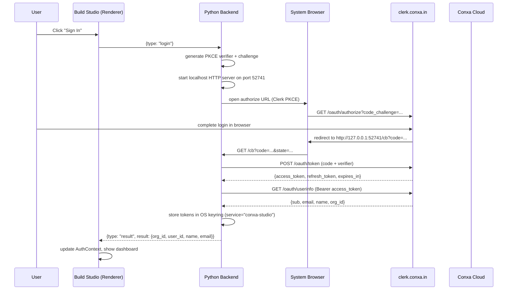
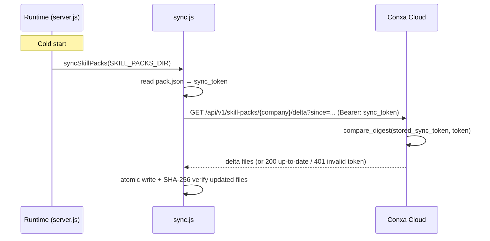
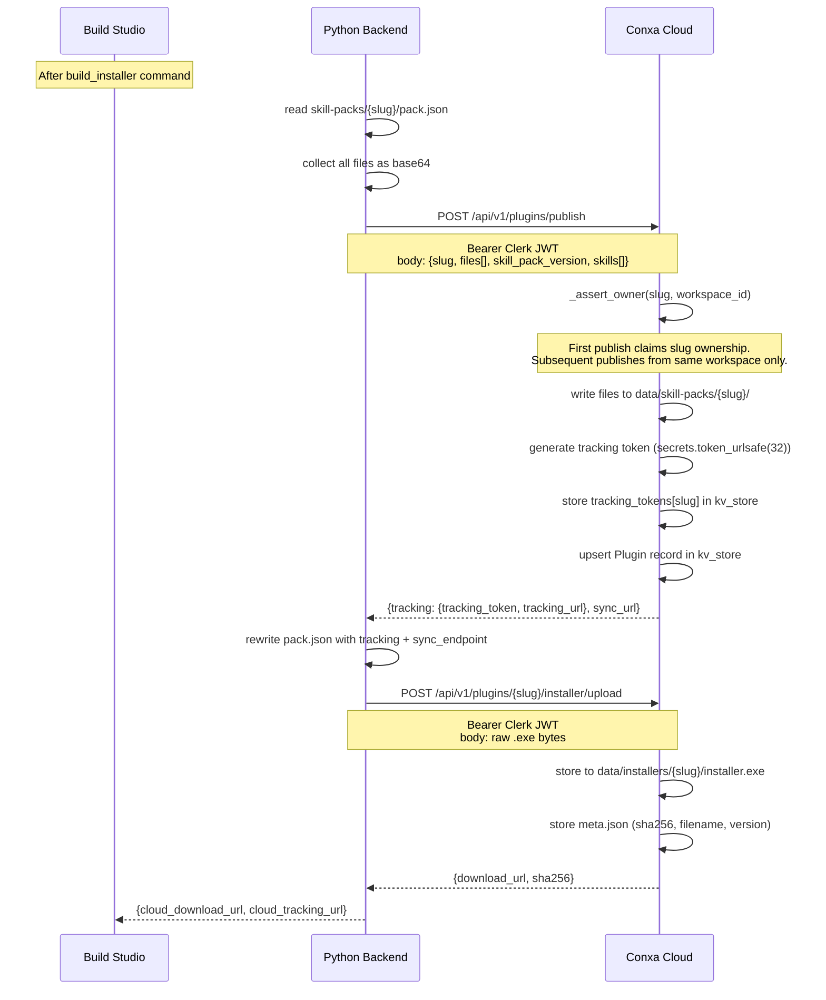
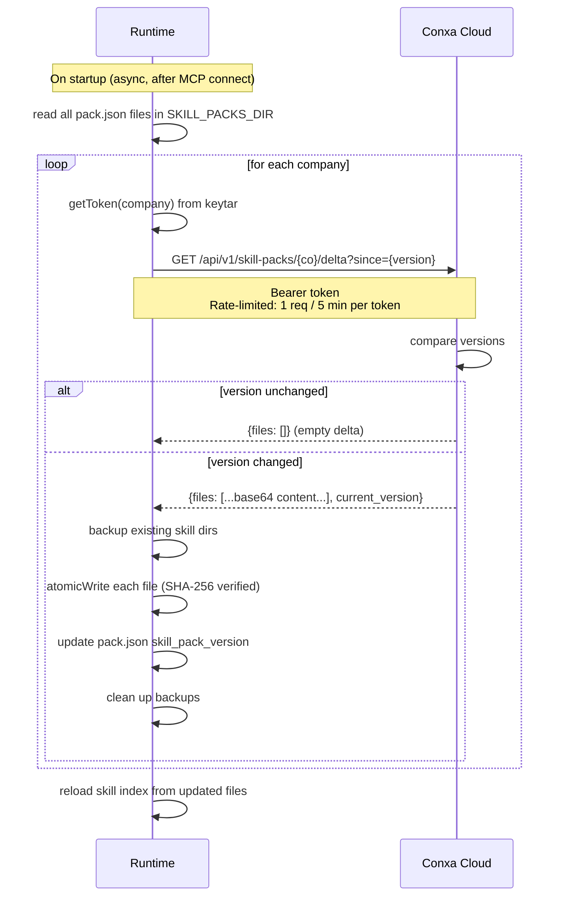
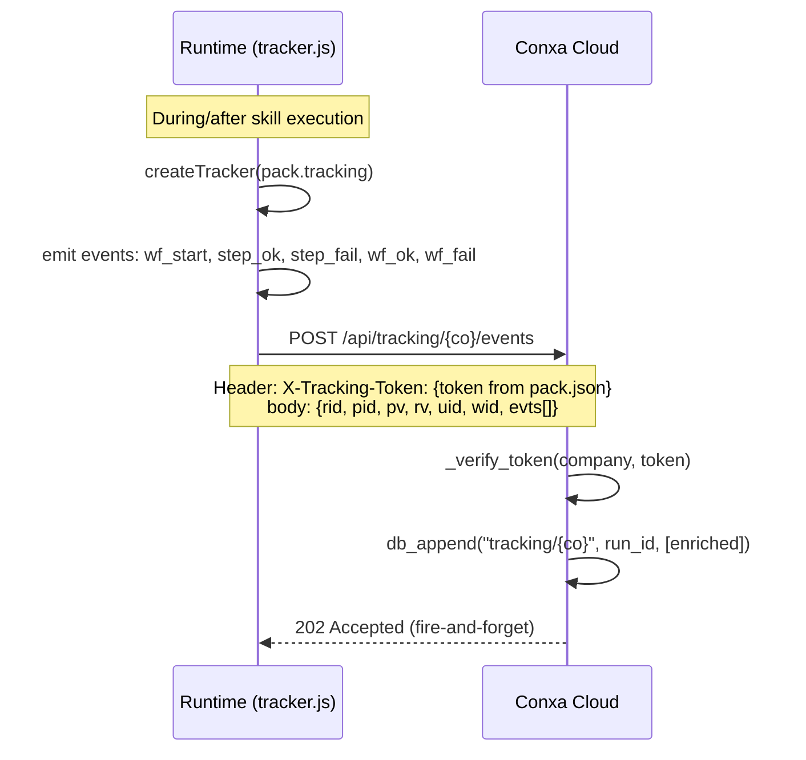
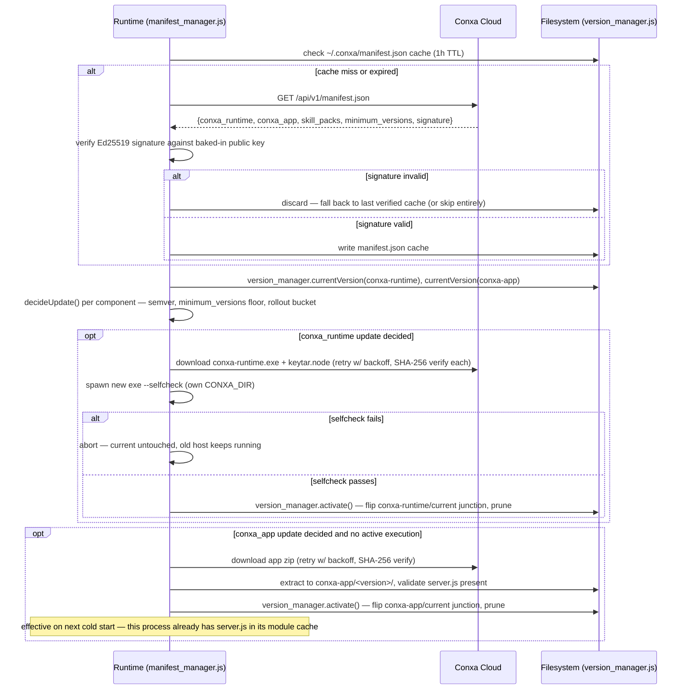

# Technical Reference Document (TRD)

**Status:** Current as of 2026-06-11  
**Scope:** Conxa platform — Build Studio, Conxa Cloud, Runtime

---

## Table of Contents

1. [System Overview](#1-system-overview)
2. [Conxa Build Studio](#2-conxa-build-studio)
3. [Conxa Cloud](#3-conxa-cloud)
4. [Conxa Runtime (MCP)](#4-conxa-runtime-mcp)
5. [Authentication & Platform Communication](#5-authentication--platform-communication)
6. [Recording Pipeline](#6-recording-pipeline)
7. [Compilation Pipeline](#7-compilation-pipeline)
8. [Skill Packaging Pipeline](#8-skill-packaging-pipeline)
9. [Execution Pipeline](#9-execution-pipeline)
10. [Recovery Architecture](#10-recovery-architecture)
11. [Skill Sync & Update Architecture](#11-skill-sync--update-architecture)
12. [Telemetry Architecture](#12-telemetry-architecture)
13. [LLM Router Architecture](#13-llm-router-architecture)
14. [Database & Storage Architecture](#14-database--storage-architecture)
15. [Security Model](#15-security-model)
16. [Deployment Architecture](#16-deployment-architecture)
17. [Known Gaps & Tech Debt](#17-known-gaps--tech-debt)

---

## 1. System Overview

Conxa is a three-tier platform:

```
┌─────────────────────────────────────────────────┐
│         Conxa Build Studio (Windows)            │
│  Electron app + Python stdio backend            │
│  All recording, compilation, packaging          │
│  happens 100% locally — nothing runs on cloud  │
└───────────────────┬─────────────────────────────┘
                    │ HTTPS / Bearer JWT
                    │ (LLM proxy, publish, auth)
┌───────────────────▼─────────────────────────────┐
│           Conxa Cloud                           │
│  FastAPI (Render) + Next.js (Vercel)            │
│  LLM metering proxy, skill pack hosting,        │
│  telemetry ingestion, billing, dashboard        │
└───────────────────┬─────────────────────────────┘
                    │ HTTPS at startup + async
                    │ (skill sync, telemetry out)
┌───────────────────▼─────────────────────────────┐
│           Conxa Runtime                         │
│  Node.js MCP server on end-user machine         │
│  Executes skills via Playwright                 │
│  Exposed to Claude Desktop as MCP tools         │
└─────────────────────────────────────────────────┘
```

**Key principle:** Execution is entirely on the end-user's machine. Conxa is
not in the execution hot path. The cloud is a coordination + telemetry layer.

---

## 2. Conxa Build Studio

### 2.1 Process Architecture

```
┌──────────────────────────────────────────────┐
│  Electron Main Process (electron/main.js)    │
│  • Window lifecycle                          │
│  • IPC bridge (electron/preload.js)          │
│  • Spawns Python backend as child process    │
│  • Deep-link auth callback handler           │
└────────────────┬─────────────────────────────┘
                 │ IPC (contextBridge)
┌────────────────▼─────────────────────────────┐
│  React Renderer (Vite + TypeScript)          │
│  electron/renderer/src/                      │
│  Pages: Dashboard, Plugins, Record,          │
│  HumanEdit, Compile, Build, Settings         │
│  State: Zustand (editorStore.ts)             │
└────────────────┬─────────────────────────────┘
                 │ lib/ipc.ts → window.conxa.send()
┌────────────────▼─────────────────────────────┐
│  Python Backend (python/backend.py)          │
│  stdio JSON-RPC: newline-delimited JSON      │
│  Protocol:                                   │
│    request  → {id, type, payload}            │
│    result   ← {id, type: "result", result}  │
│    error    ← {id, type: "error", code, msg}│
│    event    ← {type: "event", id, ...}       │
│  Threading: one thread per request           │
│  Async loop: background thread for Playwright│
└──────────────────────────────────────────────┘
```

### 2.2 Python Backend Commands

The backend dispatches on `type` field. All commands are in `backend.py`:

| Command | Purpose |
|---|---|
| `ping` | Health check |
| `bootstrap` | First-run dep download (NSIS, runtime binary) |
| `login` / `logout` / `whoami` | Clerk PKCE auth |
| `start_recording` / `stop_recording` | Playwright session lifecycle |
| `get_recording_status` | Live event count |
| `run_pipeline` | Normalize raw events |
| `compile` | Full compile → SkillPackage |
| `create_plugin` / `list_plugins` / `get_plugin` / `delete_plugin` | Plugin CRUD |
| `list_workflows` / `update_workflow` / `delete_workflow` | Workflow management |
| `build_plugin` | Build data-only plugin folder |
| `build_installer` | NSIS installer + cloud publish + upload |
| `test_workflow` | Local runtime test |
| `publish` | Push skill pack to cloud |
| `get_workflow` / `patch_step` / `reorder_steps` / `insert_step` / `delete_step` | Workflow editor |
| `validate_workflow` / `sign_off_workflow` | Quality gate |
| `list_skills` / `get_skill_document` / `delete_skill` / `rename_skill` | Skill library |
| `list_skill_packages` / `list_skill_package_files` | Skill pack browser |
| `list_runs` / `get_run` / `get_metrics` | Run history |
| `get_usage` | LLM proxy quota |

### 2.3 Data Directory Layout (Build Studio)

```
~/.conxa/              (or SKILL_DATA_DIR)
├── plugins/
│   └── {plugin_id}/
│       ├── plugin.json        (Plugin model)
│       └── auth/
│           └── auth.json      (Playwright storageState — NEVER in build output)
├── sessions/
│   └── {session_id}/
│       ├── events.jsonl       (raw RecordedEvent stream)
│       └── screenshots/
├── skills/
│   └── {skill_id}/
│       ├── skill.json         (SkillPackage JSON)
│       └── assets/            (screenshot thumbnails)
├── skill-packs/
│   └── {company_slug}/
│       ├── pack.json          (manifest with sync_endpoint, tracking)
│       └── {skill_slug}/
│           ├── execution.json
│           ├── recovery.json
│           └── inputs.json
├── runs/
│   └── {plugin_id}.jsonl
├── cache/
│   └── sessions/              (staged auth for runtime test)
├── deps/
│   ├── nsis/makensis.exe
│   └── runtime/{ver}/conxa-runtime.exe + keytar.node + runtime-app/
└── kv/                        (filesystem fallback for DB)
```

### 2.4 Bootstrap Flow

On first launch, `services/bootstrap.py` runs `ensure_all()`:

1. Fetches `GET /api/v1/updates/deps-manifest` (public, no auth).
2. Downloads and SHA-256 verifies NSIS zip → extracts to `deps/nsis/`.
3. Downloads and verifies `conxa-runtime.exe` + `keytar.node` → places in `deps/runtime/{ver}/`.
4. Downloads and extracts the app-layer zip (`runtime_app.bundle_url`) → `deps/runtime/{ver}/runtime-app/`.
5. Runs `playwright install chromium` to install the bundled browser.

This is idempotent — already-present deps are skipped.

---

## 3. Conxa Cloud

### 3.1 Architecture

```
Vercel (frontend)                    Render (backend)
──────────────────                   ─────────────────────────
Next.js 16                           FastAPI + uvicorn
conxa-cloud/frontend/                conxa-cloud/backend/
                                     
/app/(marketing)/    ← public site   app/main.py
/app/(protected)/    ← dashboard     app/api/
/app/sign-in/        ← Clerk embed   app/llm/router.py
/app/api/v1/[...]/   ← proxy        app/services/
route.ts             ← proxy to      
                       API_ORIGIN    PostgreSQL (SKILL_DATABASE_URL)
```

### 3.2 API Routes

All under `/api/v1/` except health endpoints:

| Prefix | Description | Auth |
|---|---|---|
| `GET /healthz` | Liveness | Public |
| `GET /readyz` | Readiness (DB ping) | Public |
| `POST /api/v1/llm/proxy/{text,vision}` | Metered LLM proxy | Clerk JWT + X-Conxa-Client header |
| `GET /api/v1/llm/proxy/usage` | Token quota status | Clerk JWT |
| `GET /api/v1/entitlements/current` | Workspace plan and four visible meters | Clerk JWT |
| `POST /api/v1/usage/compile/reserve` | Reserve 1 fresh compile credit | Clerk JWT |
| `POST /api/v1/usage/compile/commit` | Commit a reserved compile credit | Clerk JWT |
| `POST /api/v1/usage/compile/release` | Release an uncommitted compile reservation | Clerk JWT |
| `POST /api/v1/plugins/publish` | Skill pack publish | Clerk JWT |
| `POST /api/v1/plugins/{slug}/installer/upload` | Upload .exe | Clerk JWT |
| `GET /api/v1/installers/{slug}` | Public installer download | Public |
| `GET /api/v1/skill-packs/{co}/delta` | Runtime skill sync — per-skill delta (see below) | Rate-limited; token optional |
| `POST /api/tracking/{co}/events` | Telemetry ingest | Package tracking token |
| `GET /api/v1/tracking/companies` | Company list | Clerk JWT |
| `GET /api/v1/tracking/{co}/runs` | Run summaries | Clerk JWT |
| `GET /api/v1/tracking/{co}/runs/{run_id}` | Run timeline | Clerk JWT |
| `GET /api/v1/tracking/{co}/drift` | Admin drift review queue (aggregated `repair_event`s; admin-gated, no auto-publish) | Clerk JWT |
| `GET /api/v1/updates/deps-manifest` | Bootstrap manifest (Build Studio deps only) | Public |
| `GET /api/v1/manifest.json` | **Unified, Ed25519-signed** runtime update manifest — conxa_runtime, conxa_app, and per-skill versions, compatibility matrix, minimum versions, rollout percentages. Source of truth for `runtime/manifest_manager.js`. Served straight from `manifest` KV (signed once at publish time, not on the read path). | Public |
| `POST /api/v1/admin/component-versions/{component}` | CI (after host/app build) and `publish_routes.py` (after skill publish) write a component's version record here; recomposes + re-signs the full manifest immediately. `component` is `conxa_runtime`, `conxa_app`, or `skill_packs:{company}:{skill}`. | Bearer: `CONXA_ADMIN_TOKEN` |
| `GET /api/v1/updates/conxa-runtime-manifest` | **Deprecated** — thin shim reading the same `component_versions` KV data, kept only for runtimes that haven't picked up the manifest-driven self-updater. | Public |
| `GET /api/v1/updates/conxa-app-manifest` | **Deprecated** — same shim pattern as above. | Public |
| `GET /api/v1/updates/studio-manifest` | Studio download info | Public |
| `GET /api/v1/skill-packs/{company}/delta` | Skill-pack delta sync — `since` is a JSON map of `{skill_slug: last_known_version}`; response is `{skills: [{name, action: "update"|"no_change", version?, files?}]}`. Each skill is compared and shipped independently — republishing one skill never triggers a re-download of the others. Authenticated by installer-embedded sync_token. | Bearer: `pack.json.sync_token`; 401 if invalid |
| `POST /api/v1/telemetry/runtime-start` | Runtime phone-home — stores `runtime_registrations` KV entry per `(company, platform)` | Public (non-critical) |
| `GET /api/v1/telemetry/runtimes` | Runtime registration list for dashboard (active/stale, version distribution) | Clerk JWT |
| `GET /api/v1/audit-events` | Audit log for the authenticated workspace (publish, installer upload, plugin create/delete) | Clerk JWT |
| `POST /api/v1/subscriptions/create` | Create Razorpay subscription (`subscription_id`, `plan_id`, public `key_id`) | Clerk JWT |
| `POST /api/v1/subscriptions/webhooks/razorpay` | Razorpay webhook | Webhook secret HMAC |
| `GET /api/v1/dashboard` | Dashboard data | Clerk JWT |
| `GET /api/v1/plugins` | Plugin list | Clerk JWT |
| `GET /api/v1/runs` | Run list (local) | Clerk JWT |
| `GET /api/v1/jobs/{job_id}` | Job status | Clerk JWT |

### 3.3 Authentication Middleware

`app/api/security.py` — `ProductionRequestMiddleware`:

1. Attaches a request ID to every request.
2. Enforces body size limits (1MB general; 250MB for publish/upload).
3. When `SKILL_AUTH_REQUIRED=true`:
   - Extracts `Authorization: Bearer <token>`.
   - Verifies against Clerk JWKS (`SKILL_CLERK_JWKS_URL`).
   - Attaches `request.state.auth` with subject, org_id, claims.
4. Public paths bypass auth: health endpoints, installer downloads, update manifests, telemetry ingest, skill-pack delta GETs.

### 3.4 Workspace / Principal Model

`app/services/saas.py` provides `Principal`:

```python
@dataclass(frozen=True)
class Principal:
    user_id: str
    workspace_id: str      # org_id from Clerk, or personal_<user_id>
    workspace_slug: str
    workspace_name: str
    role: str              # "owner" | "member" | "admin"
    email: str | None
    name: str | None
    auth_provider: str     # "clerk" | "local"
    identity_source: str
```

In local dev (`SKILL_AUTH_REQUIRED=false`), all requests are treated as a synthetic local principal.

### 3.5 Billing

Razorpay is the wired payment gateway (`app/api/razorpay_routes.py`). Production checkout uses pre-provisioned Razorpay monthly plan IDs for Starter and Pro (`RAZORPAY_STARTER_PLAN_ID`, `RAZORPAY_PRO_PLAN_ID`); runtime checkout must not create Razorpay plans dynamically. Local development can still fall back to dynamic plan creation when those IDs are absent. Subscription verification and Razorpay activation/charge webhooks persist `current_period_end` from Razorpay's next-charge timestamp (`charge_at`, falling back to `current_end`) so paid usage windows reset on the monthly payment date. The config has orphaned `stripe_*` fields — these are **not wired** in any route handler (see §17).

---

## 4. Conxa Runtime (MCP)

### 4.1 Process Model

The runtime uses a **split architecture** — a large infrequent host binary and a small frequently-updated app layer:

```
Claude Desktop (host)
        │  MCP stdio transport
        ▼
conxa-runtime.exe  ← host layer (Node.js + all npm deps + bootstrap.js, ~85 MB, updated quarterly)
        │  loads from disk
        ▼
~/.conxa/conxa-app/server.js  ← app layer (obfuscated JS, ~60 KB zip, updated every release)
        │
        ├── @modelcontextprotocol/sdk  (bundled in host, accessed via global.__hostRequire bridge)
        ├── run.js                    (step executor)
        ├── skill_loader.js           (skill registry)
        ├── sync.js                   (skill pack sync)
        ├── auth_manager.js           (token + session management)
        ├── browser.js                (Playwright browser lifecycle)
        └── tracker.js                (telemetry event emission)
```

`bootstrap.js` (bundled in host): resolves `conxa-app/current` (a directory junction — see §4.4) via `version_manager.resolveCurrent()`, checks that version's `version.json` for `min_host` compatibility, then loads its `server.js`. On failure, calls `version_manager.rollback()` to flip `current` back to the previously-retained version and retries — no re-download needed, since old versions are never deleted until pruned by retention. App-layer files are obfuscated JS (self-defending, string-array rc4) — not human-readable on disk, but no V8 bytecode dependency on the host's exact Node build.

> **Why not bytecode?** `@yao-pkg/pkg` embeds its own prebuilt Node24 base, whose V8 build differs from official nodejs.org Node 24.x. `bytenode`'s `fixBytecode` overwrites the header bytes that reveal the mismatch, so `cachedDataRejected` never fires — but the deserialization segfaults silently (0xC0000005, no stderr). Obfuscated plain JS eliminates this coupling permanently.

### 4.2 MCP Tools

Defined in `server.js` `_toolDefinitions()`:

| Tool | Description |
|---|---|
| `list_skills` | List installed skills, optionally filtered by company |
| `execute_skill` | Execute a single workflow skill |
| `execute_sequence` | Execute an ordered list of skills in one browser session |
| `get_skill_inputs` | Return input schema for a skill |
| `get_execution_status` | Status of current execution |
| `cancel_execution` | Stop the running execution |
| `refresh_skills` | Force immediate skill pack sync |
| `get_runtime_status` | Runtime diagnostics (non-mutating) |

### 4.3 Startup Sequence

```mermaid
sequenceDiagram
    participant CD as Claude Desktop
    participant RT as bootstrap.js (host)
    participant App as conxa-app/server.js
    participant Cloud as Conxa Cloud

    CD->>RT: spawn conxa-runtime\current\conxa-runtime.exe (MCP stdio)
    RT->>RT: version_manager.resolveCurrent(conxa-app) → check min_host compatibility
    RT->>App: require conxa-app/current/server.js (or rollback to previous version)
    App->>App: resolve CONXA_DIR, CONXA_DATA_DIR
    App->>App: load skill index from cache (SKILL_PACKS_DIR)
    App->>CD: MCP connect (StdioServerTransport)
    par Startup sync (parallel)
        App->>Cloud: GET /api/v1/manifest.json (cached 1h; Ed25519-verified against baked-in public key)
        Cloud-->>App: {conxa_runtime, conxa_app, skill_packs, signature}
        App->>App: manifest_manager.checkForUpdates() — decide per component (version, rollout %, min_versions)
        App->>App: if conxa_app newer → download zip, verify SHA-256, extract to conxa-app/<version>/, activate()
        App->>App: if conxa_runtime newer → download files, --selfcheck the new exe, activate() (never touches the running process's own file)
        and
        App->>Cloud: GET /skill-packs/{co}/delta?since={per-skill version map} (skipped if synced <5min ago)
        Cloud-->>App: {skills: [{name, action, version?, files?}]}
        App->>App: per changed skill → parallel file downloads → write to <skill>/<version>/ → activate()
    end
    App->>App: syncState.complete = true; reload skill index
    App->>CD: sendToolListChanged()
    App->>Cloud: POST /api/v1/telemetry/runtime-start (fire-and-forget)
```

**Execution gate:** `execute_skill` awaits `startupSync` before running. Both skill-pack sync and the unified manifest check must complete (or fail gracefully) before any workflow executes. On a normal connection this resolves in under 1 second. Failures fall through to cached data — the user is never permanently blocked. Manifest signature failures are treated identically to network failures: the last previously-verified cached manifest is used, or the check is skipped entirely on first run.

### 4.4 Skill Pack Directory Layout (Runtime)

Every updateable component — the host exe, the app layer, and each individual skill —
is a **versioned directory** with a `current` directory junction pointing at the active
version (see `runtime/version_manager.js`). Old versions are retained (default: current +
2 previous) so rollback never needs a re-download; junctions are used (not JSON pointer
files) because Claude Desktop's MCP config stores a literal filesystem path to the host
exe, which only the OS itself can resolve transparently — a junction is the one mechanism
that works without requiring admin rights or Developer Mode.

```
~/.conxa/                       (CONXA_DIR)
├── conxa-runtime/
│   ├── v1.0.0/, v1.1.0/         (each: conxa-runtime.exe, keytar.node, version.json)
│   └── current                 (directory junction → the active version)
├── conxa-app/                  (app layer — hot-synced, effective on next cold start)
│   ├── v1.0.0/, v1.1.0/         (each: server.js, sync.js, run.js, browser.js,
│   │                             auth_manager.js, tracker.js, skill_loader.js,
│   │                             install_identity.js, version_manager.js,
│   │                             manifest_manager.js, version.json)
│   └── current                 (directory junction → the active version)
├── manifest.json                (locally cached copy of the last Ed25519-verified signed manifest)
├── chromium/                   (Playwright browser — unversioned, external)
├── skill-packs/
│   └── {company}/
│       ├── pack.json           (company metadata: sync_endpoint, sync_token — no shared version)
│       └── {skill_slug}/
│           ├── v1.0.0/, v1.1.0/  (each: execution.json, recovery.json, inputs.json,
│           │                      manifest.json, validation.json, version.json)
│           └── current           (directory junction, independent per skill)
└── logs/
    ├── runtime.log             (JSONL, rotated at 10MB)
    └── recovery.log            (recovery event log, rotated at 10MB)

%APPDATA%/Conxa/               (CONXA_DATA_DIR)
├── cache/
│   ├── sessions/
│   │   ├── {co}_state.json             (AES-256-GCM encrypted storageState)
│   │   ├── {co}_raw_state.json         (plaintext fallback)
│   │   └── {co}_auth_meta.json
│   └── manifests.json                  (skill index fast-load cache)
└── data/
    ├── executions/{id}/
    │   ├── state.json
    │   └── checkpoint.json
    └── runs/{plugin}.jsonl
```

---

## 5. Authentication & Platform Communication

### 5.1 Authentication Systems Summary

| System | Auth Mechanism | Token Storage | Identity Provider |
|---|---|---|---|
| Build Studio | Clerk PKCE OAuth | OS keyring (`keyring` lib) | Clerk (clerk.conxa.in) |
| Cloud (API) | Clerk JWT verification | N/A (stateless) | Clerk JWKS |
| Cloud (Frontend) | Clerk Next.js SDK | Clerk session cookie | Clerk |
| Runtime | Per-company opaque token | OS keychain (`keytar`) | Conxa Cloud (POST /auth/refresh) |

### 5.2 Build Studio Login Flow



**Token lifecycle:** Tokens are refreshed transparently in `auth_service.get_token()` when within 60 seconds of expiry using the stored `refresh_token`. Stored in OS credential manager (Windows Credential Manager / macOS Keychain / Linux Secret Service via the `keyring` Python library).

### 5.3 Cloud API Authentication

Every protected API call from the Build Studio:
1. Calls `auth_service.get_token()` — returns a valid Clerk `access_token`.
2. Sets `Authorization: Bearer <token>` header.
3. Cloud middleware (`ProductionRequestMiddleware`) verifies JWT via PyJWT + JWKS.
4. Attaches `request.state.auth` with `subject`, `org_id`, `claims`.
5. `principal_from_request()` in `saas.py` constructs a `Principal` object for RBAC.

### 5.4 Runtime Sync Token (per-company, installer-embedded)

The runtime uses an **installer-embedded sync token** for all Conxa Cloud communication (skill-pack delta fetches). End users never interact with Conxa auth — they only log into their own target platform.

#### 5.4.1 Token lifecycle

The sync token is a `secrets.token_urlsafe(32)` string minted **at publish time** and stored server-side in the `sync_tokens` KV namespace keyed by company slug. It is stable across republishes (reused if present) and can be rotated by deleting the KV entry.

**Publish → installer flow:**

```
Build Studio publishes skill pack
  → POST /api/v1/plugins/publish
  → cloud mints sync_token (publish_routes._sync_token())
  → sync_token written into cloud-side pack.json
  → publish response returns sync_token
  → Build Studio writes sync_token into local pack.json (backend.py)
  → installer_builder stages pack.json verbatim into NSIS
  → installer ships pack.json to $PROFILE\.conxa\skill-packs\{company}\
```

`installer_builder.py` guards that `pack.json` has `sync_token` before staging — build fails fast if the pack was never published.

#### 5.4.2 Runtime sync

On every cold start, `sync.js:_doSync()` reads `pack.sync_token` directly from the on-disk `pack.json` and sends it as `Authorization: Bearer` to the delta endpoint. No keytar lookup, no user login.



`GET /api/v1/skill-packs/{company}/delta` is in `PUBLIC_SKILL_PACK_SYNC_PREFIXES` so middleware does not apply — the handler validates the sync token directly. In local dev (`SKILL_AUTH_REQUIRED=false`) validation is skipped.

#### 5.4.3 Session encryption (per-machine key)

When executing a skill the runtime loads the target-platform Playwright `storageState` (browser cookies/localStorage). It is encrypted at rest with AES-256-GCM using a **per-machine** key derived via HKDF (`auth_manager.js:_deriveKey()`). The key is a 32-byte random value generated on first use per company and stored in the OS keychain via keytar (service `conxa-session`).

This decouples session encryption from the sync token: a leaked installer exposes the sync token (granting read-only access to that company's skill packs) but **cannot decrypt any user's session file** since the encryption key is machine-specific.

### 5.5 Skill Publishing Flow



### 5.6 Skill Sync Flow (Runtime → Cloud)



**CURRENT STATE gap:** The delta endpoint ships **all files** when the version differs — no per-file checksum diffing. Each delta call transfers the entire skill pack regardless of what changed. Code comment in `skillpack_update_routes.py`: `"Simplified implementation"`.

### 5.7 Telemetry Flow



Telemetry is compact: short event codes (`wf_start`, `wf_ok`, `wf_fail`, `step_ok`, `step_fail`, `recovery_tier{1-5}`), timestamps, and step indices. The tracking token is embedded in `pack.json` at publish time and never requires the end-user to authenticate.

### 5.8 Runtime Self-Update Flow

The runtime is driven by **one Ed25519-signed manifest** (`GET /api/v1/manifest.json`) instead of separate unsigned per-layer endpoints. `runtime/manifest_manager.js` fetches it, verifies the signature against a public key baked into the host exe at build time (same stamping mechanism as `HOST_VERSION`), and decides — independently for `conxa_runtime` and `conxa_app` — whether to update, using semver comparison, the `minimum_versions` floor (forces an update regardless of rollout), and a deterministic rollout bucket (`sha256(install_id + component_name) mod 100 < rollout.percentage`, stable across polls so a staged rollout doesn't reshuffle who's "in" every check). A manifest that fails signature verification is discarded outright — treated exactly like a network failure, never partially trusted.

Every component is a **versioned directory** managed by `runtime/version_manager.js` (see §4.4): `activate()` validates the new version, flips the `current` junction, and prunes old versions beyond retention (default: current + 2 previous) while protecting whichever version was live immediately before the activation, so a same-run rollback never needs a re-download. `rollback()` simply flips `current` back — no download.

**App layer** — downloads a zip, extracts to `conxa-app/<version>/`, validates `server.js` is present, `activate()`s. Since `server.js` is already `require()`'d into the running process's module cache, this only takes effect on the *next* cold start — flipping the junction has zero effect on the currently executing code.

**Host layer** — downloads `conxa-runtime.exe` + `keytar.node` into their own `conxa-runtime/<version>/` directory (never touching whatever file the *currently running* process loaded from — a structural improvement over the old flat-file layout, which needed a `update.bat`/`--selfcheck`/rename-over-running-exe dance specifically because the new and old files used to share one path). Before activating, the new exe is spawned once with `--selfcheck` (own environment, own `CONXA_DIR`) — if it doesn't exit 0, activation is aborted and `current` is left untouched, regardless of whether the SHA-256 checksum matched (a checksum only proves the download wasn't corrupted, not that the binary actually boots).



**`--install-playwright` behaviour:** Uses `playwright-core/cli` bundled inside `conxa-runtime.exe` (no system npm/npx dependency). Idempotent — exits immediately if the correct Chromium revision is already on disk. Runs through `conxa-runtime/current/conxa-runtime.exe` so it always exercises whatever version is actually active.

### 5.9 Data Ownership Summary

| Data | Owner | Storage Location |
|---|---|---|
| Plugin metadata (local) | Build Studio | `data/plugins/{id}/plugin.json` |
| Auth session (Playwright state) | Build Studio (LOCAL ONLY) | `data/plugins/{id}/auth/auth.json` |
| Raw recorded events | Build Studio | `data/sessions/{id}/events.jsonl` |
| Compiled skills | Build Studio | `data/skills/{id}/skill.json` |
| Built skill packs | Build Studio | `data/skill-packs/{co}/` |
| Published skill packs | Conxa Cloud | `data/skill-packs/{co}/` on Render (fast-path cache) + `kv_store` (`skillpack_files__{co}` namespace, durable) |
| Installer binaries + version history | Conxa Cloud | `data/installers/{co}/` on Render (fast-path cache) + `kv_store` (`installer_versions__{co}` namespace, durable) |
| Tracking tokens | Conxa Cloud | `kv_store` table (tracking_tokens namespace) |
| Slug ownership | Conxa Cloud | `kv_store` table (publish_owners namespace) |
| Telemetry / run events | Conxa Cloud | `kv_store` table (tracking/{co} namespace) |
| Runtime skill packs | End-user machine | `~/.conxa/skill-packs/` |
| Runtime auth tokens | End-user machine | OS keychain (keytar) |
| Runtime browser sessions | End-user machine | `~/.conxa/cache/sessions/` |

**Render disk durability:** the `conxa-api` web service runs on Render's free plan (`render.yaml`), which has no persistent disk and wipes the container filesystem on idle-timeout or redeploy. Local disk under `data/skill-packs/` and `data/installers/` is therefore a fast-path cache only — `publish_routes.py` and `skillpack_update_routes.py` write every published skill-pack file and every installer version (including binary content, base64-encoded) to the existing Postgres-backed KV store (`installer_versions__{slug}`, `skillpack_files__{slug}` namespaces) as the durable source of truth, and rehydrate local disk from there on cache miss (e.g. `_load_installer_from_db`, `_ensure_skill_pack_on_disk`). This closes the gap where a disk wipe between two installer uploads made the older version unrecoverable.

---

## 6. Recording Pipeline

**Location:** `conxa-builder/python/conxa_compile/recorder/`

### 6.1 Capture

`session.py` — `RecorderSession` wraps a Playwright browser context:

1. Playwright launches Chromium with stored auth (`storageState`).
2. `bridge.js` is injected into every frame (including iframes) via `page.addInitScript`.
3. Bridge captures: `click`, `dblclick`, `right_click`, `type`, `fill`, `focus`, `select`, `select_option`, `set_checkbox`, `set_radio`, `date_pick`, `drag_drop`, `keyboard_shortcut`, `upload`, `navigate`, `scroll`, `tab_open`, `tab_switch`, `popup`, `frame_enter`, `frame_exit`, `dialog_appeared`, `dialog_accept`, `dialog_dismiss`.
4. Each event carries: `action`, `url`, `frame` (iframe chain), `target` (element signals), `value`, `ts`.
5. `frame_extractor.py` walks the iframe parent chain to accumulate page-level bounding box offsets.
6. Events stream to `session_events.py` which appends to `events.jsonl`.

### 6.2 Iframe Chain Preservation

Every recorded event carries a `frame` object with:
- `src` — iframe src URL
- `frame_id` — Playwright frame ID
- `parent_chain` — ordered list of parent frame IDs

This chain is preserved verbatim through compile and execution. Bounding boxes are page-level (offsets accumulated up the chain during recording).

---

## 7. Compilation Pipeline

**Location:** `conxa-builder/python/conxa_compile/`

### 7.1 Pipeline Stages

```
events.jsonl (raw RecordedEvents)
        │
        ▼  pipeline/normalize.py
        │  • Canonicalize action types
        │  • Filter noise events
        │  • Resolve frame references
        │
        ▼  pipeline/dedupe.py
        │  • Remove duplicate consecutive events
        │  • Collapse rapid-fire clicks
        │
        ▼  pipeline/enrich.py
        │  • Add DOM snapshot refs
        │  • Augment with surrounding text context
        │  • Compute visibility signals
        │
        ▼  pipeline/selectors.py
        │  • Extract raw selector candidates from recorded DOM
        │
        ▼  compiler/build.py:compile_skill_package()
           │
           ├── LLM: intent_llm.py → WorkflowIntentGraph (one call per workflow)
           │
           ├── For each step:
           │   ├── identity_bundle.py → IdentityBundle (deterministic, zero-LLM)
           │   │   generate_deterministic_signals() produces Playwright-native signals
           │   │   ranked by durability. LLM is never asked to write a selector string.
           │   ├── anchor_vision_llm.py → relational anchor phrases (optional)
           │   ├── validation_planner.py → Assertion[]
           │   ├── recovery_policy.py → RecoveryBlock
           │   └── confidence/layered.py → confidence score
           │
           └── → SkillPackage (models/skill_spec.py)
```

### 7.2 LLM Calls Per Step

All LLM calls route through `conxa_core.llm.get_router()`. In Build Studio, the router singleton is replaced with `LLMProxyClient` which forwards to the cloud's metered proxy. The cloud proxy itself has the multi-provider pool (Groq, Google AI Studio, NVIDIA NIM, etc.).

| LLM Client | Call | Token cost (approx) |
|---|---|---|
| `intent_llm.py` | Per-step intent string + per-workflow intent graph | Low–High |
| `anchor_vision_llm.py` | Per-step relational anchor phrases (if enabled) | Medium (screenshot) |
| `recovery_llm.py` | Per-step recovery block | Medium |

Selector generation is **fully deterministic** — `identity_bundle.py:generate_deterministic_signals()` reads the recorded DOM at compile time and emits Playwright-native-grammar signals ranked by durability. No LLM call is made to produce or score selector strings (SeeAct Finding 3: ~30% hallucination rate for LLM-written selectors). `llm_selector_generator_v2.to_playwright_grammar()` is still used as a pure string-formatting utility by `identity_bundle.py`.

### 7.3 SkillPackage Output Schema

```python
SkillPackage:
  meta: SkillMeta                      # id, version, title, source_session_id
  inputs: list[dict]                   # parameterizable inputs schema
  skills: list[SkillBlock]             # one block per workflow
    └── steps: list[SkillStep]
          action: str | dict            # action type + params
          intent: str                   # human-readable intent
          element_fingerprint: ElementFingerprint
            role, tag, inner_text, aria_label, name,
            placeholder, label_text, data_testid,
            input_type, css_class_tokens, anchor_phrases,
            position_hint
          compiled_selectors: list[str] # ranked CSS/XPath selectors
          validation: ValidationBlock
            assertions: list[Assertion] # url_pattern, selector_present, etc.
          recovery: RecoveryBlock
            intent, anchors, strategies, confidence_threshold
          semantic_description: str
          snapshot_ref: str             # DOM snapshot blob ref
  intent_graph: WorkflowIntentGraph    # goal, steps, decision_points
  compile_report: dict                  # status, steps_total, min_confidence
```

---

## 8. Skill Packaging Pipeline

**Location:** `conxa-builder/python/conxa_compile/plugin_builder.py`

After compilation, `build_plugin()` produces a data-only plugin folder:

```
output/skill_package/{company}-plugin/
├── plugin.json          (manifest: slug, name, target_url, skills[])
├── CLAUDE.md            (rendered from plugin_templates/plugin/Claude.md.tmpl)
├── index.md             (rendered from plugin_templates/plugin/index.md.tmpl)
├── pack.json            (version manifest)
└── skills/
    └── {skill_slug}/
        ├── execution.json   (compiled steps + selectors)
        ├── recovery.json    (recovery blocks + anchors)
        └── inputs.json      (input schema)
```

**Invariant:** Auth files (`auth.json`) are NEVER placed in the build output. The `build_installer` command explicitly checks and refuses if `auth.json` is found under the skill pack dir.

The installer (`installer_builder.py`) wraps this with NSIS to produce a per-user `.exe` (no UAC) that:
1. Installs the skill pack to `$PROFILE\.conxa\skill-packs\{company}\`.
2. Installs `conxa-runtime.exe` + `keytar.node` + `conxa-app\` (pre-extracted app layer) to `$PROFILE\.conxa\`.
3. Installs Chromium to `$PROFILE\.conxa\chromium\` (via `conxa-runtime.exe --install-playwright`, run with `CONXA_DIR` set explicitly to `$PROFILE\.conxa` so it lands in the same place the runtime reads from later).
4. Registers the MCP server by generating a PowerShell script that does a non-destructive JSON merge into `claude_desktop_config.json` (auto-detecting the Microsoft Store/MSIX config path) and into `~/.claude.json` for Claude Code if it already exists, setting `env.CONXA_DIR = $PROFILE\.conxa` on the entry.

---

## 9. Execution Pipeline

**Location:** `runtime/run.js`

### 9.1 Step Execution Loop

For each step in `execution.json`:

```
1. Poll pause signal (control file: allow pause/resume via API)
2. waitForPageLoadAndPace() — adaptive timing, human-like pacing
3. waitForUrlState() — pre-step URL gate (if step.url defined)
4. executeStep() — primary action
   ├── interpolate input variables ({{variable}} substitution)
   ├── resolveStep() — IdentityBundle resolution over the live DOM
   │   ├── Tier 1: deterministic exception ladder over all bundle signals (in-process, zero-token)
   │   ├── Tier 2: a11y re-probe / re-hover / fallback / dialog-scope / fuzzy (in-process, zero-token)
   │   ├── Tier 3: LLM semantic recovery — intent + DOM inventory → Claude (agent-mediated; ceiling ≥ 3)
   │   └── Tier 4: Vision recovery — screenshot → Claude (agent-mediated; ceiling ≥ 3)
   └── withLocator() — perform the action
5. verifyAssertions() — check Assertion[]
   ├── required assertions → halt on failure
   └── advisory assertions → log warning
6. writeCheckpoint() — step-level recovery point
7. tracker.emit() — telemetry event
```

### 9.2 Human-Like Pacing

`CONXA_HUMAN_PACING` (default: enabled) adds randomized delays:

| Action | Delay range |
|---|---|
| click | 180–300ms |
| fill | 100–200ms |
| type | 100–200ms |
| select | 160–260ms |
| focus | 80–160ms |
| scroll | 120–220ms |

After navigation steps: waits for `domcontentloaded` + 600ms observer pause.

---

## 10. Recovery Architecture

### 10.1 Four-Tier Recovery Cascade + Ceiling

When step resolution fails to find the target:

| Tier | Mechanism | LLM Cost | Trigger | Where |
|---|---|---|---|---|
| **T1** | Deterministic exception ladder (re-resolve / scroll / dismiss-overlay / wait-stable/enabled) over all bundle signals | Zero | Always first | `run.js` (in-process) |
| **T2** | a11y re-probe (role+name through the matcher), re-hover, fallback selectors, dialog-scope, fuzzy text | Zero | T1 fails | `run.js` (in-process) |
| **T3** | LLM **semantic** recovery — failed-step intent + live DOM inventory → Claude | Yes (text) | T2 fails | Agent-mediated handoff |
| **T4** | **Vision** recovery — failure screenshot + reference image → Claude | Yes (vision) | T3 insufficient | Agent-mediated handoff |

**Tiers 1–2 are in-process and zero-token** (`run.js:recoverStep`). **Tiers 3–4 are agent-mediated:** when the in-process cascade is exhausted the runtime returns a *structured recovery request* to the MCP client (Claude) — a Tier 3 semantic block (step intent + interactive-element inventory) and a Tier 4 vision block (screenshots) — and the agent resumes by calling `execute_skill` again with a corrected selector. This is the **closing edge** of the cascade.

**Recovery ceiling (`CONXA_MAX_RECOVERY_TIER`, 1–4, default 4).** The zero-token cascade always runs; the env var caps whether the agent-mediated handoff (T3/T4) is offered:
- **Claude / MCP execution → ceiling 4** (default): full cascade; on T2 exhaustion the runtime emits the structured recovery request.
- **Build Studio sandbox → ceiling 2** (`conxa_runtime.py` sets `CONXA_MAX_RECOVERY_TIER=2`): no agent handoff. A step surviving T1/T2 fails deterministically so the compiled pack is judged on its own merits — there is no agent in a headless Studio run to act on a recovery request.

**Closing edge — `step_overrides`.** `execute_skill` accepts `step_overrides: { "<0-based step index>": { "selector": "<Playwright selector>" } }` (keyed by the same index as `resume_from`). On resume the chosen selector is injected via the step's `_explicit_selector` channel (`run.js:applyStepOverrides`), flowing through normal string-mode resolution — frame_chain, gating, and pacing preserved. Overrides are honoured only when the ceiling ≥ 3, so a stray override can never silently rewrite a pack under deterministic Studio test. Without this edge T3/T4 could *describe* a fix but never *apply* one.

**Cross-call page parking (the state-preservation half of the closing edge).** Agent recovery is inherently cross-call (runtime fails → Claude reasons → runtime resumes). If the failed page were torn down, the resume would begin on a blank page and `resume_from` would skip the navigation that established state — so the agent's *correct* selector would act on the wrong page and fail again. On a parkable failure (single run, ceiling ≥ 3, a selector/verify failure that is not auth/cancel), the runtime **parks the live page+context+browser** keyed by skill+company instead of closing it (`server.js:_parkedRecovery`), with a TTL (`CONXA_RECOVERY_PARK_TTL_MS`, default 180s) that closes it if the agent never resumes. When the matching resume-with-override arrives, the runtime adopts the parked page and applies the override to the exact DOM the recovery request described. An unrelated/new run discards any stale park first. Headless browsers are reclaimed by `browser.js`'s per-company idle cache; a visible (`watch`) browser is closed on discard. Events: `recovery_park_created` / `recovery_park_resumed` / `recovery_park_discarded`.

Retry budget: `RETRY_BUDGET_MAX = 3` per (skill, step_index). On exhaustion → `retry_budget_exhausted` event logged, escalate.

Recovery observability: `mcp_connected`, `execute_start`, and `get_runtime_status` all report `max_recovery_tier`; the recovery log records `recovery_ceiling_reached`, `agent_recovery_requested`, and `agent_override_applied` events.

### 10.2 Selector Scoring

The resolver's scoring oracle is `IdentityBundle.fingerprint` (an `ElementFingerprint`) — a stable
identity to score DOM candidates against:
- `data_testid` — highest stability signal
- `aria_label`, `role`, `name` — a11y tree signals
- `inner_text` — visible text (max 120 chars)
- `anchor_phrases` — relational context phrases
- `position_hint` — normalized x/y (0.0–1.0)

Each candidate gets a weighted score; the uniqueness/margin gate (below) decides the winner.

### 10.2a IdentityBundle Resolution (primary runtime path)

`IdentityBundle` is the **single source of truth** for element identity: a durability-ranked,
orthogonality-deduplicated set of `IdentitySignal`s plus the scoring `fingerprint`, `stable_hash`,
`frame_chain`, `shadow_path`, and `guid_like_attrs`. The runtime resolves every step's primary
target through it — there is **no legacy `compiled_selectors` / single-selector primary path**, and
frame roots are driven solely by `identity_bundle.frame_chain`. Packs without an `identity_bundle`
fail fast (recompile required).

- **Compile (`conxa_compile/compiler/identity_bundle.py`, `selector_score.py`,
  `selector_filters.py`):** signals are generated in Playwright native grammar
  (`internal:testid=`, `internal:role=…[name=…]`, `internal:text=`, relational
  `>> right-of=`), scored by `durability = base_durability(engine) × survival_prior ×
  stability_adjustments`, deduplicated to one signal per orthogonality class (test-contract,
  semantic-aria, visible-text, spatial-anchor, structural), and gated by uniqueness-at-compile,
  PII-binding, and an xpath/shadow guard. `stable_hash` (`stable_hash.py`) is
  SHA-256 over tag-path + sorted static attrs + AX name, with dynamic
  (focus/hover/active/animation/`is-*`) classes stripped.
- **Replay (`runtime/resolver.js` + `runtime/resolve_adapter.js`):** the **primary** resolution
  path. `resolve_adapter.js` maps each `IdentitySignal` to a Playwright locator
  (`signalToLocator`: engine → `getByTestId`/`getByRole`/`getByText`/`locator`), pre-gathers
  candidate descriptors per signal (`gatherCandidates`), then hands the pure `resolve()`
  (`resolver.js`) a synchronous map view. `resolve()` walks signals in durability order with a
  strict uniqueness gate — it never blindly takes candidate `[0]`. On multi-match it scores each
  candidate against `fingerprint` and accepts a winner only when its margin over the runner-up
  clears the threshold; otherwise it falls through to the next signal. `stable_hash` is the
  tie-breaker. `run.js` `withLocator(…, PRIMARY, …)` calls `resolveStep()`; a miss/ambiguous throw
  engages the recovery cascade. (Recovery still uses an explicit-selector mode via
  `stepWithSelector`.)
- **GATE (`run.js` `gateLocator`):** before every action — attached → visible → RAF-stable
  (bounding box unchanged across two frames) → enabled (`disabled`/`aria-disabled`). Budget is
  confidence-adaptive. Zero LLM.
- **VERIFY (`run.js` `verifyStep`):** after every action — independent post-condition check of
  the step's compiled assertions (`url_pattern`, `selector_present/absent`, `text_present/absent`).
  A failed *required* assertion descends into recovery; advisory failures are recorded only.

### 10.2b Layer 1 / Layer 2 zero-token recovery

`runtime/recovery.js` adds an exception-classified ladder ahead of the existing cascade:

- **Layer 1 (`classifyException` → `layer1Ladder`):** maps the thrown error to a single
  deterministic remedy — stale → re-resolve, intercepted → dismiss-overlay (Escape),
  out-of-bounds → scroll-into-view, not-stable → wait-stable, not-enabled → wait-enabled — then
  retries the primary selector once.
- **Layer 2:** a11y re-probe, transient retry, **re-hover-then-retry** (walks the precompiled
  `handler_hints.hover_chain` for menu reveals), fallback selectors, dialog scope, fuzzy text.

On any recovery success the runner emits a structured **`repair_event`** (step id, tier, method,
score/margin, `stable_hash`, app-version fingerprint, drift hint). This is **ephemeral per-run
telemetry** — the signed local pack is never mutated; a durable fix is only ever an
admin-reviewed, manually published re-sign (see §10.5).

### 10.5 Drift Flywheel (admin-gated)

`repair_event`s ingest via `POST /tracking/{company}/events` and aggregate into an admin review
queue at **`GET /api/v1/tracking/{company}/drift`** (`_drift_review_queue`), keyed by
(plugin, version, step). **Detection is automatic and fleet-wide; publishing is always
admin-approved, never automatic** — the endpoint surfaces evidence only and marks entries
`needs_review`. No re-sign or fleet push happens without an explicit admin action.

### 10.3 Dialog-Scoped Recovery

If the element is expected inside a dialog, recovery first restricts the search to `[role="dialog"]`, `[role="alertdialog"]`, `[aria-modal="true"]`, `.modal`. Fuzzy fallback expands to the full page if no match.

### 10.4 No-Recovery Steps

`frame_enter` and `frame_exit` actions carry `no_recovery_block`. These are structural markers, not interactive steps, and are never retried.

---

## 11. Skill Sync & Update Architecture

### 11.1 Skill Pack Delta Sync

**Endpoint:** `GET /api/v1/skill-packs/{company}/delta?since={version}`

**CURRENT STATE (simplified):**
- If `current_version == since_version` → return `{files: []}`.
- Otherwise → return ALL files in the skill pack as base64.
- No per-file checksum comparison.
- Rate-limited: 1 request per 5 minutes per token (in-memory `_rate_cache` dict).

**FUTURE STATE:** Per-file SHA-256 comparison against a version manifest. Only changed files transferred. Redis-backed rate limiting.

### 11.2 Atomic File Updates

`sync.js` uses transactional file writes:
1. Backup existing skill dir (`skill_dir.bak`).
2. Write each file to `.tmp` suffix.
3. SHA-256 verify content matches delta entry.
4. Atomic rename `.tmp` → target.
5. On any failure → restore from backup.
6. On full success → delete backups.

### 11.3 Runtime Self-Update

One signed manifest, two components decided independently; see §5.8 for the full sequence diagram.

**App layer** — checked during every cold-start `startupSync` via `GET /api/v1/manifest.json` (1h cache, Ed25519-verified). A zip is downloaded, extracted to `conxa-app/<version>/`, and `version_manager.activate()` flips the `current` junction. Effective on the *next* cold start — this process already has `server.js` in its module cache, so the swap doesn't affect anything mid-flight.

**Host layer** — decided from the same manifest fetch (no separate endpoint or cache). Downloads `conxa-runtime.exe` + `keytar.node` into their own `conxa-runtime/<version>/` directory:

| File | Staged into | Activated by |
|---|---|---|
| `conxa-runtime.exe` | `conxa-runtime/<version>/conxa-runtime.exe` | `--selfcheck` must exit 0, then `version_manager.activate()` flips `conxa-runtime/current` |
| `keytar.node` | `conxa-runtime/<version>/keytar.node` | same activation, no separate step |
| Chromium | N/A (downloaded by Playwright) | `--install-playwright` run through `conxa-runtime/current/conxa-runtime.exe` |

Because the new version lands in its own directory rather than overwriting the currently-running exe's file, activation can happen immediately rather than being deferred to "the next safe restart" — there is nothing to defer. If `--selfcheck` fails, activation is aborted regardless of a matching SHA-256 (a checksum only proves the download wasn't corrupted, not that it boots), and `current` is left pointing at the previous, still-good version.

---

## 12. Telemetry Architecture

### 12.1 Event Schema (compact)

Emitted by `runtime/tracker.js`:

| Event code | When | Fields |
|---|---|---|
| `wf_start` | Workflow begins | `ts`, `tot` (total steps) |
| `step_ok` | Step succeeds | `ts`, `si` (step index), `tier` (recovery tier used) |
| `step_fail` | Step fails | `ts`, `si`, `code` (error code) |
| `recovery_tier{N}` | Recovery attempted | `ts`, `si`, `tier` |
| `wf_ok` | Workflow succeeds | `ts`, `dur`, `tot`, `rec` (recovered steps) |
| `wf_fail` | Workflow fails | `ts`, `dur`, `fsi` (failed step index), `fc` (failure code) |

### 12.2 Batch Payload

```json
{
  "rid": "run_id",
  "pid": "plugin_id",
  "pv": "plugin_version",
  "rv": "runtime_version",
  "uid": "user_id_hash",
  "wid": "workspace_id",
  "sv": 1,
  "evts": [{"e": "wf_start", "ts": 1717000000, "tot": 5}, ...]
}
```

Header: `X-Tracking-Token: <token from pack.json>`

### 12.3 Storage & Query

- Stored in `kv_store` table under namespace `tracking/{company}`, key = `run_id`.
- `db_append()` appends batches to a JSON array.
- Queried by `tracking_routes.py` — Clerk-authenticated dashboard endpoints.
- Workspace scoping: `_batches_for_principal()` filters by `workspace_id` in batch.

---

## 13. LLM Router Architecture

**Location:** `conxa-cloud/backend/app/llm/router.py`

### 13.1 Provider Pool

The cloud maintains a flat pool of `(provider, endpoint, api_key, text_model, vision_model)` tuples. Multiple keys per provider expand to multiple entries.

Enabled providers (current defaults):
- **Groq** — `llama-3.3-70b-versatile` (text), `llama-4-scout-17b` (vision)
- **Google AI Studio** — `gemini-2.5-flash` (both)
- **NVIDIA NIM** — `llama-4-maverick-17b` (text), `llama-3.2-90b-vision` (vision)

Disabled by default (toggle via env): Cerebras, Together, OpenRouter, Mistral.

### 13.2 Router Behavior

- Round-robin with cooldown: entries that return 429 are cooled for `llm_router_cooldown_secs` (60s default).
- Failover: on error, moves to next entry.
- Max retries: `llm_router_max_retries` (3 default).
- Fast text preference: when `llm_router_prefer_fast_for_text=true`, text calls prefer low-latency providers.

### 13.3 Build Studio → Cloud Proxy

Build Studio's LLM calls go through `services/llm_proxy_client.py`:
- Target: `POST /api/v1/llm/proxy/text` or `/api/v1/llm/proxy/vision`
- Header: `Authorization: Bearer <Clerk access_token>`
- Header: `X-Conxa-Client: build-studio`
- Body includes `usage_class`: `compile` or `human_edit`. Missing values default to `compile` for rollout compatibility.
- Compile LLM calls record compile input/output tokens; Human Edit LLM calls draw from the workspace's monthly Human Edit pool.
- `CloudUnreachable`, `QuotaExceeded`, and stable entitlement errors propagate up to the compiler, which surfaces them as `compile_error` events to the renderer.

### 13.4 Entitlements And Visible Meters

The cloud exposes four customer-visible meters:
- `seats`
- `installer_slots`
- `compile_credits`
- `human_edit_tokens`

Plan defaults:
- `free`: 1 seat, 1 installer slot, 50 compile credits/month, 1M Human Edit tokens/month.
- `starter`: 3 seats, 3 installer slots, 300 compile credits/month, 10M Human Edit tokens/month.
- `pro`: 10 seats, 10 installer slots, 1000 compile credits/month, 50M Human Edit tokens/month.
- `enterprise`: explicit workspace overrides.
- `development`: unlimited.

Legacy `basic` billing records normalize to `starter`. Paid Razorpay workspaces use `billing:<current_period_end_unix>` as the usage period and reset at the next monthly payment timestamp stored on the billing record. Workspaces without a subscription timestamp fall back to the UTC calendar month (`YYYY-MM`) and reset at the first day of the next UTC month.

Fresh compile flow:
1. Build Studio determines the workflow has no `skill_id`.
2. Build Studio calls `POST /api/v1/usage/compile/reserve`.
3. If reservation fails, local compile is blocked before pipeline work starts.
4. Build Studio commits the reservation before the first LLM-bearing compiler stage.
5. If failure occurs before commit, Build Studio calls release. If failure occurs after commit, the credit remains consumed.

Recompile and LLM-assisted Human Edit:
- Existing workflow `skill_id` means no compile-credit reservation.
- Proxied LLM calls use `usage_class="human_edit"`.
- Deterministic editor actions stay available when the Human Edit pool is exhausted.

Installer slots:
- Skill-pack publish does not consume a slot.
- Installer upload consumes a slot only when the slug has no existing installer release for the workspace.
- Same slug, newer version is allowed at the limit. Exact duplicate version is rejected separately.

Seat usage:
- Clerk organization membership is the intended source of truth when an organization is present and `CLERK_SECRET_KEY` is configured for the cloud backend.
- Local/dev falls back to SaaS membership state.
- Hard seat enforcement requires a Conxa-owned invite API or Clerk webhook cleanup.

Stable entitlement error codes:
- `compile_credit_limit_exceeded`
- `human_edit_pool_exceeded`
- `installer_limit_exceeded`
- `seat_limit_exceeded`
- `entitlements_unavailable`
- `invalid_usage_class`

---

## 14. Database & Storage Architecture

### 14.1 KV Store (Primary Abstraction)

`conxa_core/db.py` provides a dual-mode key-value store:

```
Mode 1: PostgreSQL (SKILL_DATABASE_URL set)
  Table: kv_store
    namespace  TEXT        PRIMARY KEY part 1
    key        TEXT        PRIMARY KEY part 2
    data       JSONB
    created_at TIMESTAMPTZ
    updated_at TIMESTAMPTZ

Mode 2: Filesystem (no SKILL_DATABASE_URL)
  data/kv/{namespace}/{sha256(key)}.json
```

Key namespaces in use:
- `plugins` — Plugin model JSON
- `entitlement_usage` — monthly usage row keyed by `workspace_id:YYYY-MM`
- `compile_reservations` — compile-credit reservations keyed by reservation id
- `publish_owners` — slug → workspace_id ownership
- `tracking_tokens` — company → {token, workspace_id, ...}
- `tracking/{company}` — run_id → [event batches]
- `runs` — plugin_id → [run records]
- `selector_cache` — DOM hash → selector candidates

### 14.2 Additional File Storage

Beyond the KV store:
- `data/sessions/{id}/events.jsonl` — raw event stream (append-only)
- `data/sessions/{id}/screenshots/` — PNG screenshots per step
- `data/skills/{id}/skill.json` — compiled SkillPackage
- `data/skill-packs/{co}/` — built plugin folder
- `data/installers/{co}/installer.exe` — uploaded installer binary

### 14.3 Production Database Requirements

In production (`SKILL_AUTH_REQUIRED=true`), the app refuses to start without `SKILL_DATABASE_URL`. The filesystem fallback is **blocked** in production.

---

## 15. Security Model

### 15.1 Current Security Boundaries

| Boundary | Mechanism |
|---|---|
| Cloud API auth | Clerk JWT (RS256, verified via JWKS) |
| Build Studio auth | Clerk PKCE (no implicit flow) |
| Runtime session encryption | AES-256-GCM, key = HKDF(company_token) |
| Telemetry ingest | Package tracking token (secrets.token_urlsafe(32)) |
| Installer download | Public (slug in URL is the only "credential") |
| Skill pack sync | Rate-limited; token optional in local dev |
| Auth file exclusion | Compiler refuses if auth.json found in build input |
| Request body limits | 1MB general; 250MB publish/upload |
| Slug ownership | First publisher claims; workspace-scoped |
| CORS | Explicit allowlist (`SKILL_CORS_ORIGINS`) + Vercel preview regex |

### 15.2 Security Gaps (Current State)

- Sync token is a shared secret across all of a company's end users — a leaked installer grants read-only access to that company's data-only skill packs. Session encryption uses a separate per-machine key so individual users' sessions remain protected.
- Skill pack delta rate limit is in-memory — not persisted across restarts.
- No device registration or runtime instance tracking.
- Installer download is fully public — anyone with the slug URL can download.
- `SKILL_TRACKING_HMAC_SECRET` is optional; without it, telemetry accepts any token.

---

## 16. Deployment Architecture

### 16.1 Cloud Backend (Render)

```
Build root:        conxa-cloud/backend/
Build command:     ./build.sh
  pip install ../../packages/conxa-core
  pip install -r requirements.txt
Start command:     ./start.sh
  uvicorn app.main:app --host 0.0.0.0 --port $PORT
Health check:      GET /healthz (liveness)
Deploy gate:       GET /readyz (DB ping)
System deps:       Aptfile (Playwright/Chromium system packages — not used in cloud, leftover)
Environment:       SKILL_AUTH_REQUIRED=true requires:
  SKILL_DATABASE_URL, SKILL_CLERK_ISSUER, SKILL_CLERK_JWKS_URL,
  SKILL_CORS_ORIGINS, RAZORPAY_KEY_ID, RAZORPAY_KEY_SECRET,
  RAZORPAY_WEBHOOK_SECRET, RAZORPAY_STARTER_PLAN_ID,
  RAZORPAY_PRO_PLAN_ID, + at least one *_API_KEYS
```

### 16.2 Cloud Frontend (Vercel)

```
Project root:      conxa-cloud/frontend/
Build command:     npm run build
Deploy:            next start
Environment:
  NEXT_PUBLIC_CLERK_PUBLISHABLE_KEY
  CLERK_SECRET_KEY
  API_ORIGIN  (points to Render backend)
```

### 16.3 Build Studio (Windows)

Distributed as a `.exe` installer built via `electron-builder` + NSIS. Ships:
- Electron app (Node.js bundled)
- PyInstaller backend bundle (`dist/backend/`)
- Does NOT ship: Chromium, NSIS, conxa-runtime.exe (fetched on first launch via bootstrap)

### 16.4 Runtime (End-User Machine)

Ships inside the company-specific installer produced by Build Studio. Per-user install (no UAC). Installs to:
- Windows: `$PROFILE\.conxa\conxa-runtime.exe` (i.e. `C:\Users\<user>\.conxa\`) plus `conxa-app\` for the pre-extracted app layer
- Mac: `~/.conxa/runtime/runtime` (planned; Mac support is in build scripts but Windows is the primary target)

MCP registration is done by the NSIS installer itself: a generated PowerShell script merges a `conxa` entry directly into `claude_desktop_config.json` (and into `~/.claude.json` for Claude Code, if present), setting `env.CONXA_DIR = $PROFILE\.conxa`. The script auto-detects the Microsoft Store/MSIX config path (`%LOCALAPPDATA%\Packages\Claude_*\LocalCache\Roaming\Claude\`) and falls back to `%APPDATA%\Claude\` otherwise, which avoids MSIX filesystem virtualization issues affecting per-user config paths on Windows (see claude-code issue #26073). An earlier design used a `.mcpb` Desktop Extension instead — that mechanism has been removed and no longer exists in the installer.

---

## 17. Known Gaps & Tech Debt

| Gap | Location | Severity | Notes |
|---|---|---|---|
| Delta sync ships all files | `skillpack_update_routes.py` | Medium | Code comment: "simplified implementation" |
| Sync token is a shared installer secret | `sync_tokens` KV + pack.json | Low | Read-only, single-company scope; per-machine session encryption key mitigates session-file risk |
| Rate limit cache in-memory | `_rate_cache` dict | Medium | Not shared across instances |
| Stripe fields in config | `config.py:stripe_*` | Low | Orphaned; Razorpay is the wired gateway |
| No device/runtime registration | Cloud | High | No visibility into how many runtimes are active |
| No enterprise RBAC enforcement | `app/services/rbac.py` | High | Scaffolded but not wired to routes |
| Runtime auth per-company only | `auth_manager.js` | Medium | No per-user identity at runtime |
| Installer download fully public | `publish_routes.py:get_installer` | Medium | Slug guessing gives access to installer |
| `research/frontend/` is a dead prototype | `research/` dir | Low | Not deployed; delete or document |
| Aptfile has Playwright deps | `conxa-cloud/backend/Aptfile` | Low | Cloud doesn't use Playwright; leftover from old arch |
| `worker.py` scaffold | `app/worker.py` | Low | Queue scaffold, not implemented |
| No CDN/multi-region blob storage | `blob_read_write_token` config | Low | Config field still unwired, but durability gap is closed: installer versions and skill-pack files now persist to Postgres (`installer_versions__{slug}`, `skillpack_files__{slug}` KV namespaces), surviving Render disk wipes. Base64-in-Postgres doesn't scale indefinitely — revisit if installers approach `build_artifact_upload_max_bytes` (250 MB) regularly or DB storage cost/limits become an issue. |
| `selector_cache_ttl_days` | Config | Low | Cache exists but no GC scheduler wired |
