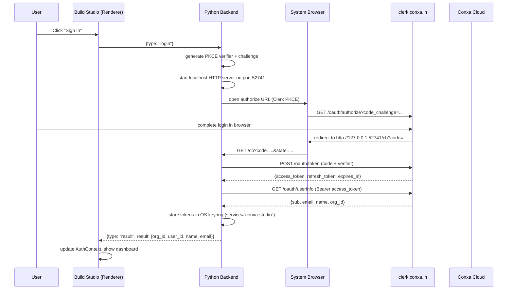
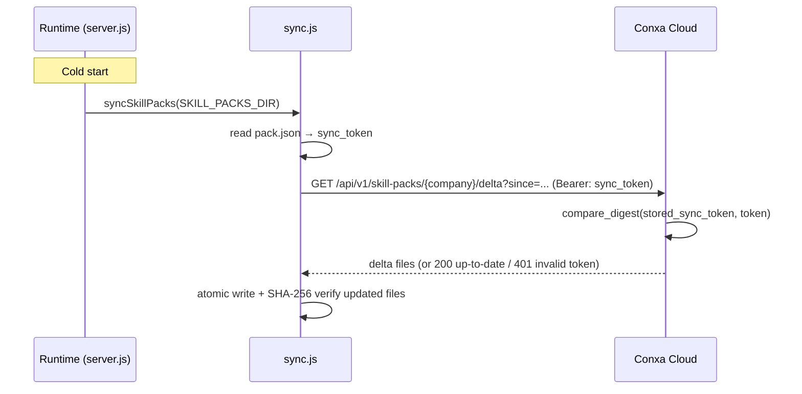
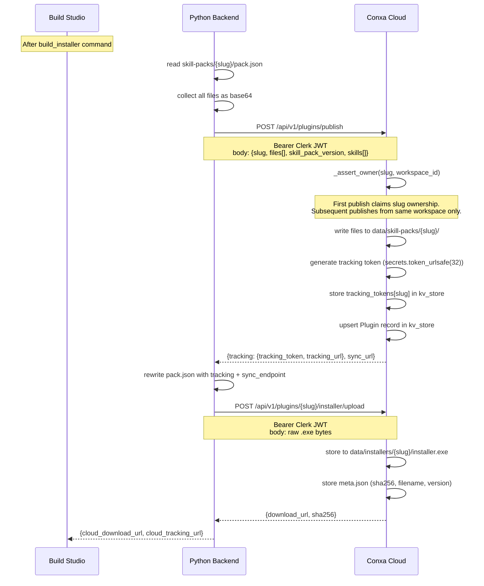
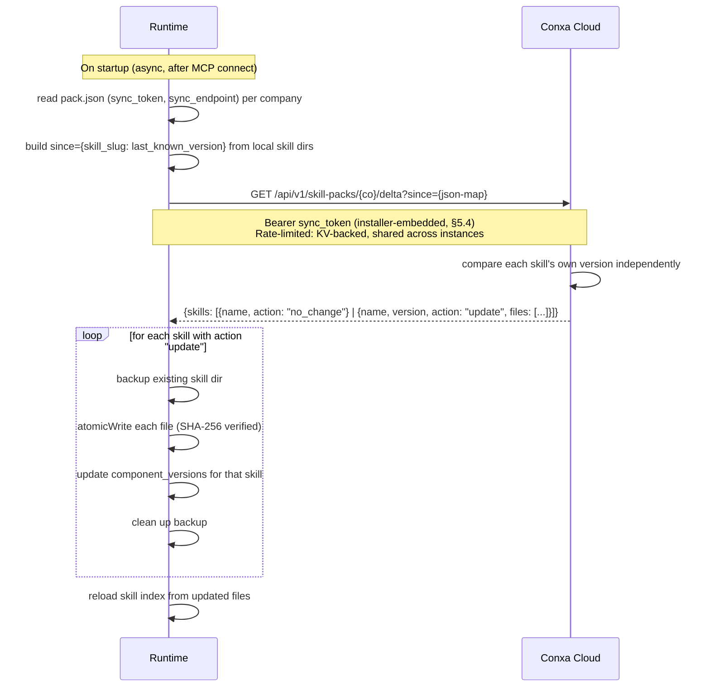
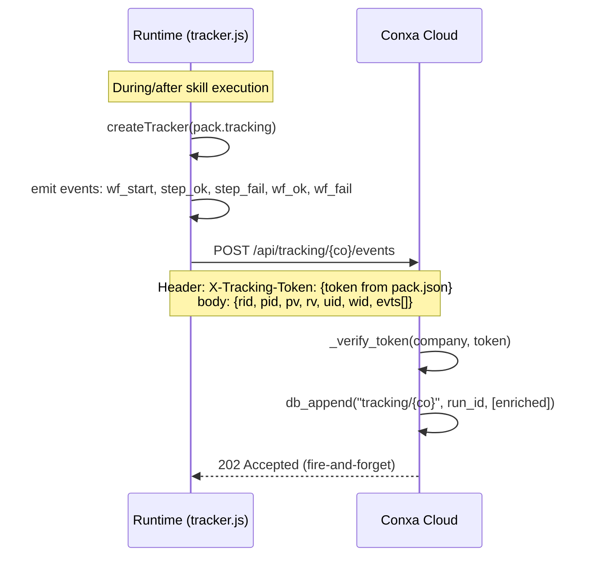
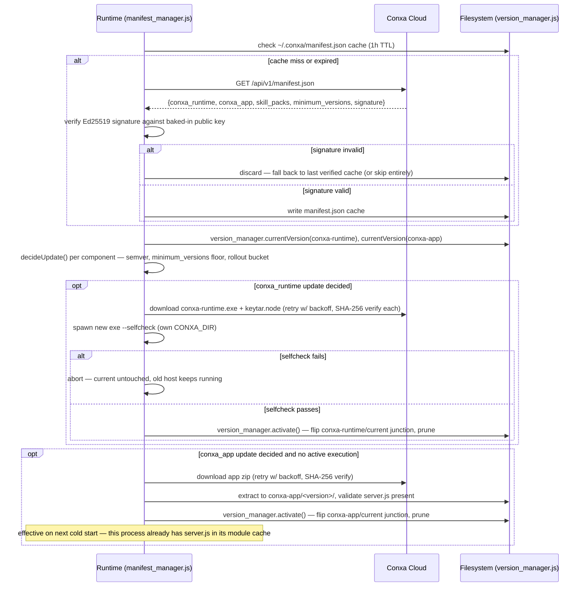

# Technical Reference Document (TRD)

**Status:** Current as of 2026-07-04  
**Scope:** Conxa platform — Build Studio, Conxa Cloud, Runtime

---

## Table of Contents

1. [System Overview](#1-system-overview)
2. [Conxa Build Studio](#2-conxa-build-studio)
3. [Conxa Cloud](#3-conxa-cloud)
4. [Conxa Runtime (MCP)](#4-conxa-runtime-mcp)
5. [Authentication & Platform Communication](#5-authentication--platform-communication)
6. [Recording Pipeline](#6-recording-pipeline)
7. [Compilation Pipeline](#7-compilation-pipeline)
8. [Skill Packaging Pipeline](#8-skill-packaging-pipeline)
9. [Execution Pipeline](#9-execution-pipeline)
10. [Recovery Architecture](#10-recovery-architecture)
11. [Skill Sync & Update Architecture](#11-skill-sync--update-architecture)
12. [Telemetry Architecture](#12-telemetry-architecture)
13. [LLM Router Architecture](#13-llm-router-architecture)
14. [Database & Storage Architecture](#14-database--storage-architecture)
15. [Security Model](#15-security-model)
16. [Deployment Architecture](#16-deployment-architecture)
17. [Known Gaps & Tech Debt](#17-known-gaps--tech-debt)

---

## 1. System Overview

Conxa is a three-tier platform:

```
┌─────────────────────────────────────────────────┐
│         Conxa Build Studio (Windows)            │
│  Electron app + Python stdio backend            │
│  All recording, compilation, packaging          │
│  happens 100% locally — nothing runs on cloud  │
└───────────────────┬─────────────────────────────┘
                    │ HTTPS / Bearer JWT
                    │ (LLM proxy, publish, auth)
┌───────────────────▼─────────────────────────────┐
│           Conxa Cloud                           │
│  FastAPI (Render) + Next.js (Vercel)            │
│  LLM metering proxy, skill pack hosting,        │
│  telemetry ingestion, billing, dashboard        │
└───────────────────┬─────────────────────────────┘
                    │ HTTPS at startup + async
                    │ (skill sync, telemetry out)
┌───────────────────▼─────────────────────────────┐
│           Conxa Runtime                         │
│  Node.js MCP server on end-user machine         │
│  Executes skills via Playwright                 │
│  Exposed to Claude Desktop as MCP tools         │
└─────────────────────────────────────────────────┘
```

**Key principle:** Execution is entirely on the end-user's machine. Conxa is
not in the execution hot path. The cloud is a coordination + telemetry layer.

---

## 2. Conxa Build Studio

### 2.1 Process Architecture

```
┌──────────────────────────────────────────────┐
│  Electron Main Process (electron/main.js)    │
│  • Window lifecycle                          │
│  • IPC bridge (electron/preload.js)          │
│  • Spawns Python backend as child process    │
│  • Deep-link auth callback handler           │
└────────────────┬─────────────────────────────┘
                 │ IPC (contextBridge)
┌────────────────▼─────────────────────────────┐
│  React Renderer (Vite + TypeScript)          │
│  electron/renderer/src/                      │
│  Pages: Dashboard, Plugins, Record,          │
│  HumanEdit, Compile, Build, Settings         │
│  State: Zustand (editorStore.ts)             │
└────────────────┬─────────────────────────────┘
                 │ lib/ipc.ts → window.conxa.send()
┌────────────────▼─────────────────────────────┐
│  Python Backend (python/backend.py)          │
│  stdio JSON-RPC: newline-delimited JSON      │
│  Protocol:                                   │
│    request  → {id, type, payload}            │
│    result   ← {id, type: "result", result}  │
│    error    ← {id, type: "error", code, msg}│
│    event    ← {type: "event", id, ...}       │
│  Threading: one thread per request           │
│  Async loop: background thread for Playwright│
└──────────────────────────────────────────────┘
```

Screenshots and step frames referenced by the workflow editor (`get_workflow`, and every editor mutation response) are **not** embedded in the JSON-RPC payload. `conxa_compile/editor/assets.py::asset_url()` returns a `conxa-asset://local/<relative-path>` URL (validated against `settings.data_dir`, no disk read); `electron/main.js` registers `conxa-asset` as a privileged scheme via `protocol.handle()` and streams the file from `<CONXA_STUDIO_HOME>/data` on demand when the renderer's `` actually requests it. This keeps editor load/save round-trips independent of workflow size — previously every asset was read and base64-inlined synchronously on every response.

### 2.2 Python Backend Commands

The backend dispatches on `type` field. All commands are in `backend.py`:

| Command | Purpose |
|---|---|
| `ping` | Health check |
| `bootstrap` | First-run dep download (NSIS, runtime binary) |
| `login` / `logout` / `whoami` | Clerk PKCE auth |
| `start_recording` / `stop_recording` | Playwright session lifecycle |
| `get_recording_status` | Live event count |
| `run_pipeline` | Normalize raw events |
| `compile` | Full compile → SkillPackage |
| `create_plugin` / `list_plugins` / `get_plugin` / `delete_plugin` | Plugin CRUD |
| `list_workflows` / `update_workflow` / `delete_workflow` | Workflow management |
| `build_plugin` | Build data-only plugin folder |
| `build_installer` | NSIS installer + cloud publish + upload |
| `test_workflow` | Local runtime test |
| `publish` | Push skill pack to cloud |
| `get_workflow` / `patch_step` / `reorder_steps` / `insert_step` / `delete_step` | Workflow editor |
| `validate_workflow` / `sign_off_workflow` | Quality gate |
| `list_skills` / `get_skill_document` / `delete_skill` / `rename_skill` | Skill library |
| `list_skill_packages` / `list_skill_package_files` | Skill pack browser |
| `list_runs` / `get_run` / `get_metrics` | Run history |
| `get_usage` | LLM proxy quota |

### 2.3 Data Directory Layout (Build Studio)

```
~/.conxa/              (or SKILL_DATA_DIR)
├── plugins/
│   └── {plugin_id}/
│       ├── plugin.json        (Plugin model)
│       └── auth/
│           └── auth.json      (Playwright storageState — NEVER in build output)
├── sessions/
│   └── {session_id}/
│       ├── events.jsonl       (raw RecordedEvent stream)
│       └── screenshots/
├── skills/
│   └── {skill_id}/
│       ├── skill.json         (SkillPackage JSON)
│       └── assets/            (screenshot thumbnails)
├── skill-packs/
│   └── {company_slug}/
│       ├── pack.json          (manifest with sync_endpoint, tracking)
│       └── {skill_slug}/
│           ├── execution.json
│           ├── recovery.json
│           └── inputs.json
├── runs/
│   └── {plugin_id}.jsonl
├── cache/
│   └── sessions/              (staged auth for runtime test)
├── deps/
│   ├── nsis/makensis.exe
│   └── runtime/{ver}/conxa-runtime.exe + keytar.node + runtime-app/
└── kv/                        (filesystem fallback for DB)
```

### 2.4 Bootstrap Flow

On first launch, `services/bootstrap.py` runs `ensure_all()`:

1. Fetches `GET /api/v1/updates/deps-manifest` (public, no auth).
2. Downloads and SHA-256 verifies NSIS zip → extracts to `deps/nsis/`.
3. Downloads and verifies `conxa-runtime.exe` + `keytar.node` → places in `deps/runtime/{ver}/`.
4. Downloads and extracts the app-layer zip (`runtime_app.bundle_url`) → `deps/runtime/{ver}/runtime-app/`.
5. Runs `playwright install chromium` to install the bundled browser.

This is idempotent — already-present deps are skipped.

---

## 3. Conxa Cloud

### 3.1 Architecture

```
Vercel (frontend)                    Render (backend)
──────────────────                   ─────────────────────────
Next.js 16                           FastAPI + uvicorn
conxa-cloud/frontend/                conxa-cloud/backend/
                                     
/app/(marketing)/    ← public site   app/main.py
/app/(protected)/    ← dashboard     app/api/
/app/sign-in/        ← Clerk embed   app/llm/router.py
/app/api/v1/[...]/   ← proxy        app/services/
route.ts             ← proxy to      
                       API_ORIGIN    PostgreSQL (SKILL_DATABASE_URL)
```

### 3.2 API Routes

All under `/api/v1/` except health endpoints:

| Prefix | Description | Auth |
|---|---|---|
| `GET /healthz` | Liveness | Public |
| `GET /readyz` | Readiness (DB ping) | Public |
| `POST /api/v1/llm/proxy/{text,vision}` | Metered LLM proxy | Clerk JWT + X-Conxa-Client header |
| `GET /api/v1/llm/proxy/usage` | Token quota status | Clerk JWT |
| `GET /api/v1/entitlements/current` | Workspace plan and four visible meters | Clerk JWT |
| `POST /api/v1/usage/compile/reserve` | Reserve 1 fresh compile credit | Clerk JWT |
| `POST /api/v1/usage/compile/commit` | Commit a reserved compile credit | Clerk JWT |
| `POST /api/v1/usage/compile/release` | Release an uncommitted compile reservation | Clerk JWT |
| `POST /api/v1/plugins/publish` | Skill pack publish (legacy, permanent) — **mandatory**, fails the whole publish on cloud error | Clerk JWT |
| `POST /api/v1/plugins/{installer_version}/{company_slug}/skill-packs/upload` | Skill pack publish (versioned equivalent, §17 row) — same contract/mandatory semantics | Clerk JWT |
| `GET /api/v1/plugins/{installer_version}/{company_slug}/skill-packs/versions` | Skill-pack release history (version, release notes, `is_latest`) — the Skill Pack Publishing page's changelog | Clerk JWT |
| `POST /api/v1/plugins/{slug}/installer/upload` | Upload .exe (legacy, permanent) — **optional**, failure never fails the build (only surfaced as a `cloud_upload_error` field) | Clerk JWT |
| `POST /api/v1/plugins/{installer_version}/{company_slug}/installer/upload` | Upload .exe (versioned equivalent) — same optional semantics | Clerk JWT |
| `GET /api/v1/plugins/generations` | `{current, supported, deprecated}` installer generations — Build Studio stamps `current` into new publishes/builds | Public |
| `POST /api/v1/admin/plugins/generations` | Flip the default generation stamped into new builds (never affects already-installed runtimes) | Bearer: `CONXA_ADMIN_TOKEN` |
| `GET /api/v1/installers/{slug}` | Installer download | Public if `SKILL_INSTALLER_SIGNING_KEY` unset (dev); otherwise requires `ts`+`sig` query params, HMAC-SHA256 signed, 10-min default window (SG-07) |
| `GET /api/v1/skill-packs/{co}/delta` | Runtime skill sync — per-skill delta (see below), legacy permanent route | Rate-limited; token optional |
| `GET /api/v1/plugins/{installer_version}/{company}/skill-packs/delta` | Runtime skill sync, versioned equivalent — identical contract | Rate-limited; token optional |
| `POST /api/tracking/{co}/events` | Telemetry ingest — permanent back-compat alias (also served at `/api/v1/tracking/...` and the versioned `/api/v1/plugins/{installer_version}/{co}/tracking/events`) | Package tracking token |
| `GET /api/v1/tracking/companies` | Company list | Clerk JWT |
| `GET /api/v1/tracking/{co}/runs` | Run summaries | Clerk JWT |
| `GET /api/v1/tracking/{co}/runs/{run_id}` | Run timeline | Clerk JWT |
| `GET /api/v1/tracking/{co}/drift` | Admin drift review queue (aggregated `repair_event`s; admin-gated, no auto-publish) | Clerk JWT |
| `GET /api/v1/updates/deps-manifest` | Bootstrap manifest (Build Studio deps only) | Public |
| `GET /api/v1/manifest.json` | **Unified, Ed25519-signed** runtime update manifest — conxa_runtime, conxa_app, and per-skill versions, compatibility matrix, minimum versions, rollout percentages. Source of truth for `runtime/manifest_manager.js`. Served straight from `manifest` KV (signed once at publish time, not on the read path). | Public |
| `POST /api/v1/admin/component-versions/{component}` | CI (after host/app build) and `publish_routes.py` (after skill publish) write a component's version record here; recomposes + re-signs the full manifest immediately. `component` is `conxa_runtime`, `conxa_app`, or `skill_packs:{company}:{skill}`. | Bearer: `CONXA_ADMIN_TOKEN` |
| `GET /api/v1/updates/conxa-runtime-manifest` | **Deprecated** — thin shim reading the same `component_versions` KV data, kept only for runtimes that haven't picked up the manifest-driven self-updater. | Public |
| `GET /api/v1/updates/conxa-app-manifest` | **Deprecated** — same shim pattern as above. | Public |
| `GET /api/v1/updates/studio-manifest` | Studio download info | Public |
| `GET /api/v1/skill-packs/{company}/delta` | Skill-pack delta sync — `since` is a JSON map of `{skill_slug: last_known_version}`; response is `{skills: [{name, action: "update"|"no_change", version?, files?}]}`. Each skill is compared and shipped independently — republishing one skill never triggers a re-download of the others. Authenticated by installer-embedded sync_token. | Bearer: `pack.json.sync_token`; 401 if invalid |
| `POST /api/v1/telemetry/runtime-start` | Runtime phone-home — stores `runtime_registrations` KV entry per `(company, platform)` | Public (non-critical) |
| `GET /api/v1/telemetry/runtimes` | Runtime registration list for dashboard (active/stale, version distribution) | Clerk JWT |
| `GET /api/v1/audit-events` | Audit log for the authenticated workspace (publish, installer upload, plugin create/delete) | Clerk JWT |
| `POST /api/v1/subscriptions/create` | Create Cashfree subscription (`subscription_id`, `auth_link`, `plan_id`) | Clerk JWT |
| `POST /api/v1/subscriptions/webhooks/cashfree` | Cashfree webhook | Webhook secret HMAC over sorted `cf_`-prefixed fields |
| `GET /api/v1/dashboard` | Dashboard data | Clerk JWT |
| `GET /api/v1/plugins` | Plugin list | Clerk JWT |
| `GET /api/v1/runs` | Run list (local) | Clerk JWT |
| `GET /api/v1/jobs/{job_id}` | Job status | Clerk JWT |

### 3.3 Authentication Middleware

`app/api/security.py` — `ProductionRequestMiddleware`:

1. Attaches a request ID to every request.
2. Enforces body size limits (1MB general; 250MB for publish/upload).
3. When `SKILL_AUTH_REQUIRED=true`:
   - Extracts `Authorization: Bearer <token>`.
   - Verifies against Clerk JWKS (`SKILL_CLERK_JWKS_URL`).
   - Attaches `request.state.auth` with subject, org_id, claims.
4. Public paths bypass auth: health endpoints, installer downloads, update manifests, telemetry ingest, skill-pack delta GETs.

### 3.4 Workspace / Principal Model

`app/services/saas.py` provides `Principal`:

```python
@dataclass(frozen=True)
class Principal:
    user_id: str
    workspace_id: str      # org_id from Clerk, or personal_<user_id>
    workspace_slug: str
    workspace_name: str
    role: str              # "owner" | "member" | "admin"
    email: str | None
    name: str | None
    auth_provider: str     # "clerk" | "local"
    identity_source: str
```

In local dev (`SKILL_AUTH_REQUIRED=false`), all requests are treated as a synthetic local principal.

### 3.5 Billing

Cashfree is the wired payment gateway (`app/api/cashfree_routes.py`, mounted at `/api/v1/subscriptions`; switched from Razorpay 2026-06-30). `POST /create` calls Cashfree's `POST /api/v2/subscriptions/nonSeamless/subscription` server-side and returns an `auth_link` for the frontend to redirect to; the workspace↔subscription↔tier mapping is stored server-side (`cashfree_sub_workspace` KV) since Cashfree webhooks only carry the subscription reference id. `POST /verify` fetches the subscription from Cashfree and resolves the tier from its `planId`. `POST /webhooks/cashfree` verifies the signature by sorting all `cf_`-prefixed payload fields and comparing against the shared webhook secret. Activation/charge webhooks persist `current_period_end` so paid usage windows reset on the monthly payment date. See `docs/Backend-Schema.md` §5.4 for the full request/response contracts. Stripe was previously present as orphaned unwired config fields and has since been fully removed (see §17).

---

## 4. Conxa Runtime (MCP)

### 4.1 Process Model

The runtime uses a **split architecture** — a large infrequent host binary and a small frequently-updated app layer:

```
Claude Desktop (host)
        │  MCP stdio transport
        ▼
conxa-runtime.exe  ← host layer (Node.js + all npm deps + bootstrap.js, ~85 MB, updated quarterly)
        │  loads from disk
        ▼
~/.conxa/conxa-app/server.js  ← app layer (obfuscated JS, ~60 KB zip, updated every release)
        │
        ├── @modelcontextprotocol/sdk  (bundled in host, accessed via global.__hostRequire bridge)
        ├── run.js                    (step executor)
        ├── skill_loader.js           (skill registry)
        ├── sync.js                   (skill pack sync)
        ├── auth_manager.js           (token + session management)
        ├── browser.js                (Playwright browser lifecycle)
        ├── page_scripts.js           (functions run inside the browser page — see below)
        └── tracker.js                (telemetry event emission)
```

`bootstrap.js` (bundled in host): resolves `conxa-app/current` (a directory junction — see §4.4) via `version_manager.resolveCurrent()`, checks that version's `version.json` for `min_host` compatibility, then loads its `server.js`. On failure, calls `version_manager.rollback()` to flip `current` back to the previously-retained version and retries — no re-download needed, since old versions are never deleted until pruned by retention. App-layer files are obfuscated JS (self-defending, string-array rc4) — not human-readable on disk, but no V8 bytecode dependency on the host's exact Node build.

`page_scripts.js` is the one app-layer file obfuscated **without** `--self-defending`/`--string-array` (mangled identifiers only). Every function it exports is one Playwright ships into the browser page via `page.evaluate()`/`locator.evaluate()` (`Function.prototype.toString()`, re-parsed and run outside this Node process). Both of those transforms rewrite a function body to call back into a module-scope decoder/self-defending guard — invisible once the source is re-parsed in the browser realm, so a full-strength build throws `ReferenceError: <mangled-name> is not defined` at the first evaluate() call that runs (silent for evaluate() sites wrapped in try/catch, fatal for `run.js`'s scroll handler, which is not). `run.js`, `server.js`, `resolve_adapter.js`, and `drift.js` call into `page_scripts.js` rather than defining browser-context functions inline — keep it that way; a new inline arrow passed to `page.evaluate()`/`locator.evaluate()` anywhere else in the app layer will reproduce this bug.

> **Why not bytecode?** `@yao-pkg/pkg` embeds its own prebuilt Node24 base, whose V8 build differs from official nodejs.org Node 24.x. `bytenode`'s `fixBytecode` overwrites the header bytes that reveal the mismatch, so `cachedDataRejected` never fires — but the deserialization segfaults silently (0xC0000005, no stderr). Obfuscated plain JS eliminates this coupling permanently.

### 4.2 MCP Tools

Defined in `server.js` `_toolDefinitions()`:

| Tool | Description |
|---|---|
| `list_skills` | List installed skills, optionally filtered by company |
| `execute_skill` | Execute a single workflow skill |
| `execute_sequence` | Execute an ordered list of skills in one browser session |
| `get_skill_inputs` | Return input schema for a skill |
| `get_execution_status` | Status of current execution |
| `cancel_execution` | Stop the running execution |
| `refresh_skills` | Force immediate skill pack sync |
| `get_runtime_status` | Runtime diagnostics (non-mutating) |

### 4.2a MCP Registration (`register-mcp` / `unregister-mcp`)

`conxa-runtime.exe register-mcp` / `unregister-mcp` are **host-exe-layer subcommands**, dispatched in `bootstrap.js` immediately after `env.apply()` — before `version_manager.resolveCurrent()`/the app-layer load, so they work even when no app layer is staged yet (a thin installer ships one before the first app-layer download) and regardless of the app layer's `min_host` check. NSIS calls the subcommand directly (`ExecWait '... register-mcp'`); no config-editing logic lives in the installer template itself.

Files (all host-layer, bundled into the exe via `bootstrap.js`'s static `require()`s — no `pkg.scripts` entry needed for a statically-required path):

| File | Role |
|---|---|
| `mcp_hosts.js` | Data table of JSON-configured hosts (Claude Desktop, Claude Code, Cursor, VS Code, Windsurf, Gemini CLI, Cline, Zed, Copilot CLI, Factory, KiloCode, Antigravity, OpenCode, OpenClaw, Crush, OpenHands, Augment, Kiro, Junie, Qwen). One row per host: `detect(ctx)`, `configPaths(ctx)` (plural — VS Code writes one file per profile, Cline writes two locations), `objectPath`, `shape`. |
| `mcp_hosts_toml.js` | Codex CLI, Mistral Vibe (TOML — `# >>> conxa:<label> >>>` managed marker blocks, no TOML parser dependency). |
| `mcp_hosts_yaml.js` | Goose, Hermes (YAML — `yaml` package's Document API, comment-preserving). |
| `config_edit.js` | JSON/JSONC writer (`jsonc-parser`, so comments/formatting survive on every host, not just the hand-edited ones). Atomic write (temp file, `fsync`, `rename`), ownership check (`isOwned()` — an existing entry is "ours" only if its `command` resolves inside our install root), and a read-immediately-before-write CAS check against a concurrent writer. |
| `config_edit_toml.js` | Marker-block editor for the two TOML hosts. A regular table (`[mcp_servers.conxa]`, Codex) can exist only once — TOML rejects a duplicate definition — so a second one outside our span is treated as foreign; an array-of-tables (`[[mcp_servers]]`, Vibe) legitimately repeats once per server, so the only real conflict is another entry whose own `name` already claims our key. |
| `config_edit_yaml.js` | Document-API editor for the two YAML hosts; no marker needed (YAML mappings hold sibling keys natively, same as the JSON hosts). |
| `mcp_register.js` | Orchestrator: `computeIdentity()` derives the entry key (`conxa` vs `conxa-dev`, from `env.js`'s `dev` flag — see §5.8-adjacent env resolution) and the stable `conxa-runtime/current/conxa-runtime.exe` command path; iterates all three host tables; never aborts the run because one host failed; writes a diagnostic status file (below); sets `process.exitCode` non-zero only if *every detected* host failed. |
| `durable_context.js` | Post-sync discoverability: writes a per-company skill/instructions file (`SKILL.md`, `AGENTS.md`, `global_rules.md`, …) into each *registered* host so the agent actually reaches for the tools. Called from `sync.js` right after `pack.skills` is written — **not** from `register-mcp`, because a thin installer ships `pack.skills` empty (§5.9); there is nothing real to name until the first successful delta-sync. Best-effort; never fails the sync. |

**Ownership is structural, not a hardcoded string.** Because `register-mcp` and `unregister-mcp` derive the entry key from the *same* `env.js` resolution every time, a dev-channel install and a stable-channel install on the same machine write to two distinct keys (`conxa-dev` / `conxa`) that can never drift apart — this replaces an earlier NSIS-generated-PowerShell design where the uninstaller's key was a separate hardcoded literal that fell out of sync with the installer's channel-derived key, leaving a dangling entry behind on dev-channel uninstalls.

`register-mcp --plan` performs every detection/ownership check and prints the machine-readable receipt (what would be written, where) without touching any file — no network, no mutation. `--dry-run` is the same without the JSON dump. `--only <id>[,<id>]` restricts the run to specific host ids.

Every run writes `<CONXA_DIR>\mcp-register-status.txt`: a one-line summary (`conxa register-mcp: 15 ok, 3 not installed, 1 left alone (not ours), 1 FAILED`) followed by per-host detail. NSIS reads the first line into its completion `MessageBox` — this is necessary, not cosmetic: the process exit code is only nonzero when *every* detected host fails, so a partial failure (14 hosts registered, 1 didn't) would otherwise show "Setup complete!" with no indication anything went wrong.

Tests: `runtime/test/test_config_edit.js`, `test_config_edit_toml.js`, `test_config_edit_yaml.js`, `test_mcp_hosts.js`, `test_mcp_register.js`, `test_mcp_register_toml.js`, `test_mcp_register_yaml.js`, `test_durable_context.js` — fixture-driven (`os.tmpdir()` + `USERPROFILE`/`HOME`/`APPDATA`/`LOCALAPPDATA` env overrides so `os.homedir()`-based host detection never touches the real machine running the test). Run via `npm test` (`node --test`, no path argument — an explicit `test/` path argument does not reliably resolve as a directory glob in every environment).

### 4.3 Startup Sequence

```mermaid
sequenceDiagram
    participant CD as Claude Desktop
    participant RT as bootstrap.js (host)
    participant App as conxa-app/server.js
    participant Cloud as Conxa Cloud

    CD->>RT: spawn conxa-runtime/current/conxa-runtime.exe (MCP stdio)
    RT->>RT: version_manager.resolveCurrent(conxa-app) → check min_host compatibility
    RT->>App: require conxa-app/current/server.js (or rollback to previous version)
    App->>App: resolve CONXA_DIR, CONXA_DATA_DIR
    App->>App: load skill index from cache (SKILL_PACKS_DIR)
    App->>CD: MCP connect (StdioServerTransport)
    par Startup sync (parallel)
        App->>Cloud: GET /api/v1/manifest.json (cached 1h; Ed25519-verified against baked-in public key)
        Cloud-->>App: {conxa_runtime, conxa_app, skill_packs, signature}
        App->>App: manifest_manager.checkForUpdates() — decide per component (version, rollout %, min_versions)
        App->>App: if conxa_app newer → download zip, verify SHA-256, extract to conxa-app/<version>/, activate()
        App->>App: if conxa_runtime newer → download files, --selfcheck the new exe, activate() (never touches the running process's own file)
        and
        App->>Cloud: GET /skill-packs/{co}/delta?since={per-skill version map} (skipped if synced <5min ago)
        Cloud-->>App: {skills: [{name, action, version?, files?}]}
        App->>App: per changed skill → parallel file downloads → write to <skill>/<version>/ → activate()
    end
    App->>App: syncState.complete = true; reload skill index
    App->>CD: sendToolListChanged()
    App->>Cloud: POST /api/v1/telemetry/runtime-start (fire-and-forget)
```

**Execution gate:** `execute_skill` awaits `startupSync` before running. Both skill-pack sync and the unified manifest check must complete (or fail gracefully) before any workflow executes. On a normal connection this resolves in under 1 second. Failures fall through to cached data — the user is never permanently blocked. Manifest signature failures are treated identically to network failures: the last previously-verified cached manifest is used, or the check is skipped entirely on first run.

### 4.4 Skill Pack Directory Layout (Runtime)

Every updateable component — the host exe, the app layer, and each individual skill —
is a **versioned directory** with a `current` directory junction pointing at the active
version (see `runtime/version_manager.js`). Old versions are retained (default: current +
2 previous) so rollback never needs a re-download; junctions are used (not JSON pointer
files) because Claude Desktop's MCP config stores a literal filesystem path to the host
exe, which only the OS itself can resolve transparently — a junction is the one mechanism
that works without requiring admin rights or Developer Mode.

```
~/.conxa/                       (CONXA_DIR)
├── conxa-runtime/
│   ├── v1.0.0/, v1.1.0/         (each: conxa-runtime.exe, keytar.node, version.json)
│   └── current                 (directory junction → the active version)
├── conxa-app/                  (app layer — hot-synced, effective on next cold start)
│   ├── v1.0.0/, v1.1.0/         (each: server.js, sync.js, run.js, browser.js,
│   │                             auth_manager.js, tracker.js, skill_loader.js,
│   │                             install_identity.js, version_manager.js,
│   │                             manifest_manager.js, page_scripts.js, version.json)
│   └── current                 (directory junction → the active version)
├── manifest.json                (locally cached copy of the last Ed25519-verified signed manifest)
├── chromium/                   (Playwright browser — unversioned, external)
├── skill-packs/
│   └── {company}/
│       ├── pack.json           (company metadata: sync_endpoint, sync_token — no shared version)
│       └── {skill_slug}/
│           ├── v1.0.0/, v1.1.0/  (each: execution.json, recovery.json, inputs.json,
│           │                      manifest.json, validation.json, version.json)
│           └── current           (directory junction, independent per skill)
└── logs/
    ├── runtime.log             (JSONL, rotated at 10MB)
    └── recovery.log            (recovery event log, rotated at 10MB)

%APPDATA%/Conxa/               (CONXA_DATA_DIR)
├── cache/
│   ├── sessions/
│   │   ├── {co}_state.json             (AES-256-GCM encrypted storageState)
│   │   ├── {co}_raw_state.json         (plaintext fallback)
│   │   └── {co}_auth_meta.json
│   └── manifests.json                  (skill index fast-load cache)
└── data/
    ├── executions/{id}/
    │   ├── state.json
    │   └── checkpoint.json
    └── runs/{plugin}.jsonl
```

---

## 5. Authentication & Platform Communication

### 5.1 Authentication Systems Summary

| System | Auth Mechanism | Token Storage | Identity Provider |
|---|---|---|---|
| Build Studio | Clerk PKCE OAuth | OS keyring (`keyring` lib) | Clerk (clerk.conxa.in) |
| Cloud (API) | Clerk JWT verification | N/A (stateless) | Clerk JWKS |
| Cloud (Frontend) | Clerk Next.js SDK | Clerk session cookie | Clerk |
| Runtime | Per-company opaque token | OS keychain (`keytar`) | Conxa Cloud (POST /auth/refresh) |

### 5.2 Build Studio Login Flow


```mermaid
sequenceDiagram
    participant User
    participant Studio as Build Studio (Renderer)
    participant Backend as Python Backend
    participant Browser as System Browser
    participant Clerk as clerk.conxa.in
    participant Cloud as Conxa Cloud

    User->>Studio: Click "Sign In"
    Studio->>Backend: {type: "login"}
    Backend->>Backend: generate PKCE verifier + challenge
    Backend->>Backend: start localhost HTTP server on port 52741
    Backend->>Browser: open authorize URL (Clerk PKCE)
    Browser->>Clerk: GET /oauth/authorize?code_challenge=...
    User->>Clerk: complete login in browser
    Clerk->>Browser: redirect to http://127.0.0.1:52741/cb?code=...
    Browser->>Backend: GET /cb?code=...&state=...
    Backend->>Clerk: POST /oauth/token (code + verifier)
    Clerk-->>Backend: {access_token, refresh_token, expires_in}
    Backend->>Clerk: GET /oauth/userinfo (Bearer access_token)
    Clerk-->>Backend: {sub, email, name, org_id}
    Backend->>Backend: store tokens in OS keyring (service="conxa-studio")
    Backend-->>Studio: {type: "result", result: {org_id, user_id, name, email}}
    Studio->>Studio: update AuthContext, show dashboard
```

**Token lifecycle:** Tokens are refreshed transparently in `auth_service.get_token()` when within 60 seconds of expiry using the stored `refresh_token`. Stored in OS credential manager (Windows Credential Manager / macOS Keychain / Linux Secret Service via the `keyring` Python library).

### 5.3 Cloud API Authentication

Every protected API call from the Build Studio:
1. Calls `auth_service.get_token()` — returns a valid Clerk `access_token`.
2. Sets `Authorization: Bearer <token>` header.
3. Cloud middleware (`ProductionRequestMiddleware`) verifies JWT via PyJWT + JWKS.
4. Attaches `request.state.auth` with `subject`, `org_id`, `claims`.
5. `principal_from_request()` in `saas.py` constructs a `Principal` object for RBAC.

### 5.4 Runtime Sync Token (per-company, installer-embedded)

The runtime uses an **installer-embedded sync token** for all Conxa Cloud communication (skill-pack delta fetches). End users never interact with Conxa auth — they only log into their own target platform.

#### 5.4.1 Token lifecycle

The sync token is a `secrets.token_urlsafe(32)` string minted **at publish time** and stored server-side in the `sync_tokens` KV namespace keyed by company slug. It is stable across republishes (reused if present) and can be rotated by deleting the KV entry.

**Publish → installer flow:**

```
Build Studio publishes skill pack (Publish Skill Package — mandatory, primary action)
  → POST /api/v1/plugins/publish (legacy) or /api/v1/plugins/{installer_version}/{slug}/skill-packs/upload (versioned)
  → cloud mints sync_token (publish_routes._sync_token())
  → sync_token + installer_version written into cloud-side pack.json
  → publish response returns sync_token
  → Build Studio writes sync_token into local pack.json (backend.py)
  → installer_builder stages pack.json verbatim into NSIS — no skill file trees
  → installer ships ONLY pack.json to $PROFILE\.conxa\skill-packs\{company}\
  → runtime's first delta-sync (sync.js) downloads every skill and creates each
    skill's `current` junction — exactly as it does for every later update
```

`installer_builder.py` guards that `pack.json` has `sync_token` before staging — build fails fast if the pack was never published. Build Installer (§UI-UX-Brief.md §2.10) is now a secondary, advanced action layered on top of this — it enforces the same guard (`skill_pack_not_published`) before packaging.

#### 5.4.2 Runtime sync

On every cold start, `sync.js:_doSync()` reads `pack.sync_token` directly from the on-disk `pack.json` and sends it as `Authorization: Bearer` to the delta endpoint. No keytar lookup, no user login.


```mermaid
sequenceDiagram
    participant RT as Runtime (server.js)
    participant S as sync.js
    participant Cloud as Conxa Cloud

    Note over RT: Cold start
    RT->>S: syncSkillPacks(SKILL_PACKS_DIR)
    S->>S: read pack.json → sync_token
    S->>Cloud: GET /api/v1/skill-packs/{company}/delta?since=... (Bearer: sync_token)
    Cloud->>Cloud: compare_digest(stored_sync_token, token)
    Cloud-->>S: delta files (or 200 up-to-date / 401 invalid token)
    S->>S: atomic write + SHA-256 verify updated files
```

`GET /api/v1/skill-packs/{company}/delta` is in `PUBLIC_SKILL_PACK_SYNC_PREFIXES` so middleware does not apply — the handler validates the sync token directly. In local dev (`SKILL_AUTH_REQUIRED=false`) validation is skipped.

#### 5.4.3 Session encryption (per-machine key)

When executing a skill the runtime loads the target-platform Playwright `storageState` (browser cookies/localStorage). It is encrypted at rest with AES-256-GCM using a **per-machine** key derived via HKDF (`auth_manager.js:_deriveKey()`). The key is a 32-byte random value generated on first use per company and stored in the OS keychain via keytar (service `conxa-session`).

This decouples session encryption from the sync token: a leaked installer exposes the sync token (granting read-only access to that company's skill packs) but **cannot decrypt any user's session file** since the encryption key is machine-specific.

### 5.5 Skill Publishing Flow


```mermaid
sequenceDiagram
    participant Studio as Build Studio
    participant Backend as Python Backend
    participant Cloud as Conxa Cloud

    Note over Studio: After build_installer command
    Backend->>Backend: read skill-packs/{slug}/pack.json
    Backend->>Backend: collect all files as base64
    Backend->>Cloud: POST /api/v1/plugins/publish
    Note over Backend,Cloud: Bearer Clerk JWT<br/>body: {slug, files[], skill_pack_version, skills[]}
    
    Cloud->>Cloud: _assert_owner(slug, workspace_id)
    Note over Cloud: First publish claims slug ownership.<br/>Subsequent publishes from same workspace only.
    Cloud->>Cloud: write files to data/skill-packs/{slug}/
    Cloud->>Cloud: generate tracking token (secrets.token_urlsafe(32))
    Cloud->>Cloud: store tracking_tokens[slug] in kv_store
    Cloud->>Cloud: upsert Plugin record in kv_store
    Cloud-->>Backend: {tracking: {tracking_token, tracking_url}, sync_url}
    
    Backend->>Backend: rewrite pack.json with tracking + sync_endpoint
    Backend->>Cloud: POST /api/v1/plugins/{slug}/installer/upload
    Note over Backend,Cloud: Bearer Clerk JWT<br/>body: raw .exe bytes
    Cloud->>Cloud: store to data/installers/{slug}/installer.exe
    Cloud->>Cloud: store meta.json (sha256, filename, version)
    Cloud-->>Backend: {download_url, sha256}
    Backend-->>Studio: {cloud_download_url, cloud_tracking_url}
```

### 5.6 Skill Sync Flow (Runtime → Cloud)


```mermaid
sequenceDiagram
    participant RT as Runtime
    participant Cloud as Conxa Cloud

    Note over RT: On startup (async, after MCP connect)
    RT->>RT: read pack.json (sync_token, sync_endpoint) per company
    RT->>RT: build since={skill_slug: last_known_version} from local skill dirs
    RT->>Cloud: GET /api/v1/skill-packs/{co}/delta?since={json-map}
    Note over RT,Cloud: Bearer sync_token (installer-embedded, §5.4)<br/>Rate-limited: KV-backed, shared across instances
    Cloud->>Cloud: compare each skill's own version independently
    Cloud-->>RT: {skills: [{name, action: "no_change"} | {name, version, action: "update", files: [...]}]}
    loop for each skill with action "update"
        RT->>RT: backup existing skill dir
        RT->>RT: atomicWrite each file (SHA-256 verified)
        RT->>RT: update component_versions for that skill
        RT->>RT: clean up backup
    end
    RT->>RT: reload skill index from updated files
```

See §5.9 / §11.1 for the full endpoint contract. Sync is per-skill, not per-company — republishing one skill never triggers a re-download of the others. Within a single changed skill, all of that skill's files are still sent (no per-file checksum diffing inside one skill) — a much smaller gap than the old whole-company retransfer this replaced, since each skill is only a handful of small JSON files.

### 5.7 Telemetry Flow


```mermaid
sequenceDiagram
    participant RT as Runtime (tracker.js)
    participant Cloud as Conxa Cloud

    Note over RT: During/after skill execution
    RT->>RT: createTracker(pack.tracking)
    RT->>RT: emit events: wf_start, step_ok, step_fail, wf_ok, wf_fail
    RT->>Cloud: POST /api/tracking/{co}/events
    Note over RT,Cloud: Header: X-Tracking-Token: {token from pack.json}<br/>body: {rid, pid, pv, rv, uid, wid, evts[]}
    Cloud->>Cloud: _verify_token(company, token)
    Cloud->>Cloud: db_append("tracking/{co}", run_id, [enriched])
    Cloud-->>RT: 202 Accepted (fire-and-forget)
```

Telemetry is compact: short event codes (`wf_start`, `wf_ok`, `wf_fail`, `step_ok`, `step_fail`, `recovery_tier{1-5}`), timestamps, and step indices. The tracking token is embedded in `pack.json` at publish time and never requires the end-user to authenticate.

### 5.8 Runtime Self-Update Flow

The runtime is driven by **one Ed25519-signed manifest** (`GET /api/v1/manifest.json`) instead of separate unsigned per-layer endpoints. `runtime/manifest_manager.js` fetches it, verifies the signature against a public key baked into the host exe at build time (same stamping mechanism as `HOST_VERSION`), and decides — independently for `conxa_runtime` and `conxa_app` — whether to update, using semver comparison, the `minimum_versions` floor (forces an update regardless of rollout), and a deterministic rollout bucket (`sha256(install_id + component_name) mod 100 < rollout.percentage`, stable across polls so a staged rollout doesn't reshuffle who's "in" every check). A manifest that fails signature verification is discarded outright — treated exactly like a network failure, never partially trusted.

Every component is a **versioned directory** managed by `runtime/version_manager.js` (see §4.4): `activate()` validates the new version, flips the `current` junction, and prunes old versions beyond retention (default: current + 2 previous) while protecting whichever version was live immediately before the activation, so a same-run rollback never needs a re-download. `rollback()` simply flips `current` back — no download.

**App layer** — downloads a zip, extracts to `conxa-app/<version>/`, validates `server.js` is present, `activate()`s. Since `server.js` is already `require()`'d into the running process's module cache, this only takes effect on the *next* cold start — flipping the junction has zero effect on the currently executing code.

**Host layer** — downloads `conxa-runtime.exe` + `keytar.node` into their own `conxa-runtime/<version>/` directory (never touching whatever file the *currently running* process loaded from — a structural improvement over the old flat-file layout, which needed a `update.bat`/`--selfcheck`/rename-over-running-exe dance specifically because the new and old files used to share one path). Before activating, the new exe is spawned once with `--selfcheck` (own environment, own `CONXA_DIR`) — if it doesn't exit 0, activation is aborted and `current` is left untouched, regardless of whether the SHA-256 checksum matched (a checksum only proves the download wasn't corrupted, not that the binary actually boots).


```mermaid
sequenceDiagram
    participant RT as Runtime (manifest_manager.js)
    participant Cloud as Conxa Cloud
    participant FS as Filesystem (version_manager.js)

    RT->>FS: check ~/.conxa/manifest.json cache (1h TTL)
    alt cache miss or expired
        RT->>Cloud: GET /api/v1/manifest.json
        Cloud-->>RT: {conxa_runtime, conxa_app, skill_packs, minimum_versions, signature}
        RT->>RT: verify Ed25519 signature against baked-in public key
        alt signature invalid
            RT->>FS: discard — fall back to last verified cache (or skip entirely)
        else signature valid
            RT->>FS: write manifest.json cache
        end
    end

    RT->>FS: version_manager.currentVersion(conxa-runtime), currentVersion(conxa-app)
    RT->>RT: decideUpdate() per component — semver, minimum_versions floor, rollout bucket

    opt conxa_runtime update decided
        RT->>Cloud: download conxa-runtime.exe + keytar.node (retry w/ backoff, SHA-256 verify each)
        RT->>RT: spawn new exe --selfcheck (own CONXA_DIR)
        alt selfcheck fails
            RT->>RT: abort — current untouched, old host keeps running
        else selfcheck passes
            RT->>FS: version_manager.activate() — flip conxa-runtime/current junction, prune
        end
    end

    opt conxa_app update decided and no active execution
        RT->>Cloud: download app zip (retry w/ backoff, SHA-256 verify)
        RT->>FS: extract to conxa-app/<version>/, validate server.js present
        RT->>FS: version_manager.activate() — flip conxa-app/current junction, prune
        Note over RT: effective on next cold start — this process already has server.js in its module cache
    end
```

**`--install-playwright` behaviour:** Uses `playwright-core/cli` bundled inside `conxa-runtime.exe` (no system npm/npx dependency). Idempotent — exits immediately if the correct Chromium revision is already on disk. Runs through `conxa-runtime/current/conxa-runtime.exe` so it always exercises whatever version is actually active.

### 5.9 Data Ownership Summary

| Data | Owner | Storage Location |
|---|---|---|
| Plugin metadata (local) | Build Studio | `data/plugins/{id}/plugin.json` |
| Auth session (Playwright state) | Build Studio (LOCAL ONLY) | `data/plugins/{id}/auth/auth.json` |
| Raw recorded events | Build Studio | `data/sessions/{id}/events.jsonl` |
| Compiled skills | Build Studio | `data/skills/{id}/skill.json` |
| Built skill packs | Build Studio | `data/skill-packs/{co}/` |
| Published skill packs | Conxa Cloud | `data/skill-packs/{co}/` on Render (fast-path cache) + `kv_store` (`skillpack_files__{co}` namespace, durable) |
| Installer binaries + version history | Conxa Cloud | `data/installers/{co}/` on Render (fast-path cache) + `kv_store` (`installer_versions__{co}` namespace, durable) |
| Tracking tokens | Conxa Cloud | `kv_store` table (tracking_tokens namespace) |
| Slug ownership | Conxa Cloud | `kv_store` table (publish_owners namespace) |
| Telemetry / run events | Conxa Cloud | `kv_store` table (tracking/{co} namespace) |
| Runtime skill packs | End-user machine | `~/.conxa/skill-packs/` |
| Runtime auth tokens | End-user machine | OS keychain (keytar) |
| Runtime browser sessions | End-user machine | `~/.conxa/cache/sessions/` |

**Render disk durability:** the `conxa-api` web service runs on Render's free plan (`render.yaml`), which has no persistent disk and wipes the container filesystem on idle-timeout or redeploy. Local disk under `data/skill-packs/` and `data/installers/` is therefore a fast-path cache only — `publish_routes.py` and `skillpack_update_routes.py` write every published skill-pack file and every installer version (including binary content, base64-encoded) to the existing Postgres-backed KV store (`installer_versions__{slug}`, `skillpack_files__{slug}` namespaces) as the durable source of truth, and rehydrate local disk from there on cache miss (e.g. `_load_installer_from_db`, `_ensure_skill_pack_on_disk`). This closes the gap where a disk wipe between two installer uploads made the older version unrecoverable.

---

## 6. Recording Pipeline

**Location:** `conxa-builder/python/conxa_compile/recorder/`

### 6.1 Capture

`session.py` — `RecorderSession` wraps a Playwright browser context:

1. Playwright launches Chromium with stored auth (`storageState`).
2. `bridge.js` is injected into every frame (including iframes) via `page.addInitScript`.
3. Bridge captures: `click`, `dblclick`, `right_click`, `type`, `fill`, `focus`, `select`, `select_option`, `set_checkbox`, `set_radio`, `date_pick`, `drag_drop`, `keyboard_shortcut`, `upload`, `navigate`, `scroll`, `tab_open`, `tab_switch`, `popup`, `frame_enter`, `frame_exit`, `dialog_appeared`, `dialog_accept`, `dialog_dismiss`.
4. Each event carries: `action`, `url`, `frame` (iframe chain), `target` (element signals), `value`, `ts`.
5. `frame_extractor.py` walks the iframe parent chain to accumulate page-level bounding box offsets.
6. Events stream to `session_events.py` which appends to `events.jsonl`.

### 6.2 Iframe Chain Preservation

Every recorded event carries a `frame` object with:
- `src` — iframe src URL
- `frame_id` — Playwright frame ID
- `parent_chain` — ordered list of parent frame IDs

This chain is preserved verbatim through compile and execution. Bounding boxes are page-level (offsets accumulated up the chain during recording).

---

## 7. Compilation Pipeline

**Location:** `conxa-builder/python/conxa_compile/`

### 7.1 Pipeline Stages

```
events.jsonl (raw RecordedEvents)
        │
        ▼  pipeline/normalize.py
        │  • Canonicalize action types
        │  • Filter noise events
        │  • Resolve frame references
        │
        ▼  pipeline/dedupe.py
        │  • Remove duplicate consecutive events
        │  • Collapse rapid-fire clicks
        │
        ▼  pipeline/enrich.py
        │  • Add DOM snapshot refs
        │  • Augment with surrounding text context
        │  • Compute visibility signals
        │
        ▼  pipeline/selectors.py
        │  • Extract raw selector candidates from recorded DOM
        │
        ▼  compiler/build.py:compile_skill_package()
           │
           ├── LLM: intent_llm.py → WorkflowIntentGraph (one call per workflow)
           │
           ├── For each step:
           │   ├── identity_bundle.py → IdentityBundle (deterministic, zero-LLM)
           │   │   generate_deterministic_signals() produces Playwright-native signals
           │   │   ranked by durability. LLM is never asked to write a selector string.
           │   ├── anchor_vision_llm.py → relational anchor phrases (optional)
           │   ├── validation_planner.py → wait_for + success_conditions (deterministic)
           │   ├── build.py:_build_assertions() → Assertion[] (one required per consequential
           │   │   action, rest advisory — see §10.2a VERIFY)
           │   ├── recovery_policy.py → RecoveryBlock
           │   └── confidence/layered.py → confidence score
           │
           └── → SkillPackage (models/skill_spec.py)
```

### 7.2 LLM Calls Per Step

All LLM calls route through `conxa_core.llm.get_router()`. In Build Studio, the router singleton is replaced with `LLMProxyClient` which forwards to the cloud's metered proxy. The cloud proxy itself has the multi-provider pool (Groq, Google AI Studio, NVIDIA NIM, etc.).

| LLM Client | Call | Token cost (approx) |
|---|---|---|
| `intent_llm.py` | Per-step intent string + per-workflow intent graph | Low–High |
| `anchor_vision_llm.py` | Per-step relational anchor phrases (if enabled) | Medium (screenshot) |
| `recovery_llm.py` | Per-step recovery block | Medium |

Selector generation is **fully deterministic** on the primary compile path, with two narrow,
user-initiated re-compile exceptions: the 1-click-fix API's `selector_regeneration.py` (task
`selector_generation`, text-only) and the Human Edit re-target wizard's "draw a new region" path,
`region_selector_vision.py` (task `region_selector`, vision — screenshot + drawn region highlight
+ DOM snippet, since no recording stores per-element geometry a text prompt could resolve a drawn
region against). Neither runs during normal compile.

On the primary compile path itself, `identity_bundle.py:generate_deterministic_signals()` reads the recorded DOM at compile time and emits Playwright-native-grammar signals ranked by durability. No LLM call is made to produce or score selector strings (SeeAct Finding 3: ~30% hallucination rate for LLM-written selectors). `llm_selector_generator_v2.to_playwright_grammar()` is still used as a pure string-formatting utility by `identity_bundle.py`.

### 7.3 SkillPackage Output Schema

```python
SkillPackage:
  meta: SkillMeta                      # id, version, title, source_session_id
  inputs: list[dict]                   # parameterizable inputs schema
  skills: list[SkillBlock]             # one block per workflow
    └── steps: list[SkillStep]
          action: str | dict            # action type + params
          intent: str                   # human-readable intent
          element_fingerprint: ElementFingerprint
            role, tag, inner_text, aria_label, name,
            placeholder, label_text, data_testid,
            input_type, css_class_tokens, anchor_phrases,
            position_hint
          compiled_selectors: list[str] # ranked CSS/XPath selectors
          validation: ValidationBlock
            assertions: list[Assertion] # url_changed, url_pattern, selector_present/absent,
                                         # text_present/absent, value_equals, state_changed
          recovery: RecoveryBlock
            intent, anchors, strategies, confidence_threshold
          semantic_description: str
          snapshot_ref: str             # DOM snapshot blob ref
  intent_graph: WorkflowIntentGraph    # goal, steps, decision_points
  compile_report: dict                  # status, steps_total, min_confidence
```

---

## 8. Skill Packaging Pipeline

**Location:** `conxa-builder/python/conxa_compile/plugin_builder.py`

After compilation, `build_plugin()` produces a data-only plugin folder:

```
output/skill_package/{company}-plugin/
├── plugin.json          (manifest: slug, name, target_url, skills[])
├── CLAUDE.md            (rendered from plugin_templates/plugin/Claude.md.tmpl)
├── index.md             (rendered from plugin_templates/plugin/index.md.tmpl)
├── pack.json            (version manifest)
└── skills/
    └── {skill_slug}/
        ├── execution.json   (compiled steps + selectors)
        ├── recovery.json    (recovery blocks + anchors)
        └── inputs.json      (input schema)
```

**Invariant:** Auth files (`auth.json`) are NEVER placed in the build output. The `build_installer` command explicitly checks and refuses if `auth.json` is found under the skill pack dir.

The installer (`installer_builder.py`) wraps this with NSIS to produce a per-user `.exe` (no UAC) that:
1. Installs the skill pack to `$PROFILE\.conxa\skill-packs\{company}\`.
2. Installs `conxa-runtime.exe` + `keytar.node` + `conxa-app\` (pre-extracted app layer) to `$PROFILE\.conxa\`.
3. Installs Chromium to `$PROFILE\.conxa\chromium\` (via `conxa-runtime.exe --install-playwright`, run with `CONXA_DIR` set explicitly to `$PROFILE\.conxa` so it lands in the same place the runtime reads from later).
4. Registers the MCP server by invoking `conxa-runtime.exe register-mcp` (see §4.2a) — every detected agent host (Claude Desktop, Claude Code, Cursor, VS Code, Windsurf, and 20+ more), not just the two Claude surfaces, ownership-checked and atomically written.

---

## 9. Execution Pipeline

**Location:** `runtime/run.js`

### 9.1 Step Execution Loop

For each step in `execution.json`:

```
1. Poll pause signal (control file: allow pause/resume via API)
2. waitForPageLoad() — waits for domcontentloaded (+ networkidle if CONXA_WAIT_NETWORKIDLE=1) after a navigation-triggering step
3. waitForUrlState() — pre-step URL gate (if step.url defined)
4. executeStep() — primary action
   ├── interpolate input variables ({{variable}} substitution)
   ├── resolveStep() — IdentityBundle resolution over the live DOM
   │   ├── Tier 1: deterministic exception ladder over all bundle signals (in-process, zero-token)
   │   ├── Tier 2: a11y re-probe / re-hover / fallback / dialog-scope / fuzzy (in-process, zero-token)
   │   ├── Tier 3: LLM semantic recovery — intent + DOM inventory → Claude (agent-mediated; ceiling ≥ 3)
   │   └── Tier 4: Vision recovery — screenshot → Claude (agent-mediated; ceiling ≥ 3)
   └── withLocator() — perform the action
5. verifyStep() — check Assertion[] (§10.2a) independently of the action's own success
   ├── required (enforced) assertion → verify-fail descends into recovery, re-verified on
   │   every re-run; unrecovered → step (and run) fails, never silently continues
   └── advisory assertions → log warning only
6. writeCheckpoint() — step-level recovery point
7. tracker.emit() — telemetry event
```

### 9.2 Page-Load Waiting

There is no artificial per-action pacing — steps execute back-to-back as fast as resolution and
the target page allow. The only wait between steps is `waitForPageLoad()`, and only when the
*previous* step's type is in `NAVIGATION_STEP_TYPES` (i.e. could have triggered navigation): it
waits for `domcontentloaded` (and `networkidle` too, if `CONXA_WAIT_NETWORKIDLE=1`) before the
next step resolves against the new page. Non-navigation steps have no inter-step wait at all.

(Earlier revisions added randomized human-like delays per action type and a minimum
"observer pause" after navigation, gated by `CONXA_HUMAN_PACING` and a per-company
`pack.pacing.observer_ms` — both were removed to make execution as fast as the page allows.)

---

## 10. Recovery Architecture

### 10.1 Four-Tier Recovery Cascade + Ceiling

> This table is the canonical, authoritative recovery-tier reference — `README.md`, `AGENTS.md`, `docs/PRD.md`, `docs/App-Flow.md`, and `docs/cost_model.md` all link here rather than repeating it. Some of those docs describe this as a "5-tier" cascade, counting human review/escalation after T4 is exhausted as an informal fifth tier — that's a framing difference, not a contradiction; the automated cascade itself has exactly four tiers.

When step resolution fails to find the target:

| Tier | Mechanism | LLM Cost | Trigger | Where |
|---|---|---|---|---|
| **T1** | Deterministic exception ladder (re-resolve / scroll / dismiss-overlay / wait-stable/enabled) over all bundle signals | Zero | Always first | `run.js` (in-process) |
| **T2** | a11y re-probe (role+name through the matcher), re-hover, fallback selectors, dialog-scope, fuzzy text | Zero | T1 fails | `run.js` (in-process) |
| **T3** | LLM **semantic** recovery — failed-step intent + live DOM inventory → Claude | Yes (text) | T2 fails | Agent-mediated handoff |
| **T4** | **Vision** recovery — failure screenshot + reference image → Claude | Yes (vision) | T3 insufficient | Agent-mediated handoff |

**Tiers 1–2 are in-process and zero-token** (`run.js:recoverStep`). **Tiers 3–4 are agent-mediated:** when the in-process cascade is exhausted the runtime returns a *structured recovery request* to the MCP client (Claude) — a Tier 3 semantic block (step intent, expected post-condition, executed-steps trace, and the live post-cascade interactive-element inventory) and a Tier 4 vision block (screenshots) — and the agent resumes by calling `execute_skill` again with a corrected selector. This is the **closing edge** of the cascade.

**Recovery ceiling (`CONXA_MAX_RECOVERY_TIER`, 1–4, default 4).** The zero-token cascade always runs; the env var caps whether the agent-mediated handoff (T3/T4) is offered:
- **Claude / MCP execution → ceiling 4** (default): full cascade; on T2 exhaustion the runtime emits the structured recovery request.
- **Build Studio sandbox → ceiling 2** (`conxa_runtime.py` sets `CONXA_MAX_RECOVERY_TIER=2`): no agent handoff. A step surviving T1/T2 fails deterministically so the compiled pack is judged on its own merits — there is no agent in a headless Studio run to act on a recovery request.

**Recovery request payload — current-state grounding.** `server.js:_buildFailureResponse` always captures the interactive-element inventory *live, after* the T1/T2 cascade has run — this is the state the agent's corrected selector will actually act on, since in-process remedies (dismiss-overlay, scroll, re-hover) can themselves change the page. The pre-cascade inventory (`run.js:captureEarlyDomSnapshot`, taken at the exact moment of failure) is included as a clearly-labeled secondary block only when it differs from the current one — e.g. a dropdown that was open at failure time but has since closed. The payload also carries: the step's expected post-condition (compiled assertions plus, when the failure was a verify-fail rather than a resolution miss, which assertion actually failed), a compact trace of already-executed steps, and explicit grounding instructions telling the agent that the current screenshot/inventory are ground truth and the recording-time reference image may be outdated.

**Closing edge — `step_overrides`.** `execute_skill` accepts `step_overrides: { "<0-based step index>": { "selector": "<Playwright selector>" } }` (keyed by the same index as `resume_from`). On resume the chosen selector is injected via the step's `_explicit_selector` channel (`run.js:applyStepOverrides`) and validated (`run.js:validateOverrideSelector`) against the step's recorded fingerprint before it is allowed to act — extending the "resolver never blindly picks candidate[0]" invariant (§10.2a) to the agent-override path. A unique match is accepted outright; a multi-match is scored the same way `resolver.js` scores compiled signals (reusing `scoreCandidate`) and only accepted when the winner clears the uniqueness margin. A no-match or ambiguous (tied) selector is rejected — the runtime does **not** fall through to `.first()` — and the resume instead returns a fresh recovery request that reports what the selector actually matched, so the agent iterates instead of silently acting on the wrong element. Overrides are honoured only when the ceiling ≥ 3, so a stray override can never silently rewrite a pack under deterministic Studio test.

**Cross-call page parking (the state-preservation half of the closing edge).** Agent recovery is inherently cross-call (runtime fails → Claude reasons → runtime resumes). If the failed page were torn down, the resume would begin on a blank page and `resume_from` would skip the navigation that established state — so the agent's *correct* selector would act on the wrong page and fail again. On a parkable failure (single run, ceiling ≥ 3, a selector/verify failure that is not auth/cancel), the runtime **parks the live page+context+browser** keyed by skill+company instead of closing it (`server.js:_parkedRecovery`), together with a cheap page-state token (`capturePageFingerprint`: url + interactive-element count + a hash of visible body text), with a TTL (`CONXA_RECOVERY_PARK_TTL_MS`, default 180s) that closes it if the agent never resumes. When the matching resume-with-override arrives, the runtime recomputes the fingerprint and compares it to the one captured at park time — a page that has since navigated or whose interactive-element count shifted materially (a live SPA re-render, a timer, a websocket push) is treated as **diverged**: the park is discarded and the override is refused rather than silently applied to state the agent never actually reasoned about. If no live, state-matching park exists at all (TTL expired, page crashed, or diverged), the runtime refuses the resume outright — it does not fall back to silently opening a fresh page mid-plan — and asks the agent to restart the skill from the beginning. When the park does match, the runtime adopts it and applies the override to the exact DOM the recovery request described. An unrelated/new run discards any stale park first. Headless browsers are reclaimed by `browser.js`'s per-company idle cache; a visible (`watch`) browser is closed on discard. Events: `recovery_park_created` / `recovery_park_resumed` / `recovery_park_discarded` / `recovery_park_state_mismatch` / `recovery_resume_refused`.

Retry budget: `RETRY_BUDGET_MAX = 3` per (skill, step_index). On exhaustion → `retry_budget_exhausted` event logged, escalate.

Recovery observability: `mcp_connected`, `execute_start`, and `get_runtime_status` all report `max_recovery_tier`; the recovery log records `recovery_ceiling_reached`, `agent_recovery_requested`, `agent_override_applied`, `agent_override_rejected` (the override validation gate refused a no-match/ambiguous selector), `recovery_park_state_mismatch`, and `recovery_resume_refused` events.

### 10.2 Selector Scoring

The resolver's scoring oracle is `IdentityBundle.fingerprint` (an `ElementFingerprint`) — a stable
identity to score DOM candidates against:
- `data_testid` — highest stability signal
- `aria_label`, `role`, `name` — a11y tree signals
- `inner_text` — visible text (max 120 chars)
- `anchor_phrases` — relational context phrases
- `position_hint` — normalized x/y (0.0–1.0)

Each candidate gets a weighted score; the uniqueness/margin gate (below) decides the winner.

### 10.2a IdentityBundle Resolution (primary runtime path)

`IdentityBundle` is the **single source of truth** for element identity: a durability-ranked,
orthogonality-deduplicated set of `IdentitySignal`s plus the scoring `fingerprint`, `stable_hash`,
`frame_chain`, `shadow_path`, and `guid_like_attrs`. The runtime resolves every step's primary
target through it — there is **no legacy `compiled_selectors` / single-selector primary path**, and
frame roots are driven solely by `identity_bundle.frame_chain`. Packs without an `identity_bundle`
fail fast (recompile required).

- **Compile (`conxa_compile/compiler/identity_bundle.py`, `selector_score.py`,
  `selector_filters.py`):** signals are generated in Playwright native grammar
  (`internal:testid=`, `internal:role=…[name=…]`, `internal:text=`, relational
  `>> right-of=`), scored by `durability = base_durability(engine) × survival_prior ×
  stability_adjustments`, deduplicated to one signal per orthogonality class (test-contract,
  semantic-aria, visible-text, spatial-anchor, structural), and gated by uniqueness-at-compile,
  PII-binding, and an xpath/shadow guard. `stable_hash` (`stable_hash.py`) is
  SHA-256 over tag-path + sorted static attrs + AX name, with dynamic
  (focus/hover/active/animation/`is-*`) classes stripped.
- **Replay (`runtime/resolver.js` + `runtime/resolve_adapter.js`):** the **primary** resolution
  path. `resolve_adapter.js` maps each `IdentitySignal` to a Playwright locator
  (`signalToLocator`: engine → `getByTestId`/`getByRole`/`getByText`/`locator`), pre-gathers
  candidate descriptors per signal (`gatherCandidates`), then hands the pure `resolve()`
  (`resolver.js`) a synchronous map view. `resolve()` walks signals in durability order with a
  strict uniqueness gate — it never blindly takes candidate `[0]`. On multi-match it scores each
  candidate against `fingerprint` and accepts a winner only when its margin over the runner-up
  clears the threshold; otherwise it falls through to the next signal. `stable_hash` is the
  tie-breaker. `run.js` `withLocator(…, PRIMARY, …)` calls `resolveStep()`; a miss/ambiguous throw
  engages the recovery cascade. (Recovery still uses an explicit-selector mode via
  `stepWithSelector`.)
- **GATE (`run.js` `gateLocator`):** before every action — attached → visible → RAF-stable
  (bounding box unchanged across two frames) → enabled (`disabled`/`aria-disabled`). Budget is
  confidence-adaptive. Zero LLM.
- **VERIFY (`run.js` `verifyStep`):** after every action — independent post-condition check of
  the step's compiled assertions (`url_changed`/`url_pattern`, `selector_present/absent`,
  `text_present/absent`, `value_equals`, `state_changed`). Every consequential action (submit
  click, destructive confirm, text entry/select) compiles with exactly one **required**
  (enforced) assertion — the compiler's deterministic "primary signal picker" in
  `build.py:_build_assertions`; everything else stays advisory. `value_equals` compares the
  field's actual value to the expected one (normalized, with a contains fallback for
  masked/formatted fields). `state_changed` is synthesized for commit/destructive clicks with no
  recorded URL/DOM evidence — it confirms the page shows *some* observable effect (URL,
  interactive-element count, or body-text delta beyond a small noise tolerance), catching a
  button that silently no-ops. A failed *required* assertion descends into recovery; advisory
  failures are recorded only.
  - **Web-first polling, not a single sample:** positive checks (`url_*`, `text_present`,
    `value_equals`, `state_changed`) retry their predicate every `VERIFY_POLL_INTERVAL_MS` (250ms)
    until it holds or the assertion's `timeout_ms` elapses — a slow render or an optimistic-UI
    update landing after the action no longer reads as a false failure. `selector_present` rides
    Playwright's own `waitFor`, which already polls. Negative checks (`selector_absent`,
    `text_absent`) additionally require the absence to still hold after a `NEGATIVE_STABILIZE_MS`
    (500ms) recheck, so a flicker (gone → back → gone) can't false-pass a check taken mid-load.
  - **Full assertion audit:** `verifyStep` evaluates every assertion on the step — not just up to
    the first required failure — and returns `results: [{type, target, required, ok,
    elapsed_ms}]` alongside `{pass, channel, evidence}`. On the primary execution path (not
    recovery re-verification), the runner emits one `verify_result` telemetry event per step that
    carries assertions (`{si, ok, n, advFail}`), giving the fleet dashboard visibility into
    advisory-assertion decay before it becomes a hard failure. A required verify-fail also attaches
    the full `results` array to the thrown error as `verifyResults`, alongside the existing
    `earlyDomSnapshot` (interactive-element inventory at the moment of failure).
  - **Post-condition distillation (recording-next-steps.md Priority 1, 2026-07-10):** the recorder
    (`bridge.js::finalizeStateWithAfter` → `buildPostCondition`) classifies the same before/after
    evidence it already captures into a small structured `post_condition` on the event —
    `classified_effect` (`navigation`/`dialog_opened`/`dialog_closed`/`expansion`/`value_set`/
    `content_change`/`none`), a redaction-safe `value_readback` (never populated for password/
    sensitive fields — same `isSensitiveEditable` rule bridge.js applies elsewhere), and a
    `dialog_signal` selector for the opened container. `build.py::_build_assertions` prefers this
    live evidence over the generic wait_for/success_conditions inference when present: a
    `dialog_opened` classification claims the enforced slot as a `selector_present` on
    `dialog_signal`; a `value_set` classification's `value_readback` (if non-redacted) becomes the
    `value_equals` assertion's `expected`, catching framework normalization/combobox commits the
    recorded intent value wouldn't show. `StateChange.dom_diff` — computed by bridge.js on every
    action but previously dropped by the model — is now carried through as the `content_change`
    fallback signal. `RecordedEvent.post_condition` and `StateChange.dom_diff` are both optional;
    old recordings validate unchanged. No runtime change — `run.js`'s `evaluateAssertion` already
    handles every assertion type this preference pass can produce.
  - **Click-family "after" capture waits for the DOM to settle (2026-07-13):** `bridge.js`'s
    click/dblclick/right_click listeners run in the event's **capture phase** — before the page's
    own bubble-phase handler (e.g. a React `onClick`) has even fired. Calling `finalizeState()`
    synchronously there (the historical behavior) always diffed the page against itself: the
    "after" snapshot was taken before the click's own effect — a revealed dropdown, panel, or
    dialog — had a chance to render, so `state_change.dom_diff` came back empty on effectively
    every click. This was the root cause of validation-less/"click new button"-style vague
    checks: `merge_dom_diff_evidence` had nothing to fold in, so intent-derived-token grounding
    (see `decision_layer.py::intent_tokens_grounded_in_context` below) correctly rejected
    ungrounded guesses but left the step with zero real evidence to fall back on. Fix:
    `finalizeStateAfterSettle()` defers the "after" capture behind a short mutation-quiet window
    (`click_settle_quiet_ms`, default 20ms) capped at a hard ceiling (`click_settle_max_ms`,
    default 250ms), queued so two fast clicks in a row still finalize in submission order. Covered
    by `test_recorder_bridge_js.py::test_click_that_synchronously_reveals_element_is_captured_in_dom_diff`,
    which fails against the old synchronous capture and passes with the settle wait.
  - **Ephemeral filtering at compile time:** `validation_planner.py::infer_success_conditions`
    runs `required_elements` candidates through `selector_filters.py::is_ephemeral_anchor` before
    handing them to `build.py::_build_assertions`'s primary-signal picker — a cookie-banner/toast/
    notification-shaped element can never land in the REQUIRED promotion slot; it's demoted to an
    advisory `text_present` token instead of dropped.
  - **Fleet dashboard:** `app.services.tracking._assertion_health_by_step` aggregates
    `verify_result` events per (company, workflow, step) into a pass-rate view, exposed on
    `GET /api/v1/tracking/dashboard` as `assertion_health_by_step` and rendered by the Cloud
    Dashboard's Assertion health card (§3.2 `docs/UI-UX-Brief.md`) — worst-pass-rate steps surface
    first.
  - **Human Edit UI + patch gate:** `StepConfigForm.tsx` carries a self-contained Validation card
    (shared `components/validation/AssertionEditor.tsx`, also used by the re-target wizard's
    Validation phase) that saves independently via `patch_step`'s `validation.assertions`.
    `conxa_compile/editor/patch_gate.py::validate_editor_patch` is now called from
    `cmd_patch_step` before any patch is merged/persisted — a manual edit that would drop a
    consequential step's only required assertion is rejected outright, not just flagged.

### 10.2b Layer 1 / Layer 2 zero-token recovery

`runtime/recovery.js` adds an exception-classified ladder ahead of the existing cascade:

- **Layer 1 (`classifyException` → `layer1Ladder`):** maps the thrown error to a single
  deterministic remedy — stale → re-resolve, intercepted → dismiss-overlay (Escape),
  out-of-bounds → scroll-into-view, not-stable → wait-stable, not-enabled → wait-enabled — then
  retries the primary selector once.
- **Layer 2:** a11y re-probe, transient retry, **re-hover-then-retry** (walks the precompiled
  `handler_hints.hover_chain` for menu reveals), fallback selectors, dialog scope, fuzzy text.
- **Re-verify on recovery:** every Layer 1/2 remedy that re-runs the action funnels through
  `recoverWithSelector`, which — when the step carries a required assertion — re-invokes
  `verifyStep` after the re-run and only reports the remedy successful if the post-condition
  re-holds. A recovered action that doesn't re-establish its post-condition still fails the step.
  A verify-fail (`classifyException` → `CLASS.VERIFY_FAIL` → `remedyFor` → `"descend-layer2"`)
  skips the Layer 1 single-remedy retry entirely — retrying the same action against the same,
  already-checked DOM can't fix a failed post-condition — and falls straight through to Layer 2's
  resolution-changing mechanisms.

On any recovery success the runner emits a structured **`repair_event`** (step id, tier, method,
score/margin, `stable_hash`, app-version fingerprint, drift hint). This is **ephemeral per-run
telemetry** — the signed local pack is never mutated; a durable fix is only ever an
admin-reviewed, manually published re-sign (see §10.5).

### 10.5 Drift Flywheel (admin-gated)

`repair_event`s ingest via `POST /tracking/{company}/events` and aggregate into an admin review
queue at **`GET /api/v1/tracking/{company}/drift`** (`_drift_review_queue`), keyed by
(plugin, version, step). **Detection is automatic and fleet-wide; publishing is always
admin-approved, never automatic** — the endpoint surfaces evidence only and marks entries
`needs_review`. No re-sign or fleet push happens without an explicit admin action.

### 10.6 Pre-Execution Drift Gate (advisory)

Each pack carries a compiled `structural_fingerprint` (the first ~3 interactive "landmarks" — see
compiler `_build_structural_fingerprint`), plumbed through `plugin_builder.py` into the runtime
`manifest.json`. Before executing step 0, `runPlan` calls `runtime/drift.js` `detectPreExecDrift`,
which locates each landmark on the live page (testid → aria-label → primary selector → text) and
scores it with the **pure resolver** (`scoreCandidate`, zero LLM). If a majority of landmarks are
missing (default: ≥50% below a 0.5 agreement threshold) it emits a **`drift_detected`** event.
This is **warn-not-block** — execution always proceeds and per-step recovery still applies (consistent
with the zero-token Tier 1/2 rule). The cloud aggregates these per (plugin, version) via
`_pre_exec_drift_queue` and returns them under `pre_exec` in the `/drift` response.

### 10.3 Dialog-Scoped Recovery

If the element is expected inside a dialog, recovery first restricts the search to `[role="dialog"]`, `[role="alertdialog"]`, `[aria-modal="true"]`, `.modal`. Fuzzy fallback expands to the full page if no match.

### 10.4 No-Recovery Steps

`frame_enter` and `frame_exit` actions carry `no_recovery_block`. These are structural markers, not interactive steps, and are never retried. `if_present`, `try_dismiss`, and `wait_for_one_of` (§10.7) carry `no_recovery_block` for the same reason — they are best-effort by design, not because they lack a target.

### 10.7 Conditional / Branch Steps (EXEC-1)

Optional interstitials — cookie/consent banners, session-expired screens, optional MFA, A/B-tested
variants — used to be indistinguishable from a genuine selector failure: every such case escalated
through the full recovery cascade, including paid Tier 3/4 LLM recovery billed to the customer's
own Claude usage. Three step types give the compiled skill a way to express "this element sometimes
appears" directly, so the runtime handles it without ever touching recovery:

| Type | Shape | Behavior |
|---|---|---|
| `if_present` | `{ type, selector\|identity_bundle, timeout_ms, steps: [...] }` | Probes for the target up to `timeout_ms`; if present, runs the nested `steps` body. |
| `try_dismiss` | `{ type, candidates: [...], timeout_ms, fallback_escape? }` | Probes each candidate selector in order; clicks the first present one (best-effort). Falls back to `Escape` unless `fallback_escape: false`. |
| `wait_for_one_of` | `{ type, options: [{selector\|identity_bundle, steps?}], timeout_ms, required? }` | Polls all options up to `timeout_ms`; the first to appear wins and its `steps` (if any) run. On timeout: no-op unless `required: true`, in which case the step fails normally (and *can* enter recovery, since a `required` miss is a real failure). |

**Runtime** (`runtime/run.js`): `probePresent(page, spec, inputs, timeoutMs)` is a non-throwing
presence probe (selector-count or `identity_bundle.signals` resolution, polled via the existing
`pollPositive`). `runBranchBody` executes each nested step through the same `executeStep`/`HANDLERS`
dispatch as top-level steps, wrapping each in try/catch so a failed nested action (e.g. the accept
button moved) is swallowed rather than propagated — the branch body never escalates to Tier 1-4
recovery, since `recoverStep` only fires on a throw escaping `runPlan`'s per-step try. Nested steps
that carry only a plain `selector` (no `identity_bundle`) are normalized via `resolvableBranchStep`
into string mode (`_explicit_selector`, the same mechanism recovery uses) — interactive handlers
like `click` otherwise resolve exclusively through `identity_bundle.signals` and throw immediately
if none exist.

**Version gate**: an older runtime silently no-ops an unrecognized step `type` (see `executeStep`),
which for a branch step means skipping its entire nested body — for `wait_for_one_of` gating an
MFA step, that's a correctness bug, not a graceful degrade. `SkillMeta.required_runtime` (enforced
at execute time via `semver.satisfies`) is the existing guard; `plugin_builder_output.py`'s
`CONXA_REQUIRED_RUNTIME` floor (default `>=1.0.3`, applied pack-wide — see the `NOTE(branch-steps)`
comment there) must be bumped to the app-layer version that first ships these handlers once that
version is tagged (same manual-coordination pattern as `MIN_HOST` in `build-runtime-app.yml`).
**Confirmed 2026-07-10 still not tagged**: `git merge-base --is-ancestor 45896e7 app-v1.3.4` fails
(the branch-executor commit is on `main` but not in any tagged app-layer release) — do not bump
the floor until it lands in one, or every pack (branch steps or not) would refuse to run.

**Compiler / schema** (`packages/conxa-core/conxa_core/models/skill_spec.py`): `SkillStep.branch`
(`dict`) holds `steps` (`if_present`), `candidates` (`try_dismiss`), `options` (`wait_for_one_of`),
`timeout_ms`, `required`. Nested step entries are raw dicts in the same shape as a saved `SkillStep`
(`action`/`target`/`identity_bundle`/`branch`/...) — `plugin_builder_saved_skill.py`'s
`_saved_step_to_execution_step` recursively serializes each one (and each `wait_for_one_of` option's
`steps`) into the flat runtime step shape above. `action_policy.NO_RECOVERY_ACTION_TYPES` and
`action_registry.SELECTOR_ACTIONS` register the three kinds; they are **not** in `MARKER_ACTIONS`
(they carry a real probe target, unlike `frame_enter`/`tab_open`) and, as of 2026-07-10, **are**
in `INSERTABLE_ACTIONS` (see Editor authoring below).

**Foundation scope**: schema, runtime executor, and build-serializer passthrough — shipped
2026-07-09. A conditional branch could initially only be authored directly as
`execution.json`/saved-skill JSON (see `runtime/test/gate-skill/` for a worked example — an
`if_present` step dismisses a fixture cookie banner before the gate click). A curated
dismiss-pattern library is tracked separately in `TODO.md` (EXEC-5).

**Recorder observation + human-gated confirmation (recording-next-steps.md Priority 2,
2026-07-10)**: the recorder itself still never emits `if_present`/`try_dismiss`/`wait_for_one_of`
directly from a live recording — it only *observes* and flags. `bridge.js::detectOptionalContainer`
walks up from each action's target (bounded, 10 levels) looking for `[role=dialog]`/
`[aria-modal="true"]`, or an id/class token match against a small consent/banner heuristic list
(`cookie`, `consent`, `gdpr`, `onetrust`, `truste`, `banner`). A `role=dialog`/`aria-modal` match is
stamped unconditionally; a banner-token match is checked against a small ring buffer of recent
`dom_diff.added` signatures (`_containerAppearedRecently`, fed by Priority 1's `dom_diff` — a
second consumer of the same signal) to distinguish "this banner just appeared" from "this banner
was always on the page," but an unconfirmable check (empty buffer, e.g. first action of the
session) still stamps — false positives are harmless. A match sets
`RecordedEvent.optionality = "stochastic"` and `branch_hint = {kind: "try_dismiss",
container_signal}`. `build.py` carries this onto `SkillStep.optional_hint` **verbatim, advisory
only** — it does not change compiled behavior; the step still compiles as a normal required linear
step, honoring the invariant that branch steps compile only from observed states + human
confirmation. `StepEditorDTO.optional_hint` surfaces it read-only; Human Edit
(`WorkflowStepItem.tsx`'s `StepBadges`) renders a "treat as optional?" affordance that calls
`cmd_confirm_optional_interstitial` →
`workflow_mutations.confirm_optional_interstitial`, which rewrites the step's `action` to
`try_dismiss` and scaffolds `branch.candidates` from the step's own recorded selector plus the
observed `container_signal`, then clears `optional_hint`. This is a structural mutation (same shape
as `insert_branch_step`/`delete_branch_step`) — it bypasses `patch_gate.py` entirely rather than
going through `cmd_patch_step`.

**Editor authoring (2026-07-10, closes the remaining EXEC-1 gap)**: `if_present`/`try_dismiss`/
`wait_for_one_of` are now insertable from Human Edit's Add-action menu. `if_present`'s nested
`steps` body is fully editable: `insert_branch_step`/`delete_branch_step`/`reorder_branch_steps`
(`conxa_compile/editor/workflow_mutations.py`) handle structural add/remove/reorder via matching
`cmd_*` RPCs (`handlers/workflow_editor.py`); per-field edits on a nested step reuse
`cmd_patch_step` with a new optional `path` parameter (`"branch.steps[N]"`) that resolves the
nested dict inside `steps[step_index]["branch"]["steps"]` instead of a top-level step, then
routes through the same `_apply_step_patch` helper (selector-quality gates + `identity_bundle`
rebuild) the top-level flow uses. `patch_gate.py::validate_editor_patch` gained an
`in_branch_body` flag: when true, `recovery`/`validation` patch keys are rejected outright, since
branch bodies are best-effort and never enter Tier 1-4 recovery (this section, above) — a nested
step's recovery/validation blocks would be dead configuration if editable. `try_dismiss`'s
`candidates` and `wait_for_one_of`'s `options` accept a normal `branch` key patch (each selector
quality-gated the same way as `target.primary_selector`) but have no dedicated authoring UI yet —
`BranchBodyEditor.tsx` only covers `if_present`; see `TODO.md` BUILD-6. Human Edit's DTO
(`StepEditorDTO.branch_summary`/`.branch_steps`) surfaces the same data read-only for review — see
`research-analysis/Human-Edit-vs-Skill-Package.md` and `docs/Implementation-Plan.md` §1.11.

---

## 11. Skill Sync & Update Architecture

### 11.1 Skill Pack Delta Sync

**Endpoint:** `GET /api/v1/skill-packs/{company}/delta?since={json-map}`

**Current state:** `since` is a JSON-encoded map of `{skill_slug: last_known_version}` (see §5.9 for the full contract and §5.6 for the sequence). Each skill is compared against its own version independently — `_build_delta()` in `skillpack_update_routes.py` returns `{"name": slug, "action": "no_change"}` for unchanged skills and `{"name": slug, "version", "action": "update", "files": [...]}` for changed ones. Republishing one skill never triggers a re-download of the others. Within a changed skill, all of that skill's files (`execution.json`, `recovery.json`, `inputs.json`, `manifest.json`, `validation.json`) are still sent — there is no per-file checksum comparison *within* a single skill, which remains a real but low-impact gap (a handful of small JSON files, not a whole company pack). Rate-limiting is KV-backed (`rate_limits` namespace in `conxa_core.db`), persisted across restarts and shared across instances — not the in-memory dict this section used to describe, and Redis was deliberately not introduced (see `docs/Security.md` SG-04).

### 11.2 Atomic File Updates

`sync.js` uses transactional file writes:
1. Backup existing skill dir (`skill_dir.bak`).
2. Write each file to `.tmp` suffix.
3. SHA-256 verify content matches delta entry.
4. Atomic rename `.tmp` → target.
5. On any failure → restore from backup.
6. On full success → delete backups.

### 11.3 Runtime Self-Update

One signed manifest, two components decided independently; see §5.8 for the full sequence diagram.

**App layer** — checked during every cold-start `startupSync` via `GET /api/v1/manifest.json` (1h cache, Ed25519-verified). A zip is downloaded, extracted to `conxa-app/<version>/`, and `version_manager.activate()` flips the `current` junction. Effective on the *next* cold start — this process already has `server.js` in its module cache, so the swap doesn't affect anything mid-flight.

**Host layer** — decided from the same manifest fetch (no separate endpoint or cache). Downloads `conxa-runtime.exe` + `keytar.node` into their own `conxa-runtime/<version>/` directory:

| File | Staged into | Activated by |
|---|---|---|
| `conxa-runtime.exe` | `conxa-runtime/<version>/conxa-runtime.exe` | `--selfcheck` must exit 0, then `version_manager.activate()` flips `conxa-runtime/current` |
| `keytar.node` | `conxa-runtime/<version>/keytar.node` | same activation, no separate step |
| Chromium | N/A (downloaded by Playwright) | `--install-playwright` run through `conxa-runtime/current/conxa-runtime.exe` |

Because the new version lands in its own directory rather than overwriting the currently-running exe's file, activation can happen immediately rather than being deferred to "the next safe restart" — there is nothing to defer. If `--selfcheck` fails, activation is aborted regardless of a matching SHA-256 (a checksum only proves the download wasn't corrupted, not that it boots), and `current` is left pointing at the previous, still-good version.

---

## 12. Telemetry Architecture

### 12.1 Event Schema (compact)

Emitted by `runtime/tracker.js`:

| Event code | When | Fields |
|---|---|---|
| `wf_start` | Workflow begins | `ts`, `tot` (total steps) |
| `step_ok` | Step succeeds | `ts`, `si` (step index), `tier` (recovery tier used) |
| `step_fail` | Step fails | `ts`, `si`, `code` (error code) |
| `recovery_tier{N}` | Recovery attempted | `ts`, `si`, `tier` |
| `wf_ok` | Workflow succeeds | `ts`, `dur`, `tot`, `rec` (recovered steps) |
| `wf_fail` | Workflow fails | `ts`, `dur`, `fsi` (failed step index), `fc` (failure code) |

### 12.2 Batch Payload

```json
{
  "rid": "run_id",
  "pid": "plugin_id",
  "pv": "plugin_version",
  "rv": "runtime_version",
  "uid": "user_id_hash",
  "wid": "workspace_id",
  "sv": 1,
  "evts": [{"e": "wf_start", "ts": 1717000000, "tot": 5}, ...]
}
```

Header: `X-Tracking-Token: <token from pack.json>`

### 12.3 Storage & Query

- Stored in `kv_store` table under namespace `tracking/{company}`, key = `run_id`.
- `db_append()` appends batches to a JSON array.
- Queried by `tracking_routes.py` — Clerk-authenticated dashboard endpoints.
- Workspace scoping: `_batches_for_principal()` filters by `workspace_id` in batch.

---

## 13. LLM Router Architecture

**Location:** `conxa-cloud/backend/app/llm/router.py`

### 13.1 Provider Pool

The cloud maintains a flat pool of `(provider, endpoint, api_key, text_model, vision_model)` tuples. Multiple keys per provider expand to multiple entries.

Enabled providers (current defaults):
- **Groq** — `llama-3.3-70b-versatile` (text), `llama-4-scout-17b` (vision)
- **Google AI Studio** — `gemini-2.5-flash` (both)
- **NVIDIA NIM** — `llama-4-maverick-17b` (text), `llama-3.2-90b-vision` (vision)

Disabled by default (toggle via env): Cerebras, Together, OpenRouter, Mistral.

### 13.2 Router Behavior

- Round-robin with cooldown: entries that return 429 are cooled for `llm_router_cooldown_secs` (60s default).
- Failover: on error, moves to next entry.
- Max retries: `llm_router_max_retries` (3 default).
- Fast text preference: when `llm_router_prefer_fast_for_text=true`, text calls prefer low-latency providers.

### 13.3 Build Studio → Cloud Proxy

Build Studio's LLM calls go through `services/llm_proxy_client.py`:
- Target: `POST /api/v1/llm/proxy/text` or `/api/v1/llm/proxy/vision`
- Header: `Authorization: Bearer <Clerk access_token>`
- Header: `X-Conxa-Client: build-studio`
- Body includes `usage_class`: `compile` or `human_edit`. Missing values default to `compile` for rollout compatibility.
- Compile LLM calls record compile input/output tokens; Human Edit LLM calls draw from the workspace's monthly Human Edit pool.
- `CloudUnreachable`, `QuotaExceeded`, and stable entitlement errors propagate up to the compiler, which surfaces them as `compile_error` events to the renderer.

### 13.4 Entitlements And Visible Meters

The cloud exposes four customer-visible meters:
- `seats`
- `skill_pack_slots` (renamed from `installer_slots` 2026-07-09 — a slot is consumed by
  the first skill-pack publish *or* installer upload for a slug, not installer upload alone;
  see §17 versioned-installer-architecture row and `docs/Backend-Schema.md` §5.3)
- `compile_credits`
- `human_edit_tokens`

Plan defaults:
- `free`: 1 seat, 1 skill pack slot, 50 compile credits/month, 1M Human Edit tokens/month.
- `starter`: 3 seats, 3 skill pack slots, 300 compile credits/month, 10M Human Edit tokens/month.
- `pro`: 10 seats, 10 skill pack slots, 1000 compile credits/month, 50M Human Edit tokens/month.
- `enterprise`: explicit workspace overrides.
- `development`: unlimited.

Legacy `basic` billing records normalize to `starter`. Paid (Cashfree-subscribed) workspaces use `billing:<current_period_end_unix>` as the usage period and reset at the next monthly payment timestamp stored on the billing record. Workspaces without a subscription timestamp fall back to the UTC calendar month (`YYYY-MM`) and reset at the first day of the next UTC month.

Fresh compile flow:
1. Build Studio determines the workflow has no `skill_id`.
2. Build Studio calls `POST /api/v1/usage/compile/reserve`.
3. If reservation fails, local compile is blocked before pipeline work starts.
4. Build Studio commits the reservation before the first LLM-bearing compiler stage.
5. If failure occurs before commit, Build Studio calls release. If failure occurs after commit, the credit remains consumed.

Recompile and LLM-assisted Human Edit:
- Existing workflow `skill_id` means no compile-credit reservation.
- Proxied LLM calls use `usage_class="human_edit"`.
- Deterministic editor actions stay available when the Human Edit pool is exhausted.

Installer slots:
- Skill-pack publish does not consume a slot.
- Installer upload consumes a slot only when the slug has no existing installer release for the workspace.
- Same slug, newer version is allowed at the limit. Exact duplicate version is rejected separately.

Seat usage:
- Clerk organization membership is the intended source of truth when an organization is present and `CLERK_SECRET_KEY` is configured for the cloud backend.
- Local/dev falls back to SaaS membership state.
- Hard seat enforcement requires a Conxa-owned invite API or Clerk webhook cleanup.

Stable entitlement error codes:
- `compile_credit_limit_exceeded`
- `human_edit_pool_exceeded`
- `installer_limit_exceeded`
- `seat_limit_exceeded`
- `entitlements_unavailable`
- `invalid_usage_class`

---

## 14. Database & Storage Architecture

### 14.1 KV Store (Primary Abstraction)

`conxa_core/db.py` provides a dual-mode key-value store:

```
Mode 1: PostgreSQL (SKILL_DATABASE_URL set)
  Table: kv_store
    namespace  TEXT        PRIMARY KEY part 1
    key        TEXT        PRIMARY KEY part 2
    data       JSONB
    created_at TIMESTAMPTZ
    updated_at TIMESTAMPTZ

Mode 2: Filesystem (no SKILL_DATABASE_URL)
  data/kv/{namespace}/{sha256(key)}.json
```

Key namespaces in use:
- `plugins` — Plugin model JSON
- `entitlement_usage` — monthly usage row keyed by `workspace_id:YYYY-MM`
- `compile_reservations` — compile-credit reservations keyed by reservation id
- `publish_owners` — slug → workspace_id ownership
- `tracking_tokens` — company → {token, workspace_id, ...}
- `tracking/{company}` — run_id → [event batches]
- `runs` — plugin_id → [run records]
- `selector_cache` — DOM hash → selector candidates

### 14.2 Additional File Storage

Beyond the KV store:
- `data/sessions/{id}/events.jsonl` — raw event stream (append-only)
- `data/sessions/{id}/screenshots/` — PNG screenshots per step
- `data/skills/{id}/skill.json` — compiled SkillPackage
- `data/skill-packs/{co}/` — built plugin folder
- `data/installers/{co}/installer.exe` — uploaded installer binary

### 14.3 Production Database Requirements

In production (`SKILL_AUTH_REQUIRED=true`), the app refuses to start without `SKILL_DATABASE_URL`. The filesystem fallback is **blocked** in production.

---

## 15. Security Model

### 15.1 Current Security Boundaries

| Boundary | Mechanism |
|---|---|
| Cloud API auth | Clerk JWT (RS256, verified via JWKS) |
| Build Studio auth | Clerk PKCE (no implicit flow) |
| Runtime session encryption | AES-256-GCM, key = HKDF(company_token) |
| Telemetry ingest | Package tracking token (secrets.token_urlsafe(32)) |
| Installer download | HMAC-SHA256 signed, time-limited `ts`+`sig` query params when `SKILL_INSTALLER_SIGNING_KEY` is set (SG-07); public (slug is the only "credential") in dev when unset |
| Skill pack sync | Rate-limited; token optional in local dev |
| Auth file exclusion | Compiler refuses if auth.json found in build input |
| Request body limits | 1MB general; 250MB publish/upload |
| Slug ownership | First publisher claims; workspace-scoped |
| CORS | Explicit allowlist (`SKILL_CORS_ORIGINS`) + Vercel preview regex |

### 15.2 Security Gaps (Current State)

- Sync token is a shared secret across all of a company's end users — a leaked installer grants read-only access to that company's data-only skill packs. Session encryption uses a separate per-machine key so individual users' sessions remain protected.
- Skill pack delta rate limit is in-memory — not persisted across restarts.
- No device registration or runtime instance tracking.
- Installer download requires a signed, time-limited link once `SKILL_INSTALLER_SIGNING_KEY` is configured in production (SG-07); still fully public — anyone with the slug URL can download — when that key is left unset (dev).
- `SKILL_TRACKING_HMAC_SECRET` (or `SKILL_AUTH_REQUIRED`) now gates the fallback: telemetry from a company with no stored token is rejected in production, and only still accepted in dev when neither is set (SG-05).

---

## 16. Deployment Architecture

### 16.0 Dev/Prod Environment Isolation

A single switch, **`CONXA_ENV`** (`dev` | `prod`), selects one of two fully isolated
stacks so Development and Production coexist on one machine with zero interference and
Production only ever receives releases promoted from Dev.

**The switch resolves everywhere from one variable:**
- **Python (cloud + Studio backend):** `conxa_core.config.active_environment()` reads
  `CONXA_ENV` and loads `.env.{dev,prod}` (`env_files()`), sets the first-class
  `settings.environment`, and a model-validator refuses to boot a `prod`-labeled
  process with auth off. `state_base_dir()` honors `CONXA_STUDIO_HOME` so Studio state
  splits into `~/.conxa-build-studio-dev` vs `~/.conxa-build-studio`.
- **Runtime (`runtime/env.js`, applied once at the top of `bootstrap.js`):** normalizes
  `process.env` with the per-env `CONXA_DIR` / `CONXA_DATA_DIR` / `CONXA_APP_DIR` /
  `CONXA_UPDATE_CHANNEL` / `CONXA_API_URL`. **Safety default = prod** (a shipped install
  with no `CONXA_ENV` must keep its `~/.conxa` tree and the `stable` channel); dev is
  opt-in. The cloud/Studio side defaults the *other* way (dev), because the danger on a
  developer workstation is accidentally touching prod.
- **Studio (`conxa-builder/electron/env.js`):** injects the dev/prod cloud, Clerk, and
  `CONXA_STUDIO_HOME` into the spawned Python backend. Shipped default = prod.

**Isolation matrix**

| Concern | Dev | Prod | Lever |
|---|---|---|---|
| Env file | `.env.dev` | `.env.prod` | `CONXA_ENV` → `env_files()` |
| Runtime install/data | `~/.conxa-dev` / `Conxa-Dev` | `~/.conxa` / `Conxa` | `CONXA_DIR`, `CONXA_DATA_DIR` |
| Studio state | `~/.conxa-build-studio-dev` | `~/.conxa-build-studio` | `CONXA_STUDIO_HOME` |
| Cloud API | `127.0.0.1:8000` / `dev-apis` | `apis.conxa.in` | `CONXA_CLOUD_API`, `CONXA_API_URL` |
| Update channel | `dev` | `stable` | `CONXA_UPDATE_CHANNEL` → `?channel=` |
| MCP server entry | `conxa-dev` | `conxa` | NSIS `MCP_SERVER` (build-time) |
| Billing | Cashfree `TEST` | Cashfree `PROD` | `CASHFREE_ENV` |

**Operator switch:** `scripts/conxa.sh <dev|prod> <backend|frontend|studio|runtime>`
(`conxa.ps1` on Windows; `make dev-*` / `make prod-*` shortcuts). It exports `CONXA_ENV`
plus the isolated path roots, then launches the target.

**pack.json invariant:** `sync_endpoint` and `tracking_url` are frozen into each pack at
publish time from the cloud's `SKILL_API_BASE_URL` (`plugin_builder.py`). Because Dev
publishes against the dev cloud, dev-built installers embed dev URLs — a dev installer
never phones home to prod. Both sync and tracking now derive from one env-consistent base.

**Release flow (promotion, never rebuild):** dev prerelease tags (`app-v1.3.0-dev.1`,
`host-…-dev.N`, `studio-…-dev.N`) build in CI and publish to the **dev** update channel on
the dev cloud (`CLOUD_API_URL_DEV`). Once validated, `promote-release.yml` fetches the
*exact signed artifact* from the dev channel, verifies its SHA-256 byte-for-byte,
republishes the identical bytes under the clean stable tag, and posts the **stable**
manifest record on the prod cloud. Signing is unchanged — the same server-side Ed25519 key
signs both channels; the runtime's baked-in public key verifies both. Prod runtimes poll
`?channel=stable` only, so un-promoted dev builds are invisible to them.

### 16.1 Cloud Backend (Render)

```
Build root:        conxa-cloud/backend/
Build command:     ./build.sh
  pip install ../../packages/conxa-core
  pip install -r requirements.txt
Start command:     ./start.sh
  uvicorn app.main:app --host 0.0.0.0 --port $PORT
Health check:      GET /healthz (liveness)
Deploy gate:       GET /readyz (DB ping)
Environment:       SKILL_AUTH_REQUIRED=true requires:
  SKILL_DATABASE_URL, SKILL_CLERK_ISSUER, SKILL_CLERK_JWKS_URL,
  SKILL_CORS_ORIGINS, CASHFREE_APP_ID, CASHFREE_SECRET_KEY,
  CASHFREE_WEBHOOK_SECRET, CASHFREE_STARTER_PLAN_ID,
  CASHFREE_PRO_PLAN_ID, + at least one *_API_KEYS
```

### 16.2 Cloud Frontend (Vercel)

```
Project root:      conxa-cloud/frontend/
Build command:     npm run build
Deploy:            next start
Environment:
  NEXT_PUBLIC_CLERK_PUBLISHABLE_KEY
  CLERK_SECRET_KEY
  API_ORIGIN  (points to Render backend)
```

### 16.3 Build Studio (Windows)

Distributed as a `.exe` installer built via `electron-builder` + NSIS. Ships:
- Electron app (Node.js bundled)
- PyInstaller backend bundle (`dist/backend/`)
- Does NOT ship: Chromium, NSIS, conxa-runtime.exe (fetched on first launch via bootstrap)

### 16.4 Runtime (End-User Machine)

Ships inside the company-specific installer produced by Build Studio. Per-user install (no UAC). Installs to:
- Windows: `$PROFILE\.conxa\conxa-runtime.exe` (i.e. `C:\Users\<user>\.conxa\`) plus `conxa-app\` for the pre-extracted app layer
- Mac: `~/.conxa/runtime/runtime` (planned; Mac support is in build scripts but Windows is the primary target)

MCP registration is done by `conxa-runtime.exe register-mcp` itself (see §4.2a) — NSIS just invokes the subcommand, no config-editing logic lives in the installer template. Auto-detects the Microsoft Store/MSIX config path (`%LOCALAPPDATA%\Packages\Claude_*\LocalCache\Roaming\Claude\`) and falls back to `%APPDATA%\Claude\` otherwise for Claude Desktop, which avoids MSIX filesystem virtualization issues affecting per-user config paths on Windows (see claude-code issue #26073) — and does the equivalent for every other detected host. An earlier design used a `.mcpb` Desktop Extension instead — that mechanism has been removed and no longer exists in the installer. A design before that generated a throwaway PowerShell script per host from the NSIS template — replaced because it reserialized the whole config file (losing comments/key order), wrote non-atomically, and its uninstaller hardcoded the registration key separately from the installer's channel-derived one, so a dev-channel uninstall could leave a dangling entry behind.

---

## 17. Known Gaps & Tech Debt

| Gap | Location | Severity | Notes |
|---|---|---|---|
| Delta sync ships all files **within a changed skill** | `skillpack_update_routes.py::_build_delta()` | Low | Per-skill granularity is real (§5.9/§11.1) — republishing one skill never re-downloads others. What remains is per-*file* diffing inside a single changed skill (a handful of small JSON files each), a much smaller gap than the whole-company retransfer this replaced. |
| ~~Selector cache GC unscheduled~~ **RESOLVED** | `selector_cache.cleanup_expired_entries()` + `main.py` lifespan | — | Background loop (default 6h + startup) sweeps expired selector-cache entries and old snapshot blobs |
| ~~Billing quotas not enforced~~ **RESOLVED** | `entitlements.py`, `publish_routes.py`, `llm_proxy_routes.py` | — | Plan limits enforced (publish slot, compile credits, Human-Edit pool); enforce flags on by default; provider is Cashfree |
| Sync token is a shared installer secret | `sync_tokens` KV + pack.json | Low | Read-only, single-company scope; per-machine session encryption key mitigates session-file risk |
| ~~Rate limit cache in-memory~~ **RESOLVED** | `rate_limits` KV namespace | — | Persisted in `conxa_core.db`; survives restarts, shared across instances (in-memory fallback in local dev) |
| ~~Stripe fields in config~~ **RESOLVED** | removed | — | Stripe fully removed (config, endpoints, dep, frontend flag); Cashfree is the wired gateway (switched from Razorpay 2026-06-30) |
| ~~No device/runtime registration~~ **RESOLVED** | `telemetry_routes.py` `/runtime-start`, `runtime/drift.js` | — | Runtime-start telemetry + pre-execution structural-fingerprint drift gate give visibility into active runtimes and redesign detection (Implementation-Plan §2.1/§2.2) |
| ~~No enterprise RBAC enforcement~~ **PARTIAL** | `app/services/rbac.py` | Medium | `require_admin` enforced on publish, plugin create/delete, bundle release; fine-grained per-skill/analyst roles still Phase 3 |
| Runtime auth per-company only | `auth_manager.js` | Medium | No per-user identity at runtime |
| ~~Installer download fully public~~ **RESOLVED** | `publish_routes.py:get_installer` | — | Requires signed, time-limited `ts`+`sig` when `SKILL_INSTALLER_SIGNING_KEY` is set; public download preserved only in dev (SG-07) |
| ~~`research/frontend/` is a dead prototype~~ **N/A** | — | — | Directory does not exist in the repo |
| ~~Aptfile has Playwright deps~~ **N/A** | — | — | `conxa-cloud/backend/Aptfile` does not exist in the current repo — removed at some point after this gap was first logged, not merely unused |
| ~~`worker.py` scaffold~~ **N/A** | — | — | `app/worker.py` does not exist in the current repo — the job-queue scaffold described here was never committed (or was removed); see `TODO.md` for the actual durable-queue gap |
| ~~`tracking_routes.py` public ingest endpoint bypasses `/api/v1`~~ **RESOLVED (reframed) 2026-07-09** | `app/api/tracking_routes.py`, `main.py` | — | The public telemetry-ingest route at `/api/tracking/{company}/events` is now a documented, **permanent** back-compat alias (installer-baked `pack.json.tracking.tracking_url` for already-deployed runtimes points at it and can never be migrated remotely — see the versioned-installer-architecture's `{installer_version}`-frozen-at-build-time rule). `/api/v1/tracking/...` and the new versioned `/api/v1/plugins/{installer_version}/{company}/tracking/events` both exist alongside it, all three calling the same `_ingest_events_impl()`. See `TODO.md` ARCH-1 and `CLAUDE.md` Key Invariants. |
| No CDN/multi-region blob storage | `blob_read_write_token` config | Low | Config field still unwired, but durability gap is closed: installer versions and skill-pack files now persist to Postgres (`installer_versions__{slug}`, `skillpack_files__{slug}` KV namespaces), surviving Render disk wipes. Base64-in-Postgres doesn't scale indefinitely — revisit if installers approach `build_artifact_upload_max_bytes` (250 MB) regularly or DB storage cost/limits become an issue. |
| `selector_cache_ttl_days` | Config | Low | Cache exists but no GC scheduler wired |
