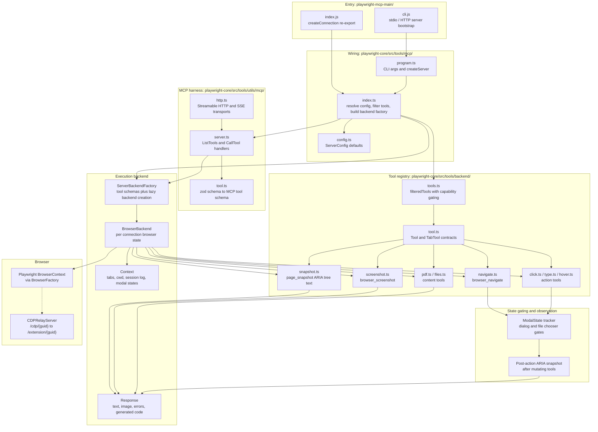
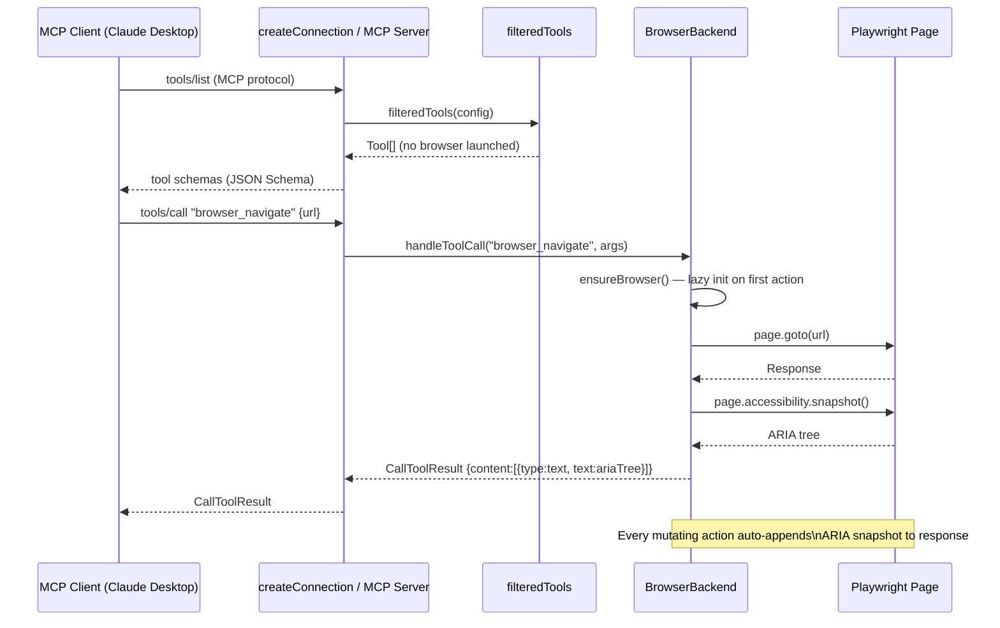
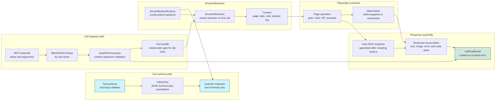

# Playwright MCP — Research Dossier

> Consolidated view of this repository: architecture diagrams, deep analysis through the Conxa lens, and file-level navigation. Analyzed as external prior art for Conxa's record→compile→distribute browser-automation platform.

**Contents:** [Architecture Diagrams](#architecture-diagrams) · [Deep Analysis](#deep-analysis-conxa-lens) · [File Navigation](#file-navigation)

---

## Architecture Diagrams


---

### Component Diagram



---

### Execution Flow Diagram



---

### Data Flow Diagram



---

## Deep Analysis (Conxa Lens)


> Lens: **Conxa** — AI-native, deterministic browser automation. Record → compile to skill packages → distribute as `.exe` → execute LOCALLY via Claude Desktop's MCP protocol. Conxa's Runtime IS an MCP server (`runtime/server.js`, `@modelcontextprotocol/sdk`) exposing `execute_skill`, `execute_sequence`, `list_skills`, `get_skill_inputs`, `get_execution_status`, `cancel_execution`, `refresh_skills`, `get_runtime_status`, `read_skill_files`. Playwright MCP is the direct reference for a mature, MCP-native browser tool server.

---

### Executive Summary

`@playwright/mcp` is a **thin packaging artifact** (~5 meaningful files). Its job is to publish an npm package, declare an MCP registry manifest (stdio transport), and re-export one function — `createConnection` — from `playwright-core`. **All architecture lives in `playwright-core/src/tools/`**, split cleanly into three layers:

1. **`tools/mcp/`** — wiring: `createConnection()` resolves config, filters the tool list, and builds a `ServerBackendFactory`.
2. **`tools/utils/mcp/`** — a **transport-agnostic MCP harness**: a generic `Server` that handles `ListTools`/`CallTool` requests, manages backend lifecycle, supports stdio + Streamable-HTTP + legacy SSE, and runs heartbeats.
3. **`tools/backend/`** — the **domain**: ~25 tool modules (`navigate`, `snapshot`, `click`, `form`, …) each a declarative `{capability, schema (zod), type, handle}` record, plus `BrowserBackend` which validates args and dispatches to handlers against a live browser context.

The key insight for Conxa: Playwright cleanly separates **the MCP protocol plumbing** (reusable, transport-agnostic) from **the tool registry** (declarative, capability-filtered) from **the execution backend** (per-connection, holds browser state). A `ServerBackend` interface (`initialize / callTool / dispose`) is the seam between protocol and domain. Conxa's `runtime/server.js` should adopt this same three-layer separation rather than hand-wiring SDK request handlers to skill execution.

---

### Architecture Overview

```
@playwright/mcp (wrapper repo)
  index.js   →  re-exports tools.createConnection
  cli.js     →  tools.decorateMCPCommand(program) → parseAsync
  server.json→  MCP registry manifest (transport: stdio)
  index.d.ts →  createConnection(config?, contextGetter?) : Promise<Server>

playwright-core/src/tools/
  mcp/index.ts        createConnection(): resolveConfig → filteredTools → backendFactory → createServer
  utils/mcp/server.ts MCP harness: createServer/connect, BackendManager, ListTools+CallTool handlers, heartbeat, stdio
  utils/mcp/http.ts   Streamable-HTTP + legacy SSE transports; DNS-rebind guard; kill endpoint
  utils/mcp/tool.ts   toMcpTool(): zod schema → JSON Schema + MCP annotations (readOnly/destructive hints)
  backend/tools.ts    browserTools registry + filteredTools(config) (capability + skillOnly filter)
  backend/tool.ts     Tool / TabTool contract; defineTool/defineTabTool; modal-state gating
  backend/browserBackend.ts  ServerBackend impl: parse args (zod), build Response, dispatch handler
  backend/<domain>.ts ~25 modules: navigate, snapshot, click, form, keyboard, network, tabs, …
```

The wrapper is replaceable; the value is the three-layer core.

---

### Core Abstractions

1. **`ServerBackend` interface + `ServerBackendFactory`** (`utils/mcp/server.ts`). The seam between MCP protocol and domain logic. Backend = `{ initialize(clientInfo), callTool(name, args, signal), dispose() }`. Factory carries `toolSchemas` (for listing, no backend needed) and `create(clientInfo)` (lazily instantiates a backend on first tool call). This lets the harness be **completely domain-agnostic** — it never imports a browser.

2. **Declarative `Tool` record** (`backend/tool.ts`). Each tool is data: `{ capability, skillOnly?, schema: { name, title, description, inputSchema (zod), type }, handle }`. `type` ∈ `input | action | assertion | readOnly` drives MCP annotations. `defineTool` / `defineTabTool` are identity helpers giving type inference. Tools are aggregated into `browserTools` and filtered, never imperatively registered.

3. **Capability filtering** (`backend/tools.ts → filteredTools`). `tool.capability.startsWith('core') || config.capabilities?.includes(capability)`, then drop `skillOnly` tools. The exposed tool surface is a pure function of config — the same codebase presents different tool sets to different clients (e.g. core-only vs. core+vision+pdf+devtools).

4. **`BrowserBackend` + `Context`** (per-connection execution state). `BrowserBackend` holds the browser context, a `Context` wrapper, a `SessionLog`, and the filtered tool list. `callTool` parses args with the tool's zod schema, builds a `Response`, sets the running tool, invokes `handle`, drains unhandled rejections, serializes, logs. Browser-disconnect listeners flip `isClose` so the harness disposes the backend.

5. **`Response` accumulator + snapshot model.** Handlers don't return values — they mutate a `Response` (`setIncludeSnapshot()`, `addCode()`, `addError()`). After every action, the response can attach a fresh **accessibility snapshot** of the page, giving the LLM the post-action DOM state. This is the deterministic "what happened" contract.

---

### Execution Flow

**Connection init**
1. Client (Claude Desktop) launches the server process (stdio) or POSTs to `/mcp` (HTTP).
2. `createServer()` registers two handlers (`ListTools`, `CallTool`) and declares `capabilities: { tools: {} }`.
3. No backend yet — tool listing needs only schemas.

**Tool listing** (`ListToolsRequestSchema`)
- Returns `factory.toolSchemas.map(toMcpTool)`. `toMcpTool` converts each zod schema to JSON Schema and attaches annotations: `readOnlyHint` (true for `readOnly`/`assertion`), `destructiveHint` (inverse), `openWorldHint: true`. **Listing is stateless and cheap** — no browser is launched to list tools.

**Tool call** (`CallToolRequestSchema`)
1. First call lazily triggers `initializeServer`: reads client capabilities, fetches client `roots` (→ `cwd`), builds `ClientInfo`, calls `factory.create(clientInfo)` then `backend.initialize()`. The browser context is created **here, once per connection** (`isolated → newContext`, else reuse `contexts()[0]`).
2. `backend.callTool(name, args, signal)`: finds the tool, `inputSchema.parse(args)` (zod) → on `ZodError` returns a formatted error result (not a thrown exception), constructs `Response`, runs `handle(context, params, response, signal)`.
3. `defineTabTool` wraps handlers to `ensureTab()` and **gate on modal state** — a tool that doesn't clear a present dialog/file-chooser is rejected before execution.
4. Result serialized; text parts merged (`mergeTextParts`); if browser disconnected, `isClose` set → harness disposes backend and resets so the next call re-initializes.

**Response**
- `CallToolResult` content array (text + optional images/snapshot). Errors are returned **in-band** as `{ isError: true, content }`, never as protocol-level exceptions — the LLM always gets a readable message.

---

### Data Model

- **Tool schema** (`ToolSchema`): `{ name, title, description, inputSchema: zod, type }`. zod is the single source of truth → JSON Schema for the wire, runtime validation in the backend, and TS type inference (`z.output<Input>`) in the handler. One definition, three uses.
- **Config** (`resolveConfig`): browser launch options, `isolated` flag, `capabilities[]`, `saveSession`, etc. Drives both `filteredTools` and context creation. Config is resolved **once** at `createConnection`.
- **Context**: per-connection wrapper over a Playwright `BrowserContext`, carrying `SessionLog`, `cwd`, running-tool state, modal states, tabs, pending-rejection queue.
- **ClientInfo**: `{ cwd, clientName }` derived from MCP `roots` and client version — lets tools resolve relative file paths against the client's workspace.
- **Annotations**: `readOnlyHint / destructiveHint / openWorldHint` — machine-readable safety hints the client can surface or gate on.

---

### Reliability Strategy

- **Schema validation at the boundary.** Every tool call is zod-parsed before the handler runs; invalid args become a clean error result. The handler never sees malformed input.
- **In-band error contract.** Errors (bad args, handler throws, unhandled rejections drained from `Context`) are returned as `isError` results with readable text — the protocol channel stays healthy and the LLM can self-correct.
- **Modal-state gating.** A tool that would act while an unhandled dialog/file-chooser is open is refused with an explanatory error, preventing silently-lost interactions.
- **Heartbeat (HTTP).** `startHeartbeat` pings the client every 3s with a 5s timeout; on failure it closes the server, releasing the browser. Stdio relies on `process.stdin 'end'` to detect peer disconnect (the SDK doesn't).
- **AbortSignal propagation.** `extra.signal` flows from the SDK request through `callTool` into the handler, enabling cancellation of in-flight tool execution.
- **Post-action snapshots.** Returning a fresh a11y snapshot makes results deterministic and verifiable rather than fire-and-forget.

### Recovery Strategy

- **Lazy backend re-init.** If a tool result carries `isClose` (browser/context closed), the harness disposes the backend and clears `backendPromise`; the next tool call transparently re-creates the browser context. The connection survives a browser crash.
- **Factory pattern isolates failure.** `BackendManager` tracks backend↔factory pairs and disposes cleanly on close; a failed `create` resets `backendPromise` so a retry can succeed.
- **No retry/self-heal at the MCP layer.** Playwright relies on its own client-side auto-waiting/locator re-querying for element-level resilience; the MCP layer itself does *not* implement selector recovery. **This is the single biggest gap vs. Conxa's deterministic, self-healing philosophy.**

### Scalability Characteristics

- **One backend (browser context) per connection.** stdio = one client, one process, one browser. HTTP (Streamable/SSE) = session-per-`mcp-session-id`, each with its own transport + backend → multiple concurrent isolated browsers in one process.
- **Stateless listing** scales freely (no browser needed to enumerate tools).
- **Lazy browser creation** — a connection that only lists tools never pays the browser cost.
- Memory bound by concurrent browser contexts; the harness has no pooling or queueing — concurrency = number of live sessions.

---

### Strengths

- **Clean three-layer separation**: protocol harness / tool registry / execution backend, joined by the `ServerBackend` seam. The harness is genuinely reusable and transport-agnostic.
- **Declarative, data-driven tools** — adding a tool is one record, no registration boilerplate; the registry is just an array.
- **zod-as-single-source** for wire schema + validation + types.
- **Capability filtering** turns one codebase into many tailored tool surfaces via config.
- **Transport flexibility** (stdio / Streamable-HTTP / SSE) behind one factory, with DNS-rebind and CSRF protections baked into the HTTP path.
- **Robust connection lifecycle**: lazy init, heartbeat, abort signals, disconnect-driven disposal, in-band errors.
- **Thin wrapper** keeps the published package trivial and the logic centrally maintained.

### Weaknesses

- **No skill/sequence abstraction.** Tools are atomic primitives; there's no notion of a compiled, parameterized multi-step workflow — exactly what Conxa needs.
- **No self-healing element recovery at the MCP layer** — relies on Playwright auto-wait, not a deterministic recovery cascade.
- **Single backend per connection, no pooling/queueing** — concurrency is unmanaged.
- **`skillOnly` flag hints at an internal skill concept** that is filtered *out* of the public MCP surface — the interesting workflow layer isn't exposed here.
- **Wrapper indirection** (`coreBundle`) makes the real code hard to locate from the published package alone.
- **No execution-status / cancel tools** as first-class MCP tools — cancellation is via AbortSignal, not an LLM-callable `cancel_execution`.

---

### LEARN

- **The `ServerBackend` seam is the right architecture.** Protocol plumbing must not import domain logic. A backend is `{ initialize, callTool, dispose }`; the harness handles list/call/lifecycle/transport. Conxa's runtime should refactor toward this so `server.js` knows nothing about skill execution internals.
- **Tools as declarative records + a registry array.** `{ capability, schema, type, handle }`. No imperative `server.tool(...)` calls scattered around.
- **One schema definition (zod), three consumers**: JSON Schema for MCP, runtime validation, TS types.
- **Lazy, per-connection execution context** created on first tool call, disposed on close, re-created on crash.
- **In-band errors + post-action state snapshot** as the deterministic result contract.
- **Annotations** (`readOnlyHint`/`destructiveHint`) give clients machine-readable safety metadata.

### ADAPT

- **Tool registry + capability filtering → skill-aware tool surface.** Conxa's tools (`execute_skill`, `list_skills`, …) are fixed, but the *same pattern* applies: a declarative tool table with a `filteredTools(config)` step. Conxa can filter by **licensed company / installed plugin set**, so a runtime only advertises skills the customer is entitled to — capability filtering becomes entitlement filtering.
- **`ServerBackend.callTool` arg-parse → skill input validation.** Conxa already has `get_skill_inputs` + `skill_loader.js` validation; route every `execute_skill` call through a zod-equivalent parse-at-boundary so bad inputs return clean in-band errors, never crash the runtime.
- **`isClose`/lazy re-init → browser lifecycle resilience.** Map Conxa's `browser.js` lifecycle onto the same pattern: if Playwright disconnects mid-skill, dispose and lazily re-create on the next `execute_skill` so the MCP connection survives.
- **Per-session context → per-execution isolation.** Conxa's `get_execution_status` / `cancel_execution` imply long-running executions; model each as a backend-managed context with an AbortSignal, mirroring Playwright's signal propagation.
- **Heartbeat for HTTP, stdin-end for stdio** — Conxa ships stdio (Claude Desktop), so adopt the `process.stdin 'end' → dispose` pattern to release the browser when Claude Desktop quits.

### IMPROVE (MCP + runtime + skill packaging)

- **Add the skill/sequence layer Playwright lacks.** Playwright stops at atomic tools; Conxa's differentiator is **compiled skill packages** as the unit of execution. Keep Playwright's clean harness, but make the "tool" a parameterized, recorded workflow with embedded multi-signal selectors and a deterministic 5-tier recovery cascade — turning fragile LLM-driven clicking into deterministic replay.
- **Make execution-status & cancellation first-class MCP tools** (Conxa already does: `get_execution_status`, `cancel_execution`). Playwright only has an internal AbortSignal — exposing them as tools lets the LLM/operator manage long runs.
- **Entitlement-driven `list_skills`** — extend capability filtering to gate by company token (`auth_manager.js`) so the advertised tool surface reflects licensing. Stronger than Playwright's static capability set.
- **Snapshot contract for skills** — adapt Playwright's post-action a11y snapshot into a per-step outcome/assertion report (Conxa's `verifyAssertions()`), so each skill step returns deterministic "what happened" the LLM can trust.
- **Self-update + delta sync** (Conxa `sync.js`) is something Playwright's model never addresses — keep it; it's a genuine advantage for distributed `.exe` runtimes.

### AVOID

- **Don't expose atomic browser primitives to the LLM as the execution unit.** Playwright's 50+ low-level tools push *non-determinism* onto the model (the LLM decides what to click). That directly contradicts Conxa's deterministic philosophy. Conxa should expose a small, stable verb set (`execute_skill`, …) and keep all element-resolution logic *inside* the compiled skill.
- **Don't rely on the wrapper/`coreBundle` indirection style.** It's fine for a multi-package monorepo but it obscures where logic lives; Conxa's single `runtime/` directory should keep the harness and backend visibly co-located.
- **Don't lean on browser auto-wait as the only resilience.** Playwright's MCP layer has no selector recovery; Conxa's whole value is the deterministic recovery cascade — keep it in the runtime, not delegated to Playwright defaults.

### REJECT

- **HTTP/SSE multi-session transport** as a runtime concern. Conxa executes **locally via Claude Desktop over stdio** — the Streamable-HTTP/SSE machinery, DNS-rebind guards, and `/killkillkill` endpoint are irrelevant and would add attack surface. Stdio-only is the correct, simpler choice; the cloud is coordination, not an MCP transport endpoint.
- **`openWorldHint: true` framing.** Playwright tools are open-world (navigate anywhere, click anything). Conxa skills are closed-world deterministic replays — the annotation model should reflect bounded, known-target behavior, not "the model can do anything."
- **Unbounded concurrency per process.** Playwright spins a browser per session with no pooling. A customer `.exe` runtime should bound concurrent executions deliberately rather than inherit Playwright's unmanaged model.

---

## File Navigation


### Repository Summary

- **Purpose**: Thin npm package that publishes `@playwright/mcp` — exposes Playwright as an MCP (Model Context Protocol) server so LLMs can automate browsers via 50+ structured tools. The actual implementation lives in `playwright-core/src/tools/mcp/`.
- **Estimated size**: ~10 meaningful source files at root; ~8 test files. Source code is in the playwright-main monorepo.
- **Main language**: JavaScript/TypeScript (index.js wrapper + TypeScript definitions)
- **Architectural style**: Thin facade — delegates everything to `playwright-core/lib/coreBundle`

---

### Entry Points

| Entry | File | Purpose |
|-------|------|---------|
| Programmatic API | `index.js` | Exports `createConnection` from coreBundle |
| CLI | `cli.js` | `playwright-mcp` command; routes through `tools.decorateMCPCommand()` |
| MCP server manifest | `server.json` | MCP registry metadata (name, version, transport: stdio) |
| Type definitions | `index.d.ts` | `createConnection(config?, contextGetter?)` signature |

**`index.js`** (full content):
```js
const { tools } = require('playwright-core/lib/coreBundle');
module.exports = { createConnection: tools.createConnection };
```

**`cli.js`** flow:
1. If `install-browser` arg → remap to `install`, delegate to `libCli.decorateProgram()`
2. Otherwise → `tools.decorateMCPCommand(program, version)` → `program.parseAsync(process.argv)`

---

### Core Components

This repo has no independent core logic. The architecture is:

```
@playwright/mcp (this repo)
  └─ index.js → playwright-core/lib/coreBundle.tools.createConnection
        └─ src/tools/mcp/index.ts     [actual implementation]
              ├─ browserFactory.ts    [browser instantiation]
              ├─ browserModel.ts      [browser abstraction]
              ├─ program.ts           [CLI command definition]
              ├─ config.ts            [config resolution]
              └─ cdpRelay*.ts         [CDP↔extension bridge]
```

For deep study of MCP logic, go to **playwright-main** → `packages/playwright-core/src/tools/mcp/`.

---

### Important Files

#### HIGH VALUE

| File | Why |
|------|-----|
| `index.js` | Shows how `createConnection` is re-exported — confirms the delegation pattern |
| `cli.js` | Shows CLI command registration flow and install-browser remap |
| `index.d.ts` | Public API surface: `createConnection(config?: Config, contextGetter?: () => Promise<BrowserContext>): Promise<Server>` |
| `server.json` | MCP registry manifest — defines transport (stdio), name, version |
| `package.json` | Version, peer deps, entry points, scripts |

#### MEDIUM VALUE

| File | Why |
|------|-----|
| `config.d.ts` | Config shape — what options the MCP server accepts |
| `playwright.config.ts` | Test configuration — shows how MCP server is integration-tested |

#### LOW VALUE

| File | Why |
|------|-----|
| `src/README.md` | Just says "source is in playwright monorepo" |
| `.devcontainer/` | Dev container setup — not architecture |
| `Dockerfile` | Runtime container — useful for deployment, not architecture |
| `.github/workflows/` | CI pipeline |
| `CONTRIBUTING.md`, `SECURITY.md` | Meta documentation |
| `tests/` | Integration test suite |

---

### Architecture-Relevant Areas

**MCP logic**
- `index.js` — `createConnection` facade
- `server.json` — stdio transport declaration; LLM clients connect via stdin/stdout
- `cli.js` — `decorateMCPCommand()` registers Playwright-specific CLI flags

**Execution logic**
- Entirely delegated to `playwright-core/src/tools/backend/browserBackend.ts`

**All other areas (locator, recording, vision, CDP relay)**
- Implemented in `playwright-main/packages/playwright-core/src/tools/mcp/`
- See `playwright-main.md` for those details

---

### Ignore Recommendations

| Area | Reason | Estimated % |
|------|--------|------------|
| `src/README.md` | Pointer only, no code | ~1% |
| `tests/` | Integration tests | ~30% |
| `.devcontainer/` | Dev environment setup | ~5% |
| `Dockerfile` | Container runtime | ~2% |
| `.github/` | CI/CD | ~5% |
| `CONTRIBUTING.md`, `SECURITY.md`, `CODE_OF_CONDUCT.md` | Meta | ~3% |

**Estimated ignorable: ~46%**. The meaningful surface of this repo is 5 files: `index.js`, `cli.js`, `index.d.ts`, `server.json`, `package.json`.

> **Key architectural insight**: This repo is primarily a packaging artifact. All analytical value is in `playwright-main`. Study this repo only to understand the public API surface and MCP transport configuration.
