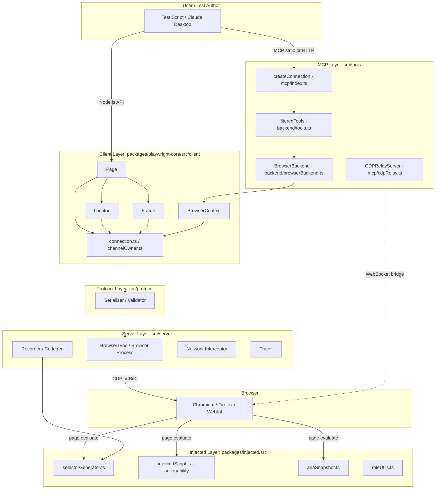
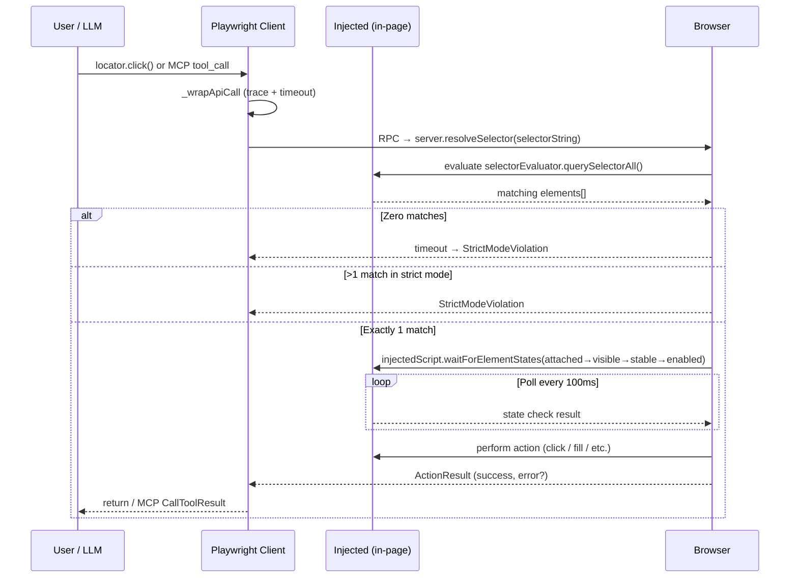

# Playwright — Research Dossier

> Consolidated view of this repository: architecture diagrams, deep analysis through the Conxa lens, and file-level navigation. Analyzed as external prior art for Conxa's record→compile→distribute browser-automation platform.

**Contents:** [Architecture Diagrams](#architecture-diagrams) · [Deep Analysis](#deep-analysis-conxa-lens) · [File Navigation](#file-navigation)

---

## Architecture Diagrams

---

### Component Diagram

---

### Execution Flow Diagram

---

### Data Flow Diagram — Record → Compile → Execute

```mermaid
flowchart LR
    subgraph REC["Record"]
        direction TB
        A1["User clicks in browser"]
        A2["Recorder captures DOM event"]
        A3["selectorGenerator scores candidates"]
        A4["Best selector plus alternatives"]
    end

    subgraph COMP["Compile / Serialize (Codegen)"]
        direction TB
        B1["Codegen emits locator API call"]
        B2["Serialized selector text"]
        B3["Examples: role button named Submit, css button submit"]
    end

    subgraph EXEC["Execute (runtime)"]
        direction TB
        C1["Locator stores selector text<br/>not a DOM node"]
        C2["Each action re-resolves selector text"]
        C3["Actionability gates: attached, visible, stable, enabled"]
        C4["Dispatch click, fill, or another action"]
        C5["ActionResult response"]
    end

    A1 --> A2
    A2 --> A3
    A3 --> A4
    A4 --> B1
    B1 --> B2
    B2 --> B3
    B3 --> C1
    C1 --> C2
    C2 --> C3
    C3 --> C4
    C4 --> C5

    style COMP fill:#f0f4ff,stroke:#4a6fa5
    style B2 fill:#f8fbff,stroke:#4a6fa5
```

---

## Deep Analysis (Conxa Lens)

### Executive Summary

Playwright is Microsoft's cross-browser automation framework. For Conxa, its value is not the browser-launching plumbing but three deeply-engineered subsystems that map directly onto Conxa's compiler/runtime/recovery concerns:

1. **A scored, accessibility-first selector generator** (`packages/injected/src/selectorGenerator.ts`) that, given a target DOM element, emits *multiple* ranked candidate selectors using a numeric cost model where role+name < label < placeholder < text < testid < css-id < tag < nth < css-path. This is exactly the "multi-signal element identity" problem Conxa's compiler solves, and Playwright has a battle-tested, deterministic, zero-LLM solution.
2. **Auto-waiting locators with strictness and actionability gates** (`client/locator.ts`, `injected/injectedScript.ts`). A `Locator` is a *lazy, re-queryable selector string*, not a captured node. Every action re-resolves the element and waits for a stack of actionability states (attached → visible → stable → enabled → editable → receives-pointer-events) before acting. This is the reliability backbone.
3. **A composable selector grammar** (`>>` chaining, `internal:*` engines, `internal:control=enter-frame`, shadow-piercing) that encodes role/text/label/frame/shadow traversal *as a serializable string*. Element identity is data, resolved late — philosophically identical to Conxa compiling selectors into a skill package and resolving them at runtime.

Playwright's deterministic, LLM-free reliability model is strongly aligned with Conxa's Tier 1/2 (zero-token) recovery philosophy. The divergence: Playwright has no concept of self-healing fallback cascades, fingerprint scoring of live candidates, or vision recovery — it fails hard when a selector misses. That gap is precisely where Conxa's recovery cascade adds value, and where Playwright's *generator* (not its runtime) is the asset to mine.

### Architecture Overview

**Subsystems & responsibilities**
- **Client layer** (`src/client/`): user-facing API objects (`Page`, `Frame`, `Locator`, `BrowserContext`). Thin — they build selector strings and marshal RPC calls. No DOM logic lives here.
- **Protocol layer** (`src/protocol/`): serialization + schema validation of the JSON channel between client (Node) and server (browser-side).
- **Server layer** (`src/server/`): owns browser processes, CDP/BiDi/WebKit protocols, network interception, recorder, codegen, tracing.
- **Injected layer** (`packages/injected/src/`): code evaluated *inside the page*. This is where the real intelligence lives — `selectorGenerator.ts`, `selectorEvaluator.ts`, `roleUtils.ts`, `injectedScript.ts` (actionability), `ariaSnapshot.ts`.
- **Codegen** (`src/server/codegen/`): turns recorded actions into language-specific source (`javascript.ts`, `python.ts`, etc.). Consumes the generator's output.
- **MCP layer** (`src/tools/`): `createConnection()` (`tools/mcp/index.ts`) → `filteredTools()` (`tools/backend/tools.ts`) → `BrowserBackend`. CDP relay (`tools/mcp/cdpRelay.ts`) bridges Playwright ↔ a Chrome extension over two WebSocket endpoints.

**Data flow (record → generate → execute)**
1. User interacts; recorder captures DOM events in-page.
2. `generateSelector()` runs in the page, scores candidate selectors against the live DOM, returns the best + alternatives.
3. Codegen serializes the winning locator into source (`page.getByRole('button', { name: 'Submit' })`).
4. At execution, the `Locator` selector string is parsed by `selectorEvaluator.ts`, re-queried each attempt, gated by actionability, then the action dispatches.

**Execution flow**: client API call → `_wrapApiCall` (tracing/timeout wrapper) → channel RPC → server resolves selector via injected evaluator → actionability poll loop → action → result/event back over channel.

### Core Abstractions

- **`Locator` (`client/locator.ts`)** — a `(frame, selectorString)` pair. Immutable; chaining (`.locator()`, `.filter()`, `.getByRole()`, `.nth()`) returns a *new* Locator with an extended selector string. All actions pass `strict: true`. Matters because identity is a *late-bound, serializable description*, never a captured handle — survives re-render, re-query is free.
- **`SelectorToken` + scored candidate model (`injected/selectorGenerator.ts`)** — `{ engine, selector, score }` where lower score = more reliable. `combineScores()` weights earlier (more specific/leftmost) tokens heavier. The generator builds *all* plausible candidates, sorts by score, and verifies each against the live DOM, preferring the lowest-score selector that *uniquely* matches the target (`elements.length === 1`). This is multi-signal element identity with a deterministic preference order.
- **Selector grammar / engines (`selectorEvaluator.ts`, `roleSelectorEngine.ts`)** — `>>` joins engine clauses; `internal:role`, `internal:label`, `internal:text`, `internal:testid`, `internal:has-text`, `css`, `xpath`, `nth`, `internal:control=enter-frame`. `pierceShadow` is a first-class evaluator flag; CSS queries recurse into open shadow roots by default. Matters: frame and shadow traversal are encoded *in the selector string itself*, not in imperative code.
- **`InjectedScript` actionability (`injected/injectedScript.ts`)** — `ElementState = visible|hidden|enabled|disabled|editable|checked|stable`. `retarget()` walks label→control and into interactive ancestors; `_checkElementIsStable()` waits N stable RAF frames. The action poll loop verifies states before each attempt. This is the auto-wait engine.
- **`ariaSnapshot` (`injected/ariaSnapshot.ts`, exposed via `Locator.ariaSnapshot`)** — serializes the accessibility tree to YAML. Used for AI-mode snapshots and assertions; an accessibility-native page representation.

### Execution Flow

- **Initialization**: `createConnection()` resolves config, filters MCP tools, lazily creates a browser context. Client `ChannelOwner` objects mirror server objects over the JSON channel.
- **Planning (locator construction)**: building a `Locator` is pure string assembly — no I/O. Filters (`hasText`, `has`, `visible`) append `internal:*` clauses. Frame entry appends `internal:control=enter-frame`.
- **Execution**: an action (`click`/`fill`) sends the selector + `strict:true` + timeout to the server. Server parses the selector, queries via the evaluator (shadow-piercing as needed), enforces strictness (error if >1 match), then enters the actionability poll loop until states pass or timeout, then dispatches the input with a hit-target check.
- **Validation**: `_expect()` / web-first assertions retry the predicate until it passes or times out (same poll model). `ariaSnapshot` enables accessibility-tree assertions.
- **Recovery**: essentially none. On miss/ambiguity Playwright throws after timeout. The only "recovery" is the implicit retry-until-timeout of re-querying — there is no alternative-selector fallback, no fingerprint rescue, no vision step.

### Data Model

- **Action**: implicit — the API method (`click`, `fill`, `selectOption`) plus options (`force`, `trial`, `timeout`, `strict`). No standalone serialized "action" object in the client; codegen reconstructs source from recorder events.
- **Element identity**: the selector string (`engine=value >> engine=value …`). The *generator* additionally produces a ranked `selectors[]` array + `score` — the only place confidence is quantified.
- **State**: `ElementState` enum gates actions; not persisted.
- **Recovery info**: none persisted. The candidate list exists only transiently during generation and is collapsed to a single string for codegen.
- **Execution metadata / tracing**: `Tracing` (`client/tracing.ts`) records snapshots, screenshots, source stacks, and network into a zip (`.trace`). Rich post-hoc forensics, but not a live recovery input.

### Reliability Strategy

- **Auto-waiting**: every action re-queries the selector and polls actionability (visible, stable across RAF frames, enabled, editable, receives-pointer-events with hit-target check) until pass or timeout. No manual sleeps.
- **Late re-resolution**: locators are descriptions, so a stale DOM reference is impossible — each attempt re-queries fresh.
- **Strictness**: `strict:true` makes ambiguity (>1 match) a hard error rather than a silent first-match, surfacing brittle selectors at author time.
- **Accessibility-first generation**: the generator strongly prefers role+name and label/placeholder/text over CSS — selectors that track user-visible semantics, which are far more stable than DOM structure.
- **Validation**: web-first assertions retry; aria snapshots assert on the accessibility tree.
- **Fallbacks**: only `or()` (author-specified alternative) and the generator's internal candidate ranking. No automatic runtime fallback.

### Recovery Strategy

- **Detection**: timeout on actionability poll or strictness violation → exception. No classification beyond "not found / not actionable / ambiguous / multiple".
- **Classification**: error messages distinguish missing element vs. failed state vs. strict-mode multiple matches, but these are diagnostic, not branching logic.
- **Recovery**: none automatic. Author must supply `or()`, broaden the locator, or fix the page.
- **Escalation**: none. Playwright is a *deterministic executor that fails loudly* — by design it never guesses. (This is the deliberate inverse of a self-healing cascade.)

### Scalability Characteristics

- **Complexity**: generator is roughly O(candidates × DOM-query) with parent-recursion capped at two levels and `nth` capped at index 5 — bounded and fast. Caching (`allowText`/`disallowText` maps, ARIA/DOM caches) keeps it interactive during recording.
- **Maintainability**: clean client/server/injected separation; selector engines are pluggable; scoring constants are centralized and tunable.
- **Enterprise readiness**: very high — multi-browser, tracing, mature, widely deployed.
- **Operational burden**: the in-page injected layer must be kept in lockstep with browser quirks (shadow DOM, ARIA spec); cross-browser ARIA computation is the heaviest maintenance area.

### Strengths

- Deterministic, LLM-free, *scored* multi-candidate selector generation with a principled accessibility-first preference order.
- Locators as serializable late-bound descriptions — re-query is free and stale handles are impossible.
- Robust auto-wait actionability model (stability across frames + hit-target testing) that eliminates flakiness without sleeps.
- Frame and shadow traversal encoded declaratively in the selector grammar.
- First-class accessibility tree snapshotting; rich tracing for forensics.

### Weaknesses

- No self-healing: a single missed selector is a hard failure. The ranked candidate list is *discarded* after codegen — runtime keeps only one selector.
- No fingerprinting or scoring of *live* candidates at execution time (scoring happens only at generation).
- No vision/LLM rescue path (intentional, but a gap for unattended automation).
- Codegen collapses rich multi-signal identity into a single string, losing the alternatives that would enable recovery.
- ARIA computation cost and cross-browser drift.

### LEARN

- **The scored candidate model is the single most transferable idea.** Conxa's compiler already generates selectors, assertions, and fingerprints; Playwright shows a *proven numeric cost model* (role+name=100, label=140, placeholder=120, text=180, testid=1, css-id=500, tag=530, nth=10000, css-path=1e7) plus the rule "pick the lowest-score candidate that *uniquely* matches the live DOM." This is directly applicable to scoring Conxa's compiled selector signals deterministically, at zero token cost.
- **Locators-as-late-bound-descriptions.** Element identity should be a serializable description re-resolved every attempt — never a captured node. Conxa's runtime `resolveElement`/`withLocator`/`rootCandidates` already lean this way; Playwright validates it as the right invariant.
- **Actionability before action.** The visible→stable(RAF)→enabled→editable→hit-target gate is a deterministic, zero-token reliability layer that belongs *before* any recovery tier fires.
- **Accessibility-first preference order** (role+name > label > placeholder > text > testid > css/xpath) is empirically the right reliability ranking and should anchor Conxa's Tier-2 accessibility resolution.

### ADAPT

- **Preserve the candidate list, don't collapse it.** Where Playwright throws away `selectors[]` after codegen, Conxa should compile *all* ranked candidates into the skill package as the recovery substrate. The generator's scoring is the ranking function; Conxa's recovery cascade is the consumer Playwright never built.
- **Use aria snapshots as a recovery/verification signal.** `ariaSnapshot` (YAML accessibility tree) is a compact, semantic page representation that could feed Conxa's Tier-3 LLM/vision steps far more cheaply than raw HTML or pixels, and serve as a deterministic assertion target at Tier 1/2.
- **Adopt the `internal:control=enter-frame` model for iframe chains.** Encoding frame traversal *in* the selector string aligns with Conxa's "iframe chain preserved verbatim" invariant and keeps recovery scoped to the correct frame.
- **Shadow-piercing as an evaluator flag**, not special-case code — a clean way to handle shadow DOM uniformly across compile and runtime.

### IMPROVE

- **Compiler**: import Playwright's scoring constants and unique-match-selection algorithm to harden `selector_score.py` / `llm_selector_generator_v2.py`, reducing reliance on the LLM for selector ranking (cheaper, more deterministic compiles).
- **Runtime / recovery**: feed the *full ranked candidate set* into the fingerprint-scored 5-tier cascade so Tier 1/2 can try the next-best deterministic selector before any LLM fires — strengthening the zero-token guarantee.
- **Recording**: adopt accessibility-first generation during capture so recorded steps default to role/label/text identity.
- **Vision/MCP**: aria-snapshot YAML as the page representation handed to Tier-3 reduces token cost vs. screenshots/DOM dumps.
- **Skill packaging**: persist alternatives + scores per element, making packages self-healing by construction.

### AVOID

- **Discarding alternatives at compile time.** Playwright's codegen keeping only one selector is the exact anti-pattern Conxa must not replicate — it forecloses recovery.
- **Scoring only at generation, never at runtime.** Live candidate scoring (Conxa's fingerprints) is what Playwright lacks; don't let the compile-time score be the only signal.
- **Over-reliance on CSS-id selectors.** Playwright already penalizes GUID-like ids (`isGuidLike`); Conxa should similarly distrust volatile ids/classes.

### REJECT

- **Fail-hard-on-miss as the terminal behavior.** Playwright deliberately never guesses and throws after timeout. That conflicts with Conxa's self-healing mandate for unattended local execution — Conxa's whole differentiator is the recovery cascade that begins where Playwright stops.
- **Client/server JSON-channel architecture.** Playwright's out-of-process client↔browser RPC is unnecessary for Conxa's local Node MCP runtime, which embeds Playwright directly; adopting the channel indirection would add latency and complexity with no benefit.
- **CDP-relay/extension bridge as a distribution model.** Playwright's Chrome-extension WebSocket relay conflicts with Conxa's MCP-native, local-.exe distribution and its "cloud never executes" invariant.
- **Trace-zip as a live recovery input.** Tracing is excellent forensics but is post-hoc; it must not be mistaken for a runtime recovery signal in Conxa's token-sensitive cascade.

---

## File Navigation

### Repository Summary

- **Purpose**: Microsoft's browser automation framework — controls Chromium, Firefox, and WebKit with a unified high-level API. Covers web testing, accessibility snapshots, MCP server integration, and CDP relay for browser extension bridging.
- **Estimated size**: ~1,449 TypeScript/JS files across 27 packages; full repo ~8,000+ files including docs, browser binaries, and test fixtures
- **Main language**: TypeScript (compiled to CJS/ESM)
- **Architectural style**: Monorepo (npm workspaces); layered client/server architecture where a Node.js client communicates over a JSON message channel to a browser-side server process

---

### Entry Points

| Entry | File | Purpose |
|-------|------|---------|
| In-process API | `index.js` → `packages/playwright-core/index.js` | Default Node.js import |
| ES module | `packages/playwright-core/index.mjs` | ESM import |
| CLI | `packages/playwright-core/cli.js` | `npx playwright` commands |
| Test runner | `packages/playwright-test/index.js` | `playwright test` |
| MCP server | `packages/playwright-core/src/entry/mcp.ts` | `createConnection()` startup |

The MCP entry (`src/entry/mcp.ts`) calls `createConnection(config, contextGetter?)` in `src/tools/mcp/index.ts`, resolves config, filters tools, instantiates a `BrowserBackend`, and returns an MCP `Server`.

---

### Core Components

| Module | Path | Purpose |
|--------|------|---------|
| **playwright-core** | `packages/playwright-core/` | Foundation — no bundled browsers |
| **playwright** | `packages/playwright/` | Public API combining all browser types |
| **playwright-test** | `packages/playwright-test/` | Full test runner + assertions + reporters |
| **client layer** | `src/client/` | User-facing API objects (Page, Locator, Frame…) |
| **server layer** | `src/server/` | Browser process side — launches, intercepts network |
| **protocol layer** | `src/protocol/` | Serialization and validation of JSON messages |
| **tools/mcp** | `src/tools/mcp/` | MCP server + CDP relay bridge |
| **recorder** | `packages/recorder/` | React-based recording UI |
| **trace-viewer** | `packages/trace-viewer/` | Trace replay and visualization |

---

### Important Files

#### HIGH VALUE

| File | Why |
|------|-----|
| `src/tools/mcp/index.ts` | MCP entry — wires config → tools → BrowserBackend → MCP Server |
| `src/tools/mcp/cdpRelay.ts` | CDPRelayServer: bridges `/cdp/{guid}` (Playwright) ↔ `/extension/{guid}` (Chrome extension) over WebSocket |
| `src/tools/mcp/cdpRelayV2.ts` | Default multi-tab protocol handler (v2); relay manages debugger attachment via `chrome.*` APIs |
| `src/tools/mcp/browserModel.ts` | Browser abstraction used by the MCP layer |
| `src/tools/mcp/program.ts` | CLI program definition for the MCP server |
| `src/client/locator.ts` | Core element selection API — CSS, accessibility, text, role-based queries; chainable filters |
| `src/client/page.ts` | Page object — navigation, interaction, waitFor, screenshot |
| `src/client/frame.ts` | Frame/iframe handling; core execution context |
| `src/client/browserContext.ts` | Cookie, storage, network interception context |
| `src/client/connection.ts` | Client-server channel — bidirectional JSON message dispatch |
| `src/client/channelOwner.ts` | Base class for all remote objects; owns a channel and dispatches events |
| `src/tools/backend/tools.ts` | `filteredTools()` — registry of all MCP tool schemas |
| `src/tools/backend/browserBackend.ts` | `BrowserBackend` — MCP tool execution against a live browser context |

#### MEDIUM VALUE

| File | Why |
|------|-----|
| `src/tools/mcp/cdpRelayV1.ts` | Legacy single-tab protocol (v1) — kept for compatibility |
| `src/tools/mcp/config.ts` | Config resolution for MCP server |
| `src/tools/mcp/cdpRelayHandler.ts` | Message routing between CDP and extension sockets |
| `src/tools/mcp/protocol.ts` | Extension command/event type definitions |
| `src/client/elementHandle.ts` | Low-level DOM handle (mostly superseded by Locator) |
| `src/client/input.ts` | Keyboard and mouse raw input |
| `src/client/network.ts` | Request/response interception |
| `src/protocol/serializers.ts` | Wire format encoding/decoding |
| `src/protocol/validator.ts` | Message schema validation |
| `src/client/tracing.ts` | Trace recording API |
| `packages/playwright-test/src/` | Test runner internals — relevant if studying assertion/fixture patterns |

#### LOW VALUE

| File | Why |
|------|-----|
| `src/client/android.ts` | Android WebDriver — not relevant to web browser automation |
| `src/client/clock.ts` | Time mocking — test utility |
| `src/client/coverage.ts` | Code coverage — test tooling |
| `packages/trace-viewer/` | Visualization app — not architecture |
| `packages/html-reporter/` | Report generation — not architecture |
| `packages/dashboard/` | Web UI — not architecture |
| `packages/extension/` | Browser extension binary — platform-specific |
| `packages/recorder/` | Recording UI (React app) — useful only for studying recording UX |
| `src/cli/` | CLI parsing — not core logic |

---

### Architecture-Relevant Areas

**Locator logic**
- `src/client/locator.ts` — selector-based element location with `hasText`, `hasNot`, `has`, visibility, role, label filters
- `src/client/elementHandle.ts` — lower-level DOM reference (legacy path)

**Execution logic**
- `src/client/page.ts`, `frame.ts`, `input.ts` — user actions (click, fill, navigate, keypress)
- `src/client/connection.ts` + `channelOwner.ts` — dispatches calls to server process

**Recording logic**
- `packages/recorder/src/` — React UI capturing user interactions
- `src/server/recorder/` — server-side recording event capture

**MCP logic**
- `src/tools/mcp/index.ts` — `createConnection()` — primary API
- `src/tools/mcp/program.ts` — CLI surface
- `src/tools/backend/tools.ts` — tool registry (50+ tools)
- `src/tools/backend/browserBackend.ts` — tool execution

**CDP relay / extension bridge**
- `src/tools/mcp/cdpRelay.ts` — `CDPRelayServer` with two WS endpoints
- `src/tools/mcp/cdpRelayV2.ts` — multi-tab handler (default)
- Controlled by `PLAYWRIGHT_EXTENSION_PROTOCOL` env var (1 = single-tab, 2 = multi-tab)

**Reliability logic**
- `src/client/locator.ts` — built-in auto-wait; locators re-query on each action
- `src/client/frame.ts` — `waitForSelector`, `waitForFunction` primitives

---

### Ignore Recommendations

| Area | Reason | Estimated % of repo |
|------|--------|-------------------|
| `tests/` | End-to-end + unit test suites | ~25% |
| `browser_patches/` | Browser binary patches — Chromium/FF/WebKit source modifications | ~15% |
| `docs/src/` | Documentation MDX source | ~5% |
| `packages/trace-viewer/` | Standalone trace visualization React app | ~3% |
| `packages/html-reporter/` | HTML report generator | ~2% |
| `packages/dashboard/` | Web dashboard UI | ~2% |
| `packages/extension/` | Browser extension (not MCP path) | ~2% |
| `packages/recorder/` | Recording UI (React) — secondary concern | ~2% |
| Browser binary packages | `packages/playwright-{chromium,firefox,webkit}/` — just download scripts | ~3% |
| `packages/playwright-ct-*` | Component testing adapters (React, Vue) | ~3% |

**Estimated ignorable: ~62%**. Focus on `packages/playwright-core/src/{client,tools/mcp,protocol}/`.
