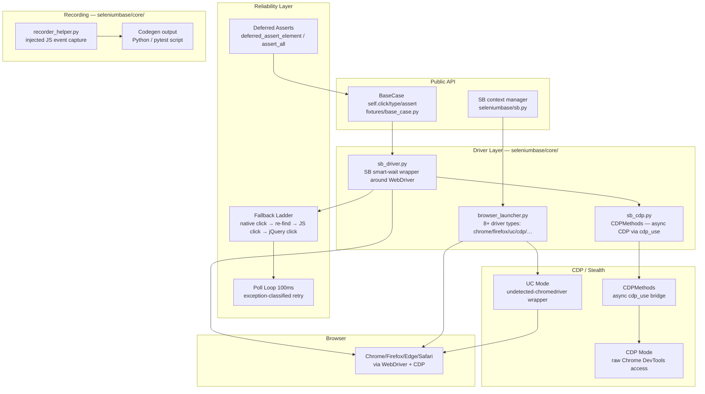
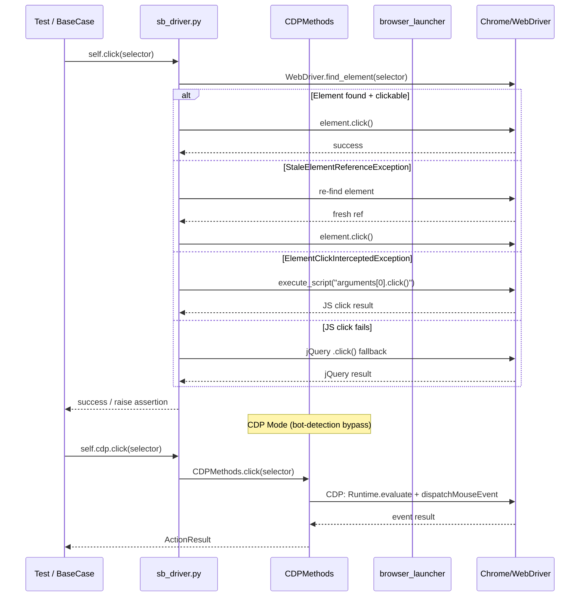
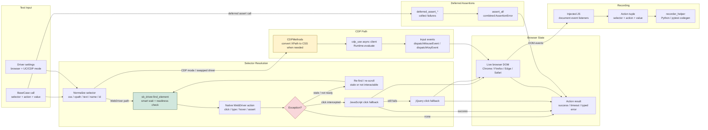

# SeleniumBase — Research Dossier

> Consolidated view of this repository: architecture diagrams, deep analysis through the Conxa lens, and file-level navigation. Analyzed as external prior art for Conxa's record→compile→distribute browser-automation platform.

**Contents:** [Architecture Diagrams](#architecture-diagrams) · [Deep Analysis](#deep-analysis-conxa-lens) · [File Navigation](#file-navigation)

---

## Architecture Diagrams


---

### Component Diagram



---

### Execution Flow Diagram



---

### Data Flow Diagram



---

## Deep Analysis (Conxa Lens)


> Lens: deterministic, local-first browser automation with a token-free recovery cascade.
> SeleniumBase is the single most mature reference for *replay reliability* — the part Conxa's runtime (run.js, 5-tier recovery) must match or beat. Intelligence only; no Conxa implementation plans.

---

### Executive Summary

SeleniumBase (SB) is a 17K+ line Python framework layered over Selenium WebDriver (plus a parallel CDP path) whose entire value proposition is **making replay reliable without the test author thinking about timing**. Every user-facing action (`click`, `type`, `hover`, `assert_*`) is a thin wrapper that (1) implicitly *smart-waits* for the element to reach the required readiness state, (2) scrolls it into view, (3) attempts the native interaction, and (4) on failure, walks a deterministic ladder of fallbacks — re-find on stale, JS-click, jQuery-click, ready-state sync, re-scroll — before surfacing a typed timeout error. Reliability is achieved through **disciplined polling loops + exception-classified retries**, not heuristics or ML.

For Conxa the relevant payload is concentrated in three places: `fixtures/page_actions.py` (the poll-loop wait primitives), `fixtures/base_case.py::click` (the canonical exception-classified fallback cascade), and `core/sb_cdp.py` (a token-free CDP interaction path that mirrors the same API). The recorder (`recorder_helper.py`) is a *flat action-tuple → code-string* generator — useful as a contrast to Conxa's richer compiled skill packages. SB has **no LLM, no self-healing of selectors, no multi-signal element identity**: when a selector breaks, SB fails. That gap is precisely Conxa's differentiator — SB is the deterministic floor Conxa builds Tier 3+ on top of.

---

### Architecture Overview

```
User test (BaseCase subclass)
  │  self.click("button#go")          ← simplified, timing-free API
  ▼
fixtures/base_case.py  (THE API, 17,413 lines)
  │  - per-action: recalc selector → smart-wait → scroll → act → fallback ladder
  │  - dispatches to page_actions OR, if "cdp swap needed", to self.cdp.*
  ├──► fixtures/page_actions.py   (WebDriver poll-loop primitives: wait_for_*)
  ├──► core/sb_cdp.py  (CDPMethods: async CDP via mycdp, wrapped synchronous)
  ├──► fixtures/js_utils.py  (scroll_to_element, XPath→CSS, JS/jQuery click, highlight)
  └──► core/browser_launcher.py  (Chrome/Edge/FF/Safari; UC mode; CDP mode; proxy)

core/recorder_helper.py  ← generate_sbase_code(action_tuples) → list[str] of code lines
plugins/pytest_plugin.py  ← lifecycle, CLI flags, sb fixture injection
```

Two interaction backends sharing one API surface:
- **WebDriver path** (default): classic Selenium, robust fallbacks, works everywhere.
- **CDP path** (`--cdp-mode`, or "swap" when UC-mode driver is disconnected for stealth): direct Chrome DevTools Protocol via the `mycdp`/`nodriver`-style async engine, wrapped into synchronous calls. Used for bot-detection evasion and when the WebDriver connection is intentionally severed.

The "CDP swap" idiom (`__is_cdp_swap_needed(driver)`) appears at the top of nearly every primitive: if the driver is in a disconnected-stealth state, the call is transparently re-routed to the equivalent `driver.cdp.*` method. One API, two engines, decided per-call.

---

### Core Abstractions

1. **BaseCase (the action façade).** A `unittest.TestCase` subclass exposing ~hundreds of timing-free verbs. Each verb encapsulates wait + scroll + act + recover. Users never write explicit waits. This is the "deterministic replay" surface.

2. **Poll-loop wait primitives (`wait_for_element_*`).** The reliability nucleus. A family of functions sharing one shape: compute `stop_ms`, loop `range(int(timeout*10))` polling every 0.1s, return on success, raise a *typed* exception (`NoSuchElementException`, `ElementNotVisibleException`, `ElementNotInteractableException`, `TextNotVisibleException`) classified by *which readiness stage* failed (present vs visible vs enabled/clickable). The exception type encodes the failure cause.

3. **CDPMethods (token-free alt engine).** A synchronous wrapper (`__add_sync_methods` monkey-patches sync lambdas onto async element handles) over an async CDP page object. Mirrors the BaseCase verbs (`click`, `type`, `select`, `find_element`, `scroll_into_view`) so the same script runs stealthily without WebDriver. Direct analog to a Conxa Tier-1/Tier-2 (compiled selector / low-level protocol) path that costs zero LLM.

---

### Execution Flow

**Init / planning.** `pytest_plugin.py` parses CLI flags (`--headless`, `--cdp-mode`, `--uc`, `--proxy`, `--demo`, `--slow`) and `browser_launcher.get_driver(...)` constructs the driver with the right capabilities. UC mode (`is_using_uc`) wires undetected-chromedriver; CDP mode wires the async CDP engine. There is no separate "plan" phase — the test method *is* the plan, executed imperatively line by line.

**Execution (per action).** Canonical path (`base_case.py::click`, lines 405–674):
1. `__check_scope` / timeout normalization (`timeout_multiplier` for slow CI).
2. `__recalculate_selector` — normalize selector, detect XPath vs CSS, expand `:contains(TEXT)` pseudo-selector, detect link-text / shadow-DOM special cases.
3. CDP-swap check — re-route to `self.cdp.click` if disconnected-stealth.
4. Special-case dispatch: link-text-in-dropdown, partial-link-text, shadow-root click.
5. `wait_for_element_visible(...)` — smart wait (poll loop).
6. `__scroll_to_element` — `js_utils.scroll_to_element`; if that fails, re-wait for visible.
7. Capture `pre_action_url` + `pre_window_count` (to detect navigation / new tabs).
8. `__element_click(element)` — the native click.
9. **Fallback ladder** (see Recovery).
10. Post-action: switch to newest window if a tab opened; `wait_for_ready_state_complete`; AngularJS settle; ad-block / beforeunload cleanup.

**Validation / verification.** `assert_*` verbs are *waits with a hard raise*: `assert_element` = `wait_for_element_visible`; `assert_text` = `wait_for_text_visible`; `assert_url`, `assert_title`, `assert_attribute`. SB also has **deferred asserts** (`deferred_assert_*` + `process_deferred_asserts`) — collect multiple soft assertion failures, report them all at the end instead of failing on the first. There is no separate post-execution validation pass; verification is interleaved as explicit assert steps the author records.

**Recovery.** Purely local, exception-classified, deterministic. No retry-the-whole-step, no LLM, no alternate selectors. See below.

---

### Data Model

SB is **action-imperative, not declarative** — there is no rich serialized "skill package." The closest thing is the recorder's output:

- **Recorded action tuple**: `[action_type, selector_or_payload, value/origin, timestamp]`. `action_type` is a terse 5-char code (`"click"`, `"input"`, `"hover"`, `"js_cl"`, `"h_clk"`, `"as_el"`, `"sw_fr"`, `"f_url"`, `"c_box"` …). Payloads are sometimes nested lists (e.g. `canva` → `[selector, x, y]`, `s_at_` → `[selector, attr, value]`).
- **Generated artifact**: `generate_sbase_code(srt_actions)` maps each tuple → a Python source *string* (`self.click("...")`). The compiled artifact is **executable Python text**, not structured data. Selector is a single string (CSS or XPath); there is no multi-signal identity, no fallback selectors, no fingerprint, no confidence score.
- **Settings model**: `config/settings.py` + `fixtures/constants.py` hold the timeout tiers — `MINI_TIMEOUT`, `SMALL_TIMEOUT`, `LARGE_TIMEOUT` — and behavioral flags (`WAIT_FOR_RSC_ON_CLICKS`, `SWITCH_TO_NEW_TABS_ON_CLICK`). Timeouts are global tiers, chosen per-action-type (e.g. clicks use SMALL, explicit waits use LARGE).

Implication for Conxa: SB's "one string selector, fail hard if it breaks" is the exact weakness Conxa's multi-signal element identity + fingerprint scoring is designed to eliminate. SB proves the *timing* half of determinism; Conxa must add the *identity-resilience* half.

---

### Reliability Strategy

**Waits (the core).** Every primitive in `page_actions.py` is a polling loop, not an event subscription:
```
start_ms; stop_ms = start + timeout*1000
for x in range(int(timeout*10)):          # ~10 Hz polling
    check_if_time_limit_exceeded()         # global test budget guard
    try: <find + assert readiness>; return element
    except: if now_ms >= stop_ms: break; time.sleep(0.1)
raise <typed timeout exception>
```
Readiness is **staged**: `present` (`find_element` succeeds) → `visible` (`is_displayed()`) → `clickable` (`is_displayed() and is_enabled()`). Each verb waits for exactly the stage it needs: `click` waits for *visible* then handles non-clickable in fallback; `update_text`/`submit` wait for *clickable*; `wait_for_element` (alias `assert_element`) waits for *visible*; `send_keys` waits for *present*. The staged design means the failure exception tells you *how far the element got*.

**Text/attribute waits** handle input vs non-input element value extraction, and Safari quirks (`innerText` vs `.text` vs `get_property("value")`) — battle-tested edge-case coverage worth studying.

**Multi-candidate waits.** `wait_for_any_of_elements_visible/present(selectors)` — returns the first of N selectors to satisfy. This is a primitive form of selector-fallback and a direct conceptual ancestor of Conxa's multi-signal resolution (though SB requires the author to enumerate candidates manually).

**Implicit scroll-into-view before every action.** `__scroll_to_element` → `js_utils.scroll_to_element`; if JS scroll fails, re-wait for visibility. Removes a whole class of `MoveTargetOutOfBounds` failures proactively.

**Ready-state synchronization.** After navigating clicks, `wait_for_ready_state_complete` + `wait_for_angularjs` settle the page (`document.readyState`, jQuery `active`, Angular pending requests) before the next action. Governed by `WAIT_FOR_RSC_ON_CLICKS`.

**Verification.** Assertions are waits-that-raise; deferred asserts batch soft failures. `is_element_visible`/`is_text_visible` provide non-raising boolean probes used for conditional flows (`click_if_visible`).

**Fallbacks (per-action).** Native click → JS `dispatchEvent(MouseEvent)` click → jQuery click → re-scroll + re-find + retry. Browser-specific routing (Safari/IE/Firefox prefer JS/jQuery click for link-text and `:contains` selectors).

---

### Recovery Strategy

SB's recovery is **single-step, exception-classified, deterministic, zero-cost**. It never re-plans, never substitutes a different selector, never calls a model. The canonical ladder is in `base_case.py::click` (486–620):

**Detection** = the native `element.click()` throwing. SB classifies by *exception type*:

| Exception caught | Interpretation | Recovery action |
|---|---|---|
| `StaleElementReferenceException` | DOM re-rendered, handle is dead | `wait_for_ready_state_complete`; sleep 0.16s; **re-find** via `wait_for_element_clickable`; re-scroll; re-click |
| `ElementNotInteractableException` | overlapped / zero-size / not yet clickable | if "zero size" + `<a>`: jump straight to JS/jQuery click; else ready-state sync, re-find visible, wait-for-clickable (1.8s), re-scroll, then native click — and if *that* throws, re-find + click again |
| `MoveTargetOutOfBoundsException` | scroll/position failed | `__js_click` → on fail `__jquery_click` → on fail re-find clickable + native click |
| `WebDriverException` ("cannot determine loading status" / "unexpected command response") | benign driver noise where click *did* land | **swallow and continue** (avoids false failures) |
| other `WebDriverException` | unknown | ready-state sync → JS click → jQuery click → re-find + native click |

**Classification → escalation.** The recovery *method* escalates in invasiveness: re-find (cheapest, handles staleness) → native re-click → **JS click** (`dispatchEvent`, bypasses interactability/overlap checks) → **jQuery click** (most forceful, used for link-text & `:contains`). Each rung is tried in order; the next is only reached when the prior throws.

**Escalation ceiling.** After the ladder, if still failing, the typed timeout exception propagates — the test fails loudly with a message naming the selector, the unmet readiness stage, and the timeout. No silent pass.

**CDP path mirrors this** at lower cost: `sb_cdp.py::click` tries `element.mouse_click()` (simulated, no PyAutoGUI) and falls back to `element.click()` (standard CDP), with scroll-into-view via CDP or JS. Tag-aware: `a/button/input/...` get mouse-click; everything else gets direct CDP click. This is the *token-free protocol-level* recovery analogous to a Conxa Tier 2.

**Direct mapping to Conxa's cascade:** SB's entire ladder corresponds to Conxa **Tier 1 (compiled selector) + Tier 2 (a11y / protocol-level)** — i.e., the zero-LLM tiers. SB has **no equivalent of Conxa Tier 3+** (LLM re-identification, vision, semantic anchor recovery). The lesson: an enormous fraction of real-world flakiness is recoverable *deterministically* — exhaust SB-style classified retries + JS-click + re-scroll + ready-state sync **before** ever spending a token. This validates Conxa's "Tier 1/2 cost zero LLM tokens" invariant and shows exactly *what* those tiers should contain.

---

### Scalability Characteristics

- **Per-action overhead** is dominated by 0.1s polling granularity and post-click ready-state settles — deliberately trading latency for reliability. Fine for local single-session replay (Conxa's model); a tax at scale.
- **Parallelism** via pytest-xdist; UC mode uses a `FileLock`/`gui_lock` around window switching and PyAutoGUI to serialize OS-level input — a genuine cross-process bottleneck.
- **No shared state / no server**: every test owns its driver; horizontal scaling = more processes. Maps cleanly to Conxa's "execution is entirely local."
- **CDP path is lighter** than WebDriver (no JSON-wire round-trips per command) — relevant if Conxa wants a faster Tier-2.
- `base_case.py` at 17K lines is a maintainability scalability problem (see Weaknesses).

---

### Strengths

- **Timing abstraction is total.** Authors never write waits; the framework guarantees readiness. This is *the* reason SB replays reliably.
- **Exception-classified recovery** — failure *type* drives recovery *strategy*. Elegant, debuggable, zero-cost.
- **Layered click fallbacks** (native → JS → jQuery) defeat overlays, animations, zero-size anchors, and stale handles without author intervention.
- **Proactive scroll-into-view + ready-state sync** eliminate failure classes before they occur.
- **Two engines, one API** (WebDriver + CDP) with transparent per-call routing.
- **Typed, descriptive failure messages** (selector + readiness stage + timeout) — excellent observability.
- **Edge-case maturity**: Safari text quirks, headless new-tab handling, shadow DOM, iframes, multi-window, link-text-in-dropdown. Years of accumulated real-world fixes.
- **Deferred asserts** — soft-assertion batching for richer validation.

### Weaknesses

- **Single-string selector, fail-hard on break.** No multi-signal identity, no selector self-healing, no fingerprint. If the DOM path changes, SB cannot recover — it just times out. (This is Conxa's entire opportunity.)
- **Recorder is primitive**: flat action tuples → code strings; no semantic intent, no anchors, no confidence, no assertion inference beyond what the user explicitly records.
- **No LLM / no vision** — no recovery when selectors are structurally invalid.
- **17,413-line god class** (`base_case.py`) — extreme coupling, hard to test in isolation, hard to evolve.
- **Polling latency** baked in (0.1s granularity + sleeps) — reliability bought with speed.
- **Global timeout tiers**, not per-element confidence-aware budgets.
- **Imperative, not declarative** — no portable structured artifact; the "skill" is Python source.

---

### LEARN

- Reliability is overwhelmingly a **timing + readiness-staging** problem, and most of it is solvable **deterministically** — *before* any model is involved. The poll-loop + staged-readiness + scroll + ready-state-sync pattern recovers the majority of real flakiness at zero token cost.
- **Exception type is a free signal.** The *kind* of failure (stale vs not-visible vs not-interactable vs out-of-bounds) deterministically selects the right recovery — no inference needed.
- **JS/protocol click is the universal escape hatch** for overlays, animations, and interactability quirks — and it's free.
- A **typed, stage-aware failure message** is worth as much as the recovery itself for operability.

### ADAPT (into Conxa)

- **Recording → bridge.js/pipeline**: SB's terse action-tuple vocabulary (click/input/hover/h_clk/c_box/sw_fr/as_el) is a sanity-check list of event types Conxa's recorder must cover, *including* the often-missed ones: hover-then-click dropdown chains (`h_clk`), checkbox check/uncheck-if-needed (`c_box`), frame enter/exit (`sw_fr`/`sw_dc`/`sw_pf`), and conditional URL navigation (`f_url` → `goto_if_not_url`).
- **Compiler → validation_planner**: SB's assertion verbs (`assert_element`/`assert_text`/`assert_url`/`assert_attribute` + deferred asserts) are a ready-made taxonomy for Conxa's outcome-validation step generation. Adopt deferred/soft-assert batching for richer run reports.
- **Runtime → run.js Tier 1/2**: SB's `click` fallback ladder is a near-complete spec for Conxa's zero-LLM tiers — re-find on stale, re-scroll, ready-state settle, then JS/protocol click — *before* escalating to Tier 3. The CDP `mouse_click → click` tag-aware fallback maps to a Conxa a11y/protocol Tier 2.
- **Recovery cascade**: classify by failure cause and escalate by *invasiveness* (re-find < native < JS < protocol < LLM), with each rung gated on the previous throwing.
- **`wait_for_any_of_elements`** is a deterministic multi-candidate resolver — the manual ancestor of Conxa's multi-signal identity; adopt the "first satisfying candidate wins" loop as the Tier-1 resolution primitive over a *ranked* signal set.

### IMPROVE (where Conxa beats SB)

- **Recording**: capture multi-signal identity (text, role/a11y, attributes, structural path, visual) per element at record time — SB captures one string.
- **Compiler**: emit a structured, versioned skill package (not Python text) with per-element fingerprint + confidence + ranked fallback signals + iframe chain preserved verbatim.
- **Runtime**: confidence-aware per-element timeout budgets instead of SB's global tiers.
- **Recovery**: add the tiers SB lacks — Tier 3 LLM re-identification, vision-based location, semantic anchor recovery — *but only after* exhausting SB-style deterministic retries, preserving the zero-token floor.
- **Vision**: SB has none for element identity; Conxa's vision tier is pure upside for DOM-invariant resilience.
- **MCP / packaging**: SB ships Python source run by pytest; Conxa ships signed data-only skill packages executed via MCP — far better for distribution, auth isolation, and self-update.

### AVOID

- The **17K-line god class**. Keep run.js / resolver / recovery modular.
- **Polling-everywhere latency** as the only strategy — prefer event/protocol signals (CDP `readyState`, mutation/lifecycle events) where available; reserve polling as fallback.
- **Global timeout tiers** as the sole budget model.
- Coupling recording output to an *executable code string* — it blocks structured self-healing.

### REJECT

- **Single-string selector with hard-fail semantics** — fundamentally incompatible with Conxa's self-healing thesis; reject as the identity model (study only as the deterministic floor).
- **pytest/unittest test-framework coupling** — Conxa's runtime is an MCP execution engine, not a test runner; SB's fixture/plugin lifecycle is irrelevant.
- **PyAutoGUI / OS-level input + global GUI FileLock** for stealth — serialization bottleneck and fragility; Conxa's protocol-level CDP path is the better stealth/interaction route.
- **Code-generation-as-compilation** (`generate_sbase_code` → source strings) — reject in favor of structured skill-package compilation.

---

## File Navigation


### Repository Summary

- **Purpose**: Mature Python browser automation and testing framework layered on top of Selenium WebDriver. Emphasizes reliability (built-in smart waits, retry on stale elements), stealth automation (CDP mode, undetected-chromedriver), and simplified syntax (`self.click()`, `self.type()`). Targets both automated testing (pytest integration) and scraping/crawling use cases.
- **Estimated size**: ~565 Python files; `seleniumbase/fixtures/base_case.py` alone is 17,413 lines
- **Main language**: Python 3.6+
- **Architectural style**: Class-based (`BaseCase` inherits `unittest.TestCase`); plugin architecture via pytest; modular core utilities; parallel CDP mode for stealth

---

### Entry Points

| Entry | File/Command | Purpose |
|-------|-------------|---------|
| Test class | `from seleniumbase import BaseCase` | Primary API — inherit and write test methods |
| pytest plugin | `seleniumbase/plugins/pytest_plugin.py` | Auto-configures WebDriver, injects fixtures |
| CLI | `sbase` / `seleniumbase` commands | Record, generate, run, translate tests |
| CDP mode | `self.driver.cdp` | Direct CDP async access via `CDPMethods` |
| Script mode | `from seleniumbase import SB` (context manager) | Non-test script usage |

---

### Core Components

| Module | Path | Purpose |
|--------|------|---------|
| **BaseCase** | `seleniumbase/fixtures/base_case.py` | 17K-line main API class — all user-facing methods |
| **sb_cdp** | `seleniumbase/core/sb_cdp.py` | `CDPMethods` — async CDP access, bot-detection bypass, element interaction via CDP |
| **browser_launcher** | `seleniumbase/core/browser_launcher.py` | Launches Chrome/Edge/Firefox/Safari with correct capabilities; integrates undetected-chromedriver |
| **sb_driver** | `seleniumbase/core/sb_driver.py` | `SbDriver` — WebDriver wrapper with smart-wait methods |
| **pytest_plugin** | `seleniumbase/plugins/pytest_plugin.py` | pytest hooks; injects `sb` fixture; CLI arg parsing |
| **recorder_helper** | `seleniumbase/core/recorder_helper.py` | Records user interactions → generates Python test code |
| **page_actions** | `seleniumbase/fixtures/page_actions.py` | Low-level Selenium page interaction primitives |
| **js_utils** | `seleniumbase/fixtures/js_utils.py` | JavaScript execution helpers, XPath-to-CSS conversion |
| **visual_helper** | `seleniumbase/core/visual_helper.py` | Screenshot-based visual regression testing |
| **undetected** | `seleniumbase/undetected/` | Bot-detection evasion (undetected-chromedriver + CDP driver) |
| **capabilities_parser** | `seleniumbase/core/capabilities_parser.py` | Parses browser capability configs |
| **proxy_helper** | `seleniumbase/core/proxy_helper.py` | Proxy configuration for all browser types |

---

### Important Files

#### HIGH VALUE

| File | Why |
|------|-----|
| `seleniumbase/fixtures/base_case.py` | **THE API** — 17K lines; every user-facing method (`goto`, `click`, `type`, `assert_*`, `highlight`, `wait_for`, `cdp`). Understanding this file defines the entire user surface. Read structurally (method names + signatures) rather than line-by-line. |
| `seleniumbase/core/sb_cdp.py` | `CDPMethods` class — CDP-based browser control; `__add_sync_methods()` wraps async CDP calls synchronously; click, type, scroll, screenshot via CDP bypass |
| `seleniumbase/core/browser_launcher.py` | Browser initialization with all options (headless, proxy, extension, undetected, CDP mode); integrates 8+ driver types |
| `seleniumbase/core/sb_driver.py` | `SbDriver` — the augmented WebDriver object; smart waits before every action |
| `seleniumbase/plugins/pytest_plugin.py` | pytest integration; `sb` fixture; all CLI flags (`--headless`, `--cdp-mode`, `--proxy`, etc.) |
| `seleniumbase/core/recorder_helper.py` | Recording logic — captures user actions and generates Python test code |
| `seleniumbase/fixtures/page_actions.py` | Underlying WebDriver actions called by BaseCase |

#### MEDIUM VALUE

| File | Why |
|------|-----|
| `seleniumbase/fixtures/js_utils.py` | JS injection utilities; XPath→CSS conversion |
| `seleniumbase/core/visual_helper.py` | Visual regression baseline comparison |
| `seleniumbase/core/proxy_helper.py` | Proxy setup across browser types |
| `seleniumbase/core/capabilities_parser.py` | Browser capability YAML/JSON parsing |
| `seleniumbase/undetected/cdp_driver/` | Alternative CDP driver (undetected mode) |
| `seleniumbase/core/session_helper.py` | Session persistence, cookie management |
| `seleniumbase/core/log_helper.py` | Test failure logging, screenshot capture on fail |
| `seleniumbase/fixtures/constants.py` | Browser name constants, timeout values |
| `seleniumbase/config/settings.py` | Default settings and environment variable overrides |
| `seleniumbase/common/decorators.py` | Test decorators (`@retry`, `@slow`, `@flaky`) |

#### LOW VALUE

| File | Why |
|------|-----|
| `seleniumbase/core/mysql.py` | MySQL test result storage — rare usage |
| `seleniumbase/core/s3_manager.py` | AWS S3 screenshot storage — deployment concern |
| `seleniumbase/translate/` | Multi-language test code translation |
| `seleniumbase/behave/` | Behave BDD runner integration |
| `seleniumbase/masterqa/` | Manual QA hybrid tool |
| `seleniumbase/resources/` | Static JS files for framework features |
| `seleniumbase/utilities/` | Selenium Grid setup utilities |
| `seleniumbase/extensions/` | Bundled browser extensions |
| `help_docs/` | Documentation markdown |
| `mkdocs_build/` | Documentation build artifacts |
| `integrations/` | CI/CD platform configs (Jenkins, GitHub Actions, etc.) |
| `examples/` | Example test scripts |

---

### Architecture-Relevant Areas

**Execution logic**
- `fixtures/base_case.py` → `self.click()`, `self.type()`, `self.goto()` — all smart-wait wrappers over Selenium
- `fixtures/page_actions.py` → raw WebDriver action primitives
- `core/sb_driver.py` → driver with auto-retry on `StaleElementReferenceException`

**Locator logic**
- `fixtures/base_case.py` — accepts CSS, XPath, text-contains (`:contains()`), link text
- `fixtures/js_utils.py` → `convert_to_css_selector()` — XPath to CSS converter
- `core/sb_driver.py` → `wait_for_element()` with timeout + polling

**Recording logic**
- `core/recorder_helper.py` — captures browser events (click, type, navigate) and generates Python test code
- CLI: `sbase record` command starts the recorder

**CDP / stealth logic**
- `core/sb_cdp.py` → `CDPMethods` — async CDP operations via `mycdp`; bypass bot detection, handle CAPTCHAs
- `core/browser_launcher.py` → `--cdp-mode` flag; also `--uc` (undetected chromedriver)
- `seleniumbase/undetected/` — undetected-chromedriver integration

**Reliability logic**
- `core/sb_driver.py` — smart waits before every action
- `fixtures/base_case.py` — all methods retry on `StaleElementReferenceException`, `ElementNotInteractableException`
- `common/decorators.py` → `@retry` for flaky test recovery

---

### Ignore Recommendations

| Area | Reason | Estimated % |
|------|--------|------------|
| `examples/` | Example scripts | ~8% |
| `help_docs/` | Documentation markdown | ~5% |
| `mkdocs_build/` | Documentation build artifacts | ~5% |
| `integrations/` | CI platform configs | ~3% |
| `seleniumbase/translate/` | Multi-language support | ~3% |
| `seleniumbase/behave/` | BDD framework integration | ~3% |
| `seleniumbase/masterqa/` | Manual QA tool | ~2% |
| `seleniumbase/resources/` | Static JS files | ~2% |
| `seleniumbase/extensions/` | Bundled extensions | ~3% |
| `seleniumbase/utilities/` | Grid setup | ~2% |
| `seleniumbase/core/mysql.py`, `s3_manager.py` | Backend storage | ~1% |

**Estimated ignorable: ~37%**. The value is concentrated in 7 files: `base_case.py`, `sb_cdp.py`, `browser_launcher.py`, `sb_driver.py`, `pytest_plugin.py`, `recorder_helper.py`, `page_actions.py`.

> **Note**: `base_case.py` at 17,413 lines is the single most information-dense file in the corpus — it IS the API. Read it structurally (scan method signatures) rather than linearly. Key method groups: navigation (`goto`, `open`), interaction (`click`, `type`, `hover`, `drag`), assertions (`assert_element`, `assert_text`, `assert_url`), waits (`wait_for_element`, `sleep`), CDP access (`cdp.click`, `cdp.type`), and utilities (`highlight`, `screenshot`, `save_teardown_screenshot`).
