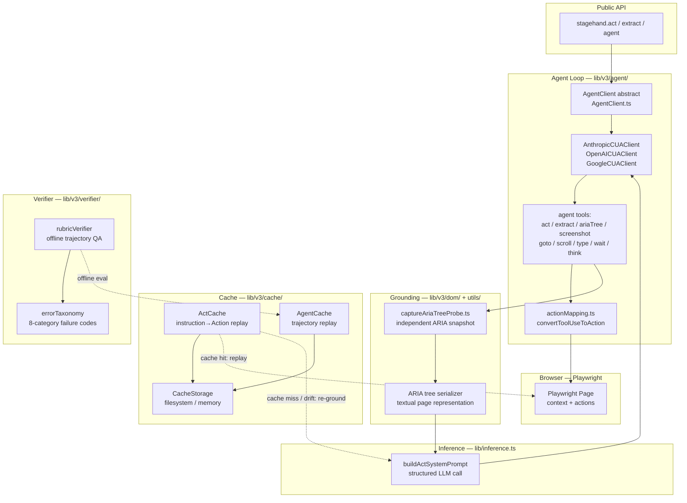
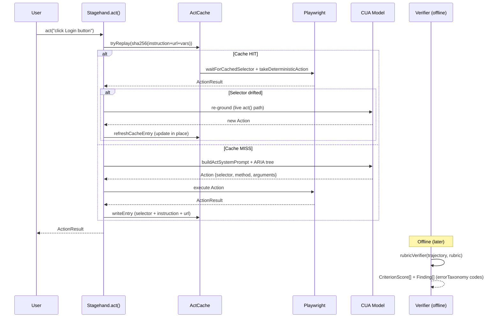

# Stagehand — Research Dossier

> Consolidated view of this repository: architecture diagrams, deep analysis through the Conxa lens, and file-level navigation. Analyzed as external prior art for Conxa's record→compile→distribute browser-automation platform.

**Contents:** [Architecture Diagrams](#architecture-diagrams) · [Deep Analysis](#deep-analysis-conxa-lens) · [File Navigation](#file-navigation)

---

## Architecture Diagrams


---

### Component Diagram



---

### Execution Flow Diagram



---

### Data Flow Diagram

```mermaid
flowchart LR
    subgraph "Intent"
        A[instruction: string\nurl: string\nvariableKeys: string[]] -->|sha256| B[CacheKey]
    end

    subgraph "Compiled Action"
        C[Action\n{selector, method, arguments[], description}]
    end

    subgraph "Cache"
        B -->|lookup| D{HIT?}
        D -->|yes| E[CachedActEntry\n{version, actions[], variableKeys[]}]
        D -->|no| F[LLM grounding path]
        F -->|inference.ts| G[structured output → Action]
        G --> C
        E --> C
        C -->|write if miss/drift| D
    end

    subgraph "Replay"
        C -->|waitForCachedSelector| H[Playwright waitForSelector]
        H -->|takeDeterministicAction| I[Browser action]
        I -->|ActionResult| J[success / selector_drift?]
        J -->|drift detected| F
    end

    subgraph "Verifier Evidence"
        K[TrajectoryStep\nagentEvidence: what LLM saw\nprobeEvidence: what harness captured\ntoolOutput]
        K --> L[rubricVerifier\ncriterion × evidence → CriterionScore\nerrorTaxonomy code]
    end

    style C fill:#d1e7dd,stroke:#0a3622
    style B fill:#cff4fc,stroke:#055160
```

---

## Deep Analysis (Conxa Lens)


> Source: `browserbasehq/stagehand` (`packages/core/lib/v3/`). Lens: Conxa's deterministic, record→compile→distribute, minimal-runtime-LLM philosophy.

### Executive Summary

Stagehand is an AI-native browser automation framework built on Playwright. It exposes three primitives: `act()` (single natural-language action), `extract()` (schema-driven structured extraction), and `agent()` (a multi-step CUA loop). Its defining feature relative to pure agent frameworks is a **two-layer caching + self-heal model**: the LLM grounds an instruction once, the resulting Playwright arguments (selector + method + args) are persisted under a content-hash key, and subsequent runs **replay deterministically with zero LLM tokens**. When a replayed selector drifts, the live grounding path re-derives it and the cache entry is silently refreshed ("self-heal"). A separate **rubric verifier** subsystem evaluates whole trajectories offline against criteria using multi-modal evidence (screenshots + independent accessibility-tree probes) and a structured 8-category error taxonomy.

For Conxa, Stagehand is a strong validation of the core thesis (cache-first deterministic replay; a11y tree as cheap textual ground truth) but is architecturally the inverse of Conxa at runtime: Stagehand is **LLM-in-the-loop by default and cached as an optimization**, whereas Conxa is **compiled-deterministic by default and LLM only as a recovery escalation**. The valuable ideas are the replay/refresh mechanics, the ARIA-tree-as-evidence pattern, and the verifier's error taxonomy. The pattern to reject is per-action live LLM grounding as the primary path.

### Architecture Overview

Five cooperating subsystems inside `lib/v3/`:

- **Agent loop** (`agent/`): `AgentClient` abstract base + provider CUA clients (`AnthropicCUAClient`, OpenAI, Google, Microsoft). Drives screenshot → model → tool_use → action → screenshot.
- **Tools** (`agent/tools/`): discrete capabilities the model can invoke — `act`, `extract`, `ariaTree`, `screenshot`, `goto`, `fillForm`, `scroll`, `wait`, `think`. Tools wrap the lower-level `act()`/`extract()` primitives.
- **Grounding** (`dom/`, `agent/utils/captureAriaTreeProbe.ts`): converts a live page into either a serialized accessibility tree (textual, token-cheap) or a screenshot (vision path) for the model.
- **Cache** (`cache/`): `ActCache` (single-action replay) and `AgentCache` (multi-step trajectory replay) over a pluggable `CacheStorage` (filesystem or in-memory).
- **Verifier** (`verifier/`): offline trajectory evaluation — `rubricVerifier` scores criteria against tiered evidence using the `errorTaxonomy`. This is an eval/QA subsystem, not a live runtime self-heal loop.

### Core Abstractions

1. **`AgentClient` (provider abstraction).** Abstract base (`AgentClient.ts`) defining `execute()`, `captureScreenshot()`, `setViewport()`, `setActionHandler()`, `setScreenshotProvider()`, `addContextNote()`. Each provider subclass adapts its Computer-Use API. The harness injects a screenshot provider and an action handler so the client stays transport-only; the host owns the browser. Clean seam for swapping models without touching the loop.

2. **Action (the cacheable unit of intent).** A grounded action is `{ selector, method, arguments[], description }` — the Playwright-executable result of grounding one instruction. Intent is represented at two levels: the human instruction string ("click the Login button") and the compiled `Action`. The cache key is `sha256(instruction + normalizedUrl + sortedVariableKeys)`; the value is the `Action[]`. This instruction→Action compilation is conceptually identical to Conxa's record→skill-package compile.

3. **Trajectory + Evidence + Rubric (the verification model).** A `Trajectory` is an ordered list of `TrajectoryStep`s, each carrying `agentEvidence` (tier-1: exact bytes the LLM ingested), `probeEvidence` (tier-2: independent harness-captured URL + screenshot + ARIA tree), and `toolOutput`. A `Rubric` is a list of weighted `RubricCriterion`s. The verifier fuses evidence per-criterion and emits `CriterionScore`s + taxonomy-coded `VerifierFinding`s.

### Execution Flow

**Init.** Host launches Playwright, constructs a provider `AgentClient`, wires `setScreenshotProvider` (page → base64 PNG) and `setActionHandler` (AgentAction → Playwright call). Cache storage is created from a cache dir (or memory).

**Planning / grounding.** For `act()`: the instruction + serialized DOM/ARIA is sent to the LLM (`inference.ts` → `buildActSystemPrompt`), which returns a structured `Action`. For the CUA agent: the loop sends a screenshot; the model returns `tool_use` blocks; `convertToolUseToAction` maps provider action types (click/type/scroll/drag/keypress, with coordinate-format normalization) to internal `AgentAction`s.

**Execution.** The action handler runs the Playwright call. In the CUA loop (`AnthropicCUAClient.executeStep`), after each tool the harness captures a fresh screenshot and the current URL and returns them as the `tool_result` — the screenshot is the feedback channel. Loop continues until the model emits no tool_use (done) or `maxSteps` (default 10).

**Validation.** Two distinct mechanisms: (a) inline — `extract()` returns a `completed` metadata flag; the agent self-assesses via screenshots. (b) offline — the `rubricVerifier` consumes a saved trajectory and scores it; this is QA/eval, decoupled from the live run.

**Recovery (cache path).** `ActCache.tryReplay` reads the entry, validates version + variable-key match, then for each cached action calls `waitForCachedSelector` then `takeDeterministicAction`. If a deterministic re-grounding produces different selectors (`haveActionsChanged`), the entry is rewritten — **self-heal as a cache refresh**, not a separate recovery tier.

### Data Model

- **`Action`**: `{ selector, method, arguments[], description }` — the deterministic, replayable unit.
- **`CachedActEntry`**: `{ version, instruction, url, variableKeys[], actions[], actionDescription, message }`. Key = sha256(instruction+url+variableKeys).
- **`CachedAgentEntry`**: `{ version, instruction, startUrl, options, configSignature, steps[], result, timestamp }`. `configSignature` includes model name, system prompt, CUA flag, tool keys, integrations — so a cache hit requires identical agent configuration. Replay zeroes out `usage` and stamps `metadata.cacheHit`.
- **`AgentReplayStep`**: tagged union (`act`, `fillForm`, `goto`, `scroll`, `wait`, `navback`, `keys`, `done`, `extract`, `screenshot`, `ariaTree`). Only interaction steps replay; `done`/`extract`/`screenshot`/`ariaTree` are no-ops on replay.
- **Verifier**: `Trajectory`, `TrajectoryStep`, `AgentEvidence` (modalities: text/image/json), `ProbeEvidence`, `Rubric`, `RubricCriterion`, `CriterionScore`, `VerifierFinding`, `ErrorTaxonomyCategory`.
- **Variables**: `%name%` placeholders in instructions; values are kept out of the cache key (only sorted keys are hashed) and substituted at replay — secrets never persist to disk.

### Reliability Strategy

- **Deterministic replay first.** Once grounded, actions replay without the model. Cache keyed on instruction + normalized URL + variable keys.
- **Variable-key gating.** Replay aborts to a cache miss if required variables are absent, preventing partial/incorrect replays.
- **Selector pre-wait.** `waitForCachedSelector` waits for the cached selector before acting, absorbing load-timing flakiness.
- **Config-signature isolation** (agent cache): different model/prompt/tool sets get different cache entries — no cross-config contamination.
- **Best-effort evidence.** `captureAriaTreeProbe` never throws; failures surface as `evidence_insufficient` rather than crashing the run.
- **Image compression** of conversation history (`compressConversationImages`) to control token growth across CUA steps.

### Recovery Strategy

- **Detection.** Live: replay action returns `success:false` → loop breaks. Offline: verifier compares agent claims against tier-1/tier-2 evidence ("evidence is ground truth; when claims conflict, evidence wins").
- **Classification.** The `errorTaxonomy` is a two-level, 8-category scheme: Selection Errors (wrong target/action/values), Hallucination Errors (output/action contradiction & fabrication), Execution & Strategy Errors, plus ambiguity/invalid-task categories. Each finding is coded (e.g. `1.3 Wrong action type`, `2.2 Action contradiction`).
- **Recovery.** Cache drift → re-ground via live `act()` deterministic path → rewrite cache entry (`refreshCacheEntry` / `refreshAgentCacheEntry`). No separate fallback tiers; recovery is "fall back to the full live grounding path."
- **Escalation.** Ultimately the CUA agent loop (vision + LLM) is the universal fallback — if deterministic replay can't proceed, the model re-plans from a screenshot. There is no graduated, token-tiered cascade like Conxa's.

### Scalability Characteristics

- **Token cost** scales with cache hit rate. Cold = full LLM grounding per action + per-step screenshots in CUA mode (expensive); warm = ~zero. No notion of a compiled, pre-validated package distributed ahead of execution.
- **Storage** is one JSON file per cache key; flat directory, content-hash names. Fine for a workspace, not a fleet.
- **Cross-machine transfer** exists in skeletal form: `AgentCache.consumeBufferedEntry` / `storeTransferredEntry` allow exporting a cached entry from a server run and importing it elsewhere — a primitive "compile once, distribute" hook.
- **Verifier** is offline and batch-oriented (consumes saved trajectories from disk), designed for eval harnesses; per-criterion top-K evidence selection keeps ~240k-token trajectories tractable.

### Strengths

- Cache-first deterministic replay genuinely removes the LLM from the hot path on repeat runs.
- Self-heal-as-refresh is elegant: one code path (live grounding) serves both first-run and recovery, and successful re-grounding upgrades the cache in place.
- Clean provider abstraction (`AgentClient`) — model-agnostic loop.
- ARIA tree as independent textual ground truth: cheap, non-visual, OCR-free verification of prices/names/dates.
- Rigorous, reusable error taxonomy for failure classification.
- Secret hygiene: variables hashed by key only, substituted at replay.

### Weaknesses

- **LLM-in-the-loop by default.** The primary path grounds every action with the model; caching is an optimization layered on top, not the contract. Cold runs and any cache miss are token-heavy.
- **CUA loop is screenshot-driven** — every step round-trips a PNG to the model. Vision-first, expensive, non-deterministic.
- **No multi-signal element identity.** A cache entry holds a single `selector` per action. When it breaks, there is no scored fallback (XPath/text/role/attributes) — recovery means re-invoking the LLM. This is exactly the gap Conxa's multi-signal fingerprint fills.
- **No graduated recovery cascade.** Binary: replay works, or fall back to full LLM grounding. No zero-token Tier-1/Tier-2 ladder.
- **Verifier is offline only** — not wired as a live self-heal trigger; it's an eval tool.
- **Flat file cache**, no packaging/signing/versioning/distribution model beyond a transfer-payload stub.

### LEARN

- A grounded action compiles to `{selector, method, arguments, description}` — a compact, replayable contract. Conxa's skill-package step is the richer analog.
- Cache key design: `sha256(instruction + normalizedUrl + sortedVariableKeys)`. URL normalization and variable-key gating are subtle correctness guards worth copying.
- ARIA tree captured by the *harness independently of the agent* gives a verifier ground truth the agent can't fabricate — a clean separation of "what the agent saw" vs "what was actually there."
- An explicit, coded error taxonomy turns failure analysis into structured, aggregatable data.

### ADAPT

- **Cache-refresh self-heal → Conxa runtime telemetry loop.** Stagehand rewrites the cache entry in place when re-grounding yields a better selector. Conxa can adapt this: when a Tier 3+ recovery succeeds, feed the recovered signal back to refine the skill package's element fingerprint (via Cloud, since Conxa compiles centrally) rather than mutating local state.
- **ARIA-tree probe → Conxa Tier 2 a11y resolution & assertion evidence.** Conxa already uses a11y at Tier 1/2; adopt Stagehand's pattern of capturing it as token-budgeted, truncation-marked *evidence* for `verifyAssertions()` — non-visual outcome validation with zero LLM.
- **`configSignature` gating → skill-package compatibility keying.** Conxa packages should carry an equivalent signature (target site version / app fingerprint) so a package isn't replayed against a drifted environment.

### IMPROVE

- **Recording.** Stagehand records *grounded outputs* (selector + method). Conxa records raw DOM events and compiles richer identity — keep that; Stagehand validates that capturing the executable form (not just the intent) is what makes replay deterministic.
- **Compiler.** Stagehand's "compile" is a runtime LLM grounding cached lazily. Conxa's ahead-of-time compiler with multi-signal identity + assertions is strictly stronger; Stagehand confirms the *value* of compilation, Conxa improves on *where and how thoroughly* it happens.
- **Runtime.** Conxa's 5-tier cascade with zero-token Tier 1/2 is a direct improvement over Stagehand's binary replay-or-LLM fallback. Preserve the invariant.
- **Recovery.** Adopt Stagehand's "re-ground then refresh" idea but slot it as Tier 3+ in the cascade, not as the only fallback.
- **Vision.** Stagehand's screenshot-per-step CUA loop is what Conxa should *avoid* at runtime; reserve vision for the highest recovery tier only.
- **MCP / skill packaging.** Stagehand's `consumeBufferedEntry`/`storeTransferredEntry` is a thin transfer stub; Conxa's signed `.exe` skill-package distribution is far more mature. No improvement to import here.

### AVOID

- Screenshot-per-step vision loops as a default execution model — high token cost, non-deterministic, slow.
- Single-selector cache entries with no scored fallback signals — brittle; one DOM change forces an LLM round-trip.
- Treating caching as a bolt-on optimization rather than the execution contract — leaves the cold/miss path expensive and unbounded.
- Letting the agent's self-reported `completed` flag be the only success signal (hallucination risk) — Stagehand itself mitigates this with the independent verifier.

### REJECT

- **LLM-in-the-loop as the primary grounding path.** Fundamentally conflicts with Conxa's deterministic-first, zero-token-Tier-1/2 invariant. Conxa must keep the model out of the hot path and out of selector/a11y resolution entirely.
- **Offline-only verification as the sole quality gate.** Conxa needs live, in-cascade outcome validation (`verifyAssertions()`), not just a post-hoc eval harness.
- **Lazy runtime compilation.** Conxa compiles ahead of time in the Build Studio; deferring grounding to runtime would reintroduce per-run LLM cost and non-determinism on the customer's machine — the exact thing Conxa's architecture exists to eliminate.

---

## File Navigation


### Repository Summary

- **Purpose**: AI-native browser automation framework combining LLM-driven action with deterministic code. Three core primitives: `act()` (single action), `agent()` (multi-step loop), `extract()` (structured data). Key innovation: auto-caching of actions + self-healing when cached actions fail. Built on Playwright + CUA (Computer Use Agent) model clients.
- **Estimated size**: ~300 TypeScript source files across 5 packages; total repo ~500 files
- **Main language**: TypeScript (Turbo monorepo, pnpm workspaces, esbuild)
- **Architectural style**: Monorepo with a core library (`packages/core`), HTTP server wrapper (`packages/server-v3`), CLI (`packages/cli`), evaluation harness (`packages/evals`), and docs

---

### Entry Points

| Entry | Path | Purpose |
|-------|------|---------|
| npm package | `packages/core` (`@browserbasehq/stagehand`) | Main library import |
| HTTP API | `packages/server-v3` (Fastify) | REST wrapper for non-Node clients |
| CLI | `packages/cli` | `npx create-browser-app` + direct commands |
| MCP example | `packages/core/examples/mcp.ts` | Shows Stagehand as MCP tool provider |
| v3 API | `packages/core/lib/v3/index.ts` | Current API surface |

---

### Core Components

| Component | Path | Purpose |
|-----------|------|---------|
| **v3 Agent** | `lib/v3/agent/` | Multi-step agent loop — drives CUA model clients |
| **AgentClient (abstract)** | `lib/v3/agent/AgentClient.ts` | Base class for all model integrations; defines `execute()`, `captureScreenshot()`, `setActionHandler()` |
| **CUA Clients** | `lib/v3/agent/AnthropicCUAClient.ts`, `OpenAICUAClient.ts`, `GoogleCUAClient.ts`, `MicrosoftCUAClient.ts` | Adapters for each provider's Computer Use API |
| **Agent Tools** | `lib/v3/agent/tools/` | Discrete browser actions: act, click, type, scroll, extract, screenshot, goto, wait, think |
| **DOM layer** | `lib/v3/dom/` | Accessibility tree + ARIA snapshot extraction for grounding |
| **Cache** | `lib/v3/cache/` | Persists action sequences; replays without LLM on repeat runs |
| **Handlers** | `lib/v3/handlers/` | Event routing between tools and browser |
| **Verifier** | `lib/v3/verifier/` | Validates action outcomes; triggers self-heal if action fails |
| **LLM** | `lib/v3/llm/` | Model abstraction (non-CUA path for `act`/`extract`) |
| **Inference** | `lib/inference.ts` | Core LLM call logic for structured output |
| **Prompt** | `lib/prompt.ts` | System prompt templates |
| **MCP** | `lib/v3/mcp/` | Exposes Stagehand tools via MCP protocol |
| **External clients** | `lib/v3/external_clients/` | Browserbase + other remote browser integrations |

---

### Important Files

#### HIGH VALUE

| File | Why |
|------|-----|
| `lib/v3/agent/AgentClient.ts` | Defines the abstract interface all CUA integrations implement: `execute()`, `captureScreenshot()`, `setActionHandler()`, `setViewport()`, `addContextNote()` |
| `lib/v3/agent/AnthropicCUAClient.ts` | Anthropic-specific Computer Use implementation — most relevant for Claude integration |
| `lib/v3/agent/tools/index.ts` | Tool registry — all discrete browser actions available to the agent |
| `lib/v3/agent/tools/act.ts` | `act()` — single action execution with LLM grounding |
| `lib/v3/agent/tools/extract.ts` | `extract()` — structured data extraction from page |
| `lib/v3/agent/utils/actionMapping.ts` | Maps CUA model action types to Playwright calls |
| `lib/v3/agent/utils/captureAriaTreeProbe.ts` | ARIA tree capture — page state representation sent to LLM |
| `lib/v3/cache/` | Caching system — action replay without LLM |
| `lib/v3/verifier/` | Self-healing — detects action failure, re-invokes LLM |
| `lib/v3/mcp/` | MCP integration — exposes Stagehand as tool provider |
| `lib/inference.ts` | Core inference call; handles structured output, retries |
| `lib/v3/index.ts` | v3 public API exports |

#### MEDIUM VALUE

| File | Why |
|------|-----|
| `lib/v3/agent/OpenAICUAClient.ts` | OpenAI Computer Use adapter — comparison point |
| `lib/v3/agent/tools/fillform.ts`, `fillFormVision.ts` | Form filling — both DOM and vision paths |
| `lib/v3/agent/tools/think.ts` | LLM reasoning step within action loop |
| `lib/v3/agent/utils/coordinateNormalization.ts` | Vision-based coordinate normalization for click accuracy |
| `lib/v3/dom/` | DOM/ARIA extraction for text-based grounding |
| `lib/v3/launch/` | Browser launch and session lifecycle |
| `lib/v3/handlers/` | Action event dispatch |
| `lib/v3/understudy/` | Secondary/fallback agent path |
| `lib/prompt.ts` | Prompt design — system prompts for act/extract |
| `packages/server-v3/src/` | HTTP wrapper for multi-language clients |
| `lib/v3/agent/utils/captchaSolver.ts` | CAPTCHA handling in agent loop |

#### LOW VALUE

| File | Why |
|------|-----|
| `packages/evals/` | Evaluation harness — testing only |
| `packages/docs/` | Documentation source |
| `packages/core/examples/` | Example scripts |
| `packages/core/scripts/` | Build scripts |
| `lib/v3/flowlogger/` | Telemetry/logging |
| `lib/v3/shutdown/` | Graceful shutdown |
| `lib/logger.ts`, `lib/inferenceLogUtils.ts` | Logging utilities |
| `media/` | Brand assets |
| `.github/` | CI/CD |
| `.changeset/` | Version management |

---

### Architecture-Relevant Areas

**Execution logic**
- `lib/v3/agent/` — full agent loop: screenshot → CUA model → action → verify → repeat
- `lib/v3/agent/tools/act.ts` — single action with grounding via ARIA/DOM

**Locator logic**
- `lib/v3/agent/utils/captureAriaTreeProbe.ts` — ARIA tree as page representation
- `lib/v3/agent/tools/ariaTree.ts` — ARIA tree tool exposed to LLM
- `lib/v3/dom/` — DOM serialization for text-mode grounding (non-vision path)

**Recovery / reliability logic**
- `lib/v3/verifier/` — post-action validation; detects when page state doesn't match expected outcome
- `lib/v3/cache/` — replays cached action sequences; self-heal when cache misses or actions fail

**Vision logic**
- `lib/v3/agent/tools/screenshot.ts` — screenshot capture at each step
- `lib/v3/agent/utils/coordinateNormalization.ts` — normalize model-output coordinates to viewport
- `lib/v3/agent/tools/fillFormVision.ts` — vision-based form filling (vs. DOM-based)

**MCP logic**
- `lib/v3/mcp/` — wraps Stagehand actions as MCP tools
- `packages/core/examples/mcp.ts` — reference implementation

---

### Ignore Recommendations

| Area | Reason | Estimated % |
|------|--------|------------|
| `packages/evals/` | Benchmark/eval harness | ~15% |
| `packages/docs/` | Documentation | ~10% |
| `packages/core/examples/` | Example scripts | ~5% |
| `packages/core/scripts/` | Build tooling | ~3% |
| `media/` | Images and brand assets | ~2% |
| `.github/`, `.husky/`, `.changeset/` | CI, git hooks, changelogs | ~3% |
| `lib/v3/flowlogger/`, `lib/v3/shutdown/` | Telemetry and lifecycle | ~3% |
| Legacy evaluator files (`v3Evaluator.ts`, `v3LegacyEvaluator.ts`) | Testing only | ~2% |

**Estimated ignorable: ~43%**. Focus on `packages/core/lib/v3/agent/` and `lib/v3/{cache,verifier,mcp}/`.
