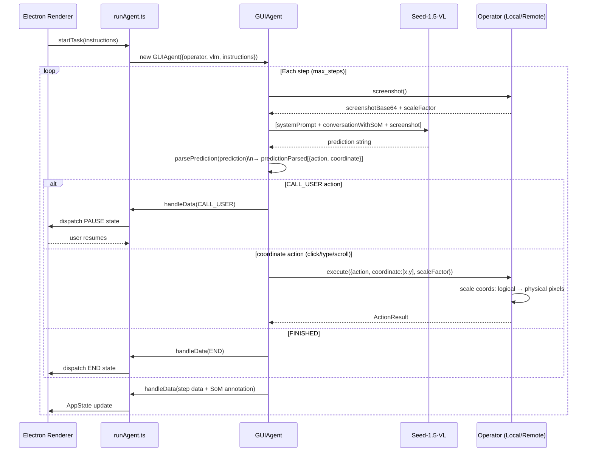

# UI-TARS Desktop — Research Dossier

> Consolidated view of this repository: architecture diagrams, deep analysis through the Conxa lens, and file-level navigation. Analyzed as external prior art for Conxa's record→compile→distribute browser-automation platform.

**Contents:** [Architecture Diagrams](#architecture-diagrams) · [Deep Analysis](#deep-analysis-conxa-lens) · [File Navigation](#file-navigation)

---

## Architecture Diagrams


---

### Component Diagram

```mermaid
graph TD
    subgraph "Entry — Electron App"
        A[apps/ui-tars/src/main/\nElectron main process]
        B[apps/ui-tars/src/renderer/\nReact UI]
        C[apps/ui-tars/src/preload/\nIPC bridge]
    end

    subgraph "Agent Orchestration — main/services/"
        D[runAgent.ts\nGUIAgent instantiation + loop]
        E[GUIAgent\npackages/agent-infra/src/agent/]
        F[handleData callback\nSoM annotation + AppState dispatch]
    end

    subgraph "Operators — agent-infra/src/operator/"
        G[LocalComputerOperator\nnutjs keyboard/mouse on host OS]
        H[LocalBrowserOperator\nPlaywright page control]
        I[RemoteComputerOperator\nRDP / remote desktop]
        J[RemoteBrowserOperator\nremote Playwright session]
    end

    subgraph "VLM Inference"
        K[Seed-1.5-VL / GPT-4o\nvia OpenAI-compatible API]
        L[screenshotContext\n{scaleFactor, physicalSize, logicalSize}]
        M[predictionParsed\n[{action, coordinate:[x,y], value?}]]
    end

    subgraph "SoM Annotation"
        N[markClickPosition\ndraw bounding boxes on screenshot]
        O[conversationWithSoM\nVLM message history + annotated images]
    end

    subgraph "State Machine"
        P[AppState: INIT/RUNNING/PAUSE/END/ERROR]
        Q[CALL_USER action\npause for human input]
    end

    A --> D
    D --> E
    E --> K
    K --> M
    M --> G & H & I & J
    E --> F
    F --> N
    N --> O
    O --> K
    E --> P
    M -->|CALL_USER| Q
    Q --> P
    B --> C --> A
```

---

### Execution Flow Diagram



---

### Data Flow Diagram

```mermaid
flowchart LR
    subgraph "Input"
        A[instructions: string\noperator config\nVLM endpoint]
    end

    subgraph "Perception"
        B[screenshot()\nbase64 PNG]
        C[screenshotContext\n{scaleFactor\nphysicalSize {w,h}\nlogicalSize {w,h}}]
    end

    subgraph "VLM Reasoning"
        D[conversationWithSoM\nmessage[] with annotated screenshots]
        E[VLM response: prediction string\ne.g. click(100, 200) or type('hello')]
        F[predictionParsed\n[{action: 'click'\ncoordinate: [100, 200]\nvalue?: string}]]
    end

    subgraph "SoM Annotation"
        G[markClickPosition\ndraw bounding box at coordinate]
        H[annotated screenshot\nreinjected into conversationWithSoM]
    end

    subgraph "Execution"
        I[operator.execute\naction + scaleFactor]
        J[physical pixel mapping\nlogical × scaleFactor]
        K[keyboard/mouse event\nor CDP dispatchMouseEvent]
    end

    subgraph "AppState"
        L[RUNNING → step update → RUNNING\nor PAUSE / END / ERROR]
    end

    A --> B --> C
    C --> D --> E --> F
    F --> G --> H --> D
    F --> I --> J --> K
    K --> L

    style F fill:#d1e7dd,stroke:#0a3622
    style C fill:#cff4fc,stroke:#055160
```

---

## Deep Analysis (Conxa Lens)


> Lens: **Conxa** — deterministic, record→compile→runtime, MCP-native, enterprise SaaS. UI-TARS is the polar opposite: VLM-first, screenshot-first, no compiled skill packages, no DOM selectors. Its value is in **recovery-tier vision concepts**, not as an architectural model.

---

### Executive Summary

UI-TARS Desktop is an Electron application that allows a user to give a natural-language instruction ("book a flight to Paris") and have a VLM (Seed-1.5-VL/1.6 series) complete it by looking at screenshots and controlling the computer or browser. The architecture is:

**instruction → screenshot → VLM → `predictionParsed` (action + coordinates) → operator executes → repeat**

There is no recorder, no compiler, no compiled artifact, no selector library, no fingerprint, no multi-signal element identity. Every run re-perceives from scratch. The VLM is in the loop on **every single step**, making this the most LLM-heavy system in the corpus. Element "localization" is pixel-coordinate-based: the model outputs `click(x, y)` and the operator moves the cursor there.

For Conxa, UI-TARS is most valuable as a **model for the highest recovery tiers** — when compiled selectors and a11y fail completely and the system needs to re-perceive the page as a human would. The `GUIAgent` SDK, the operator abstraction, Set-of-Marks (SoM) annotation, and coordinate normalization are directly relevant. The execution model as a whole is not.

---

### Architecture Overview

**Subsystems**

- **`GUIAgent` SDK** (`@ui-tars/sdk`): the brain. Orchestrates screenshot → VLM call → parse prediction → execute operator → loop. Accepts `model` (VLM config), `systemPrompt`, `operator`, `onData` callback, abort signal. Completely VLM-driven; no deterministic path.
- **Operator abstraction** (`Operator` enum + operator classes): pluggable execution backend.
  - `NutJSElectronOperator` — OS-level input via NutJS (cross-platform mouse/keyboard injection)
  - `DefaultBrowserOperator` / `RemoteBrowserOperator` — browser-level via `@ui-tars/operator-browser` (Playwright-based)
  - `RemoteComputerOperator` — cloud-hosted desktop (remote execution mode)
- **Electron main process** (`apps/ui-tars/src/main/main.ts`): app lifecycle, IPC, window management, accessibility permissions.
- **`runAgent.ts`** (services): top-level agent runner — resolves operator type, builds `GUIAgent`, wires `onData` callback that (a) annotates screenshots with Set-of-Marks markers, (b) pushes state updates to the renderer.
- **Agent-infra packages** (`packages/agent-infra/`): reusable infrastructure — browser-use (browser operator with DOM layer), mcp-servers (MCP tools for browser/filesystem/search/commands), mcp-client.
- **Renderer** (`apps/ui-tars/src/renderer/`): React UI — user types instruction, sees conversation with annotated screenshots, status.

**Data flow**

```
User instruction
  → runAgent() resolves operator (LocalComputer / LocalBrowser / Remote*)
  → GUIAgent(model, systemPrompt, operator, onData)
  → GUIAgent loop:
      screenshot() [via operator]
      → VLM call (systemPrompt + screenshot + history)
      → parse predictionParsed: [{action, coordinate, params}]
      → operator.execute(action, coordinate)
      → onData({status, conversations})
        → markClickPosition (SoM annotation on screenshot)
        → setState (Electron IPC → renderer)
      → next step
  → until status = FINISH / ERROR / CALL_USER
```

---

### Core Abstractions

1. **`GUIAgent` (the SDK orchestrator).** Accepts a model config + operator + system prompt; runs the perceive→act loop; calls `onData` each step with full `conversations` array (screenshot + predictionParsed + status). Completely abstract over the VLM provider and the execution target.

2. **`predictionParsed` (the action contract).** The VLM's structured output per step: an array of action objects, each with `action` (type: click/type/scroll/drag/hotkey/screenshot/finished), `coordinate` ([x, y] in screen space), optional `text` (for type), `button`, `direction`, `amount`. This is the "executable intent" — the only thing the operator needs to act.

3. **Operator interface** (pluggable execution). Four implementations sharing one interface: `screenshot()`, `execute(action)`, `getScreenSize()`. Computer operators inject OS-level input (NutJS → Windows SendInput / macOS CGEvent); browser operators drive Playwright. The seam means the same VLM loop works against desktop apps and browsers with no loop changes.

4. **Set-of-Marks (SoM) annotation** (`markClickPosition`). After each VLM step, the screenshot is re-encoded with a visual marker (circle/dot) at the predicted click coordinates. This gives the user (and the verifier) a ground-truth overlay of where the VLM intended to click — independent of whether the click actually landed correctly.

5. **System prompt versioning** (`getSpByModelVersion`, `getSpByModelVersion`). The system prompt that tells the VLM how to format its output changes per model version (Seed-1.5-VL vs 1.6). Versioned prompt selection means VLM upgrades can be deployed without changing the loop.

---

### Execution Flow

**Init.** Electron app starts; accessibility permissions ensured (macOS: `app.setAccessibilitySupportEnabled(true)`, Windows: `force-renderer-accessibility` command-line switch). `ElectronStore` initialized for settings persistence.

**Operator selection** (`runAgent`). Based on `settings.operator` enum: LocalComputer → NutJS; LocalBrowser → Playwright via `DefaultBrowserOperator`; Remote* → proxy to cloud. Remote mode swaps model config (uses a hosted free-tier VLM via proxy URL + auth headers) so local API keys aren't required.

**Agent loop** (`GUIAgent`). Each step:
1. Call `operator.screenshot()` → base64 PNG.
2. Build messages: systemPrompt + conversation history + current screenshot.
3. VLM call (streaming or non-streaming) → parse structured prediction.
4. `operator.execute(predictionParsed[i])` for each action in the step.
5. Call `onData` → renderer update.
6. Status check: continue / FINISH / ERROR / CALL_USER (human-in-the-loop pause).

**CALL_USER mode.** The loop pauses and signals the renderer; the user can continue (e.g., solve a CAPTCHA or 2FA manually), and the agent resumes. This is the explicit human-in-the-loop escape hatch.

**Validation.** No explicit assertions or outcome validation — validation is entirely implicit: the VLM observes the post-action screenshot and decides if the goal was achieved. No `verifyAssertions()` equivalent.

**Recovery.** None beyond "retry with the next screenshot." If a click lands wrong, the VLM sees the result in the next screenshot and can issue a corrective action. There is no typed error, no tiered fallback, no selector fallback. The VLM IS the recovery mechanism.

---

### Data Model

- **`AppState`**: `{ status: StatusEnum, instructions: string, messages: ConversationWithSoM[], abortController, browserAvailable, restUserData }`. The entire runtime state in one Electron store slice.
- **`ConversationWithSoM`**: extends the base `conversation` (screenshot, predictionParsed, screenshotContext) with `screenshotBase64WithElementMarker` — the SoM-annotated screenshot.
- **`predictionParsed`**: `Array<{ action: ActionType, coordinate?: [x, y], text?: string, button?: string, direction?: string, amount?: number }>`. This is the executable unit — coordinate-based, not selector-based.
- **`screenshotContext`**: `{ size: { width, height }, scaleFactor }` — viewport dimensions for coordinate normalization.
- **`UITarsModelConfig`**: `{ baseURL, apiKey, model, useResponsesApi }` — VLM connection config. Model agnostic (any OpenAI-compatible endpoint).
- **`SettingStore`**: persistent (ElectronStore-backed) — VLM provider, API key, model name, operator preference, language, search engine.

---

### Reliability Strategy

UI-TARS's reliability strategy is almost entirely **"trust the VLM to self-correct via the next screenshot."** There is minimal explicit reliability engineering:

- **Abort signal propagation**: `AbortController` lets the user or system cancel mid-run; every async operation checks the signal.
- **Operator isolation**: LocalBrowser checks browser availability before the loop starts; fails early with a user-friendly error.
- **CALL_USER escape hatch**: explicit pause mechanism for human-verification moments (CAPTCHA, 2FA, ambiguous decisions).
- **Remote mode**: if a local VLM isn't available, the remote operator + hosted model is the fallback — reliability through redundant execution modes.
- **No timeouts, no retries, no exception-classified fallback ladder.** If the browser crashes or the VLM returns junk, the `onError` callback surfaces the raw error JSON.

---

### Recovery Strategy

**Detection.** Implicit — the VLM observes post-action screenshots and detects its own mistakes ("the button is still there, I should click it again"). No programmatic detection of failed actions.

**Classification.** None. There is no error taxonomy, no typed failure modes.

**Recovery.** The VLM issues corrective actions on the next step. This works for forgiving UIs and simple corrections but is unreliable for pages that require precise timing, for modals that change the DOM unexpectedly, or for actions that have irreversible consequences.

**Escalation.** `CALL_USER` is the only escalation path — pause and wait for human intervention. There is no tiered cascade, no zero-token intermediate step, no a11y fallback, no alternate-selector path.

---

### Scalability Characteristics

- **Token cost**: massive. Every step sends a full-resolution screenshot to the VLM. For a 10-step task at typical VLM pricing, this is expensive at scale.
- **Speed**: slower than selector-based automation. VLM inference latency per step is 1–5 seconds; a 20-step task takes 20–100 seconds of pure VLM time.
- **Enterprise readiness**: low. No audit trail beyond screenshots, no deterministic replay, no skill sharing, no versioned packages, no fleet deployment, no telemetry pipeline.
- **Maintainability**: high within the Electron app itself (clean separation of concerns, TypeScript, Turbo monorepo). Low from an automation perspective — a UI change requires the VLM to re-reason rather than a re-compile.
- **Operational burden**: high per customer (VLM API keys required locally or remote mode). No offline operation without a VLM endpoint.

---

### Strengths

- **Zero configuration for automation.** Users don't record, don't compile, don't write selectors — they just describe the task.
- **Generalizes to any UI.** Native desktop apps, browser, even non-web GUIs — anything that can be screenshotted.
- **Self-correcting via perception.** The VLM sees the current state on every step; it can recover from minor mistakes by observing their consequences.
- **Clean operator abstraction.** Local/remote × computer/browser covered by four implementations sharing one interface.
- **Set-of-Marks annotation.** Visual ground-truth overlay of VLM intent on screenshots — excellent for debugging and user trust.
- **CALL_USER mechanism.** Explicit human-in-the-loop escape for ambiguous or sensitive moments.
- **Remote model support.** Free/hosted VLM path removes the local API key requirement for end users.

---

### Weaknesses

- **No compiled skill packages.** Every run requires VLM inference from scratch — no deterministic fast path, no offline operation.
- **No multi-signal element identity.** The VLM's pixel coordinates are brittle at layout changes, zoom/scale shifts, DPI differences, partial renders.
- **VLM-in-the-loop on every step.** Expensive, slow, and non-deterministic — the opposite of enterprise SaaS reliability.
- **No programmatic recovery.** When a click misses, the only recovery is "trust the VLM to notice and correct on the next step." This fails for strict timing, form validation, and irreversible actions.
- **No assertions or outcome validation.** There is no `verifyAssertions()` — the task is "done" when the VLM says so.
- **Screenshot fidelity dependency.** A slightly slow renderer, a loading spinner, or a shadow element that briefly occludes the target can fool the VLM.
- **Coordinate fragility at DPI boundaries.** `screenshotContext.scaleFactor` partially mitigates this, but HiDPI + remote rendering combinations create coordinate-space mismatches.

---

### LEARN

- **`GUIAgent` + operator interface = clean perception-execution loop.** The decomposition into (a) loop/model, (b) screenshot/action interface, (c) pluggable execution backend is clean and worth studying. The operator abstraction lets the same perception loop target desktop and browser without loop changes.
- **Set-of-Marks (SoM) annotation is low-cost ground truth.** Drawing a click marker on the screenshot at the VLM's predicted coordinates gives a cheap, pixel-level audit trail. Does not require DOM access. Useful for any vision-based action: show WHERE the system thinks it clicked.
- **System prompt versioning.** Versioned prompts per model version allow VLM upgrades without changing the loop or re-recording skills.
- **`screenshotContext.scaleFactor`** for coordinate normalization is essential for cross-DPI operation. Any vision-based component Conxa builds must track scaleFactor.
- **CALL_USER as a first-class concept.** An explicit "pause and hand to the human" state is better than silent failure. Relevant to Conxa's human-escalation in recovery.

---

### ADAPT

- **VLM perception loop → Conxa Tier 4/5 vision recovery.** The `GUIAgent` screenshot→VLM→coordinate→execute loop is directly adaptable as a recovery tier when all lower tiers fail. It should be a last resort (expensive, non-deterministic), not a primary path.
- **Operator interface → Conxa's `withLocator` abstraction.** Conxa's runtime resolves elements through a tiered selector chain. The operator interface pattern (single `execute(action)` method, pluggable implementations) is a clean model for making Conxa's lower resolution tiers (Tier 1/2) and VLM recovery tiers (Tier 4/5) share one action-execution contract.
- **SoM annotation → Conxa telemetry.** When Conxa's vision recovery fires (Tier 4+), annotate the recovery screenshot with a SoM marker at the resolved coordinate. Ship this to telemetry so the Conxa Cloud can flag coordinate drift from the compiled bounding-box anchor.
- **CALL_USER → Conxa skill execution pause.** Conxa already has human-in-the-loop implied by Claude Desktop interaction; formalize a "pause skill and await human" MCP response to surface ambiguous recovery decisions to the user.

---

### IMPROVE

- **Recovery (Tier 4/5).** The Conxa recovery cascade should add a vision tier that mirrors UI-TARS's screenshot→VLM path, but only after compiled selectors (Tier 1), a11y (Tier 2), and semantic LLM re-grounding (Tier 3) have been exhausted.
- **Recording.** Conxa's recorder could capture `screenshotContext` (viewport + scaleFactor) alongside DOM events. This enables post-compilation bounding-box anchors that the vision recovery tier can use to narrow VLM coordinate search to the expected region.
- **Compiler.** Compiler could emit a `bbox_anchor` per step — the element's expected bounding box. Vision recovery would then ask the VLM to find the target within ±N pixels of the anchor, dramatically reducing coordinate search space vs. full-screen VLM.

---

### AVOID

- **VLM-per-step as the primary execution path.** Every step requiring a VLM call is incompatible with Conxa's Tier 1/2 zero-token invariant and with enterprise-scale economics.
- **Coordinate-only element identity.** `click(x, y)` with no DOM fallback is fragile at layout reflows, responsive design, DPI changes, and dynamic content. Should only appear in recovery, never in the compiled skill.
- **Implicit outcome validation.** Relying on the VLM to self-assess success via screenshots leads to hallucinated completions. Conxa must keep explicit `verifyAssertions()` as a programmatic gate.
- **No typed error taxonomy.** Without classification of failure causes, telemetry cannot diagnose systemic problems (e.g., "login modal consistently breaks vision recovery on this app version").

---

### REJECT

- **"Trust the VLM to self-correct"** as a recovery strategy for enterprise SaaS. Enterprise customers need deterministic, auditable outcomes. Non-deterministic VLM self-correction produces inconsistent results that are impossible to SLA-guarantee.
- **Vision as the primary locator path.** Screenshot-based coordinate targeting is the most expensive, slowest, and most brittle locator strategy available. Conxa's multi-signal DOM-first locator cascade is strictly superior for all cases where the DOM is accessible.
- **Implicit compilation** (no compile step at all). UI-TARS proves that inference-only automation can generalize, but it also demonstrates why it can't scale: every user pays VLM inference cost every time, there's no shared knowledge between runs, and there's no improvement over time without explicit feedback loops.

---

## File Navigation


### Repository Summary

- **Purpose**: Electron desktop application powered by a vision-language model (VLM) that automates computer and browser tasks via natural language commands. The agent observes the screen via screenshots, reasons about what to do, and executes mouse/keyboard actions. Supports local privacy-preserving execution. Built by Bytedance.
- **Estimated size**: ~500 TypeScript/React files across 4 packages + 1 Electron app
- **Main language**: TypeScript (Electron + React renderer; Node.js main process)
- **Architectural style**: Electron monorepo (Turbo + pnpm); main/renderer/preload process split; agent-infra packages for reusable agent components; VLM-first (coordinate-based, not DOM-selector-based)

---

### Entry Points

| Entry | File | Purpose |
|-------|------|---------|
| Electron app | `apps/ui-tars/src/main/main.ts` | App initialization, window creation, IPC setup |
| IPC routes | `apps/ui-tars/src/main/ipcRoutes/index.ts` | All IPC channel definitions between main and renderer |
| Agent runner | `apps/ui-tars/src/main/services/runAgent.ts` | Starts the VLM agent loop |
| Renderer UI | `apps/ui-tars/src/renderer/` | React-based user interface |
| Agent-infra browser-use | `packages/agent-infra/browser-use/src/index.ts` | Browser automation layer used by agents |
| MCP servers | `packages/agent-infra/mcp-servers/` | MCP tool server for browser, filesystem, search |

---

### Core Components

| Component | Path | Purpose |
|-----------|------|---------|
| **Electron main** | `apps/ui-tars/src/main/main.ts` | App lifecycle, accessibility permissions, window mgmt, IPC registration |
| **Agent runner** | `apps/ui-tars/src/main/services/runAgent.ts` | Executes the VLM agent loop; calls VLM → parses action → executes |
| **UTIO service** | `apps/ui-tars/src/main/services/utio.ts` | UI-TARS Input/Output — system-level mouse/keyboard control |
| **Window manager** | `apps/ui-tars/src/main/services/windowManager.ts` | Manages multiple Electron windows |
| **IPC routes** | `apps/ui-tars/src/main/ipcRoutes/` | Typed IPC channels: agent control, settings, screenshots |
| **Store** | `apps/ui-tars/src/main/store/` | Electron-store backed state (settings, agent history) |
| **Browser operator** | `packages/agent-infra/browser-use/src/operator.ts` | `Operator` class — translates agent actions to browser commands |
| **Agent (browser-use)** | `packages/agent-infra/browser-use/src/agent/` | Browser-specific agent loop |
| **DOM (browser-use)** | `packages/agent-infra/browser-use/src/dom/` | DOM extraction for browser agent |
| **MCP servers** | `packages/agent-infra/mcp-servers/` | browser, commands, filesystem, search tool servers |
| **MCP client** | `packages/agent-infra/mcp-client/` | MCP client connecting to tool servers |
| **UI-TARS package** | `packages/ui-tars/src/` | Shared VLM interaction types and utilities |
| **Common** | `packages/common/` | Cross-package utilities |

---

### Important Files

#### HIGH VALUE

| File | Why |
|------|-----|
| `apps/ui-tars/src/main/services/runAgent.ts` | **Core agent loop** — screenshots the screen, calls VLM API, parses action (click/type/scroll/key), dispatches via UTIO |
| `apps/ui-tars/src/main/services/utio.ts` | **System input** — mouse movement, click, keyboard injection at OS level (not browser) |
| `packages/agent-infra/browser-use/src/operator.ts` | `Operator` — maps VLM action types to Playwright/CDP browser calls; coordinate normalization |
| `packages/agent-infra/browser-use/src/agent/` | Browser-specific agent loop; interfaces with VLM for browser tasks |
| `packages/agent-infra/browser-use/src/dom/` | DOM state extraction for browser agent grounding |
| `apps/ui-tars/src/main/ipcRoutes/` | All IPC channel definitions — how renderer triggers agent actions |
| `packages/agent-infra/mcp-servers/browser/` | MCP tool server for browser control |
| `packages/agent-infra/mcp-client/` | MCP client implementation |
| `apps/ui-tars/src/main/store/` | Settings and agent state persistence |

#### MEDIUM VALUE

| File | Why |
|------|-----|
| `apps/ui-tars/src/main/main.ts` | Electron startup — accessibility permissions, squirrel setup, window creation |
| `apps/ui-tars/src/main/services/browserCheck.ts` | Checks browser availability before agent runs |
| `apps/ui-tars/src/main/services/settings.ts` | VLM endpoint configuration, API key management |
| `apps/ui-tars/src/main/services/windowManager.ts` | Multi-window management for agent + UI |
| `apps/ui-tars/src/preload/` | Secure IPC bridge between main and renderer |
| `apps/ui-tars/src/renderer/` | React UI — task input, agent status, history display |
| `packages/agent-infra/browser-use/src/context.ts` | Browser context lifecycle |
| `packages/agent-infra/mcp-servers/commands/` | Shell command execution MCP tool |
| `packages/agent-infra/mcp-servers/search/` | Web search MCP tool |
| `packages/agent-infra/browser-use/src/prompts.ts` | System prompts for browser agent |

#### LOW VALUE

| File | Why |
|------|-----|
| `docs/` | Documentation |
| `rfcs/` | Design proposals (historical) |
| `infra/` | Infrastructure / deployment |
| `patches/` | Dependency patches |
| `.changeset/` | Version management |
| `scripts/` | Build scripts |
| `.github/` | CI/CD |
| `apps/ui-tars/src/main/menu.ts` | Electron menu bar |
| `apps/ui-tars/src/main/tray.ts` | System tray icon |
| `apps/ui-tars/src/main/electron-updater/` | Auto-update mechanism |
| `packages/agent-infra/mcp-benchmark/` | Benchmarking harness |

---

### Architecture-Relevant Areas

**Vision logic**
- `services/runAgent.ts` — captures screenshot at each step; encodes and sends to VLM
- VLM (Seed-1.5-VL / 1.6 series) processes screenshot → returns action with coordinates
- No DOM-selector-based locating — entirely coordinate-based from VLM output

**Execution logic**
- `services/utio.ts` — OS-level mouse/keyboard execution (desktop tasks)
- `packages/agent-infra/browser-use/src/operator.ts` — browser-specific action execution
- Action types: `click(x,y)`, `type(text)`, `scroll(x,y,direction)`, `key(combo)`, `screenshot`

**Locator logic**
- No traditional CSS/XPath locators — VLM outputs pixel coordinates
- `packages/agent-infra/browser-use/src/dom/` — supplementary DOM extraction for browser agent grounding when coordinates aren't sufficient

**MCP logic**
- `packages/agent-infra/mcp-servers/` — browser, commands, filesystem, search tool servers
- `packages/agent-infra/mcp-client/` — connects agent to tool servers
- Agent can invoke MCP tools mid-task for web search, file access, shell commands

**Reliability logic**
- `services/runAgent.ts` — step loop with max iterations; error capture per step
- VLM action verification via next screenshot comparison (implicit)

---

### Ignore Recommendations

| Area | Reason | Estimated % |
|------|--------|------------|
| `docs/` | Documentation | ~5% |
| `rfcs/` | Historical design docs | ~3% |
| `infra/` | Cloud deployment | ~5% |
| `patches/` | npm package patches | ~2% |
| `.changeset/`, `scripts/` | Build tooling | ~3% |
| `.github/` | CI/CD | ~3% |
| `apps/ui-tars/src/main/menu.ts`, `tray.ts` | UI chrome | ~1% |
| `apps/ui-tars/src/main/electron-updater/` | Auto-update | ~2% |
| `packages/agent-infra/mcp-benchmark/` | Benchmarking | ~3% |
| `packages/agent-infra/logger/` | Logging utilities | ~2% |
| `packages/agent-infra/shared/` | Minor shared types | ~2% |

**Estimated ignorable: ~31%**. Focus on `apps/ui-tars/src/main/services/`, `apps/ui-tars/src/main/ipcRoutes/`, `packages/agent-infra/browser-use/src/`, and `packages/agent-infra/mcp-servers/`.

> **Key architectural insight**: UI-TARS operates at the OS level (pixel coordinates + system input) rather than DOM level. This is the only repo in the corpus that takes a pure VLM/vision-first approach with zero DOM dependency for the desktop agent path.
