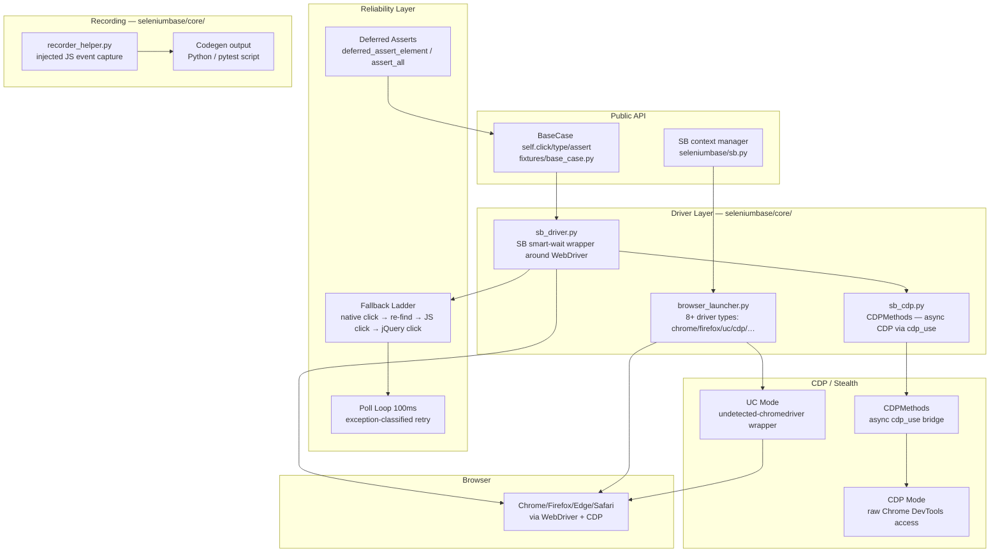
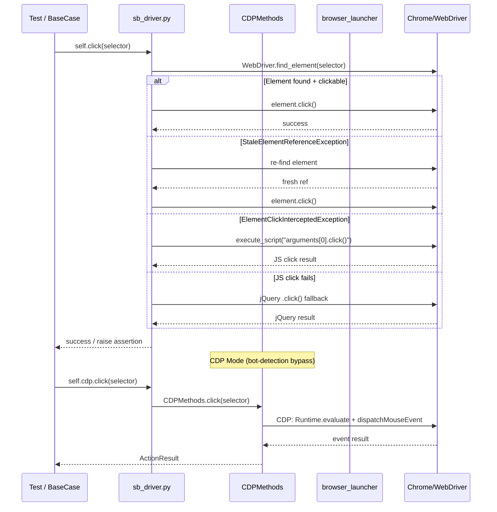

# SeleniumBase — Architecture Maps

---

## Component Diagram



---

## Execution Flow Diagram



---

## Data Flow Diagram

```mermaid
flowchart LR
    subgraph "Selector Input"
        A[selector: string\ncss / xpath / text / name / id]
    end

    subgraph "Resolution"
        B[sb_driver.find_element\nWebDriver.find_element]
        C{Exception?}
        D[StaleElement → re-find]
        E[Intercepted → JS click]
        F[JS fail → jQuery click]
    end

    subgraph "CDP Path"
        G[CDPMethods\n__convert_to_css_if_xpath]
        H[cdp_use async client\nRuntime.evaluate]
        I[dispatchMouseEvent / Input.dispatchKeyEvent]
    end

    subgraph "Recording"
        J[injected JS\ndocument event listeners]
        K[action tuple\n{selector, action, value}]
        L[recorder_helper\nPython / pytest codegen]
    end

    subgraph "Deferred Assertions"
        M[deferred_assert_element\ncollect failures]
        N[assert_all\nraise combined AssertionError]
    end

    A --> B --> C
    C -->|clean| B
    C -->|StaleElement| D --> B
    C -->|Intercepted| E
    E -->|fail| F
    A --> G --> H --> I
    J --> K --> L
    M --> N

    style G fill:#fff3cd,stroke:#856404
    style B fill:#d1e7dd,stroke:#0a3622
```
