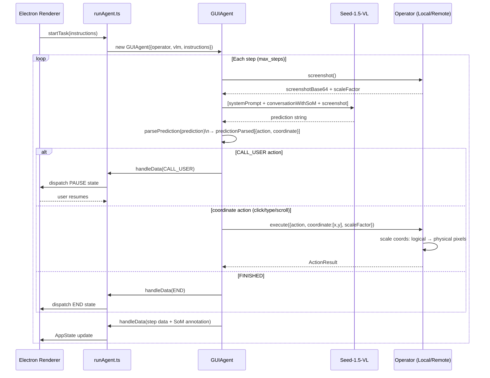

# UI-TARS Desktop — Architecture Maps

---

## Component Diagram

```mermaid
graph TD
    subgraph "Entry — Electron App"
        A[apps/ui-tars/src/main/\nElectron main process]
        B[apps/ui-tars/src/renderer/\nReact UI]
        C[apps/ui-tars/src/preload/\nIPC bridge]
    end

    subgraph "Agent Orchestration — main/services/"
        D[runAgent.ts\nGUIAgent instantiation + loop]
        E[GUIAgent\npackages/agent-infra/src/agent/]
        F[handleData callback\nSoM annotation + AppState dispatch]
    end

    subgraph "Operators — agent-infra/src/operator/"
        G[LocalComputerOperator\nnutjs keyboard/mouse on host OS]
        H[LocalBrowserOperator\nPlaywright page control]
        I[RemoteComputerOperator\nRDP / remote desktop]
        J[RemoteBrowserOperator\nremote Playwright session]
    end

    subgraph "VLM Inference"
        K[Seed-1.5-VL / GPT-4o\nvia OpenAI-compatible API]
        L[screenshotContext\n{scaleFactor, physicalSize, logicalSize}]
        M[predictionParsed\n[{action, coordinate:[x,y], value?}]]
    end

    subgraph "SoM Annotation"
        N[markClickPosition\ndraw bounding boxes on screenshot]
        O[conversationWithSoM\nVLM message history + annotated images]
    end

    subgraph "State Machine"
        P[AppState: INIT/RUNNING/PAUSE/END/ERROR]
        Q[CALL_USER action\npause for human input]
    end

    A --> D
    D --> E
    E --> K
    K --> M
    M --> G & H & I & J
    E --> F
    F --> N
    N --> O
    O --> K
    E --> P
    M -->|CALL_USER| Q
    Q --> P
    B --> C --> A
```

---

## Execution Flow Diagram



---

## Data Flow Diagram

```mermaid
flowchart LR
    subgraph "Input"
        A[instructions: string\noperator config\nVLM endpoint]
    end

    subgraph "Perception"
        B[screenshot()\nbase64 PNG]
        C[screenshotContext\n{scaleFactor\nphysicalSize {w,h}\nlogicalSize {w,h}}]
    end

    subgraph "VLM Reasoning"
        D[conversationWithSoM\nmessage[] with annotated screenshots]
        E[VLM response: prediction string\ne.g. click(100, 200) or type('hello')]
        F[predictionParsed\n[{action: 'click'\ncoordinate: [100, 200]\nvalue?: string}]]
    end

    subgraph "SoM Annotation"
        G[markClickPosition\ndraw bounding box at coordinate]
        H[annotated screenshot\nreinjected into conversationWithSoM]
    end

    subgraph "Execution"
        I[operator.execute\naction + scaleFactor]
        J[physical pixel mapping\nlogical × scaleFactor]
        K[keyboard/mouse event\nor CDP dispatchMouseEvent]
    end

    subgraph "AppState"
        L[RUNNING → step update → RUNNING\nor PAUSE / END / ERROR]
    end

    A --> B --> C
    C --> D --> E --> F
    F --> G --> H --> D
    F --> I --> J --> K
    K --> L

    style F fill:#d1e7dd,stroke:#0a3622
    style C fill:#cff4fc,stroke:#055160
```
