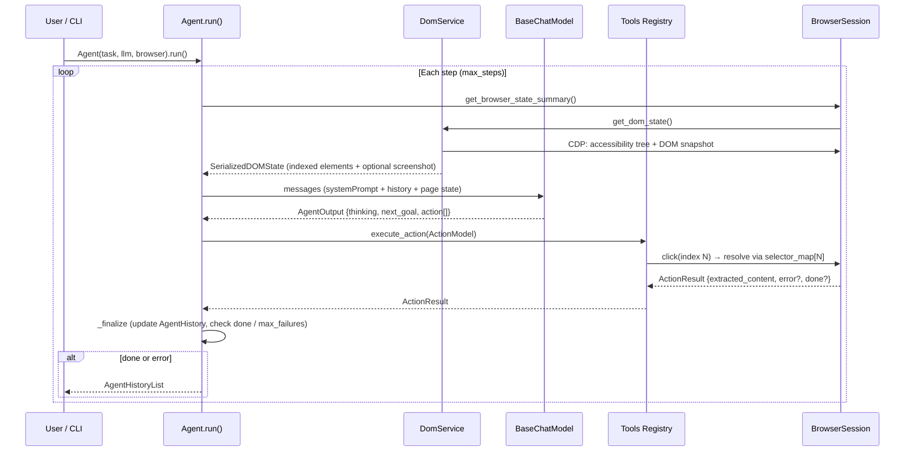

# browser-use — Architecture Maps

---

## Component Diagram

```mermaid
graph TD
    subgraph "Entry"
        A[CLI / Python API\nbrowser-use, bu, browseruse-tui]
    end

    subgraph "Agent — browser_use/agent/"
        B[Agent.run / Agent.step\nservice.py]
        C[AgentOutput — views.py\nthinking / next_goal / action list]
        D[MessageManager\nmessage_manager/service.py]
        E[SystemPrompt\nprompts.py]
    end

    subgraph "LLM — browser_use/llm/"
        F[BaseChatModel\nbase.py]
        G[Anthropic / OpenAI / Gemini\nGroq / Ollama adapters]
    end

    subgraph "DOM — browser_use/dom/"
        H[DomService\nservice.py]
        I[ClickableElementDetector\nserializer/clickable_elements.py]
        J[DOMTreeSerializer\nserializer/serializer.py]
        K[EnhancedAXNode / SerializedDOMState\nviews.py]
    end

    subgraph "Browser — browser_use/browser/"
        L[BrowserSession\nsession.py]
        M[BrowserProfile\nlaunch config, proxy, CDP]
    end

    subgraph "Tools — browser_use/tools/"
        N[Tools registry\nservice.py]
        O[@registry.action decorator\nPydantic ActionModel]
    end

    subgraph "MCP — browser_use/mcp/"
        P[MCP Server\nClaude Desktop integration]
    end

    A --> B
    B --> D
    D --> F
    F --> G
    G -->|AgentOutput| B
    B --> H
    H --> I & J
    I & J --> K
    K --> D
    B --> L
    L --> M
    B --> N
    N --> O
    O --> L
    P -.-> B
```

---

## Execution Flow Diagram



---

## Data Flow Diagram

```mermaid
flowchart LR
    subgraph "Page Perception"
        A[CDP: getFullAXTree\ngetDocument] -->|raw AX nodes + DOM| B
        B[ClickableElementDetector\nheuristic: interactive nodes] -->|EnhancedAXNode[]| C
        C[DOMTreeSerializer] -->|numbered list: '42[button:Submit]'| D
        D[SerializedDOMState\n{selector_map, element_tree_text\nscreenshot_base64, url}]
    end

    subgraph "LLM Reasoning"
        D -->|prompt| E[BaseChatModel]
        E -->|structured output| F[AgentOutput\n{thinking, next_goal\naction:[{click:{index:42}}]}]
    end

    subgraph "Execution"
        F -->|action list| G[Tools.execute_action]
        G -->|selector_map lookup:\nindex 42 → backend_node_id + xpath| H[BrowserSession.execute]
        H -->|CDP: dispatchEvent| I[Browser]
        I -->|ActionResult| G
        G -->|result| J[AgentHistory step]
    end

    style D fill:#fff3cd,stroke:#856404
    style F fill:#d1e7dd,stroke:#0a3622
```
