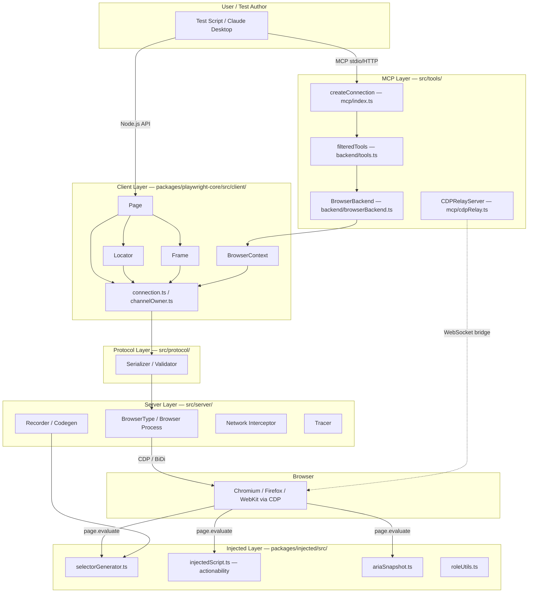
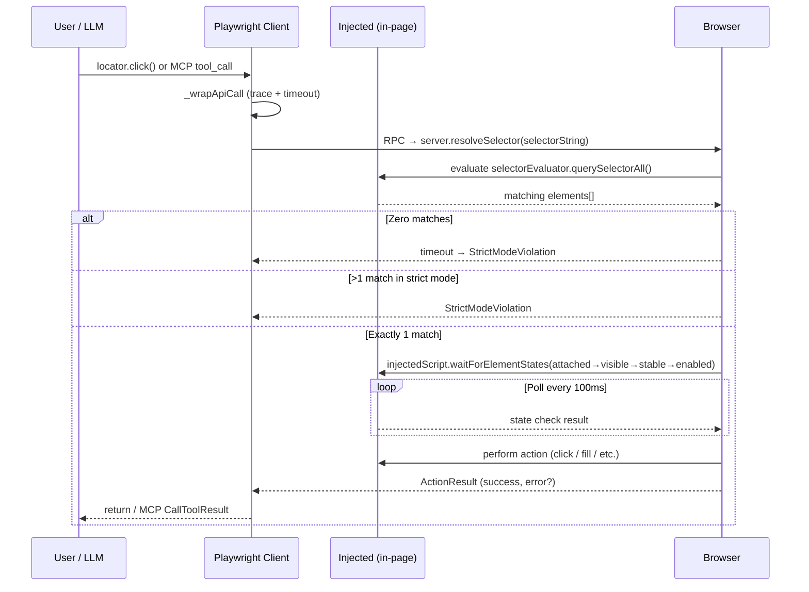

# Playwright — Architecture Maps

---

## Component Diagram



---

## Execution Flow Diagram



---

## Data Flow Diagram — Record → Compile → Execute

```mermaid
flowchart LR
    subgraph "Record (Codegen)"
        A1[User clicks in browser]
        A2[Recorder captures DOM event]
        A3[selectorGenerator.generateSelector\nScores candidates by cost:\nrole+name < label < text < testid < css-id < css-path]
        A4[Codegen serializes:\npage.getByRole('button',{name:'Submit'})]
    end

    subgraph "Selector String — serializable text"
        B['"role=button[name=Submit]"\nor\n"css=button#submit"']
    end

    subgraph "Execute (runtime)"
        C1[Locator holds selector string\n— NOT a DOM node]
        C2[On each action:\nselectorEvaluator.querySelectorAll re-runs]
        C3[injectedScript.waitForStates\nattached→visible→stable→enabled]
        C4[action dispatches]
        C5[ActionResult → response]
    end

    A1 --> A2 --> A3 --> A4 --> B
    B --> C1 --> C2 --> C3 --> C4 --> C5

    style B fill:#f0f4ff,stroke:#4a6fa5
```
