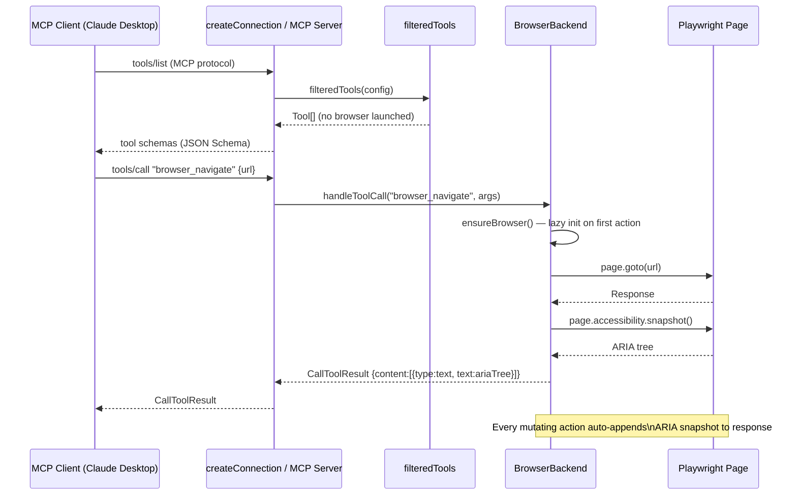

# playwright-mcp — Architecture Maps

---

## Component Diagram

```mermaid
graph TD
    subgraph "Entry — playwright-mcp-main/"
        A[index.js\ncreateConnection re-export]
        B[cli.js\nstdio / HTTP server bootstrap]
    end

    subgraph "Protocol Harness — playwright-core/src/tools/mcp/"
        C[index.ts\ncreateConnection\nwires config→tools→backend→server]
        D[program.ts\ncli arg parse → createServer]
        E[config.ts\nServerConfig defaults]
    end

    subgraph "Tool Registry — mcp/backend/"
        F[tools.ts\nfilteredTools: Tool[]\ncapability flag gating]
        G[browserBackend.ts\nBrowserBackend per connection\nlazy browser init]
        H[ServerBackend interface\nhandleToolCall / screencast / etc.]
    end

    subgraph "Tools — src/tools/"
        I[snapshot.ts\npage_snapshot: ARIA tree text]
        J[screenshot.ts\nbrowser_screenshot]
        K[navigate.ts\nbrowser_navigate]
        L[click.ts / type.ts / hover.ts …\naction tools]
        M[pdf.ts / files.ts\ncontent tools]
    end

    subgraph "State Gating"
        N[ModalState tracker\npage.waitForURL / dialog detection]
        O[Post-action snapshot\nauto-snapshot after every mutating tool]
    end

    subgraph "Browser"
        P[Playwright BrowserContext\nvia BrowserFactory]
        Q[CDPRelayServer\n/cdp/{guid} ↔ /extension/{guid}]
    end

    A --> C
    B --> D
    D --> C
    C --> F
    F --> G
    G --> H
    H --> I & J & K & L & M
    I & K & L --> N
    N --> O
    G --> P
    P -.-> Q
```

---

## Execution Flow Diagram



---

## Data Flow Diagram

```mermaid
flowchart LR
    subgraph "Tool Schema"
        A[Tool.schema\nJSON Schema inputSchema\nzod validator]
    end

    subgraph "Dispatch"
        B[MCP tools/call\n{name, arguments}]
        C[filteredTools lookup\nby tool name]
        D[Tool.handle\nchecks modal state]
    end

    subgraph "BrowserBackend"
        E[BrowserBackend\nensureBrowser on first call]
        F[ServerBackendFactory\nconfig → BrowserBackend | SSHBackend]
    end

    subgraph "Playwright Execution"
        G[page action\ngoto / click / fill / evaluate]
        H[page.accessibility.snapshot\nor page.screenshot]
    end

    subgraph "Response Assembly"
        I[CallToolResult\ncontent: TextContent | ImageContent[]]
        J[Auto ARIA snapshot\nappended after mutating actions]
    end

    A --> B --> C --> D --> E
    F --> E
    E --> G --> H
    H --> J --> I

    style A fill:#cff4fc,stroke:#055160
    style I fill:#d1e7dd,stroke:#0a3622
```
