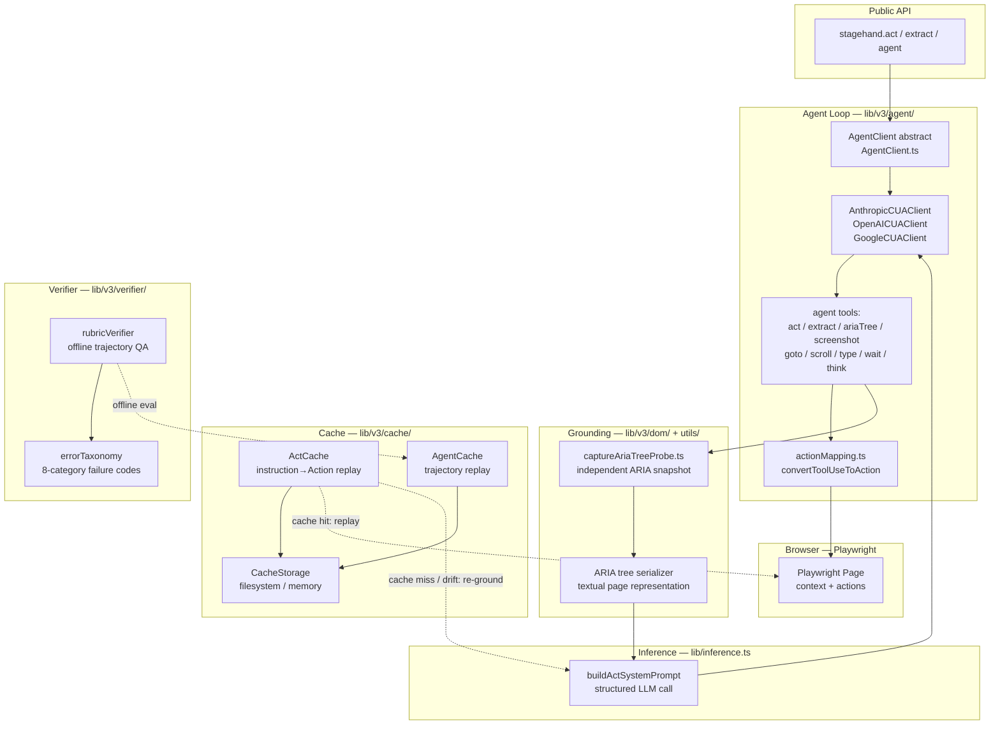
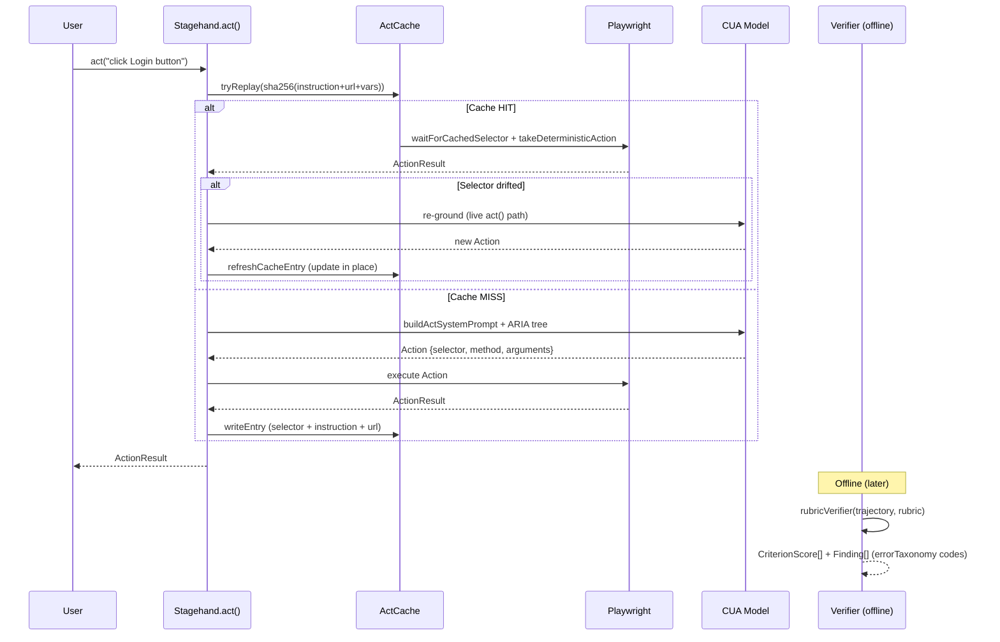

# Stagehand — Architecture Maps

---

## Component Diagram



---

## Execution Flow Diagram



---

## Data Flow Diagram

```mermaid
flowchart LR
    subgraph "Intent"
        A[instruction: string\nurl: string\nvariableKeys: string[]] -->|sha256| B[CacheKey]
    end

    subgraph "Compiled Action"
        C[Action\n{selector, method, arguments[], description}]
    end

    subgraph "Cache"
        B -->|lookup| D{HIT?}
        D -->|yes| E[CachedActEntry\n{version, actions[], variableKeys[]}]
        D -->|no| F[LLM grounding path]
        F -->|inference.ts| G[structured output → Action]
        G --> C
        E --> C
        C -->|write if miss/drift| D
    end

    subgraph "Replay"
        C -->|waitForCachedSelector| H[Playwright waitForSelector]
        H -->|takeDeterministicAction| I[Browser action]
        I -->|ActionResult| J[success / selector_drift?]
        J -->|drift detected| F
    end

    subgraph "Verifier Evidence"
        K[TrajectoryStep\nagentEvidence: what LLM saw\nprobeEvidence: what harness captured\ntoolOutput]
        K --> L[rubricVerifier\ncriterion × evidence → CriterionScore\nerrorTaxonomy code]
    end

    style C fill:#d1e7dd,stroke:#0a3622
    style B fill:#cff4fc,stroke:#055160
```
