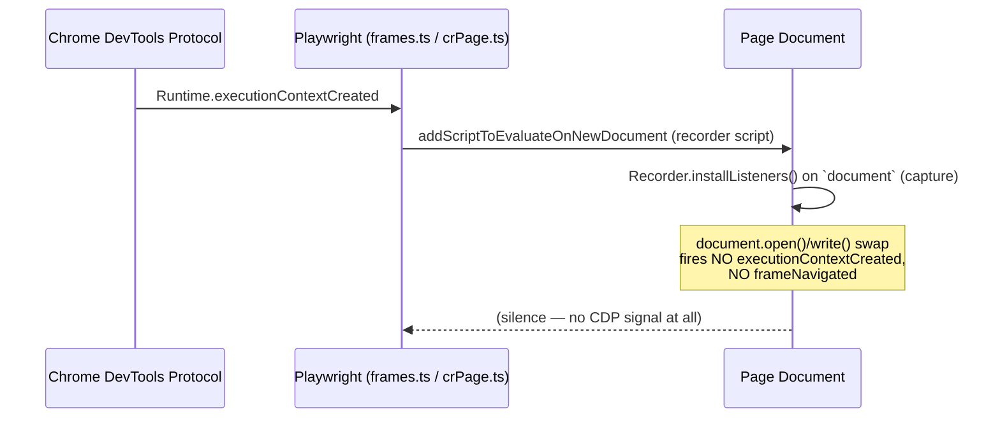
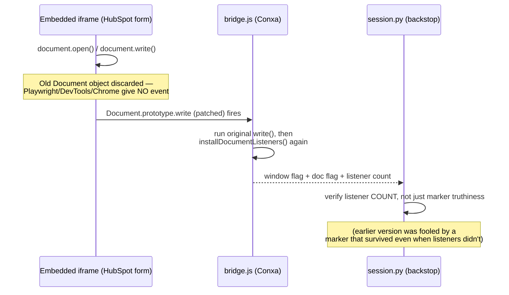

# Recorder, Selector & Replay Architecture Comparison — Playwright Codegen, Chrome DevTools Recorder, browser-use vs. Conxa

**Written:** 2026-07-16
**Scope:** Reverse-engineered from real, freshly-cloned source (not from memory/training data) — `microsoft/playwright`, `ChromeDevTools/devtools-frontend` + `puppeteer/replay`, and `browser-use/browser-use`. Every external claim below cites a repo path and, where practical, a line number.
**Related reading in this repo:** [`01-external-research/repos/playwright.md`](01-external-research/repos/playwright.md) and [`01-external-research/repos/browser-use.md`](01-external-research/repos/browser-use.md) already contain deep general-purpose dossiers on those two tools (execution model, MCP integration, scalability). This report does not repeat that ground — it focuses specifically on **recording → selector generation → replay**, and on the one problem that triggered it: **`document.open()`/`document.write()` DOM swaps silently detaching recorder listeners**, a bug Conxa hit in production (HubSpot's embedded "Create a Contact" iframe) and fixed on 2026-07-16 (`FIX.md:190-215`).

---

## Table of Contents

1. [Executive Summary](#1-executive-summary)
2. [Technical Deep Dive: Playwright Codegen](#2-technical-deep-dive-playwright-codegen)
3. [Technical Deep Dive: Chrome DevTools Recorder + puppeteer/replay](#3-technical-deep-dive-chrome-devtools-recorder--puppeteerreplay)
4. [Technical Deep Dive: browser-use](#4-technical-deep-dive-browser-use)
5. [Technical Recap: Conxa](#5-technical-recap-conxa)
6. [The document.write() Case Study, Compared](#6-the-documentwrite-case-study-compared)
7. [Comparison Matrix](#7-comparison-matrix)
8. [Ideas to Adopt, Adapt, or Avoid](#8-ideas-to-adopt-adapt-or-avoid)
9. [Recommendations for Reliability](#9-recommendations-for-reliability)
10. [Source Citations](#10-source-citations)

---

## 1. Executive Summary

*(No jargon. If you only read one section, read this one.)*

We looked at three well-known tools that record what a person does in a browser and play it back later, and compared each one to how Conxa does the same job.

- **Playwright Codegen** (from Microsoft, the engine underneath a huge share of browser test automation) watches you click and type, then writes down one "address" per element — something like "the button labeled Submit." It's good at writing addresses a human can read, but it only ever writes down **one** address per step. If a website changes just enough that the address stops matching, replay simply fails. There is no backup plan.
- **Chrome DevTools Recorder** (built into every Chrome browser) is smarter about this specific point: it writes down **several** addresses per step — by role, by look-and-feel, by position — and tries all of them at once when replaying, using whichever one still works. That's a real strength. But it still has no sense of which address is *more trustworthy* than another, and if every address it wrote down stops working, it also just fails with no further options.
- **browser-use** doesn't really "record and replay" at all — it's an AI agent that looks at the page fresh, every single time, and asks an AI model what to click next. That makes it naturally immune to a changed page (there's nothing old to go stale), but it means every single click costs an AI request — slow and expensive to run at scale, with no way to save a workflow once and run it cheaply many times after.
- **Conxa** already does more than any of the three: it writes down *several* addresses per step like Chrome DevTools Recorder does, but goes further by scoring how trustworthy each one is (a proper name/ID beats a footer link that might change) and picks the best one deterministically — no AI guessing involved. If an address stops working at replay time, Conxa doesn't just give up: it tries cheap, instant recovery tricks first (a menu needs re-opening, an overlay needs dismissing) before ever spending money on an AI call, and even then the AI is only ever asked to *find* the element again, never to invent a brand-new automation from scratch.

The specific bug that prompted this research — a customer's embedded form swapped itself out using an old-fashioned browser trick (`document.write()`) that doesn't count as a "real" page change, so Conxa's listeners kept watching a form that no longer existed, and nothing typed into the new one got recorded — turns out to be a blind spot **all three** of the outside tools share. We checked: neither Playwright, nor Chrome DevTools Recorder, nor browser-use has any code that specifically detects this trick. Playwright's own internal tooling has to work around the exact same problem with a manual hack. Conxa is the only one of the four that now handles it directly, with a purpose-built fix that both patches the hole and double-checks the patch actually worked. That is a genuine point of pride, not just parity — but the report below still surfaces a few ideas worth stealing from the others (especially Chrome DevTools Recorder's multiple-addresses-per-step habit, which Conxa already does even better) and a few risks worth guarding against before the next similar bug shows up somewhere new.

---

## 2. Technical Deep Dive: Playwright Codegen

*(Source: `microsoft/playwright`, shallow clone, commit `7a94de6`.)*

### 2.1 How it records

`packages/injected/src/recorder/recorder.ts`'s `Recorder.installListeners()` (`recorder.ts:1418-1438`) attaches one set of listeners — `click`, `auxclick`, `dblclick`, `contextmenu`, `dragstart`, `input`, `keydown`, `keyup`, `pointerdown/up`, `mousedown/up/move/leave/enter`, `focus`, `scroll` — directly on `this.document`, all in the **capture phase**. This is event delegation: a single listener set per document, not one per element.

The recorder script itself is delivered via `BrowserContext.extendInjectedScript()` (`browserContext.ts:731-739`), which installs into every frame that already exists and subscribes to `Page.Events.InternalFrameNavigatedToNewDocument` to install into any *future* frame's new document (`Frame.extendInjectedScript`, `frames.ts:1855-1861`). This pipeline is entirely CDP-navigation-driven: `Runtime.executionContextCreated` (`crPage.ts:424,668`) feeds `Page.addScriptToEvaluateOnNewDocument` (`crPage.ts:508,1020`), and `Page.frameNavigated` (`crPage.ts:417`) surfaces as `frameNavigatedToNewDocument` (`page.ts:901-913`).

### 2.2 How selectors are generated

`packages/injected/src/selectorGenerator.ts` runs a genuinely **scored candidate search**: `generateSelectorFor` (`selectorGenerator.ts:148-231`) builds candidates (test-id, role+name, placeholder, label, alt-text, text, title, CSS id/tag), each carrying a numeric score constant — lower is better — from `kTestIdScore=1` up through `kCSSFallbackScore=1e7` (`selectorGenerator.ts:40-68`). It sorts ascending and **stops at the first candidate whose element set is exactly 1** (`elements.length === 1` → `break`, line ~182-186). There is no margin check against a runner-up candidate — first unique match wins outright.

Critically: **only one selector string is persisted per recorded step.** `generateSelector` (`selectorGenerator.ts:78-144`) does return a `selectors` (plural) field, but it's populated only for the interactive "pick locator" tool used by a human browsing candidates in the UI — the actual `RecordActionTool` recording path (`recorder.ts:126,730`) always takes the single winning `selector` string. The score that chose it is a build-time tie-breaker, thrown away the moment the string is written down. Nothing is kept to fall back to later.

### 2.3 How replay works

Resolution always re-parses the same literal string, forever. `Frame.waitForSelector` (`frames.ts:834-893`) polls via `retryWithProgressAndBackoff` until the element reaches the target state or the action times out — the selector string itself never changes between polls. `ElementHandle._retryAction` (`dom.ts:317-378`) retries only *actionability preconditions* (not visible yet, not stable yet, overlay intercepting the click) against the element **that string already resolved** — it is not selector fallback. If the string matches zero elements, Playwright throws a timeout. There is no alternate-candidate substitution anywhere in this path.

### 2.4 Dynamic DOM, iframes, and `document.write()`

Iframes are tracked as `Frame` objects with `_parentFrame`/`_childFrames` (`frames.ts:513-556`); codegen injects an independent recorder instance into every frame, and recorded actions carry a frame path stitched with `internal:control=enter-frame` (`recorderUtils.ts:28-30, 99-114`) so a click inside a triply-nested iframe still resolves unambiguously.

`document.open()`/`document.write()` is **not** a CDP navigation and gets **no** guaranteed re-injection. We grepped `frames.ts`/`page.ts` for `document.open` and found exactly one call site in the entire codebase: Playwright's *own* `Frame.setContent()` (`frames.ts:962-984`), which has to work around this exact problem — it runs `document.open(); console.debug(tag); document.write(html); document.close();` in the same execution context and detects completion by matching a console-message tag, because **no CDP event marks the swap.** That is Playwright's own engineers hitting the identical wall Conxa hit.

What partially rescues Codegen is a self-built heuristic: `InjectedScript._setupGlobalListenersRemovalDetection()` (`injectedScript.ts:1412-1434`) runs a `MutationObserver({childList:true})` on `document`, watching for a new `documentElement` node. When one appears, it dispatches a synthetic event and checks whether a previously-registered listener still fires; if not, it re-registers everything in `onGlobalListenersRemoved`, which includes `PollingRecorder`'s `installListeners()` call (`pollingRecorder.ts:44`). This is a best-effort DOM-mutation guess, not a spec-level guarantee — it depends on the swap producing a detectable new `documentElement`, and it's undocumented/untested for this specific scenario in the recorder code itself.

### 2.5 Strengths & Weaknesses

| | |
|---|---|
| **Strengths** | Genuinely readable, semantically meaningful selectors (role+name-first priority ladder); clean, uniform frame-path chaining for nested iframes; the `MutationObserver` listener-loss detector is a clever unofficial patch for a real spec gap. |
| **Weaknesses** | Exactly one selector persisted per step — once chosen, all scoring/candidate data is discarded, so there's nothing to fall back to. No multi-signal identity, no confidence score kept at replay time, no recovery cascade — a broken selector is a hard failure after timeout. `document.write()` handling is a best-effort heuristic, not a guarantee — and Playwright's own `setContent()` has to work around the same gap with a manual hack. |

---

## 3. Technical Deep Dive: Chrome DevTools Recorder + puppeteer/replay

*(Source: `ChromeDevTools/devtools-frontend` and `puppeteer/replay`, shallow clones.)*

### 3.1 How it records

The recorder panel injects a real content script rather than relying purely on CDP event observation. `RecordingSession.ts` calls `Page.addScriptToEvaluateOnNewDocument` plus an immediate `evaluateInAllFrames` to run the script in a dedicated isolated world (`RecordingSession.ts:578-596`, `#injectApplicationScript`). The injected script, `injected/RecordingClient.ts:114-142`, attaches real capturing-phase listeners (`keydown`, `beforeinput`, `input`, `keyup`, `pointerdown`, `click`, `auxclick`, `beforeunload`) on `window`, filtering for `event.isTrusted` (`RecordingClient.ts:90,194,208…`) so synthetic/automation-fired events are ignored by default. Captured steps flow back to DevTools over a CDP binding (`RecorderBinding.addStep`, `RecordingSession.ts:113-116, 556-576`).

Cross-frame handling uses `ChildTargetManager` events (`TARGET_CREATED`/`TARGET_DESTROYED`, `RecordingSession.ts:532-544`) to recursively attach to every OOPIF (out-of-process iframe) as its own CDP target with its own binding + injected script. Frame identity for a step is a path of child-frame indices from the root (`getTargetFrameContext`, `SDKUtils.ts:27-44`).

### 3.2 How selectors are generated — the standout feature

This is where DevTools Recorder pulls ahead of Playwright Codegen. `puppeteer/replay`'s `src/Schema.ts:9-11` defines `Selector = string | string[]`, and every step's `selectors` field is `Selector[]` — **an array of independent selector strategies**, generated by `injected/SelectorComputer.ts` in the order `aria, css, xpath, pierce, text` (`SelectorComputer.ts:58-75`), where CSS prefers test attributes (`data-testid`, `data-test`, `data-qa`, `data-cy`, `SelectorComputer.ts:33-42`) and `pierce` walks through shadow-DOM boundaries. `getSelectors(node)` (`:102-111`) runs every configured strategy and keeps whichever ones succeed — all of them, not just the best one.

### 3.3 How replay works — parallel race, not sequential fallback

`PuppeteerRunnerExtension.runStepInFrame` (`src/PuppeteerRunnerExtension.ts:85-268`) builds one Puppeteer `Locator` per selector candidate and calls `locatorRace(...)` — Puppeteer's built-in mechanism that **races all candidate locators concurrently** and acts on whichever resolves first. This is more sophisticated than sequential try-next-on-failure: the fastest-resolving strategy wins with no added latency cost for the others. There is, however, **no scoring of which strategy is more trustworthy** — every candidate races on equal footing regardless of whether it's a stable ARIA role or a brittle nth-child CSS path. If every raced locator times out, `Runner.run()` simply propagates the error (`src/Runner.ts:61-89,78-83`) — the flow aborts, full stop.

### 3.4 Dynamic DOM, iframes, and `document.write()`

We grepped both trees for `document.write`, `executionContextCreated`, `frameNavigated`, `documentUpdated` and found **zero matches** anywhere in `front_end/panels/recorder/**` or `puppeteer-replay/src/**`. The only "new document" handling is the generic CDP guarantee behind `addScriptToEvaluateOnNewDocument` — which, as established in Section 2.4, does *not* fire for `document.open()`/`write()` swaps — plus the OOPIF `TARGET_CREATED` path, which only covers *cross-process* iframe creation, not a same-process content swap. **This is confirmed absence, not merely unexplored territory**: there is no comment, test, or fallback anywhere addressing it.

### 3.5 Strengths & Weaknesses

| | |
|---|---|
| **Strengths** | Multi-candidate schema (5 orthogonal strategies including shadow-DOM piercing) is a genuinely useful durability primitive, computed cheaply at record time; `Locator.race()` means the fastest-resolving strategy always wins with zero latency penalty; ancestor-chain selector form elegantly handles shadow DOM without new step types; trusted-event gating avoids recording framework-internal synthetic noise. |
| **Weaknesses** | Zero durability/confidence scoring anywhere (confirmed by grep — no occurrence of "confidence," "durability," or "self-heal" in either codebase); "self-healing" is entirely selector-list exhaustion — once every candidate is stale, replay fails outright with no recovery tiers; trusted-event-only capture means legitimate framework-triggered UI changes are invisible to the recorder; `document.write()`/in-place content swaps are entirely unhandled. |

---

## 4. Technical Deep Dive: browser-use

*(Source: `browser-use/browser-use`, shallow clone, commit `dbc4d46`.)*

browser-use is architecturally a different animal from the other two — it isn't a record-once/replay-many tool at all. It's an LLM-driven agent that re-perceives the page and picks a fresh action every single step.

### 4.1 How it "records" (it doesn't, by design)

There is no compile-once pipeline. `Agent.step()` (`browser_use/agent/service.py:1027-1077`) runs perceive → decide → act → repeat on every step: `_prepare_context` (`:1079-1091`) calls `get_browser_state_summary(include_screenshot=True, ...)`, which either serves a short-lived cache or dispatches a fresh CDP DOM/accessibility/snapshot extraction (`browser/session.py:1584-1620`). `_get_next_action` then hands this fresh state to an LLM, which picks the next action. There is no branch anywhere that skips the LLM and replays a stored action deterministically.

### 4.2 Its "selector" analogue

The per-step element index is CDP's own `backend_node_id`, not a durable custom identity. `EnhancedDOMTreeNode` (`dom/views.py:373-464`) fuses the DOM tree, accessibility tree, and layout snapshot into one struct; the "selector map" (`DOMSelectorMap = dict[int, EnhancedDOMTreeNode]`, `views.py:913`) is rebuilt fresh every step by `DOMTreeSerializer` (`dom/serializer/serializer.py:704-723`) — the LLM literally clicks by small integer index (`click(index=7)`), resolved via `get_dom_element_by_index` (`browser/session.py:2414-2416`).

There is a cross-step diff (`previous_cached_state`, `dom/service.py:1050-1052`) that flags genuinely new elements with a `*` prefix for the LLM's benefit (`serializer.py:719-723,925,1005`) — but this is a cosmetic freshness hint, not identity resolution. `backend_node_id` is whatever CDP currently assigns and is wholesale invalidated on navigation (`session.py:1228,1231`).

### 4.3 Iframes and shadow DOM

Same-origin iframes are traversed inline via `contentDocument` (`dom/service.py:867-871`); shadow roots via `shadowRoots` (`:874-882`), recursively constructed and kept separate from regular children. Cross-origin iframes (no inline `contentDocument`) get a separate recursive CDP-target call, gated by visibility/size and capped by `max_iframe_depth` (default 5) and a document-count cap to bound blowup (`:925-957, 930-933`). Coordinate offsets accumulate up the parent chain exactly as Conxa's `session.py` does (`:855-865`) — this is one of the few points of genuine architectural convergence between the two systems.

### 4.4 Dynamic DOM, staleness, and `document.write()`

There is no `MutationObserver`, DOM-hash, or generation-counter anywhere in `browser_use/dom/` or `browser_use/browser/` (confirmed by grep). The design **sidesteps the entire bug class by construction**: because every step re-extracts the DOM fresh, there is no persistent element reference to go stale *between decisions*. The only residual staleness window is *mid-step*, between extraction and the click executing, handled reactively: `default_action_watchdog.py:1043-1055` catches the click exception and tells the LLM the index "may be stale... get fresh browser state before retrying" — the fix is simply "look again," which the loop already does next step.

Interestingly, browser-use's *optional* history-replay feature (`agent/service.py:3093,3862`, for re-running a saved trace) does need genuine cross-snapshot identity, and builds a cascading matcher strikingly close in spirit to Conxa's multi-signal approach: exact `element_hash` → `stable_hash` (dynamic classes like `focus`/`hover`/animation stripped, `dom/views.py:175-184`) → XPath → accessible-name → unique-attribute fallback (`_update_action_indices`, `agent/service.py:3519-3668`). But this cascade still requires a full fresh DOM re-extraction at replay time to search against, still retries with exponential backoff, and can fall through to a fresh LLM call mid-replay for "extract" actions — it is not a deterministic, LLM-free replay path.

### 4.5 Strengths & Weaknesses

| | |
|---|---|
| **Strengths** | Structurally immune to *this entire class* of staleness bug — there's nothing cached across the LLM decision boundary to go stale; works immediately on unseen sites with no authoring/compile step; iframe/shadow-DOM traversal with depth/size caps is a sensible, battle-tested pattern worth reusing verbatim. |
| **Weaknesses** | An LLM (and often a vision) call on *every single action* — cost and latency scale linearly with workflow length, with no free deterministic replay path; no offline compile artifact to version, diff, or audit ahead of execution; correctness is only knowable by actually running the agent. |

---

## 5. Technical Recap: Conxa

*(Ground truth from this repo — `conxa-builder/python/conxa_compile/`, `runtime/`.)*

### 5.1 Recording

Same event-registry pattern as the other tools — `bridge.js`'s `onDoc()`/`installDocumentListeners()` (`bridge.js:66-82`) attaches capture-phase listeners (click `:1160`, change `:1177`, beforeinput `:1226`, input `:1236`, keyup `:1246`, focusin/out `:1255/:1264`, dblclick `:1290`, contextmenu `:1303`, drag/drop `:1788/:1797`, keydown `:1817`) on `document`, plus `window`-level listeners for `scroll`/`message`/`beforeunload` that survive swaps for free (`:1275,124,1841`) since `window` persists across a `document.open()`.

### 5.2 Selector generation — durability-scored multi-signal identity

Conxa goes a step beyond even DevTools Recorder's multi-candidate array: `IdentityBundle` (`compiler/identity_bundle.py:30-110`) generates up to 6 deterministic signal engines per element (testid, role+name, text, relational/spatial-anchor, css-id/structural, xpath), each carrying a computed **durability score** (`selector_score.py:94-148`) — base weight per engine (testid 0.99 down to xpath 0.10) × survival prior × penalties for dynamic ids or positional brittleness. Signals are additionally grouped into **orthogonality classes** (test-contract, semantic-aria, visible-text, spatial-anchor, structural) and deduplicated so only the strongest signal per independent axis survives (`selector_filters.py:282-291`) — this is qualitatively different from DevTools Recorder's flat, unscored array. `_build_target` (`compiler/build.py:645-797`) is fully deterministic; the LLM is explicitly never asked to write a selector string (comment at `build.py:713-716` cites the ~30% hallucination rate SeeAct found for LLM-generated selectors) — it's reserved for step-intent text and the workflow-level intent graph (`build.py:1315-1370`).

### 5.3 Replay — margin-gated durability walk

`runtime/resolver.js:120-179` sorts signals by durability descending and, per signal, checks candidates: a unique match is accepted if it scores ≥0.5, or unconditionally if it's a "contract" signal (testid/css-id) that doesn't contradict the fingerprint. For multiple matches, it computes a weighted fingerprint-agreement score and only accepts the top scorer if its **margin over the runner-up clears 0.15** — otherwise it falls through to the *next lower-durability signal* in the bundle, never to `candidate[0]` blindly (`:160-176`). This margin-gate plus signal fallthrough is Conxa's most direct answer to both Playwright's "one string, no fallback" and DevTools Recorder's "unscored race" limitations.

### 5.4 Recovery cascade

Before ever touching an LLM: L1 exception-ladder (`runtime/recovery.js:36-68`, applied `run.js:1128-1161`) classifies the thrown exception into one deterministic remedy and retries once; L2 (`run.js:1027-1201`) does a11y re-probe, re-hover chain-walking for revealed menus, and fuzzy text matching — all zero-token, in-process. Only if both are exhausted does Tier 3+ (LLM semantic/vision recovery, gated by `CONXA_MAX_RECOVERY_TIER`, `recovery.js:89-101`, `server.js:48,622-741`) fire — and even the LLM's returned selector override is re-gated through the identical 0.15-margin check (`run.js:218-255`) before it's trusted.

---

## 6. The document.write() Case Study, Compared

**The bug, in plain terms:** some sites (a HubSpot embedded contact form, in Conxa's case) load a placeholder iframe, then swap in the real form using `document.open()`/`document.write()` — a decades-old browser trick that replaces the entire page content *without* triggering what browsers consider a real page change. Every recorder in this report attaches its listeners once, when a document is first created; none of them get a "the document changed" signal from the browser for this trick, because — by design — one doesn't fire.

**We checked, concretely, whether any of the three outside tools has a fix:**

| Tool | Detects the swap? | Evidence |
|---|---|---|
| **Playwright Codegen** | Partially, via a *guess* | `injectedScript.ts:1412-1434` runs a `MutationObserver` watching for a new `documentElement` node, and re-installs listeners if it fires. Not a guarantee — Playwright's own `Frame.setContent()` (`frames.ts:962-984`) has to work around the identical gap with a manual console-tag hack, proving the CDP layer gives no help here. |
| **Chrome DevTools Recorder / puppeteer-replay** | No | Zero matches for `document.write`, `executionContextCreated`, or any related term anywhere in the recorder or replay source. |
| **browser-use** | N/A by construction | It never caches a persistent listener or element reference across decisions, so this specific bug class can't occur — but note this "solves" it only by paying an LLM call per action, not by detecting the swap. |
| **Conxa** | **Yes — explicitly** | `Document.prototype.open/write/writeln` are monkey-patched *on the prototype* (an instance-level patch is exactly what `document.open()` would discard) — `bridge.js:87-118`. Each patched call runs the original, then synchronously calls `installDocumentListeners()` again (`:101-102,107-108,113-114`), with **zero race window**. A Python-side backstop (`session.py:_ensure_bridge_installed_in_frame_sync`, `:337-413`) independently verifies real re-attachment by checking the *returned listener count*, not just a truthy marker — after an earlier version of the fix was fooled by a marker flag that itself survived the swap even though the real listeners didn't (`FIX.md:204-207`). |

**Why this matters beyond one bug:** this is the sharpest, most concrete evidence in this whole report that Conxa's reliability engineering is ahead of the field on a real, customer-triggered edge case — not a hypothetical one. None of the three widely-used tools researched here defends against it by design; Playwright's own maintainers had to hand-roll a workaround for their *own* internal use of `document.open()`, which strongly suggests this class of bug is generally under-addressed in the browser-automation ecosystem, not just something Conxa happened to miss once.

---

## 7. Comparison Matrix

| Dimension | Playwright Codegen | Chrome DevTools Recorder | browser-use | **Conxa** |
|---|---|---|---|---|
| Recording mechanism | Injected script, capture-phase listeners on `document`, per-frame | Injected script (isolated world), capture-phase listeners on `window`, trusted-events only | None (fresh CDP extraction every step) | Injected script, capture-phase listeners on `document` + `window`, per-frame |
| Selectors per step | **1** (scoring discarded after pick) | **Multiple** (5 strategies, unscored) | N/A (integer index, re-derived every step) | **Multiple, durability-scored** (6 engines, orthogonality-deduped) |
| Confidence/durability scoring | Build-time tie-break only, not persisted | None | None in live loop; ad-hoc match-level cascade in optional replay feature | **Yes** — persisted per signal, drives both compile-time selection and runtime fallthrough |
| Replay fallback if primary fails | None — hard failure after timeout | Selector-list exhaustion via `Locator.race()`, then hard failure | N/A — LLM picks a new action next step (at LLM cost) | **Margin-gated fallthrough** to next signal, then L1/L2 zero-token recovery, then Tier 3+ LLM as last resort |
| Iframe handling | Per-frame injection + `enter-frame` selector chaining | Per-frame injection + `TARGET_CREATED` OOPIF attach | Recursive CDP-target traversal, depth/size-capped | Per-frame injection + `postMessage` bbox-offset relay + preserved frame chain |
| `document.write()` swap handling | Heuristic `MutationObserver` guess; own `setContent()` needs a manual hack | **None found** | N/A by construction (no persistent reference to go stale) | **Explicit fix**: prototype patch + count-verified backstop |
| LLM involvement | None | None | Every action (LLM decides what to click) | Never for selector strings; last-resort only for recovery, output re-verified against the same margin gate |
| Cost model at scale | Free replay, but brittle | Free replay, but brittle | LLM cost scales linearly with workflow length | Free replay in the common case; LLM cost only paid on genuine drift |

---

## 8. Ideas to Adopt, Adapt, or Avoid

### Adopt
- **Nothing wholesale** — Conxa's multi-signal durability-scored identity already strictly dominates both Playwright's single-selector and DevTools Recorder's unscored-array approaches on paper. The honest finding here is that Conxa should *keep* its current design rather than regress toward either of them.

### Adapt
- **Playwright's `MutationObserver`-based listener-loss detector** (`injectedScript.ts:1412-1434`) is a reasonable *second, earlier* signal Conxa doesn't currently have: right now Conxa's defense is entirely reactive (patch `document.open/write/writeln` on the prototype). A generalized `MutationObserver` watching for `documentElement` replacement could serve as an additional backstop for swap mechanisms that *don't* go through `open()`/`write()` at all (e.g. `document.documentElement.outerHTML = ...` or `Element.replaceChildren()` on `<html>`/`<body>`) — vectors the current prototype patch doesn't cover because it's keyed specifically to those three methods.
- **browser-use's depth/size-capped recursive cross-origin-iframe traversal** (`dom/service.py:925-957`, `max_iframe_depth=5` default) is a clean, battle-tested pattern for bounding blowup on pathological iframe nesting — worth checking whether Conxa's iframe pipeline has an equivalent cap, since `docs/TRD.md`'s Iframe Pipeline section doesn't mention one explicitly.
- **DevTools Recorder's `Locator.race()` concurrent-candidate resolution** — Conxa's resolver already sorts by durability and walks signals in order, which is *more principled* than an unweighted race, but it's inherently sequential (try highest-durability signal, check margin, fall through). If compile-time signal count is ever large enough that sequential DOM queries become a latency concern at replay, racing the top 2-3 signals concurrently (still gated by the same margin check on whichever resolves) could shave latency without giving up the durability ordering.

### Avoid
- **browser-use's re-perceive-every-step model** for Conxa's core replay path — it "solves" staleness only by removing the entire concept of cached identity, at the cost of an LLM/vision call per action. This directly contradicts Conxa's zero-token Tier 1/2 recovery invariant and would make the common case (a workflow replaying against an unchanged page) as expensive as the worst case. This is a deliberate, correct rejection, not an oversight.
- **Playwright's single-selector-per-step model** — already established as strictly weaker than Conxa's current approach; there's no scenario where narrowing Conxa's IdentityBundle down to one persisted signal would be an improvement.
- **DevTools Recorder's trusted-event-only capture gate** (`RecordingClient.ts:90,194,208…`) — reasonable for DevTools' use case (a human manually recording their own actions), but would be actively harmful for Conxa if copied verbatim, since it would make the recorder blind to any framework-triggered synthetic event a target site legitimately fires as part of its own UI logic (a risk if Conxa ever needs to capture programmatic form population, e.g. autofill-triggered `input` events).

---

## 9. Recommendations for Reliability

Ranked by leverage (highest first):

1. **Generalize the document-swap defense beyond `document.open/write/writeln`.** The current fix (`bridge.js:87-118`) is keyed to three specific methods. Add the `MutationObserver`-on-`documentElement`-replacement backstop described in Section 8 ("Adapt") as a second, independent detector, so a future site that achieves the same effect through a different API (`outerHTML` reassignment, `replaceChildren()`, or a not-yet-invented equivalent) doesn't reopen the same class of bug under a new name.
2. **Add a regression fixture for this exact bug to the disabled CI execution gate.** `runtime/test/gate_replay.js` (the real-skill-replay gate) is currently disabled in `.github/workflows/build-runtime-app.yml` pending re-enablement (tracked in `TODO.md`). A synthetic fixture that loads an iframe and swaps it via `document.write()` mid-recording/mid-replay would concretely validate the fix stays working across future `bridge.js`/`resolver.js` changes, and is cheap to add now while the context is fresh — worth prioritizing ahead of, or alongside, re-enabling the gate generally.
3. **Confirm (or add) an explicit recursion/size cap in the iframe pipeline**, matching browser-use's `max_iframe_depth`/size-gate pattern (Section 8), since pathological nesting (ad networks, chained third-party widgets) is a plausible source of the *next* edge case, not just a theoretical one.
4. **Do not chase Chrome DevTools Recorder's `Locator.race()` unless replay latency actually becomes a measured problem.** Conxa's sequential margin-gated walk is more principled (it orders by trust, not by speed), and introducing concurrency here trades a correctness property (deterministic signal precedence) for a performance property Conxa hasn't shown a need for yet — premature to adopt.
5. **Keep documenting these bugs as case studies, not just fixes.** The value of this specific bug wasn't just the patch — it's that reasoning through *why* three well-funded, widely-used tools all miss the same edge case surfaced a genuine, defensible competitive point ("Conxa handles document.write swaps; Playwright, Chrome DevTools Recorder, and browser-use do not"). That's a sales-relevant fact (see `docs/Sales-Blockers.md`'s framing) as much as an engineering one, worth carrying into reliability marketing material verbatim.

---

## 10. Source Citations

All external-tool citations in this report were verified against fresh, read-only shallow clones (not training-data recall):
- `microsoft/playwright` — commit `7a94de6`
- `ChromeDevTools/devtools-frontend` — targeted read of `front_end/panels/recorder/`
- `puppeteer/replay` — full shallow clone
- `browser-use/browser-use` — commit `dbc4d46` (2026-07-14)

All Conxa citations reference the current state of this repository as of 2026-07-16, primarily `conxa-builder/python/conxa_compile/recorder/bridge.js`, `conxa-builder/python/conxa_compile/session.py`, `conxa-builder/python/conxa_compile/compiler/{identity_bundle,selector_grammar,selector_score,selector_filters,build}.py`, `runtime/{resolver,recovery,run,server}.js`, and `FIX.md`.
